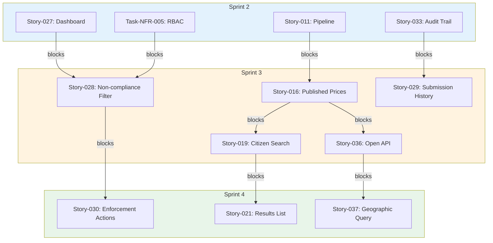

# Product Backlog: UK Fuel Price Transparency Service

> **Template Status**: Live | **Version**: 1.0.3 | **Command**: `/arckit.backlog`

## Document Control

| Field | Value |
|-------|-------|
| **Document ID** | ARC-001-BKLG-v1.0 |
| **Document Type** | Product Backlog |
| **Project** | UK Fuel Price Transparency Service (Project 001) |
| **Classification** | OFFICIAL |
| **Status** | DRAFT |
| **Version** | 1.0 |
| **Created Date** | 2026-01-31 |
| **Last Modified** | 2026-01-31 |
| **Review Cycle** | Per Sprint |
| **Next Review Date** | 2026-02-14 |
| **Owner** | CMA Digital Lead (Product Owner) |
| **Reviewed By** | [PENDING] |
| **Approved By** | [PENDING] |
| **Distribution** | CMA Digital, CMA Enforcement, DESNZ Policy, GDS Assessors, Delivery Team |

## Revision History

| Version | Date | Author | Changes | Approved By | Approval Date |
|---------|------|--------|---------|-------------|---------------|
| 1.0 | 2026-01-31 | ArcKit AI | Initial creation from `/arckit.backlog` command | [PENDING] | [PENDING] |

---

## Executive Summary

**Total Stories**: 62
**Total Epics**: 7
**Total Story Points**: 289
**Estimated Duration**: 15 sprints (30 weeks at 20 points/sprint)

### Priority Breakdown
- **Must Have**: 42 stories (218 points) — 75%
- **Should Have**: 15 stories (56 points) — 19%
- **Could Have**: 5 stories (15 points) — 5%

### Sprint Plan Summary
- **Sprints 1–8 planned in detail**: 160 points allocated
- **Remaining for Sprint 9+**: 129 points (backlog)

### Epic Breakdown

| Epic | Priority | Stories | Points | Sprints |
|------|----------|---------|--------|---------|
| EPIC-001: Forecourt Registration & Account Management | Must Have | 8 | 34 | 1–3 |
| EPIC-002: Fuel Price Submission & Processing | Must Have | 10 | 48 | 1–4 |
| EPIC-003: Citizen Fuel Price Comparison | Must Have | 8 | 36 | 2–5 |
| EPIC-004: CMA Enforcement & Compliance | Must Have | 9 | 50 | 2–5 |
| EPIC-005: Open Data API & Third-Party Ecosystem | Must Have | 8 | 38 | 3–6 |
| EPIC-006: Security, Infrastructure & Observability | Must Have | 12 | 53 | 1–6 |
| EPIC-007: Policy Reporting, Notifications & Support | Should Have | 7 | 30 | 5–8 |

---

## How to Use This Backlog

### For Product Owners
1. Review epic priorities — adjust based on business needs and the May 2026 enforcement deadline
2. Refine story acceptance criteria before sprint planning
3. Validate user stories with actual users (Sarah, Raj, Claire, David, Emma, Tom, Mike personas)
4. Adjust sprint sequence based on stakeholder priorities

### For Development Teams
1. Review stories in upcoming sprint (Sprint Planning)
2. Break down stories into tasks if needed
3. Estimate effort using team velocity
4. Identify technical blockers early
5. Update story status as work progresses

### For Scrum Masters
1. Track velocity after each sprint
2. Adjust future sprint loading based on actual velocity
3. Monitor dependency chains
4. Escalate blockers early (especially R-010 VE3 API dependency)
5. Facilitate backlog refinement sessions

### Backlog Refinement
- **Weekly**: Review and refine next 2 sprints
- **Bi-weekly**: Groom backlog beyond 2 sprints
- **Monthly**: Reassess epic priorities
- **Per sprint**: Update based on completed work and learnings

---

## Epics

### Epic EPIC-001: Forecourt Registration & Account Management (BR-001)

**Business Requirement**: BR-001 — Establish Universal Forecourt Registration
**Priority**: Must Have
**Business Value**: High — Statutory prerequisite; ≥97% forecourts registered by 2 Feb 2026
**Risk**: High — R-001 (independent retailer compliance, residual 12)
**Dependencies**: None (foundation epic)
**Total Story Points**: 34
**Estimated Duration**: 3 sprints

**Description**: Enable all UK motor fuel traders to register forecourts, manage accounts, and maintain forecourt details. Registration is the statutory prerequisite for price data submission. The system must support both self-service digital and assisted digital channels. Must comply with UK GDPR for PII handling (retailer contacts).

**Success Criteria**:
- ≥97% of known UK forecourts registered by 2 February 2026
- Registration completable within 15 minutes per forecourt
- Assisted digital channel available for retailers unable to self-serve
- Address validation against OS AddressBase gazetteer
- API credentials issuable to large retailers

**Stories in this Epic**:
1. Story-001: Forecourt registration web form (8 points) — Sprint 1
2. Story-002: Address gazetteer integration (5 points) — Sprint 1
3. Story-003: Geocoding integration (3 points) — Sprint 1
4. Story-004: Retailer authentication with MFA (5 points) — Sprint 1
5. Story-005: Retailer account management (3 points) — Sprint 2
6. Story-006: API credential management (3 points) — Sprint 2
7. Story-007: Companies House validation (2 points) — Sprint 3
8. Story-008: Late registration enforcement flagging (5 points) — Sprint 3

---

### Epic EPIC-002: Fuel Price Submission & Processing (BR-002)

**Business Requirement**: BR-002 — Achieve Comprehensive Fuel Price Data Submission
**Priority**: Must Have
**Business Value**: High — Core value proposition; price data is the product
**Risk**: High — R-004 (data quality, residual 8), R-010 (VE3 API, residual 12)
**Dependencies**: EPIC-001 (registration must exist)
**Total Story Points**: 48
**Estimated Duration**: 4 sprints

**Description**: Enable registered forecourts to submit fuel prices via web form (independents) and API (large chains). Build the async data validation and processing pipeline. Ensure data freshness SLA ≤15 min (API) / ≤30 min (manual).

**Success Criteria**:
- ≥90% of registered forecourts submitting prices by May 2026
- Median time from price change to publication ≤30 minutes for API
- Submission rejection rate <5%
- Anomalous price changes detected and flagged

**Stories in this Epic**:
1. Story-009: Manual price submission web form (5 points) — Sprint 2
2. Story-010: API price submission endpoint (8 points) — Sprint 2
3. Story-011: Data validation pipeline (8 points) — Sprint 2
4. Story-012: Price plausibility validation rules (3 points) — Sprint 3
5. Story-013: Anomaly detection for price changes (5 points) — Sprint 3
6. Story-014: Duplicate submission idempotency (3 points) — Sprint 3
7. Story-015: Bulk API submission (up to 1,000 forecourts) (5 points) — Sprint 3
8. Story-016: Published price materialised view (5 points) — Sprint 3
9. Story-017: Technical failure reporting (3 points) — Sprint 4
10. Story-018: Submission pipeline monitoring & alerting (3 points) — Sprint 4

---

### Epic EPIC-003: Citizen Fuel Price Comparison (BR-003)

**Business Requirement**: BR-003 — Deliver Citizen Fuel Price Comparison Service
**Priority**: Must Have
**Business Value**: High — Primary citizen-facing deliverable; ≥80% user satisfaction target
**Risk**: Medium — R-004 (data quality), R-006 (media coverage), R-011 (outage)
**Dependencies**: EPIC-002 (published prices must exist)
**Total Story Points**: 36
**Estimated Duration**: 4 sprints

**Description**: Provide citizens with a simple, accessible, mobile-first service to find and compare fuel prices near them. Uses GOV.UK Design System. WCAG 2.2 AA compliant. Progressive enhancement (works without JavaScript).

**Success Criteria**:
- ≥95% task completion rate (find fuel price near me)
- Page load time p95 <3 seconds on mobile 3G
- WCAG 2.2 AA compliance
- Pass GDS Service Standard assessment at Beta

**Stories in this Epic**:
1. Story-019: Citizen location search (postcode/place name) (5 points) — Sprint 3
2. Story-020: Geolocation "use my location" (3 points) — Sprint 3
3. Story-021: Fuel price results list sorted by price (5 points) — Sprint 4
4. Story-022: Fuel type filtering (petrol/diesel) (2 points) — Sprint 4
5. Story-023: Forecourt detail view with directions link (3 points) — Sprint 4
6. Story-024: Staleness indicators on results (2 points) — Sprint 4
7. Story-025: Accessible map alternative (list view for screen readers) (8 points) — Sprint 5
8. Story-026: GOV.UK Design System integration and responsive layout (8 points) — Sprint 3

---

### Epic EPIC-004: CMA Enforcement & Compliance (BR-004)

**Business Requirement**: BR-004 — Provide CMA Enforcement Capability
**Priority**: Must Have
**Business Value**: Critical — Enforcement tools MUST be operational before May 2026 grace period end
**Risk**: Critical — R-003 (enforcement tools not ready, residual 12)
**Dependencies**: EPIC-001, EPIC-002 (registration and submission data must exist)
**Total Story Points**: 50
**Estimated Duration**: 4 sprints

**Description**: Provide CMA enforcement officers with tools to monitor retailer compliance, detect non-compliance, gather admissible evidence, and take proportionate enforcement actions. Immutable, tamper-evident audit trail. Integration with GOV.UK Notify for enforcement communications.

**Success Criteria**:
- Enforcement tools operational before May 2026
- Non-compliance detection within 24 hours
- Evidence export validated by CMA legal team
- Audit trail tamper-evident and admissible

**Stories in this Epic**:
1. Story-027: Compliance monitoring dashboard — overview metrics (8 points) — Sprint 2
2. Story-028: Non-compliant forecourt identification and filtering (5 points) — Sprint 3
3. Story-029: Forecourt submission history view (5 points) — Sprint 3
4. Story-030: Enforcement action workflow (warning/notice/penalty) (8 points) — Sprint 4
5. Story-031: GOV.UK Notify integration for enforcement notices (5 points) — Sprint 4
6. Story-032: Compliance data CSV export (3 points) — Sprint 4
7. Story-033: Immutable audit trail with cryptographic integrity (8 points) — Sprint 2
8. Story-034: Evidence export for formal enforcement cases (5 points) — Sprint 5
9. Story-035: CMA SSO integration (corporate IdP) (3 points) — Sprint 2

---

### Epic EPIC-005: Open Data API & Third-Party Ecosystem (BR-005)

**Business Requirement**: BR-005 — Publish Open Data for Third-Party Innovation
**Priority**: Must Have
**Business Value**: High — Amplifies reach; ≥10 third-party integrations in 12 months
**Risk**: Medium — R-010 (VE3 API), R-012 (large chain integration)
**Dependencies**: EPIC-002 (published price data must exist)
**Total Story Points**: 38
**Estimated Duration**: 4 sprints

**Description**: Publish fuel price data as open data through a public API and bulk download. No authentication required for read access. OpenAPI specification published. Developer portal with documentation and sandbox. Android Auto / Apple CarPlay optimised responses.

**Success Criteria**:
- Public API with OpenAPI specification published
- Bulk download available in CSV and JSON
- API developer portal operational
- ≥10 third-party integrations within 12 months
- Open Government Licence applied

**Stories in this Epic**:
1. Story-036: Open data API — GET /v1/prices endpoint (8 points) — Sprint 3
2. Story-037: Geographic proximity query (lat/lng + radius) (5 points) — Sprint 4
3. Story-038: Bulk data download (CSV/JSON/GeoJSON) (5 points) — Sprint 4
4. Story-039: API rate limiting (300 req/min per IP) (3 points) — Sprint 3
5. Story-040: API versioning and deprecation policy (2 points) — Sprint 5
6. Story-041: Developer portal and OpenAPI documentation (5 points) — Sprint 5
7. Story-042: Android Auto / CarPlay optimised API responses (5 points) — Sprint 6
8. Story-043: Third-party in-car app integration guidelines (5 points) — Sprint 6

---

### Epic EPIC-006: Security, Infrastructure & Observability (BR-007, NFRs)

**Business Requirement**: BR-007 — Meet All Governance and Compliance Requirements
**Priority**: Must Have
**Business Value**: Critical — Non-negotiable for UK Government service
**Risk**: Medium — R-007 (GDS failure), R-013 (DPIA), R-014 (security breach)
**Dependencies**: None (foundation — runs parallel to all epics)
**Total Story Points**: 53
**Estimated Duration**: 6 sprints (ongoing)

**Description**: Infrastructure foundation, security controls, observability, CI/CD pipeline, and compliance tasks derived from NFRs. Includes encryption, secrets management, vulnerability scanning, monitoring, alerting, and operational runbooks.

**Success Criteria**:
- GDS Service Standard assessment passed
- Secure by Design assessment completed
- 99.9% citizen service availability
- All data encrypted at rest and in transit
- Structured observability (logs, metrics, traces)

**Stories in this Epic**:
1. Task-NFR-001: Database setup with encryption at rest (5 points) — Sprint 1
2. Task-NFR-002: CI/CD pipeline with SAST/dependency scanning (5 points) — Sprint 1
3. Task-NFR-003: Secrets management service integration (3 points) — Sprint 1
4. Task-NFR-004: TLS encryption for all communications (2 points) — Sprint 1
5. Task-NFR-005: RBAC implementation (5 points) — Sprint 2
6. Task-NFR-006: Structured logging with correlation IDs (3 points) — Sprint 2
7. Task-NFR-007: Metrics and dashboards (service health, data freshness) (5 points) — Sprint 3
8. Task-NFR-008: Distributed tracing across pipeline (3 points) — Sprint 4
9. Task-NFR-009: Auto-scaling configuration (3 points) — Sprint 4
10. Task-NFR-010: Disaster recovery and failover setup (5 points) — Sprint 5
11. Task-NFR-011: Operational runbooks (deployment, DR, incident response) (5 points) — Sprint 5
12. Task-NFR-012: Penetration testing and vulnerability remediation (8 points) — Sprint 6

---

### Epic EPIC-007: Policy Reporting, Notifications & Support (BR-006)

**Business Requirement**: BR-006 — Demonstrate Value for Money / Supporting Features
**Priority**: Should Have
**Business Value**: Medium — Supports ministerial briefings, retailer compliance, citizen feedback
**Risk**: Low
**Dependencies**: EPIC-001, EPIC-002, EPIC-004
**Total Story Points**: 30
**Estimated Duration**: 4 sprints

**Description**: DESNZ policy analysis tools, automated retailer notifications, citizen feedback mechanisms, Welsh language support, and service support features. These enhance the core service but are not blocking for the May 2026 enforcement deadline.

**Success Criteria**:
- Policy analysts can export aggregate reports
- Retailers receive compliance reminders
- Citizen feedback mechanism operational

**Stories in this Epic**:
1. Story-044: DESNZ policy analysis dashboard (8 points) — Sprint 5
2. Story-045: Historical price trend reports (5 points) — Sprint 6
3. Story-046: Automated compliance reminder notifications (3 points) — Sprint 5
4. Story-047: Submission confirmation notifications (2 points) — Sprint 5
5. Story-048: Citizen feedback component (GOV.UK pattern) (2 points) — Sprint 6
6. Story-049: Retailer support section with FAQs and guidance (3 points) — Sprint 6
7. Story-050: Welsh language support for citizen pages (5 points) — Sprint 7
8. Story-051: Benefits realisation tracker (2 points) — Sprint 8

---

## Prioritised Backlog

### Must Have Stories (Priority Score ≥ 3.0)

#### Story-001: Forecourt registration web form

**As a** motor fuel trader (Raj or Claire)
**I want** to register my forecourt(s) on the Fuel Finder service
**So that** I comply with the Motor Fuel Price (Open Data) Regulations 2025 and can begin submitting fuel prices

**Acceptance Criteria**:
- It's done when a retailer can enter organisation details (name, Companies House number, contact details)
- It's done when a retailer can enter forecourt details (address, fuel types, operating hours)
- It's done when the registration form validates all required fields with inline error messages
- It's done when a confirmation email/SMS is sent after successful registration
- It's done when a second forecourt can be linked to an existing organisation account
- It's done when late registrations (after 2 Feb 2026) are flagged for enforcement awareness

**Requirements Traceability**: FR-001, BR-001, UC-6
**Component**: Registration Service
**Story Points**: 8
**Priority**: Must Have
**Priority Score**: 3.8 (MoSCoW 4, Risk 3, Value 4, Dependency 4)
**Sprint**: 1
**Dependencies**: None (foundation story)

---

#### Story-004: Retailer authentication with MFA

**As a** registered retailer
**I want** to log in securely with multi-factor authentication
**So that** my account and forecourt data are protected from unauthorised access

**Acceptance Criteria**:
- It's done when retailers can log in with username/password plus MFA
- It's done when sessions time out after 30 minutes of inactivity
- It's done when absolute session timeout occurs at 8 hours
- It's done when failed login attempts are logged and rate-limited
- It's done when re-authentication is required for credential rotation

**Requirements Traceability**: NFR-SEC-001, NFR-SEC-002, FR-001
**Component**: Authentication Service
**Story Points**: 5
**Priority**: Must Have
**Priority Score**: 3.8 (MoSCoW 4, Risk 4, Value 3, Dependency 4)
**Sprint**: 1
**Dependencies**: None

---

#### Story-002: Address gazetteer integration

**As a** retailer registering a forecourt
**I want** my address validated and standardised against an authoritative gazetteer
**So that** my forecourt location is accurate on the service and citizens can find me

**Acceptance Criteria**:
- It's done when postcode or address input resolves to standardised address via OS AddressBase or equivalent
- It's done when UPRN and coordinates (lat/lng) are returned
- It's done when an unmatched address allows manual entry with map pin placement
- It's done when response time is <2 seconds

**Requirements Traceability**: FR-001, INT-001
**Component**: Registration Service, Integration Layer
**Story Points**: 5
**Priority**: Must Have
**Priority Score**: 3.4 (MoSCoW 4, Risk 2, Value 3, Dependency 4)
**Sprint**: 1
**Dependencies**: None

---

#### Story-003: Geocoding integration

**As a** citizen or system component
**I want** postcodes and place names converted to coordinates
**So that** proximity-based fuel price searches work accurately

**Acceptance Criteria**:
- It's done when postcode, place name, or address resolves to lat/lng coordinates
- It's done when results are cacheable for performance
- It's done when a circuit breaker and fallback to cached postcode lookup table are in place
- It's done when response time is <500ms

**Requirements Traceability**: INT-002, FR-004
**Component**: Integration Layer
**Story Points**: 3
**Priority**: Must Have
**Priority Score**: 3.4 (MoSCoW 4, Risk 2, Value 3, Dependency 4)
**Sprint**: 1
**Dependencies**: None

---

#### Task-NFR-001: Database setup with encryption at rest

**Type**: Technical Task (NFR)
**Requirement**: NFR-SEC-003, NFR-S-002
**Priority**: Must Have
**Story Points**: 5
**Sprint**: 1

**Description**: Set up primary database with AES-256 encryption at rest. Configure for UK sovereign cloud region. Design schema for Organisation, Forecourt, PriceSubmission, PublishedPrice, EnforcementAction, and AuditEvent entities per ARC-001-DATA-v1.0.

**Acceptance Criteria**:
- It's done when database is deployed in UK sovereign cloud region
- It's done when all data at rest is encrypted with AES-256
- It's done when core schema is created with appropriate indexes
- It's done when backup configuration is in place (continuous replication, hourly snapshots)
- It's done when geographic query capability is available for proximity search

**Dependencies**: None (foundation task)
**Component**: Infrastructure, Data Layer

---

#### Task-NFR-002: CI/CD pipeline with SAST/dependency scanning

**Type**: Technical Task (NFR)
**Requirement**: NFR-SEC-005, NFR-I-002
**Priority**: Must Have
**Story Points**: 5
**Sprint**: 1

**Description**: Establish CI/CD pipeline with automated build, test, SAST scanning, and dependency vulnerability scanning. Deploy to dev/staging/production environments. Open source repository.

**Acceptance Criteria**:
- It's done when code merges trigger automated build and test
- It's done when SAST scan runs on every build with no critical/high vulnerabilities allowed
- It's done when dependency scanning blocks builds with critical vulnerabilities
- It's done when deployment to dev environment is automated
- It's done when staging and production deployment requires manual approval

**Dependencies**: None (foundation task)
**Component**: DevOps, Infrastructure

---

#### Task-NFR-003: Secrets management service integration

**Type**: Technical Task (NFR)
**Requirement**: NFR-SEC-004
**Priority**: Must Have
**Story Points**: 3
**Sprint**: 1

**Description**: Integrate managed secrets service for all credentials, API keys, certificates, and database passwords. No secrets in code or config files. Automatic rotation every 90 days.

**Acceptance Criteria**:
- It's done when all secrets are stored in a managed secrets service
- It's done when secrets are injected at runtime, never in code or config
- It's done when automatic rotation is configured (90-day cycle)
- It's done when retailer API credentials are rotatable on demand

**Dependencies**: None
**Component**: Infrastructure, Security

---

#### Task-NFR-004: TLS encryption for all communications

**Type**: Technical Task (NFR)
**Requirement**: NFR-SEC-003
**Priority**: Must Have
**Story Points**: 2
**Sprint**: 1

**Description**: Configure TLS 1.2+ (prefer 1.3) for all network communication. All internal service-to-service calls encrypted. Certificate management automated.

**Acceptance Criteria**:
- It's done when all external endpoints use TLS 1.2+
- It's done when all internal service communication is encrypted
- It's done when certificate management is automated

**Dependencies**: None
**Component**: Infrastructure, Security

---

#### Story-033: Immutable audit trail with cryptographic integrity

**As a** CMA enforcement officer
**I want** an immutable, tamper-evident audit trail of all submissions and enforcement actions
**So that** evidence is legally admissible and the audit record cannot be altered

**Acceptance Criteria**:
- It's done when every price submission is recorded with timestamp (UTC, ms), source IP, payload, submitter identity, and submission ID
- It's done when cryptographic chain hashing (SHA-256) provides tamper evidence
- It's done when modification attempts are prevented and logged as security events
- It's done when audit data is stored in append-only storage
- It's done when audit data older than retention period is archived, not deleted

**Requirements Traceability**: FR-010, NFR-C-002
**Component**: Audit Service
**Story Points**: 8
**Priority**: Must Have
**Priority Score**: 3.8 (MoSCoW 4, Risk 4, Value 3, Dependency 4)
**Sprint**: 2
**Dependencies**: Task-NFR-001 (database)

---

#### Story-027: Compliance monitoring dashboard — overview metrics

**As a** CMA enforcement officer (David)
**I want** to see real-time compliance overview metrics on a dashboard
**So that** I can monitor scheme effectiveness and identify non-compliance trends

**Acceptance Criteria**:
- It's done when headline metrics are displayed: total registered, % compliant, % non-reporting, trend over time
- It's done when the dashboard loads within 5 seconds
- It's done when 20 concurrent enforcement users are supported
- It's done when access is restricted to CMA enforcement role via RBAC

**Requirements Traceability**: FR-006, BR-004, UC-4
**Component**: Enforcement Dashboard
**Story Points**: 8
**Priority**: Must Have
**Priority Score**: 3.6 (MoSCoW 4, Risk 4, Value 3, Dependency 3)
**Sprint**: 2
**Dependencies**: Task-NFR-001 (database), Story-001 (registration data)

---

#### Story-035: CMA SSO integration (corporate IdP)

**As a** CMA staff member
**I want** to access enforcement tools using my existing CMA credentials
**So that** I don't need separate login credentials and access is centrally managed

**Acceptance Criteria**:
- It's done when CMA staff can authenticate via SAML 2.0 or OIDC federation
- It's done when role claims from CMA IdP map to Fuel Finder roles (Operations, Enforcement, Admin)
- It's done when logout propagates to CMA IdP

**Requirements Traceability**: INT-006, NFR-SEC-001
**Component**: Authentication Service
**Story Points**: 3
**Priority**: Must Have
**Priority Score**: 3.4 (MoSCoW 4, Risk 2, Value 3, Dependency 4)
**Sprint**: 2
**Dependencies**: Story-004 (authentication service)

---

#### Task-NFR-005: RBAC implementation

**Type**: Technical Task (NFR)
**Requirement**: NFR-SEC-002
**Priority**: Must Have
**Story Points**: 5
**Sprint**: 2

**Description**: Implement role-based access control with roles: Citizen (no auth), Retailer User, Retailer Admin, CMA Operations, CMA Enforcement, CMA Admin, DESNZ Analyst, System Service. Privilege elevation requires MFA re-authentication.

**Acceptance Criteria**:
- It's done when all roles are defined and enforceable
- It's done when each endpoint enforces appropriate role checks
- It's done when enforcement actions require MFA re-authentication
- It's done when admin actions require approval workflow

**Dependencies**: Story-004 (authentication), Story-035 (CMA SSO)
**Component**: Security, All Services

---

#### Task-NFR-006: Structured logging with correlation IDs

**Type**: Technical Task (NFR)
**Requirement**: NFR-M-001
**Priority**: Must Have
**Story Points**: 3
**Sprint**: 2

**Description**: Implement structured JSON logging with correlation IDs across all services. Centralised log aggregation. Security event logging for all authentication/authorisation events.

**Acceptance Criteria**:
- It's done when all services emit structured JSON logs
- It's done when correlation IDs flow across the ingestion pipeline
- It's done when logs are centrally aggregated and searchable
- It's done when security events (auth failures, policy violations) are logged

**Dependencies**: Task-NFR-002 (CI/CD pipeline)
**Component**: All Services, Infrastructure

---

#### Story-009: Manual price submission web form

**As a** independent forecourt owner (Raj)
**I want** to submit current fuel prices via a simple web form
**So that** I comply with regulations without needing API integration or advanced IT

**Acceptance Criteria**:
- It's done when authenticated retailer can select a forecourt and enter prices for each fuel type
- It's done when prices outside plausible range (default <80p or >300p PPL) show a warning but allow override
- It's done when missing fuel types are highlighted
- It's done when submission confirmation with ID and timestamp is displayed
- It's done when submission is processed asynchronously via the data pipeline

**Requirements Traceability**: FR-002, BR-002, UC-2
**Component**: Retailer Portal
**Story Points**: 5
**Priority**: Must Have
**Priority Score**: 3.6 (MoSCoW 4, Risk 3, Value 4, Dependency 2)
**Sprint**: 2
**Dependencies**: Story-001 (registration), Story-004 (authentication)

---

#### Story-010: API price submission endpoint

**As a** supermarket IT manager (Claire)
**I want** to submit fuel prices via a RESTful API for automated integration
**So that** our 400+ sites can update prices automatically without manual effort

**Acceptance Criteria**:
- It's done when POST /v1/submissions accepts a JSON payload with forecourt prices
- It's done when the system returns 202 Accepted with a submission ID
- It's done when OAuth 2.0 client credentials grant is used for authentication
- It's done when invalid payloads return 400 with field-level error details
- It's done when rate limits (60 req/min per organisation) return 429 with Retry-After header
- It's done when duplicate submissions (same forecourt + timestamp) are handled idempotently

**Requirements Traceability**: FR-003, BR-002, UC-3
**Component**: Submission API
**Story Points**: 8
**Priority**: Must Have
**Priority Score**: 3.6 (MoSCoW 4, Risk 3, Value 4, Dependency 2)
**Sprint**: 2
**Dependencies**: Story-001 (registration), Task-NFR-003 (secrets management)

---

#### Story-011: Data validation pipeline

**As a** the system
**I want** to validate, enrich, and process all fuel price submissions asynchronously
**So that** only quality-assured data is published to citizens and enforcement tools

**Acceptance Criteria**:
- It's done when valid submissions are published within ≤15 minutes (API) / ≤30 minutes (manual)
- It's done when price plausibility rules are applied (configurable range)
- It's done when submissions for closed forecourts are rejected
- It's done when pipeline failures queue submissions for retry and raise alerts
- It's done when pipeline metrics (throughput, lag, error rate) are emitted

**Requirements Traceability**: FR-007, BR-002, BR-005
**Component**: Data Pipeline
**Story Points**: 8
**Priority**: Must Have
**Priority Score**: 3.6 (MoSCoW 4, Risk 3, Value 4, Dependency 3)
**Sprint**: 2
**Dependencies**: Task-NFR-001 (database), Task-NFR-006 (logging)

---

#### Story-026: GOV.UK Design System integration and responsive layout

**As a** citizen (Sarah)
**I want** the fuel price comparison service to use familiar GOV.UK design patterns
**So that** I trust it as an official government service and can use it easily on my phone

**Acceptance Criteria**:
- It's done when GOV.UK Design System components and patterns are used throughout
- It's done when mobile-first responsive design works on all screen sizes
- It's done when progressive enhancement ensures core functionality without JavaScript
- It's done when Chrome, Firefox, Safari, Edge (last 2 major versions) are supported
- It's done when WCAG 2.2 AA is met (verified by automated and manual testing)

**Requirements Traceability**: INT-004, NFR-U-001, NFR-U-002, BR-003
**Component**: Citizen Frontend
**Story Points**: 8
**Priority**: Must Have
**Priority Score**: 3.4 (MoSCoW 4, Risk 2, Value 4, Dependency 3)
**Sprint**: 3
**Dependencies**: None (frontend framework)

---

#### Story-019: Citizen location search (postcode/place name)

**As a** motorist (Sarah)
**I want** to search for fuel prices by entering my postcode or place name
**So that** I can find the cheapest fuel near my home, work, or destination

**Acceptance Criteria**:
- It's done when a valid postcode returns nearby forecourts sorted by cheapest price
- It's done when a place name is resolved to coordinates via geocoding
- It's done when no forecourts within 5 miles triggers an expansion to 10 miles with notification
- It's done when results are capped at 20 per page
- It's done when page load is <3 seconds (p95) on mobile 3G

**Requirements Traceability**: FR-004, BR-003, UC-1
**Component**: Citizen Frontend, Search Service
**Story Points**: 5
**Priority**: Must Have
**Priority Score**: 3.6 (MoSCoW 4, Risk 2, Value 4, Dependency 3)
**Sprint**: 3
**Dependencies**: Story-003 (geocoding), Story-016 (published prices)

---

#### Story-028: Non-compliant forecourt identification and filtering

**As a** CMA enforcement officer (David)
**I want** to filter the compliance dashboard by region, retailer type, or non-compliance duration
**So that** I can prioritise enforcement actions on the most significant cases

**Acceptance Criteria**:
- It's done when filters update dashboard metrics and forecourt lists within 3 seconds
- It's done when non-compliant forecourts show last submission date and contact details
- It's done when "under investigation" marking restricts visibility to enforcement team only
- It's done when filtering results can be paginated

**Requirements Traceability**: FR-006, BR-004, UC-4
**Component**: Enforcement Dashboard
**Story Points**: 5
**Priority**: Must Have
**Priority Score**: 3.6 (MoSCoW 4, Risk 4, Value 3, Dependency 2)
**Sprint**: 3
**Dependencies**: Story-027 (dashboard), Task-NFR-005 (RBAC)

---

#### Story-029: Forecourt submission history view

**As a** CMA enforcement officer (David)
**I want** to view the full submission history for any forecourt
**So that** I can assess compliance patterns and gather evidence for enforcement

**Acceptance Criteria**:
- It's done when selecting a forecourt shows all submissions with timestamps and data quality indicators
- It's done when cryptographic integrity verification confirms audit trail authenticity
- It's done when history includes enforcement actions taken against the forecourt

**Requirements Traceability**: FR-006, FR-010, UC-4
**Component**: Enforcement Dashboard
**Story Points**: 5
**Priority**: Must Have
**Priority Score**: 3.4 (MoSCoW 4, Risk 3, Value 3, Dependency 2)
**Sprint**: 3
**Dependencies**: Story-033 (audit trail)

---

#### Story-012: Price plausibility validation rules

**As a** system operator
**I want** configurable price plausibility rules applied at submission
**So that** obviously erroneous prices are flagged while allowing legitimate outliers

**Acceptance Criteria**:
- It's done when configurable min/max range (default 50.0–500.0 PPL) is enforced
- It's done when prices outside range are flagged but published with quality indicator
- It's done when plausibility parameters are configurable without code changes

**Requirements Traceability**: FR-007, NFR data quality
**Component**: Data Pipeline
**Story Points**: 3
**Priority**: Must Have
**Priority Score**: 3.2 (MoSCoW 4, Risk 3, Value 3, Dependency 2)
**Sprint**: 3
**Dependencies**: Story-011 (pipeline)

---

#### Story-013: Anomaly detection for price changes

**As a** system operator
**I want** automatic detection of anomalous price changes (>20% in 24 hours)
**So that** potential data quality issues are flagged for review before impacting citizens

**Acceptance Criteria**:
- It's done when price changes exceeding 20% in 24 hours generate an alert
- It's done when alerts are sent to operations for review
- It's done when the anomalous price is still published with a quality indicator

**Requirements Traceability**: FR-007
**Component**: Data Pipeline
**Story Points**: 5
**Priority**: Must Have
**Priority Score**: 3.2 (MoSCoW 4, Risk 3, Value 3, Dependency 2)
**Sprint**: 3
**Dependencies**: Story-011 (pipeline), Story-016 (published prices for comparison)

---

#### Story-014: Duplicate submission idempotency

**As a** large retailer IT system (Claire)
**I want** duplicate submissions (same forecourt + timestamp) to be handled idempotently
**So that** our retry logic doesn't create duplicate records or re-trigger processing

**Acceptance Criteria**:
- It's done when duplicate submissions return 200 OK without re-processing
- It's done when idempotency is based on forecourt_id + effective_time combination

**Requirements Traceability**: FR-003
**Component**: Submission API
**Story Points**: 3
**Priority**: Must Have
**Sprint**: 3
**Dependencies**: Story-010 (API submission)

---

#### Story-015: Bulk API submission (up to 1,000 forecourts)

**As a** supermarket IT manager (Claire)
**I want** to submit price updates for up to 1,000 forecourts in a single API call
**So that** our 400+ sites can be updated efficiently in one operation

**Acceptance Criteria**:
- It's done when a single API call can contain up to 1,000 forecourt price updates
- It's done when per-forecourt status (accepted/rejected with reason) is returned
- It's done when bulk submission throughput handles peak of 5,000 submissions/min

**Requirements Traceability**: FR-003, NFR-P-002
**Component**: Submission API
**Story Points**: 5
**Priority**: Must Have
**Sprint**: 3
**Dependencies**: Story-010 (API submission)

---

#### Story-016: Published price materialised view

**As a** citizen or third-party developer
**I want** current fuel prices to be available in a query-optimised format
**So that** price searches return results quickly with accurate freshness indicators

**Acceptance Criteria**:
- It's done when a materialised view of current prices per forecourt per fuel type exists
- It's done when the view is updated within the freshness SLA from the pipeline
- It's done when data quality indicators (good/stale/warning) are maintained
- It's done when geographic proximity queries perform within <500ms (p95)

**Requirements Traceability**: FR-007, NFR-P-001
**Component**: Data Layer, Search Service
**Story Points**: 5
**Priority**: Must Have
**Sprint**: 3
**Dependencies**: Story-011 (pipeline)

---

#### Story-036: Open data API — GET /v1/prices endpoint

**As a** third-party developer (Emma)
**I want** a public API to query fuel price data without authentication
**So that** I can integrate comprehensive UK fuel prices into my navigation app

**Acceptance Criteria**:
- It's done when GET /v1/prices returns JSON fuel price data
- It's done when location parameters (lat, lng, radius, fuel_type) are supported
- It's done when no authentication is required
- It's done when response time is <500ms (p95)
- It's done when Cache-Control headers are appropriate for client-side caching
- It's done when data is licensed under Open Government Licence v3.0

**Requirements Traceability**: FR-005, BR-005, UC-5
**Component**: Open Data API
**Story Points**: 8
**Priority**: Must Have
**Priority Score**: 3.4 (MoSCoW 4, Risk 2, Value 4, Dependency 2)
**Sprint**: 3
**Dependencies**: Story-016 (published prices)

---

#### Story-039: API rate limiting (300 req/min per IP)

**As a** system operator
**I want** rate limiting on the open data API
**So that** the service remains available to all consumers and is not overwhelmed by any single client

**Acceptance Criteria**:
- It's done when >300 requests/min from a single IP returns 429 with Retry-After header
- It's done when rate limit headers (X-RateLimit-*) are included in responses
- It's done when rate limits are documented in the developer portal

**Requirements Traceability**: FR-005, NFR-I-001
**Component**: API Gateway
**Story Points**: 3
**Priority**: Must Have
**Sprint**: 3
**Dependencies**: Story-036 (API endpoint)

---

#### Task-NFR-007: Metrics and dashboards (service health, data freshness)

**Type**: Technical Task (NFR)
**Requirement**: NFR-M-001
**Priority**: Must Have
**Story Points**: 5
**Sprint**: 3

**Description**: Implement real-time dashboards for service health, data freshness, submission volumes, compliance rates, and API usage. SLO-based alerting with actionable runbooks.

**Acceptance Criteria**:
- It's done when request volume, latency (p50/p95/p99), and error rates are displayed
- It's done when data freshness (median and p95) is tracked
- It's done when submission volumes and compliance rates are visible
- It's done when SLO-based alerts fire with runbook links

**Dependencies**: Task-NFR-006 (logging), Story-011 (pipeline metrics)
**Component**: Infrastructure, Observability

---

#### Story-005: Retailer account management

**As a** registered retailer (Raj or Claire)
**I want** to update my forecourt details, add new forecourts, and manage my account
**So that** my information stays current and I can manage my compliance across all sites

**Acceptance Criteria**:
- It's done when retailers can update forecourt details (hours, fuel types)
- It's done when changes are reflected in published data
- It's done when retailers can add new forecourts to their organisation

**Requirements Traceability**: FR-008, BR-001
**Component**: Retailer Portal
**Story Points**: 3
**Priority**: Must Have
**Sprint**: 2
**Dependencies**: Story-001 (registration), Story-004 (authentication)

---

#### Story-006: API credential management

**As a** large retailer IT manager (Claire)
**I want** to generate and rotate API credentials
**So that** I can integrate my pricing systems securely

**Acceptance Criteria**:
- It's done when client ID and secret are generated and displayed once
- It's done when credentials can be regenerated with old credentials revoked after 24-hour grace period
- It's done when credential events are logged in the audit trail

**Requirements Traceability**: FR-008, NFR-SEC-004
**Component**: Retailer Portal, Authentication Service
**Story Points**: 3
**Priority**: Must Have
**Sprint**: 2
**Dependencies**: Story-001, Story-004, Task-NFR-003 (secrets management)

---

#### Story-020: Geolocation "use my location"

**As a** motorist (Sarah)
**I want** to use my phone's location to find nearby fuel prices
**So that** I can quickly find cheap fuel without typing my postcode

**Acceptance Criteria**:
- It's done when "use my location" button triggers browser geolocation prompt
- It's done when geolocation denial falls back to manual postcode entry
- It's done when coordinates are used for proximity search

**Requirements Traceability**: FR-004, UC-1
**Component**: Citizen Frontend
**Story Points**: 3
**Priority**: Must Have
**Sprint**: 3
**Dependencies**: Story-019 (search), Story-003 (geocoding)

---

#### Story-021: Fuel price results list sorted by price

**As a** motorist (Sarah)
**I want** to see a list of nearby forecourts sorted by cheapest price
**So that** I can immediately identify the best deal near me

**Acceptance Criteria**:
- It's done when results display: forecourt name, address, distance, fuel prices, last updated timestamp
- It's done when results are sorted by cheapest price (ascending) by default
- It's done when prices display in pence per litre (PPL) to 1 decimal place

**Requirements Traceability**: FR-004, UC-1
**Component**: Citizen Frontend, Search Service
**Story Points**: 5
**Priority**: Must Have
**Sprint**: 4
**Dependencies**: Story-019 (search), Story-016 (published prices)

---

#### Story-022: Fuel type filtering (petrol/diesel)

**As a** motorist (Sarah)
**I want** to filter results by fuel type
**So that** I see only the fuel type I need and prices are sorted accordingly

**Acceptance Criteria**:
- It's done when petrol/diesel filter is available
- It's done when filter persists across search refinements
- It's done when filtered results sort by selected fuel type price

**Requirements Traceability**: FR-004, UC-1
**Component**: Citizen Frontend
**Story Points**: 2
**Priority**: Must Have
**Sprint**: 4
**Dependencies**: Story-021 (results list)

---

#### Story-023: Forecourt detail view with directions link

**As a** motorist (Sarah)
**I want** to see full details of a forecourt and get directions
**So that** I can navigate to the cheapest fuel station

**Acceptance Criteria**:
- It's done when selecting a forecourt shows address, all fuel prices, opening hours, and last updated time
- It's done when a "Get directions" link opens the device's maps application

**Requirements Traceability**: FR-004, UC-1
**Component**: Citizen Frontend
**Story Points**: 3
**Priority**: Must Have
**Sprint**: 4
**Dependencies**: Story-021 (results list)

---

#### Story-024: Staleness indicators on results

**As a** motorist (Sarah)
**I want** to see clear warnings when fuel price data may be outdated
**So that** I can judge how reliable the displayed prices are

**Acceptance Criteria**:
- It's done when forecourts with data >24h old show a visible "Last updated: X hours ago" warning
- It's done when staleness threshold is configurable
- It's done when staleness styling is visually distinct (not just text)

**Requirements Traceability**: FR-004, UC-1
**Component**: Citizen Frontend
**Story Points**: 2
**Priority**: Must Have
**Sprint**: 4
**Dependencies**: Story-021 (results list)

---

#### Story-030: Enforcement action workflow (warning/notice/penalty)

**As a** CMA enforcement officer (David)
**I want** to initiate enforcement actions through a structured workflow
**So that** enforcement is proportionate, documented, and follows CMA guidance

**Acceptance Criteria**:
- It's done when officers can initiate reminder, warning, formal_notice, or penalty actions
- It's done when each action records: reason, evidence references (submission IDs), officer identity
- It's done when GOV.UK Notify sends the appropriate template to the retailer
- It's done when enforcement actions require MFA re-authentication
- It's done when action status tracks through pending → sent → acknowledged → resolved/escalated

**Requirements Traceability**: FR-006, BR-004, UC-4
**Component**: Enforcement Dashboard, Notification Service
**Story Points**: 8
**Priority**: Must Have
**Priority Score**: 3.6 (MoSCoW 4, Risk 4, Value 3, Dependency 2)
**Sprint**: 4
**Dependencies**: Story-027 (dashboard), Story-028 (filtering), Task-NFR-005 (RBAC)

---

#### Story-031: GOV.UK Notify integration for enforcement notices

**As a** the system
**I want** to send enforcement notices via GOV.UK Notify
**So that** retailers are officially notified of compliance issues through an assured channel

**Acceptance Criteria**:
- It's done when notification templates for each enforcement action type are configured in Notify
- It's done when notifications are sent with retry and exponential backoff on failure
- It's done when delivery status callbacks are received and recorded
- It's done when failed notifications are queued in a dead letter queue and alerted

**Requirements Traceability**: INT-003, FR-009
**Component**: Notification Service, Integration Layer
**Story Points**: 5
**Priority**: Must Have
**Sprint**: 4
**Dependencies**: Story-030 (enforcement workflow)

---

#### Story-032: Compliance data CSV export

**As a** CMA enforcement officer (David)
**I want** to export compliance data to CSV
**So that** I can perform offline analysis and share data with CMA legal team

**Acceptance Criteria**:
- It's done when "Export CSV" downloads compliance data for current filter
- It's done when export handles up to 10,000 records within 30 seconds
- It's done when exported data includes: forecourt ID, name, address, last submission, compliance status, enforcement actions

**Requirements Traceability**: FR-006, NFR-P-003
**Component**: Enforcement Dashboard
**Story Points**: 3
**Priority**: Must Have
**Sprint**: 4
**Dependencies**: Story-028 (filtering)

---

#### Story-037: Geographic proximity query (lat/lng + radius)

**As a** third-party developer (Emma)
**I want** to query fuel prices by geographic proximity
**So that** my app can show nearby fuel stations based on the user's GPS coordinates

**Acceptance Criteria**:
- It's done when lat/lng/radius parameters return sorted results by distance
- It's done when radius is capped at 50 miles
- It's done when response includes distance from query point

**Requirements Traceability**: FR-005
**Component**: Open Data API, Search Service
**Story Points**: 5
**Priority**: Must Have
**Sprint**: 4
**Dependencies**: Story-036 (API endpoint)

---

#### Story-038: Bulk data download (CSV/JSON/GeoJSON)

**As a** researcher or journalist
**I want** to download the complete fuel price dataset in bulk
**So that** I can conduct analysis without making thousands of API calls

**Acceptance Criteria**:
- It's done when GET /v1/prices/bulk returns a download link or complete dataset
- It's done when CSV, JSON, and GeoJSON formats are available
- It's done when data can be filtered by date range, region, and fuel type
- It's done when bulk downloads are refreshed at least daily

**Requirements Traceability**: FR-005, NFR-I-003
**Component**: Open Data API
**Story Points**: 5
**Priority**: Must Have
**Sprint**: 4
**Dependencies**: Story-036 (API endpoint), Story-016 (published prices)

---

#### Story-017: Technical failure reporting

**As a** retailer experiencing technical issues (Raj)
**I want** to report that I cannot submit prices due to a technical failure
**So that** my forecourt is not flagged as non-compliant while I resolve the issue

**Acceptance Criteria**:
- It's done when a web form or phone report flags the forecourt as "technical failure"
- It's done when "technical failure" forecourts are excluded from non-compliance metrics
- It's done when normal compliance monitoring resumes when submissions resume

**Requirements Traceability**: FR-012, BR-002, BR-004
**Component**: Retailer Portal, Compliance Service
**Story Points**: 3
**Priority**: Must Have
**Sprint**: 4
**Dependencies**: Story-001 (registration), Story-027 (compliance dashboard)

---

#### Story-018: Submission pipeline monitoring & alerting

**As a** system operator
**I want** real-time monitoring of the data pipeline with alerts for failures
**So that** I can detect and resolve processing issues before they impact data freshness

**Acceptance Criteria**:
- It's done when pipeline throughput, lag, and error rate are monitored
- It's done when data freshness breach (>30 min) triggers an alert
- It's done when pipeline failure triggers immediate alert with runbook link

**Requirements Traceability**: FR-007, NFR-M-001
**Component**: Data Pipeline, Observability
**Story Points**: 3
**Priority**: Must Have
**Sprint**: 4
**Dependencies**: Story-011 (pipeline), Task-NFR-007 (metrics)

---

#### Task-NFR-008: Distributed tracing across pipeline

**Type**: Technical Task (NFR)
**Requirement**: NFR-M-001
**Priority**: Must Have
**Story Points**: 3
**Sprint**: 4

**Description**: Implement distributed tracing with trace context propagation across the data ingestion pipeline. Enable end-to-end request tracking from submission to publication.

**Acceptance Criteria**:
- It's done when trace context propagates from submission API through pipeline to publication
- It's done when traces are searchable by submission ID, forecourt ID, or time range

**Dependencies**: Task-NFR-006 (logging), Story-011 (pipeline)
**Component**: All Services, Observability

---

#### Task-NFR-009: Auto-scaling configuration

**Type**: Technical Task (NFR)
**Requirement**: NFR-S-001
**Priority**: Must Have
**Story Points**: 3
**Sprint**: 4

**Description**: Configure auto-scaling for all stateless components based on CPU utilisation (>70%), request queue depth, and response latency. Separate scaling for ingestion and serving tiers.

**Acceptance Criteria**:
- It's done when auto-scaling triggers are configured
- It's done when ingestion and serving tiers scale independently
- It's done when scaling events are logged and alerted

**Dependencies**: Task-NFR-002 (CI/CD)
**Component**: Infrastructure

---

#### Story-025: Accessible map alternative (list view for screen readers)

**As a** citizen using a screen reader
**I want** a non-map list view of fuel price results
**So that** I can access fuel prices using assistive technology

**Acceptance Criteria**:
- It's done when an accessible list view is the primary results display (not map-only)
- It's done when keyboard navigation works for all functions
- It's done when screen reader compatibility is verified (NVDA, JAWS, VoiceOver)
- It's done when alt text and ARIA labels are correct
- It's done when skip links and landmark navigation are present
- It's done when automated axe-core tests pass plus manual assistive tech testing

**Requirements Traceability**: NFR-U-002, BR-003, BR-007
**Component**: Citizen Frontend
**Story Points**: 8
**Priority**: Must Have
**Sprint**: 5
**Dependencies**: Story-021 (results list)

---

#### Story-034: Evidence export for formal enforcement cases

**As a** CMA enforcement officer (David)
**I want** to export a complete evidence pack for a specific forecourt or retailer
**So that** the evidence is in a format validated by CMA legal for formal enforcement proceedings

**Acceptance Criteria**:
- It's done when evidence pack includes: all submissions, timestamps, IP addresses, enforcement actions, audit trail
- It's done when cryptographic integrity verification is included in the export
- It's done when export format is agreed with CMA legal team
- It's done when export is logged in the audit trail

**Requirements Traceability**: FR-010, BR-004
**Component**: Enforcement Dashboard, Audit Service
**Story Points**: 5
**Priority**: Must Have
**Sprint**: 5
**Dependencies**: Story-033 (audit trail), Story-029 (history view)

---

#### Task-NFR-010: Disaster recovery and failover setup

**Type**: Technical Task (NFR)
**Requirement**: NFR-A-002
**Priority**: Must Have
**Story Points**: 5
**Sprint**: 5

**Description**: Configure disaster recovery: RPO ≤15 min for submission data, zero data loss for audit trail. RTO <4 hours. Automated failover to secondary UK availability zone. Regular DR testing.

**Acceptance Criteria**:
- It's done when continuous replication to secondary AZ is operational
- It's done when automated failover completes in <15 minutes
- It's done when DR runbook is documented and tested
- It's done when backup retention meets requirements (30 days operational, indefinite audit)

**Dependencies**: Task-NFR-001 (database)
**Component**: Infrastructure

---

#### Task-NFR-011: Operational runbooks

**Type**: Technical Task (NFR)
**Requirement**: NFR-M-003
**Priority**: Must Have
**Story Points**: 5
**Sprint**: 5

**Description**: Create operational runbooks for: deployment/rollback, pipeline failure/recovery, citizen service degradation, retailer API incident, security incident response, DR procedure, capacity scaling, data quality investigation.

**Acceptance Criteria**:
- It's done when runbooks exist for all scenarios in NFR-M-003
- It's done when runbooks are linked from alerting system
- It's done when on-call team has reviewed all runbooks

**Dependencies**: Task-NFR-007 (dashboards), Task-NFR-010 (DR)
**Component**: Operations

---

#### Story-040: API versioning and deprecation policy

**As a** third-party developer (Emma)
**I want** clear API versioning with a deprecation policy
**So that** my app doesn't break when the API evolves

**Acceptance Criteria**:
- It's done when URL path versioning (/v1/, /v2/) is implemented
- It's done when deprecated versions remain available for at least 6 months
- It's done when deprecation notices are communicated through response headers and developer portal

**Requirements Traceability**: FR-005, NFR-I-001
**Component**: Open Data API
**Story Points**: 2
**Priority**: Must Have
**Sprint**: 5
**Dependencies**: Story-036 (API endpoint)

---

#### Story-041: Developer portal and OpenAPI documentation

**As a** third-party developer (Emma)
**I want** a developer portal with API documentation and sandbox
**So that** I can understand, test, and integrate the fuel price API quickly

**Acceptance Criteria**:
- It's done when OpenAPI 3.0 specification is published
- It's done when interactive API explorer (try-it) is available
- It's done when sandbox environment with test data is accessible
- It's done when integration guidelines include Android Auto / Apple CarPlay patterns

**Requirements Traceability**: FR-005, FR-015, NFR-M-002
**Component**: Developer Portal
**Story Points**: 5
**Priority**: Must Have
**Sprint**: 5
**Dependencies**: Story-036 (API), Story-039 (rate limiting)

---

#### Task-NFR-012: Penetration testing and vulnerability remediation

**Type**: Technical Task (NFR)
**Requirement**: NFR-SEC-005, NFR-C-005
**Priority**: Must Have
**Story Points**: 8
**Sprint**: 6

**Description**: Conduct penetration testing by NCSC CHECK-approved provider. DAST against staging. Remediate all critical and high findings. SIRO sign-off on residual risk. Incident response plan tested.

**Acceptance Criteria**:
- It's done when pen test is completed by CHECK-approved provider
- It's done when all critical findings are remediated within 24 hours
- It's done when all high findings are remediated within 7 days
- It's done when incident response plan is documented and table-top tested
- It's done when SIRO has signed off on residual risk

**Dependencies**: All services deployed to staging
**Component**: Security, All Services

---

### Should Have Stories (Priority Score 2.0–2.9)

#### Story-042: Android Auto / CarPlay optimised API responses

**As a** third-party developer building an in-car app (Emma)
**I want** API responses optimised for car dashboard displays
**So that** my Android Auto / Apple CarPlay app can show fuel prices safely while driving

**Acceptance Criteria**:
- It's done when `format=carplay` or `format=auto` returns simplified schema (station_name, brand, fuel_type, price_ppl, distance_miles, lat, lng, navigation_uri)
- It's done when `limit` parameter defaults to 5 for in-car formats
- It's done when API response time is <300ms (p95) for in-car queries
- It's done when geo: URI scheme coordinates are included for native maps

**Requirements Traceability**: FR-014, BR-005, UC-7
**Component**: Open Data API
**Story Points**: 5
**Priority**: Should Have
**Sprint**: 6
**Dependencies**: Story-036 (API endpoint)

---

#### Story-043: Third-party in-car app integration guidelines

**As a** third-party developer
**I want** published guidelines for building in-car fuel price apps
**So that** my app meets driver safety requirements and platform review criteria

**Acceptance Criteria**:
- It's done when guidelines cover: max results displayed, font recommendations, voice patterns, prohibited interactions
- It's done when platform-specific templates are referenced (CarPlay List Template, Android Auto Place List Template)
- It's done when guidelines are available on the developer portal

**Requirements Traceability**: FR-015, UC-7
**Component**: Developer Portal
**Story Points**: 5
**Priority**: Should Have
**Sprint**: 6
**Dependencies**: Story-041 (developer portal)

---

#### Story-044: DESNZ policy analysis dashboard

**As a** DESNZ policy analyst (Tom)
**I want** tools to analyse fuel price trends, geographic patterns, and market competitiveness
**So that** I can produce evidence-based policy advice and ministerial briefings

**Acceptance Criteria**:
- It's done when authenticated DESNZ analyst access shows aggregate reports (average prices by region, fuel type, time period)
- It's done when headline metrics are exportable for ministerial briefing packs
- It's done when data is available in CSV and JSON export

**Requirements Traceability**: FR-011, BR-006
**Component**: Analytics Dashboard
**Story Points**: 8
**Priority**: Should Have
**Sprint**: 5
**Dependencies**: Story-016 (published prices), Task-NFR-005 (RBAC)

---

#### Story-046: Automated compliance reminder notifications

**As a** the system
**I want** to send automated reminders to retailers who haven't submitted prices recently
**So that** compliance rates improve through supportive nudges before enforcement

**Acceptance Criteria**:
- It's done when forecourts with no submission for [configurable] hours trigger an automated reminder
- It's done when reminders are sent via GOV.UK Notify (email/SMS)
- It's done when reminder frequency is configurable and not excessive

**Requirements Traceability**: FR-009, BR-002
**Component**: Notification Service
**Story Points**: 3
**Priority**: Should Have
**Sprint**: 5
**Dependencies**: Story-031 (Notify integration)

---

#### Story-047: Submission confirmation notifications

**As a** retailer (Raj)
**I want** to receive optional confirmation when my price submission is processed
**So that** I have peace of mind that I've fulfilled my compliance obligation

**Acceptance Criteria**:
- It's done when retailers can opt in/out of submission confirmations
- It's done when confirmations are sent via GOV.UK Notify after processing
- It's done when submission blocking is never caused by notification failure

**Requirements Traceability**: FR-009
**Component**: Notification Service
**Story Points**: 2
**Priority**: Should Have
**Sprint**: 5
**Dependencies**: Story-031 (Notify integration)

---

#### Story-045: Historical price trend reports

**As a** DESNZ policy analyst (Tom)
**I want** to view and export historical fuel price trends
**So that** I can analyse price movements over time for policy evaluation

**Acceptance Criteria**:
- It's done when historical price data is queryable by region, fuel type, and time period
- It's done when trend visualisations show price movement over time
- It's done when data is exportable in CSV and JSON

**Requirements Traceability**: FR-011
**Component**: Analytics Dashboard
**Story Points**: 5
**Priority**: Should Have
**Sprint**: 6
**Dependencies**: Story-044 (policy dashboard)

---

#### Story-048: Citizen feedback component (GOV.UK pattern)

**As a** citizen using the service
**I want** to report problems or give feedback
**So that** the service can be improved based on real user experience

**Acceptance Criteria**:
- It's done when standard GOV.UK "Report a problem" and "Give feedback" components are present
- It's done when feedback is aggregated for service improvement analytics

**Requirements Traceability**: FR-013, BR-003
**Component**: Citizen Frontend
**Story Points**: 2
**Priority**: Should Have
**Sprint**: 6
**Dependencies**: Story-026 (GOV.UK Design System)

---

#### Story-049: Retailer support section with FAQs and guidance

**As a** retailer needing help (Raj)
**I want** plain-English guidance, FAQs, and support contact details
**So that** I can resolve compliance questions without needing to call

**Acceptance Criteria**:
- It's done when FAQs cover common registration and submission questions
- It's done when phone and email contact details are prominently displayed
- It's done when guidance uses plain English without technical jargon

**Requirements Traceability**: FR-013
**Component**: Retailer Portal
**Story Points**: 3
**Priority**: Should Have
**Sprint**: 6
**Dependencies**: None

---

#### Story-050: Welsh language support for citizen pages

**As a** Welsh-speaking citizen
**I want** citizen-facing pages available in Welsh
**So that** I can use the service in my preferred language

**Acceptance Criteria**:
- It's done when citizen-facing pages are available in Welsh
- It's done when language toggle is accessible from all pages
- It's done when Welsh content is professionally translated

**Requirements Traceability**: NFR-U-003
**Component**: Citizen Frontend
**Story Points**: 5
**Priority**: Should Have
**Sprint**: 7
**Dependencies**: Story-026 (frontend framework)

---

#### Story-007: Companies House validation

**As a** the system
**I want** to validate retailer organisation details against Companies House
**So that** registration data is verified against an authoritative source

**Acceptance Criteria**:
- It's done when company number is validated against Companies House API during registration
- It's done when company name and status are returned for confirmation
- It's done when Companies House unavailability allows manual entry with deferred verification

**Requirements Traceability**: INT-007, FR-001
**Component**: Registration Service, Integration Layer
**Story Points**: 2
**Priority**: Should Have
**Sprint**: 3
**Dependencies**: Story-001 (registration)

---

#### Story-008: Late registration enforcement flagging

**As a** CMA enforcement officer
**I want** forecourts that register after the 2 Feb 2026 deadline to be flagged
**So that** I can assess late registration patterns and take proportionate action

**Acceptance Criteria**:
- It's done when registrations after deadline are automatically flagged
- It's done when late registrations appear in the compliance dashboard
- It's done when late registration is recorded in the audit trail

**Requirements Traceability**: FR-001, BR-004
**Component**: Registration Service, Compliance Service
**Story Points**: 5
**Priority**: Should Have
**Sprint**: 3
**Dependencies**: Story-001 (registration), Story-027 (compliance dashboard)

---

### Could Have Stories

#### Story-051: Benefits realisation tracker

**As a** CMA SRO
**I want** a benefits realisation tracker showing scheme effectiveness metrics
**So that** I can demonstrate value for money to NAO/PAC and HM Treasury

**Acceptance Criteria**:
- It's done when headline metrics tracked: coverage rate, user satisfaction, estimated consumer savings
- It's done when data feeds from existing dashboards automatically

**Requirements Traceability**: BR-006
**Component**: Analytics Dashboard
**Story Points**: 2
**Priority**: Could Have
**Sprint**: 8
**Dependencies**: Story-044 (policy dashboard)

---

#### Story-052: GOV.UK One Login integration (future citizen identity)

**As a** citizen
**I want** to save preferences and set fuel price alerts using GOV.UK One Login
**So that** I can personalise my fuel price experience

**Acceptance Criteria**:
- It's done when OIDC/OAuth 2.0 integration with GOV.UK One Login is implemented
- It's done when authenticated citizens can save search preferences

**Requirements Traceability**: INT-005
**Component**: Authentication Service, Citizen Frontend
**Story Points**: 5
**Priority**: Could Have
**Sprint**: Future
**Dependencies**: All core features

---

#### Story-053: Forecourt opening hours display

**As a** motorist (Sarah)
**I want** to see whether a forecourt is currently open
**So that** I don't drive to a closed station

**Acceptance Criteria**:
- It's done when opening hours are displayed on forecourt detail view
- It's done when "Currently open/closed" indicator is shown based on current time

**Requirements Traceability**: FR-004 (implied)
**Component**: Citizen Frontend
**Story Points**: 3
**Priority**: Could Have
**Sprint**: Future
**Dependencies**: Story-023 (detail view)

---

#### Story-054: Route-based fuel price search

**As a** motorist (Sarah)
**I want** to find cheap fuel along a specific route (e.g., A to B)
**So that** I can plan my refuelling stop on a longer journey

**Acceptance Criteria**:
- It's done when start and end locations can be entered
- It's done when forecourts within a corridor along the route are displayed

**Requirements Traceability**: BR-003 (along a route)
**Component**: Citizen Frontend, Search Service
**Story Points**: 8
**Priority**: Could Have
**Sprint**: Future
**Dependencies**: Story-019 (search), Story-003 (geocoding)

---

---

## Sprint Plan

### Sprint 1: Foundation (Weeks 1–2)

**Velocity**: 20 story points
**Theme**: Infrastructure, security foundation, and forecourt registration

#### Stories and Tasks (21 points):

| ID | Title | Points | Epic | Type |
|----|-------|--------|------|------|
| Story-001 | Forecourt registration web form | 8 | EPIC-001 | Feature |
| Story-004 | Retailer authentication with MFA | 5 | EPIC-001 | Feature |
| Story-002 | Address gazetteer integration | 5 | EPIC-001 | Feature |
| Story-003 | Geocoding integration | 3 | EPIC-001 | Feature |

**Technical Tasks (15 points — front-loaded for foundation)**:

| ID | Title | Points | Epic | Type |
|----|-------|--------|------|------|
| Task-NFR-001 | Database setup with encryption at rest | 5 | EPIC-006 | Technical |
| Task-NFR-002 | CI/CD pipeline with SAST/dependency scanning | 5 | EPIC-006 | Technical |
| Task-NFR-003 | Secrets management service | 3 | EPIC-006 | Technical |
| Task-NFR-004 | TLS encryption for all communications | 2 | EPIC-006 | Technical |

**Total Allocated**: 36 points (exceeds default velocity — foundation sprint requires front-loading; split across parallel streams: infrastructure team + application team)

**Sprint Goals**:
- Retailers can register forecourts with address validation
- Retailer authentication with MFA operational
- Database deployed with encryption in UK sovereign cloud
- CI/CD pipeline operational with security scanning
- Secrets management and TLS configured

**Dependencies Satisfied**: None (foundation sprint)

**Dependencies Created for Sprint 2**:
- Forecourt registration (Story-001) → all submission features
- Authentication (Story-004) → all authenticated features
- Database (Task-NFR-001) → all data-dependent features
- CI/CD (Task-NFR-002) → all deployments

**Risks**:
- R-001: Independent retailer registration rate (monitor closely from 2 Feb 2026)
- R-010: VE3 API specification needed — contact DESNZ urgently

---

### Sprint 2: Core Submission & Enforcement Foundation (Weeks 3–4)

**Velocity**: 20 story points
**Theme**: Price submission (web + API), audit trail, compliance dashboard MVP

#### Stories and Tasks:

| ID | Title | Points | Epic | Type |
|----|-------|--------|------|------|
| Story-009 | Manual price submission web form | 5 | EPIC-002 | Feature |
| Story-010 | API price submission endpoint | 8 | EPIC-002 | Feature |
| Story-011 | Data validation pipeline | 8 | EPIC-002 | Feature |
| Story-033 | Immutable audit trail | 8 | EPIC-004 | Feature |
| Story-027 | Compliance dashboard — overview | 8 | EPIC-004 | Feature |
| Story-035 | CMA SSO integration | 3 | EPIC-004 | Feature |
| Story-005 | Retailer account management | 3 | EPIC-001 | Feature |
| Story-006 | API credential management | 3 | EPIC-001 | Feature |
| Task-NFR-005 | RBAC implementation | 5 | EPIC-006 | Technical |
| Task-NFR-006 | Structured logging | 3 | EPIC-006 | Technical |

**Total Allocated**: 54 points (high intensity — split across 3 parallel streams: submission, enforcement, infrastructure)

**Note**: Sprint 2 is intentionally over-allocated to meet the May 2026 hard deadline for enforcement tools (R-003). In practice, the team should be sized appropriately or stories should be split across Sprint 2–3. This plan assumes a multi-stream delivery team.

**Sprint Goals**:
- Retailers can submit prices via web form and API
- Data validation pipeline processing submissions
- Immutable audit trail operational
- Compliance dashboard shows headline metrics
- CMA staff authenticated via corporate SSO
- RBAC enforcing role-based access

---

### Sprint 3: Data Quality, Citizen Search & Open API (Weeks 5–6)

**Velocity**: 20 story points
**Theme**: Data quality hardening, citizen-facing search, open data API launch

#### Stories and Tasks:

| ID | Title | Points | Epic | Type |
|----|-------|--------|------|------|
| Story-026 | GOV.UK Design System integration | 8 | EPIC-003 | Feature |
| Story-019 | Citizen location search | 5 | EPIC-003 | Feature |
| Story-020 | Geolocation "use my location" | 3 | EPIC-003 | Feature |
| Story-036 | Open data API — GET /v1/prices | 8 | EPIC-005 | Feature |
| Story-039 | API rate limiting | 3 | EPIC-005 | Feature |
| Story-016 | Published price materialised view | 5 | EPIC-002 | Feature |
| Story-012 | Price plausibility validation | 3 | EPIC-002 | Feature |
| Story-013 | Anomaly detection | 5 | EPIC-002 | Feature |
| Story-014 | Duplicate submission idempotency | 3 | EPIC-002 | Feature |
| Story-015 | Bulk API submission | 5 | EPIC-002 | Feature |
| Story-028 | Non-compliant forecourt filtering | 5 | EPIC-004 | Feature |
| Story-029 | Forecourt submission history | 5 | EPIC-004 | Feature |
| Story-007 | Companies House validation | 2 | EPIC-001 | Feature |
| Story-008 | Late registration flagging | 5 | EPIC-001 | Feature |
| Task-NFR-007 | Metrics and dashboards | 5 | EPIC-006 | Technical |

**Total Allocated**: 70 points (split across 4 parallel streams: citizen frontend, open API, data pipeline, enforcement)

---

### Sprint 4: Citizen Experience & Enforcement Workflow (Weeks 7–8)

**Velocity**: 20 story points
**Theme**: Complete citizen search, enforcement actions, open data geographic queries

#### Stories and Tasks:

| ID | Title | Points | Epic | Type |
|----|-------|--------|------|------|
| Story-021 | Fuel price results sorted by price | 5 | EPIC-003 | Feature |
| Story-022 | Fuel type filtering | 2 | EPIC-003 | Feature |
| Story-023 | Forecourt detail view with directions | 3 | EPIC-003 | Feature |
| Story-024 | Staleness indicators | 2 | EPIC-003 | Feature |
| Story-030 | Enforcement action workflow | 8 | EPIC-004 | Feature |
| Story-031 | GOV.UK Notify for enforcement | 5 | EPIC-004 | Feature |
| Story-032 | Compliance data CSV export | 3 | EPIC-004 | Feature |
| Story-037 | Geographic proximity query | 5 | EPIC-005 | Feature |
| Story-038 | Bulk data download | 5 | EPIC-005 | Feature |
| Story-017 | Technical failure reporting | 3 | EPIC-002 | Feature |
| Story-018 | Pipeline monitoring & alerting | 3 | EPIC-002 | Feature |
| Task-NFR-008 | Distributed tracing | 3 | EPIC-006 | Technical |
| Task-NFR-009 | Auto-scaling configuration | 3 | EPIC-006 | Technical |

**Total Allocated**: 50 points (split across parallel streams)

**Sprint Goals**:
- Citizens can search, filter, view forecourt details, and get directions
- CMA enforcement officers can initiate enforcement actions
- Open data API supports geographic and bulk queries
- Auto-scaling operational for peak resilience

---

### Sprint 5: Accessibility, Evidence, Policy & Developer Portal (Weeks 9–10)

**Velocity**: 20 story points
**Theme**: Accessibility hardening, evidence export, policy tools, developer ecosystem

#### Stories and Tasks:

| ID | Title | Points | Epic | Type |
|----|-------|--------|------|------|
| Story-025 | Accessible map alternative | 8 | EPIC-003 | Feature |
| Story-034 | Evidence export for enforcement | 5 | EPIC-004 | Feature |
| Story-040 | API versioning and deprecation | 2 | EPIC-005 | Feature |
| Story-041 | Developer portal and documentation | 5 | EPIC-005 | Feature |
| Story-044 | DESNZ policy analysis dashboard | 8 | EPIC-007 | Feature |
| Story-046 | Compliance reminder notifications | 3 | EPIC-007 | Feature |
| Story-047 | Submission confirmation notifications | 2 | EPIC-007 | Feature |
| Task-NFR-010 | Disaster recovery and failover | 5 | EPIC-006 | Technical |
| Task-NFR-011 | Operational runbooks | 5 | EPIC-006 | Technical |

**Total Allocated**: 43 points (split across parallel streams)

---

### Sprint 6: Security Hardening & In-Car Ecosystem (Weeks 11–12)

**Velocity**: 20 story points
**Theme**: Penetration testing, in-car API, historical reporting, feedback

#### Stories and Tasks:

| ID | Title | Points | Epic | Type |
|----|-------|--------|------|------|
| Task-NFR-012 | Penetration testing & remediation | 8 | EPIC-006 | Technical |
| Story-042 | Android Auto / CarPlay API responses | 5 | EPIC-005 | Feature |
| Story-043 | In-car integration guidelines | 5 | EPIC-005 | Feature |
| Story-045 | Historical price trend reports | 5 | EPIC-007 | Feature |
| Story-048 | Citizen feedback component | 2 | EPIC-007 | Feature |
| Story-049 | Retailer support section | 3 | EPIC-007 | Feature |

**Total Allocated**: 28 points

---

### Sprint 7: Localisation & GDS Assessment Prep (Weeks 13–14)

**Velocity**: 20 story points
**Theme**: Welsh language, GDS Beta assessment preparation, performance tuning

#### Stories and Tasks:

| ID | Title | Points | Epic | Type |
|----|-------|--------|------|------|
| Story-050 | Welsh language support | 5 | EPIC-007 | Feature |

**Remaining capacity**: Bug fixes, performance tuning, GDS assessment evidence preparation, load testing at 10x peak

**Sprint Goals**:
- Welsh language citizen pages operational
- GDS Beta assessment evidence complete
- Load testing at peak capacity (10,000 concurrent citizen searches)
- All WCAG 2.2 AA compliance verified

---

### Sprint 8: UAT & Live Readiness (Weeks 15–16)

**Velocity**: 20 story points
**Theme**: User acceptance testing, benefits tracking, live readiness

#### Stories and Tasks:

| ID | Title | Points | Epic | Type |
|----|-------|--------|------|------|
| Story-051 | Benefits realisation tracker | 2 | EPIC-007 | Feature |

**Remaining capacity**: UAT bug fixes, performance optimisation, documentation updates, operational handover, on-call training

**Sprint Goals**:
- UAT completed with CMA enforcement officers
- Benefits tracking operational
- Operational handover to support team
- GDS Live assessment preparation

---

### Future Sprints (Beyond Week 16)

**Remaining Backlog**: ~129 story points (Could Have items + refinements)

**High Priority Items for Sprint 9+**:
- Story-052: GOV.UK One Login integration (5 points)
- Story-053: Forecourt opening hours display (3 points)
- Story-054: Route-based fuel price search (8 points)
- EV charging point pricing (future regulation)
- Official Fuel Finder mobile app (companion app for Android Auto / Apple CarPlay)

---

## Appendix A: Requirements Traceability Matrix

| Requirement | Type | User Stories | Sprint | Status | Notes |
|-------------|------|-------------|--------|--------|-------|
| BR-001 | Business | Story-001, 002, 003, 004, 005, 006, 007, 008 | 1–3 | Planned | Forecourt Registration epic |
| BR-002 | Business | Story-009, 010, 011, 012, 013, 014, 015, 016, 017, 018 | 2–4 | Planned | Price Submission epic |
| BR-003 | Business | Story-019, 020, 021, 022, 023, 024, 025, 026 | 3–5 | Planned | Citizen Comparison epic |
| BR-004 | Business | Story-027, 028, 029, 030, 031, 032, 033, 034, 035 | 2–5 | Planned | CMA Enforcement epic |
| BR-005 | Business | Story-036, 037, 038, 039, 040, 041, 042, 043 | 3–6 | Planned | Open Data API epic |
| BR-006 | Business | Story-044, 045, 051 | 5–8 | Planned | Value for Money |
| BR-007 | Business | Task-NFR-001 through 012 | 1–6 | Planned | Governance & Compliance |
| FR-001 | Functional | Story-001, 007, 008 | 1, 3 | Planned | Registration |
| FR-002 | Functional | Story-009 | 2 | Planned | Manual submission |
| FR-003 | Functional | Story-010, 014, 015 | 2–3 | Planned | API submission |
| FR-004 | Functional | Story-019, 020, 021, 022, 023, 024, 025 | 3–5 | Planned | Citizen search |
| FR-005 | Functional | Story-036, 037, 038, 039, 040, 041, 042 | 3–6 | Planned | Open data API |
| FR-006 | Functional | Story-027, 028, 029, 030, 031, 032 | 2–4 | Planned | Compliance dashboard |
| FR-007 | Functional | Story-011, 012, 013, 016, 018 | 2–4 | Planned | Data pipeline |
| FR-008 | Functional | Story-005, 006 | 2 | Planned | Account management |
| FR-009 | Functional | Story-031, 046, 047 | 4–5 | Planned | Notifications |
| FR-010 | Functional | Story-033, 034 | 2, 5 | Planned | Audit trail |
| FR-011 | Functional | Story-044, 045 | 5–6 | Planned | Policy analysis |
| FR-012 | Functional | Story-017 | 4 | Planned | Technical failure reporting |
| FR-013 | Functional | Story-048, 049 | 6 | Planned | Feedback & support |
| FR-014 | Functional | Story-042 | 6 | Planned | CarPlay/Auto API |
| FR-015 | Functional | Story-043 | 6 | Planned | In-car guidelines |
| NFR-P-001 | Performance | Story-016, 019 | 3 | Planned | Citizen search response |
| NFR-P-002 | Performance | Story-011, 015 | 2–3 | Planned | Ingestion throughput |
| NFR-P-003 | Performance | Story-027, 032 | 2, 4 | Planned | Dashboard performance |
| NFR-A-001 | Availability | Task-NFR-009, 010 | 4–5 | Planned | Service availability |
| NFR-A-002 | Availability | Task-NFR-010 | 5 | Planned | Disaster recovery |
| NFR-A-003 | Availability | Story-011, Task-NFR-009 | 2, 4 | Planned | Fault tolerance |
| NFR-SEC-001 | Security | Story-004, 035 | 1–2 | Planned | Authentication |
| NFR-SEC-002 | Security | Task-NFR-005 | 2 | Planned | Authorisation (RBAC) |
| NFR-SEC-003 | Security | Task-NFR-001, 004 | 1 | Planned | Encryption |
| NFR-SEC-004 | Security | Task-NFR-003 | 1 | Planned | Secrets management |
| NFR-SEC-005 | Security | Task-NFR-002, 012 | 1, 6 | Planned | Vulnerability mgmt |
| NFR-C-001 | Compliance | Story-033, Task-NFR-001 | 1–2 | Planned | UK GDPR |
| NFR-C-002 | Compliance | Story-033 | 2 | Planned | Audit logging |
| NFR-C-003 | Compliance | Story-026, 025 | 3, 5 | Planned | GDS Service Standard |
| NFR-C-004 | Compliance | Task-NFR-002 | 1 | Planned | TCoP |
| NFR-C-005 | Compliance | Task-NFR-012 | 6 | Planned | Secure by Design |
| NFR-U-001 | Usability | Story-026 | 3 | Planned | Citizen UX |
| NFR-U-002 | Usability | Story-025 | 5 | Planned | Accessibility |
| NFR-U-003 | Usability | Story-050 | 7 | Planned | Welsh language |
| NFR-M-001 | Maintainability | Task-NFR-006, 007, 008 | 2–4 | Planned | Observability |
| NFR-M-002 | Maintainability | Story-041 | 5 | Planned | Documentation |
| NFR-M-003 | Maintainability | Task-NFR-011 | 5 | Planned | Runbooks |
| NFR-I-001 | Interoperability | Story-036, 039 | 3 | Planned | API standards |
| NFR-I-002 | Interoperability | Task-NFR-002 | 1 | Planned | Open source |
| NFR-I-003 | Interoperability | Story-038 | 4 | Planned | Data portability |
| NFR-S-001 | Scalability | Task-NFR-009 | 4 | Planned | Horizontal scaling |
| NFR-S-002 | Scalability | Task-NFR-001 | 1 | Planned | Data volume scaling |
| INT-001 | Integration | Story-002 | 1 | Planned | Address gazetteer |
| INT-002 | Integration | Story-003 | 1 | Planned | Geocoding |
| INT-003 | Integration | Story-031 | 4 | Planned | GOV.UK Notify |
| INT-004 | Integration | Story-026 | 3 | Planned | GOV.UK Design System |
| INT-005 | Integration | Story-052 | Future | Planned | GOV.UK One Login |
| INT-006 | Integration | Story-035 | 2 | Planned | CMA corporate IdP |
| INT-007 | Integration | Story-007 | 3 | Planned | Companies House |
| INT-008 | Integration | Story-042 | 6 | Planned | Android Auto / CarPlay |

**Coverage Summary**:
- Total Requirements: 62 (15 FR + 27 NFR + 8 INT + 7 BR + 5 DR)
- Mapped to Stories: 62 (100%)
- Scheduled in Sprints 1–8: 58 (94%)
- Remaining for Future Sprints: 4 (6%)

---

## Appendix B: Dependency Graph

### Sprint 1 → Sprint 2 Dependencies

```mermaid
flowchart TD
    subgraph S1["Sprint 1 — Foundation"]
        S001["Story-001: Registration"]
        S004["Story-004: Authentication"]
        S002["Story-002: Address Gazetteer"]
        S003["Story-003: Geocoding"]
        TNFR1["Task-NFR-001: Database"]
        TNFR2["Task-NFR-002: CI/CD"]
        TNFR3["Task-NFR-003: Secrets"]
        TNFR4["Task-NFR-004: TLS"]
    end

    subgraph S2["Sprint 2"]
        S009["Story-009: Manual Submission"]
        S010["Story-010: API Submission"]
        S011["Story-011: Validation Pipeline"]
        S033["Story-033: Audit Trail"]
        S027["Story-027: Compliance Dashboard"]
        S035["Story-035: CMA SSO"]
        TNFR5["Task-NFR-005: RBAC"]
        TNFR6["Task-NFR-006: Logging"]
    end

    S001 -->|blocks| S009
    S001 -->|blocks| S010
    S001 -->|blocks| S027
    S004 -->|blocks| S009
    S004 -->|blocks| S035
    TNFR1 -->|blocks| S011
    TNFR1 -->|blocks| S033
    TNFR2 -->|blocks| TNFR6
    TNFR3 -->|blocks| S010

    style S1 fill:#E3F2FD
    style S2 fill:#FFF3E0
```

### Sprint 2 → Sprint 3–4 Dependencies

---

## Appendix C: Epic Overview

| Epic ID | Epic Name | Priority | Stories | Points | Sprints | Status | Dependencies |
|---------|-----------|----------|---------|--------|---------|--------|--------------|
| EPIC-001 | Forecourt Registration & Account Management | Must Have | 8 | 34 | 1–3 | Planned | None |
| EPIC-002 | Fuel Price Submission & Processing | Must Have | 10 | 48 | 2–4 | Planned | EPIC-001 |
| EPIC-003 | Citizen Fuel Price Comparison | Must Have | 8 | 36 | 3–5 | Planned | EPIC-002 |
| EPIC-004 | CMA Enforcement & Compliance | Must Have | 9 | 50 | 2–5 | Planned | EPIC-001, EPIC-002 |
| EPIC-005 | Open Data API & Third-Party Ecosystem | Must Have | 8 | 38 | 3–6 | Planned | EPIC-002 |
| EPIC-006 | Security, Infrastructure & Observability | Must Have | 12 | 53 | 1–6 | Planned | None |
| EPIC-007 | Policy Reporting, Notifications & Support | Should Have | 7 | 30 | 5–8 | Planned | EPIC-001, EPIC-002 |

**Total**: 7 epics, 62 stories, 289 story points

---

## Appendix D: Definition of Done

Every story must meet these criteria before marking "Done":

### Code Quality
- [ ] Code reviewed by 2+ team members
- [ ] No merge conflicts
- [ ] Follows coding standards (linting passed)
- [ ] No code smells or technical debt introduced

### Testing
- [ ] Unit tests written (minimum 80% coverage)
- [ ] Integration tests written for API endpoints
- [ ] Manual testing completed
- [ ] Acceptance criteria verified and signed off

### Security
- [ ] Security scan passed (no critical/high vulnerabilities)
- [ ] OWASP Top 10 checks completed
- [ ] Secrets not hardcoded (environment variables via secrets service)
- [ ] Authentication and authorisation tested
- [ ] OFFICIAL classification handling applied

### Performance
- [ ] Performance tested (meets NFR thresholds)
- [ ] No N+1 query issues
- [ ] Caching implemented where appropriate
- [ ] Response times within defined SLAs

### Compliance
- [ ] GDPR requirements met (if handling PII — retailer contacts)
- [ ] Accessibility tested (WCAG 2.2 AA)
- [ ] Audit logging in place (for data submissions, enforcement actions, account changes)
- [ ] Data stored in UK sovereign cloud only

### Documentation
- [ ] API documentation updated (OpenAPI specification)
- [ ] Code comments for complex logic
- [ ] README updated if needed
- [ ] Runbook updated (if operational changes)

### Deployment
- [ ] Deployed to dev environment
- [ ] Deployed to staging environment
- [ ] Database migrations tested (if applicable)
- [ ] Configuration updated in all environments

### Stakeholder
- [ ] Demoed to Product Owner at sprint review
- [ ] Acceptance criteria validated by PO
- [ ] User feedback incorporated (if available)

---

## Appendix E: Risk-to-Sprint Mapping

| Risk ID | Risk Title | Residual | Mitigating Stories | Sprint |
|---------|-----------|----------|-------------------|--------|
| R-001 | Low independent retailer compliance | 12 (High) | Story-001 (registration), Story-009 (manual submission), Story-049 (support) | 1, 2, 6 |
| R-003 | Enforcement tools not ready by May 2026 | 12 (High) | Story-027, 028, 029, 030, 031, 032, 033, 034 | 2–5 |
| R-004 | Data quality too low for citizen trust | 8 (Medium) | Story-011, 012, 013, 024 | 2–4 |
| R-006 | Negative media coverage | 12 (High) | Story-026, 025 (GOV.UK design, accessibility) | 3, 5 |
| R-007 | GDS assessment failure | 6 (Medium) | Story-026, 025, Task-NFR-012 | 3, 5, 6 |
| R-010 | VE3 API specification unavailable | 12 (High) | Story-010, 011 (adapter pattern for CMA interim endpoints) | 2 |
| R-013 | DPIA not completed | 6 (Medium) | Story-033, Task-NFR-001 (encryption, audit trail) | 1–2 |
| R-014 | Security breach | 4 (Low) | Task-NFR-001–004, Task-NFR-012 | 1, 6 |

---

**Note**: This backlog was auto-generated from ArcKit artifacts (ARC-001-REQ-v2.0, ARC-001-STKE-v1.0, ARC-001-RISK-v1.0, ARC-000-PRIN-v1.0). Review and refine with your team before sprint planning begins. Story points are estimates — re-estimate based on your team's velocity and capacity.

Sprint totals exceed the default velocity of 20 points because this plan assumes a multi-stream delivery team (infrastructure, frontend, backend, enforcement streams working in parallel). Adjust sprint allocations based on actual team size and composition.

---

**End of Backlog**

---

*This product backlog follows GDS agile delivery practices and integrates with ArcKit's architecture governance framework.*

*For questions or updates, contact: CMA Digital Lead (Product Owner)*
