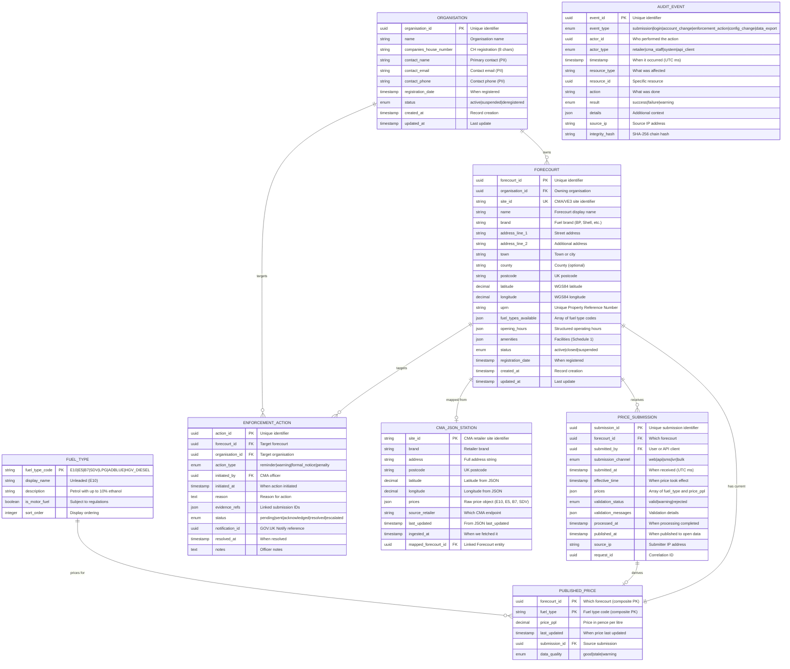

# Data Model: UK Fuel Price Transparency Service

> **Template Status**: Live | **Version**: 1.0.3 | **Command**: `/arckit.data-model`

## Document Control

| Field | Value |
|-------|-------|
| **Document ID** | ARC-001-DATA-v1.0 |
| **Document Type** | Data Model |
| **Project** | UK Fuel Price Transparency Service (Project 001) |
| **Classification** | OFFICIAL |
| **Status** | DRAFT |
| **Version** | 1.0 |
| **Created Date** | 2026-01-30 |
| **Last Modified** | 2026-01-30 |
| **Review Cycle** | Monthly |
| **Next Review Date** | 2026-03-01 |
| **Owner** | [OWNER_NAME_AND_ROLE] |
| **Reviewed By** | PENDING |
| **Approved By** | PENDING |
| **Distribution** | CMA Digital, DESNZ Policy, GDS Assessors, Delivery Team, Architecture Review Board |

## Revision History

| Version | Date | Author | Changes | Approved By | Approval Date |
|---------|------|--------|---------|-------------|---------------|
| 1.0 | 2026-01-30 | ArcKit AI | Initial creation from `/arckit.data-model` command | PENDING | PENDING |

---

## Executive Summary

### Overview

This data model defines the logical data architecture for the UK Government Fuel Price Transparency Service ("Fuel Finder"), a service operated by the Competition and Markets Authority (CMA) under the Motor Fuel Price (Open Data) Regulations 2025. The model captures the full lifecycle of fuel price data — from retailer organisation registration and forecourt registration, through price submission and validation, to published open data and enforcement actions.

The model is grounded in live JSON schema analysis of the CMA interim retailer endpoints (14 retailers providing voluntary fuel price data) and the statutory data scope defined in Schedule 1 of the Motor Fuel Price (Open Data) Regulations 2025. Four live JSON endpoints were fetched and analysed (Ascona Group, Esso, Motor Fuel Group, JET) revealing a standardised schema with `site_id`, `brand`, `address`, `postcode`, `location{latitude, longitude}`, and `prices{E10, E5, B7, SDV}` — all optional fuel types in pence per litre.

The data model supports six core entities across three tiers: **registration** (Organisation, Forecourt), **operational** (PriceSubmission, PublishedPrice), and **governance** (EnforcementAction, AuditEvent). Additionally, two supplementary entities are defined to map the live CMA JSON schema and fuel type reference data, ensuring seamless integration with both the interim CMA endpoints and the future Fuel Finder statutory API (VE3 Global).

### Model Statistics
- **Total Entities**: 8 entities defined (E-001 through E-008)
- **Total Attributes**: 96 attributes across all entities
- **Total Relationships**: 10 relationships mapped
- **Data Classification**:
  - Public: 3 entities (Forecourt, PublishedPrice, FuelType)
  - Internal: 1 entity (CmaJsonStation — ingestion staging)
  - Confidential: 2 entities (Organisation, PriceSubmission — contain PII/audit metadata)
  - Restricted: 2 entities (EnforcementAction, AuditEvent — CMA enforcement-sensitive)

### Compliance Summary
- **GDPR/DPA 2018 Status**: COMPLIANT — PII limited to Organisation contact details; legal basis is Public Task (GDPR Art 6(1)(e))
- **PII Entities**: 1 entity contains personally identifiable information (Organisation — contact_name, contact_email, contact_phone)
- **Data Protection Impact Assessment (DPIA)**: REQUIRED — large-scale processing of business data with enforcement consequences; separate DPIA document recommended (ARC-001-DPIA-v1.0)
- **Data Retention**: Longest retention is 7 years (enforcement actions, audit events — CMA legal requirements)
- **Cross-Border Transfers**: NO — all data stored and processed within UK sovereign cloud regions (TC-1)

### Key Data Governance Stakeholders
- **Data Owner (Business)**: CMA Director of Digital Markets — Accountable for data quality and usage
- **Data Steward**: CMA Data Governance Lead — Responsible for data governance policies
- **Data Custodian (Technical)**: CMA Digital Team — Manages data storage and security
- **Data Protection Officer**: CMA DPO — Ensures privacy compliance

---

## Visual Entity-Relationship Diagram (ERD)



**Diagram Notes**:
- **Cardinality**: `||` = exactly one, `o{` = zero or more, `|{` = one or more, `o|` = zero or one
- **Primary Keys (PK)**: Uniquely identify each record
- **Foreign Keys (FK)**: Reference other entities
- **Unique Keys (UK)**: Must be unique but not primary identifier
- **CMA_JSON_STATION**: Staging entity for CMA interim JSON endpoint data; maps to canonical Forecourt entity
- **PUBLISHED_PRICE**: Materialised view of current prices — composite PK (forecourt_id, fuel_type)

---

## Entity Catalog

### Entity E-001: Organisation

**Description**: A motor fuel trader (company or sole trader) that operates one or more forecourts. Registered under the Motor Fuel Price (Open Data) Regulations 2025 as a "motor fuel trader" obligated to submit pricing data.

**Source Requirements**:
- FR-001: Forecourt Registration
- INT-007: Companies House API validation
- BR-001: Regulatory compliance

**Business Context**: Organisations are the legal entities accountable for price submission compliance. CMA enforcement actions target organisations (not individual forecourts). The entity links to Companies House for validation and to GOV.UK Notify for compliance communications.

**Data Ownership**:
- **Business Owner**: CMA Director of Digital Markets — Accountable for retailer registry accuracy
- **Technical Owner**: CMA Digital Team — Maintains database and schema
- **Data Steward**: CMA Data Governance Lead — Enforces registration data quality

**Data Classification**: CONFIDENTIAL (contains PII — contact details of named individuals)

**Volume Estimates**:
- **Initial Volume**: ~3,000 records at go-live (estimated from ~8,300 forecourts with multi-site operators)
- **Growth Rate**: +50 records per year (new market entrants)
- **Peak Volume**: ~3,200 records at Year 3
- **Average Record Size**: 2 KB

**Data Retention**:
- **Active Period**: Duration of active registration in primary database
- **Archive Period**: 6 years after deregistration in cold storage
- **Total Retention**: Registration period + 6 years (driven by CMA legal retention requirements)
- **Deletion Policy**: Anonymize PII after retention period; retain non-PII for statistical purposes

#### Attributes

| Attribute | Type | Required | PII | Description | Validation Rules | Default | Source Req |
|-----------|------|----------|-----|-------------|------------------|---------|------------|
| organisation_id | UUID | Yes | No | Unique identifier | UUID v4 format | Auto-generated | FR-001 |
| name | VARCHAR(255) | Yes | No | Organisation legal name | Non-empty, 1-255 chars | None | FR-001 |
| companies_house_number | VARCHAR(8) | No | No | Companies House registration number | 8-char alphanumeric, validated via CH API | NULL | INT-007 |
| contact_name | VARCHAR(255) | Yes | Yes | Primary contact full name | Non-empty, 1-255 chars | None | FR-001 |
| contact_email | VARCHAR(255) | Yes | Yes | Primary contact email | RFC 5322 format, unique per organisation | None | FR-001 |
| contact_phone | VARCHAR(20) | Yes | Yes | Primary contact phone | E.164 format | None | FR-001 |
| registration_date | TIMESTAMP | Yes | No | When organisation registered | ISO 8601, auto-set on registration | NOW() | FR-001 |
| status | VARCHAR(20) | Yes | No | Account status | Enum: active, suspended, deregistered | 'active' | FR-001 |
| created_at | TIMESTAMP | Yes | No | Record creation time | ISO 8601, auto-set | NOW() | DR-005 |
| updated_at | TIMESTAMP | Yes | No | Last update time | ISO 8601, auto-update | NOW() | DR-005 |

**Attribute Notes**:
- **PII Attributes**: contact_name, contact_email, contact_phone — encrypted at rest (AES-256)
- **Encrypted Attributes**: contact_name, contact_email, contact_phone
- **Derived Attributes**: None
- **Audit Attributes**: created_at, updated_at — all changes logged to AuditEvent (E-006)

#### Relationships

**Outgoing Relationships** (this entity references others):
- None — Organisation is a root entity

**Incoming Relationships** (other entities reference this):
- **owns**: E-002 (Forecourt) → E-001 (Organisation)
  - Foreign Key: forecourt.organisation_id references organisation.organisation_id
  - Description: An organisation operates one or more forecourts
  - Cascade Delete: NO — organisation deregistration requires explicit forecourt handling
  - Orphan Check: REQUIRED — every forecourt must belong to an active organisation
- **targets**: E-005 (EnforcementAction) → E-001 (Organisation)
  - Description: CMA enforcement actions target the legal entity
  - Usage: Enforcement escalation path

#### Indexes

**Primary Key**:
- `pk_organisation` on `organisation_id` (clustered index)

**Unique Constraints**:
- `uk_organisation_email` on `contact_email` (unique per organisation)
- `uk_organisation_ch_number` on `companies_house_number` (unique where not null)

**Performance Indexes**:
- `idx_organisation_status` on `status` (for active organisation queries)
- `idx_organisation_name` on `name` (for search)
- `idx_organisation_registration_date` on `registration_date` (for compliance reporting)

#### Privacy & Compliance

**GDPR/DPA 2018 Considerations**:
- **Contains PII**: YES
- **PII Attributes**: contact_name, contact_email, contact_phone
- **Legal Basis for Processing**: Public Task (GDPR Art 6(1)(e)) — processing necessary for CMA's statutory enforcement function under the Motor Fuel Price (Open Data) Regulations 2025
- **Data Subject Rights**:
  - **Right to Access**: Provide organisation records via admin portal / SAR endpoint
  - **Right to Rectification**: Allow updates via retailer portal or CMA admin
  - **Right to Erasure**: Anonymize PII on request after retention period; cannot erase during active enforcement
  - **Right to Portability**: Export in JSON / CSV format
  - **Right to Object**: Not applicable — legal basis is Public Task, not consent or legitimate interests
  - **Right to Restrict Processing**: Support restriction flag during disputes
- **Data Breach Impact**: MEDIUM — contact details of named business representatives
- **Cross-Border Transfers**: None — UK sovereign cloud only
- **DPIA**: REQUIRED — part of overall service DPIA

**Government Security Classification**: OFFICIAL (OFFICIAL-SENSITIVE for PII fields)

**Audit Logging**:
- **Access Logging**: Required — log who accesses contact details
- **Change Logging**: Required — log all modifications (before/after values)
- **Retention of Logs**: 7 years (AuditEvent entity)

---

### Entity E-002: Forecourt

**Description**: A physical fuel retail location (petrol station / filling station) registered under the Motor Fuel Price (Open Data) Regulations 2025. Maps directly to the CMA interim JSON `stations[]` array element and to the Fuel Finder Schedule 1 registration data.

**Source Requirements**:
- FR-001: Forecourt Registration
- FR-004: Citizen Fuel Price Search
- INT-001: Address Gazetteer (OS Places API)
- INT-002: Geocoding Service

**Business Context**: Forecourts are the physical locations where fuel is sold. Citizens search for forecourts by location. CMA monitors compliance per forecourt. The entity schema is designed to accommodate both the CMA interim JSON format (`site_id`, `brand`, `address`, `postcode`, `location`) and the Fuel Finder statutory registration fields (Schedule 1: trading name, address, coordinates, trading hours, amenities, fuel grades).

**Data Ownership**:
- **Business Owner**: CMA Director of Digital Markets — Accountable for forecourt register accuracy
- **Technical Owner**: CMA Digital Team — Maintains database
- **Data Steward**: CMA Data Governance Lead — Ensures registration data quality

**Data Classification**: PUBLIC (addresses and locations are published as open data)

**Volume Estimates**:
- **Initial Volume**: ~8,500 records at go-live (all UK petrol stations)
- **Growth Rate**: +100 records per year (new stations, net of closures)
- **Peak Volume**: ~10,000 records at Year 3
- **Average Record Size**: 3 KB

**Data Retention**:
- **Active Period**: Indefinite while station is operational
- **Archive Period**: Indefinite — public record
- **Total Retention**: Indefinite (public register)
- **Deletion Policy**: Soft delete (status = 'closed'); retain for historical analysis

#### Attributes

| Attribute | Type | Required | PII | Description | Validation Rules | Default | Source Req |
|-----------|------|----------|-----|-------------|------------------|---------|------------|
| forecourt_id | UUID | Yes | No | Unique identifier | UUID v4 format | Auto-generated | FR-001 |
| organisation_id | UUID | Yes | No | Owning organisation | FK to Organisation, must be 'active' | None | FR-001 |
| site_id | VARCHAR(50) | No | No | CMA/VE3 site identifier | Alphanumeric, unique where not null | NULL | CMA JSON |
| name | VARCHAR(255) | Yes | No | Forecourt display name (trading name) | Non-empty, 1-255 chars | None | FR-001, Schedule 1 |
| brand | VARCHAR(100) | No | No | Fuel brand name | e.g., BP, Shell, Esso, ASDA | NULL | CMA JSON |
| address_line_1 | VARCHAR(255) | Yes | No | Street address | Non-empty | None | FR-001 |
| address_line_2 | VARCHAR(255) | No | No | Additional address line | | NULL | FR-001 |
| town | VARCHAR(100) | Yes | No | Town or city | Non-empty | None | FR-001 |
| county | VARCHAR(100) | No | No | County | | NULL | FR-001 |
| postcode | VARCHAR(10) | Yes | No | UK postcode | UK postcode regex, validated via OS Places | None | FR-001 |
| latitude | DECIMAL(10,7) | Yes | No | WGS84 latitude | Range: 49.0–61.0 (UK bounds) | None | FR-001 |
| longitude | DECIMAL(10,7) | Yes | No | WGS84 longitude | Range: -8.0–2.0 (UK bounds) | None | FR-001 |
| uprn | VARCHAR(12) | No | No | Unique Property Reference Number | 12-digit numeric string | NULL | INT-001 |
| fuel_types_available | JSONB | Yes | No | Array of fuel type codes available | Array of valid FuelType codes | '[]' | Schedule 1 |
| opening_hours | JSONB | No | No | Structured operating hours | JSON schema validated | NULL | Schedule 1 |
| amenities | JSONB | No | No | Facilities per Schedule 1 (8 items) | JSON schema validated | NULL | Schedule 1 |
| status | VARCHAR(20) | Yes | No | Forecourt status | Enum: active, closed, suspended | 'active' | FR-001 |
| registration_date | TIMESTAMP | Yes | No | When registered with Fuel Finder | ISO 8601 | NOW() | FR-001 |
| created_at | TIMESTAMP | Yes | No | Record creation | ISO 8601, auto-set | NOW() | DR-005 |
| updated_at | TIMESTAMP | Yes | No | Last update | ISO 8601, auto-update | NOW() | DR-005 |

**Attribute Notes**:
- **PII Attributes**: None — forecourt data is public
- **CMA JSON Mapping**: `site_id` maps to CMA JSON `stations[].site_id`; `brand` maps to `stations[].brand`; `address_line_1` extracted from `stations[].address`; `postcode` maps to `stations[].postcode`; `latitude`/`longitude` map to `stations[].location.latitude`/`longitude`
- **Fuel Finder Schedule 1 Fields**: `name` (trading name), `address_*` + `postcode` (site address), `latitude`/`longitude` (coordinates), `opening_hours` (trading hours), `amenities` (8 defined facilities), `fuel_types_available` (fuel grades)
- **Spatial Data**: latitude/longitude stored as DECIMAL for precision; PostGIS spatial index recommended for geographic queries

#### Relationships

**Outgoing Relationships** (this entity references others):
- **belongs_to**: E-002 → E-001 (Organisation)
  - Foreign Key: `organisation_id` references Organisation.`organisation_id`
  - Description: A forecourt is operated by one organisation
  - Cascade Delete: NO — forecourt persists as public record
  - Orphan Check: REQUIRED — every forecourt must have an organisation

**Incoming Relationships** (other entities reference this):
- **receives**: E-003 (PriceSubmission) → E-002
  - Description: Price submissions target a specific forecourt
- **has_current**: E-004 (PublishedPrice) → E-002
  - Description: Current published price per fuel type per forecourt
- **targets**: E-005 (EnforcementAction) → E-002
  - Description: Enforcement actions target a specific forecourt
- **mapped_from**: E-007 (CmaJsonStation) → E-002
  - Description: CMA interim JSON station mapped to canonical forecourt

#### Indexes

**Primary Key**:
- `pk_forecourt` on `forecourt_id` (clustered index)

**Foreign Keys**:
- `fk_forecourt_organisation` on `organisation_id`
  - References: Organisation.`organisation_id`
  - On Delete: RESTRICT
  - On Update: CASCADE

**Unique Constraints**:
- `uk_forecourt_site_id` on `site_id` (unique where not null — CMA/VE3 identifier)

**Performance Indexes**:
- `idx_forecourt_postcode` on `postcode` (for postcode search)
- `idx_forecourt_location` — PostGIS spatial index on (latitude, longitude) (for geographic proximity queries)
- `idx_forecourt_organisation` on `organisation_id` (for organisation lookup)
- `idx_forecourt_status` on `status` (for active forecourt filtering)
- `idx_forecourt_brand` on `brand` (for brand filtering)

**Full-Text Indexes**:
- `ftx_forecourt_name_address` on `(name, address_line_1, town)` (for search functionality)

#### Privacy & Compliance

**GDPR/DPA 2018 Considerations**:
- **Contains PII**: NO — all forecourt data is public open data
- **Legal Basis for Processing**: Public Task (GDPR Art 6(1)(e))
- **Data Breach Impact**: LOW — public data
- **Government Security Classification**: OFFICIAL — PUBLIC

---

### Entity E-003: PriceSubmission

**Description**: A fuel price data submission from a retailer for a specific forecourt. Represents a single price update event containing one or more fuel type prices. This is the immutable audit record of every price submission received by the service.

**Source Requirements**:
- FR-002: Manual Price Submission
- FR-003: API Price Submission
- FR-007: Data Validation Pipeline
- FR-010: Audit Trail

**Business Context**: PriceSubmissions are the core transactional data of the service. Each submission records what prices a retailer reported, when, how, and whether the data passed validation. The CMA uses submission history for compliance monitoring — detecting late or missing submissions triggers enforcement. The `prices` JSON field mirrors the CMA interim JSON schema: `{E10: 131.9, E5: 144.9, B7: 139.9, SDV: 151.9}` — all optional, in pence per litre.

**Data Ownership**:
- **Business Owner**: CMA Director of Digital Markets
- **Technical Owner**: CMA Digital Team
- **Data Steward**: CMA Data Governance Lead

**Data Classification**: CONFIDENTIAL (submission metadata including source_ip and submitter identity)

**Volume Estimates**:
- **Initial Volume**: 0 (new service)
- **Growth Rate**: ~150,000 per day (Year 1), ~300,000 per day (Year 3)
- **Peak Volume**: ~165M cumulative records at Year 3
- **Average Record Size**: 1.5 KB

**Data Retention**:
- **Active Period**: 1 year in hot storage (SSD)
- **Archive Period**: 6 years in cold storage (S3 Glacier / equivalent)
- **Total Retention**: 7 years (CMA legal retention for enforcement evidence)
- **Deletion Policy**: Hard delete after 7 years

#### Attributes

| Attribute | Type | Required | PII | Description | Validation Rules | Default | Source Req |
|-----------|------|----------|-----|-------------|------------------|---------|------------|
| submission_id | UUID | Yes | No | Unique submission identifier | UUID v4 format | Auto-generated | FR-003 |
| forecourt_id | UUID | Yes | No | Which forecourt | FK to Forecourt, must be 'active' | None | FR-003 |
| submitted_by | UUID | Yes | No | User or API client who submitted | FK to auth identity | None | FR-010 |
| submission_channel | VARCHAR(10) | Yes | No | How submitted | Enum: web, api, sms, ivr, bulk | None | FR-002, FR-003 |
| submitted_at | TIMESTAMP(3) | Yes | No | When received (UTC, millisecond precision) | ISO 8601, auto-set on receipt | NOW() | FR-003 |
| effective_time | TIMESTAMP | No | No | When price took effect at pump | ISO 8601, must be ≤ submitted_at | NULL | FR-003 |
| prices | JSONB | Yes | No | Fuel prices: `{E10: 131.9, B7: 139.9, ...}` | Schema validated; each value 50.0–500.0 PPL | None | FR-003 |
| validation_status | VARCHAR(10) | Yes | No | Processing result | Enum: valid, warning, rejected | 'valid' | FR-007 |
| validation_messages | JSONB | No | No | Validation details (warnings, errors) | JSON array | NULL | FR-007 |
| processed_at | TIMESTAMP | No | No | When processing completed | ISO 8601 | NULL | FR-007 |
| published_at | TIMESTAMP | No | No | When published to open data | ISO 8601 | NULL | FR-007 |
| source_ip | VARCHAR(45) | Yes | No | Submitter IP address (IPv4 or IPv6) | Valid IP format | None | FR-010 |
| request_id | UUID | Yes | No | Correlation ID for distributed tracing | UUID v4 | Auto-generated | NFR-M-001 |

**Attribute Notes**:
- **PII Attributes**: None directly — though `submitted_by` links to an authenticated identity
- **CMA JSON Mapping**: The `prices` JSONB field uses the same key codes as the CMA interim JSON: `E10` (unleaded petrol, 10% ethanol), `E5` (super unleaded, 5% ethanol), `B7` (diesel, 7% biodiesel), `SDV` (premium/super diesel variant)
- **Immutability**: PriceSubmission records are append-only; once created, they are never updated (corrections are new submissions)

#### Relationships

**Outgoing Relationships** (this entity references others):
- **for_forecourt**: E-003 → E-002 (Forecourt)
  - Foreign Key: `forecourt_id` references Forecourt.`forecourt_id`
  - Description: Each submission is for one specific forecourt
  - Cascade Delete: NO — submissions are immutable audit records
  - Orphan Check: REQUIRED — forecourt must exist and be active

**Incoming Relationships** (other entities reference this):
- **derives**: E-004 (PublishedPrice) → E-003
  - Description: Published price references its source submission

#### Indexes

**Primary Key**:
- `pk_price_submission` on `submission_id` (clustered index)

**Foreign Keys**:
- `fk_submission_forecourt` on `forecourt_id`
  - References: Forecourt.`forecourt_id`
  - On Delete: RESTRICT
  - On Update: CASCADE

**Performance Indexes**:
- `idx_submission_forecourt_submitted` on `(forecourt_id, submitted_at DESC)` (for latest submission per forecourt)
- `idx_submission_submitted_at` on `submitted_at` (for time-range queries, compliance monitoring)
- `idx_submission_validation_status` on `validation_status` (for rejected submission monitoring)
- `idx_submission_request_id` on `request_id` (for correlation/tracing)

**Partitioning**:
- Partition by `submitted_at` (monthly partitions) for efficient archival and query performance at high volume

#### Privacy & Compliance

**GDPR/DPA 2018 Considerations**:
- **Contains PII**: NO (prices are public; submission metadata does not constitute PII)
- **Legal Basis for Processing**: Public Task (GDPR Art 6(1)(e))
- **Data Breach Impact**: LOW — published fuel prices are public data
- **Government Security Classification**: OFFICIAL (audit metadata); published prices are PUBLIC

**Audit Logging**:
- **Access Logging**: Required for enforcement-related queries
- **Change Logging**: Not applicable — immutable entity
- **Retention of Logs**: 7 years

---

### Entity E-004: PublishedPrice

**Description**: The current published fuel price for a forecourt, derived from the latest valid PriceSubmission. This is a materialised view optimised for citizen-facing geographic proximity queries. It mirrors the CMA interim JSON `stations[].prices` structure — one row per forecourt per fuel type.

**Source Requirements**:
- FR-004: Citizen Fuel Price Search
- FR-005: Open Data API
- NFR-P-001: Performance (sub-second search response)

**Business Context**: PublishedPrice is the read-optimised entity that powers the citizen search. It contains only the current price for each fuel type at each forecourt, updated when a valid PriceSubmission is processed. This entity is published as open data via the API and bulk export. The `data_quality` field indicates freshness — 'stale' if no update received in >24 hours.

**Data Ownership**:
- **Business Owner**: CMA Director of Digital Markets
- **Technical Owner**: CMA Digital Team
- **Data Steward**: CMA Data Governance Lead

**Data Classification**: PUBLIC (published open data)

**Volume Estimates**:
- **Initial Volume**: ~34,000 records (8,500 forecourts × 4 fuel types average)
- **Growth Rate**: Proportional to forecourt growth
- **Peak Volume**: ~40,000 records at Year 3
- **Average Record Size**: 0.2 KB

**Data Retention**:
- **Active Period**: Current record — replaced on each update
- **Archive Period**: N/A — historical data retained in PriceSubmission
- **Total Retention**: Current only
- **Deletion Policy**: Row replaced on update; deleted when forecourt closes

#### Attributes

| Attribute | Type | Required | PII | Description | Validation Rules | Default | Source Req |
|-----------|------|----------|-----|-------------|------------------|---------|------------|
| forecourt_id | UUID | Yes | No | Which forecourt | Composite PK part 1; FK to Forecourt | None | FR-004 |
| fuel_type | VARCHAR(10) | Yes | No | Fuel type code | Composite PK part 2; FK to FuelType | None | FR-004 |
| price_ppl | DECIMAL(5,1) | Yes | No | Price in pence per litre | Range: 50.0–500.0 | None | FR-004 |
| last_updated | TIMESTAMP | Yes | No | When price was last updated | ISO 8601 | None | FR-004 |
| submission_id | UUID | Yes | No | Source submission | FK to PriceSubmission | None | FR-010 |
| data_quality | VARCHAR(10) | Yes | No | Quality indicator | Enum: good, stale, warning | 'good' | FR-007 |

**Attribute Notes**:
- **Composite Primary Key**: (forecourt_id, fuel_type) — one row per fuel type per forecourt
- **Fuel Type Codes**: `E10` = Unleaded petrol (10% ethanol), `E5` = Super unleaded (5% ethanol), `B7` = Diesel (7% biodiesel), `SDV` = Premium/super diesel variant — matching CMA interim JSON keys
- **Data Quality**: Automatically set to 'stale' by background job if `last_updated` > 24 hours ago

#### Relationships

**Outgoing Relationships**:
- **for_forecourt**: E-004 → E-002 (Forecourt)
  - Foreign Key: `forecourt_id` references Forecourt.`forecourt_id`
- **from_submission**: E-004 → E-003 (PriceSubmission)
  - Foreign Key: `submission_id` references PriceSubmission.`submission_id`
- **of_fuel_type**: E-004 → E-008 (FuelType)
  - Foreign Key: `fuel_type` references FuelType.`fuel_type_code`

#### Indexes

**Primary Key**:
- `pk_published_price` on `(forecourt_id, fuel_type)` (composite clustered index)

**Foreign Keys**:
- `fk_published_forecourt` on `forecourt_id` → Forecourt.`forecourt_id` (RESTRICT)
- `fk_published_submission` on `submission_id` → PriceSubmission.`submission_id` (RESTRICT)
- `fk_published_fuel_type` on `fuel_type` → FuelType.`fuel_type_code` (RESTRICT)

**Performance Indexes**:
- `idx_published_last_updated` on `last_updated` (for freshness monitoring and stale data detection)
- `idx_published_data_quality` on `data_quality` (for quality dashboard)
- `idx_published_fuel_type` on `fuel_type` (for fuel type filtering)

**Spatial Query Support**: Geographic proximity queries join PublishedPrice to Forecourt via forecourt_id and use Forecourt's spatial index on (latitude, longitude).

---

### Entity E-005: EnforcementAction

**Description**: A CMA enforcement action against a non-compliant retailer. Records the full lifecycle of compliance intervention from initial reminder through to formal penalty.

**Source Requirements**:
- FR-006: Compliance Dashboard
- FR-009: Retailer Notifications
- FR-010: Audit Trail
- INT-003: GOV.UK Notify

**Business Context**: CMA has statutory powers to enforce compliance under the Motor Fuel Price (Open Data) Regulations 2025. Penalties include up to 1% annual global turnover or 5% daily global turnover, plus unlimited criminal fines. This entity records the enforcement chain of evidence.

**Data Ownership**:
- **Business Owner**: CMA Director of Enforcement
- **Technical Owner**: CMA Digital Team
- **Data Steward**: CMA Legal Team

**Data Classification**: RESTRICTED (enforcement-sensitive; access limited to authorised CMA staff)

**Volume Estimates**:
- **Initial Volume**: 0
- **Growth Rate**: ~500 per year (estimated — dependent on compliance rates)
- **Peak Volume**: ~2,000 at Year 3
- **Average Record Size**: 2 KB

**Data Retention**:
- **Active Period**: Until resolved + 2 years in hot storage
- **Archive Period**: 5 years in cold storage
- **Total Retention**: 7 years minimum (CMA legal requirements)
- **Deletion Policy**: Hard delete after 7 years unless legal hold

#### Attributes

| Attribute | Type | Required | PII | Description | Validation Rules | Default | Source Req |
|-----------|------|----------|-----|-------------|------------------|---------|------------|
| action_id | UUID | Yes | No | Unique identifier | UUID v4 | Auto-generated | FR-006 |
| forecourt_id | UUID | Yes | No | Target forecourt | FK to Forecourt | None | FR-006 |
| organisation_id | UUID | Yes | No | Target organisation | FK to Organisation | None | FR-006 |
| action_type | VARCHAR(20) | Yes | No | Type of action | Enum: reminder, warning, formal_notice, penalty | None | FR-006 |
| initiated_by | UUID | Yes | No | CMA officer who initiated | FK to CMA staff identity | None | FR-006 |
| initiated_at | TIMESTAMP | Yes | No | When action initiated | ISO 8601 | NOW() | FR-006 |
| reason | TEXT | Yes | No | Reason for action | Non-empty | None | FR-006 |
| evidence_refs | JSONB | Yes | No | Array of linked PriceSubmission IDs | JSON array of UUIDs | '[]' | FR-010 |
| status | VARCHAR(20) | Yes | No | Action status | Enum: pending, sent, acknowledged, resolved, escalated | 'pending' | FR-006 |
| notification_id | UUID | No | No | GOV.UK Notify reference | UUID from Notify API response | NULL | INT-003 |
| resolved_at | TIMESTAMP | No | No | When resolved | ISO 8601 | NULL | FR-006 |
| notes | TEXT | No | No | Officer notes | Free text | NULL | FR-006 |

#### Relationships

**Outgoing Relationships**:
- **targets_forecourt**: E-005 → E-002 (Forecourt)
  - Foreign Key: `forecourt_id` references Forecourt.`forecourt_id`
  - Cascade Delete: NO
- **targets_organisation**: E-005 → E-001 (Organisation)
  - Foreign Key: `organisation_id` references Organisation.`organisation_id`
  - Cascade Delete: NO

#### Indexes

**Primary Key**:
- `pk_enforcement_action` on `action_id`

**Foreign Keys**:
- `fk_enforcement_forecourt` on `forecourt_id` → Forecourt.`forecourt_id` (RESTRICT)
- `fk_enforcement_organisation` on `organisation_id` → Organisation.`organisation_id` (RESTRICT)

**Performance Indexes**:
- `idx_enforcement_status` on `status` (for active action monitoring)
- `idx_enforcement_organisation` on `organisation_id` (for per-organisation history)
- `idx_enforcement_initiated_at` on `initiated_at` (for chronological reporting)
- `idx_enforcement_action_type` on `action_type` (for action type reporting)

#### Privacy & Compliance

**GDPR/DPA 2018 Considerations**:
- **Contains PII**: NO directly (references Organisation which contains PII)
- **Legal Basis for Processing**: Public Task (GDPR Art 6(1)(e)) — CMA statutory enforcement
- **Data Breach Impact**: HIGH — enforcement-sensitive data; premature disclosure could prejudice investigations
- **Government Security Classification**: OFFICIAL-SENSITIVE

**Audit Logging**:
- **Access Logging**: REQUIRED — all access logged
- **Change Logging**: REQUIRED — all status changes logged with before/after values
- **Retention of Logs**: 7 years

---

### Entity E-006: AuditEvent

**Description**: Immutable record of significant system events for compliance, forensics, and regulatory accountability. Implements a hash-chain for tamper evidence.

**Source Requirements**:
- FR-010: Audit Trail
- NFR-S-003: Audit and Forensics
- BR-004: Regulatory accountability

**Business Context**: CMA enforcement requires evidential integrity. Every significant action — price submission, login, account change, enforcement action, configuration change, data export — is recorded immutably. The SHA-256 integrity_hash creates a chain linking each event to the previous, providing tamper evidence.

**Data Ownership**:
- **Business Owner**: CMA Director of Enforcement
- **Technical Owner**: CMA Digital Team (DBA)
- **Data Steward**: CMA Information Security Officer

**Data Classification**: RESTRICTED (contains security-relevant audit data)

**Volume Estimates**:
- **Initial Volume**: 0
- **Growth Rate**: ~500,000 per day (Year 1) — every submission + system events
- **Peak Volume**: ~550M cumulative at Year 3
- **Average Record Size**: 0.5 KB

**Data Retention**:
- **Active Period**: 1 year in hot storage
- **Archive Period**: 6 years in cold storage (append-only, immutable)
- **Total Retention**: 7 years (immutable, append-only storage)
- **Deletion Policy**: Hard delete after 7 years; no modification permitted during retention

#### Attributes

| Attribute | Type | Required | PII | Description | Validation Rules | Default | Source Req |
|-----------|------|----------|-----|-------------|------------------|---------|------------|
| event_id | UUID | Yes | No | Unique identifier | UUID v4 | Auto-generated | FR-010 |
| event_type | VARCHAR(30) | Yes | No | Type of event | Enum: submission, login, account_change, enforcement_action, config_change, data_export | None | FR-010 |
| actor_id | UUID | Yes | No | Who performed the action | Indexed | None | FR-010 |
| actor_type | VARCHAR(20) | Yes | No | Type of actor | Enum: retailer, cma_staff, system, api_client | None | FR-010 |
| timestamp | TIMESTAMP(3) | Yes | No | When it occurred (UTC, ms) | ISO 8601, auto-set | NOW() | FR-010 |
| resource_type | VARCHAR(100) | Yes | No | What was affected | e.g., 'forecourt', 'price_submission', 'organisation' | None | FR-010 |
| resource_id | UUID | Yes | No | Specific resource affected | Indexed | None | FR-010 |
| action | VARCHAR(100) | Yes | No | What was done | e.g., 'create', 'update', 'submit_price', 'login' | None | FR-010 |
| result | VARCHAR(10) | Yes | No | Outcome | Enum: success, failure, warning | None | FR-010 |
| details | JSONB | No | No | Additional context (before/after values) | JSON | NULL | FR-010 |
| source_ip | VARCHAR(45) | Yes | No | Source IP address | Valid IP format | None | FR-010 |
| integrity_hash | VARCHAR(64) | Yes | No | SHA-256 chain hash | 64-char hex; hash of (previous_hash + event data) | None | NFR-S-003 |

**Attribute Notes**:
- **Immutability**: AuditEvent records are INSERT-ONLY; UPDATE and DELETE operations are prohibited at the database level
- **Hash Chain**: `integrity_hash` = SHA-256(previous_event.integrity_hash + event_id + event_type + timestamp + resource_id + action)
- **Tamper Detection**: Background verification job checks hash chain integrity daily

#### Relationships

- AuditEvent is a standalone entity with no foreign key constraints to other entities (by design — audit records must persist independently of referenced resources)

#### Indexes

**Primary Key**:
- `pk_audit_event` on `event_id`

**Performance Indexes**:
- `idx_audit_timestamp` on `timestamp` (for chronological queries)
- `idx_audit_actor` on `(actor_id, actor_type)` (for per-user audit trail)
- `idx_audit_resource` on `(resource_type, resource_id)` (for per-resource audit trail)
- `idx_audit_event_type` on `event_type` (for event type filtering)

**Partitioning**:
- Partition by `timestamp` (monthly partitions) for efficient archival

#### Privacy & Compliance

- **Contains PII**: NO (references actors by ID, not by PII)
- **Government Security Classification**: OFFICIAL-SENSITIVE
- **Immutability**: Enforced at database level (no UPDATE/DELETE permissions on this table)

---

### Entity E-007: CmaJsonStation

**Description**: Staging entity for data ingested from the 14 CMA interim voluntary JSON endpoints. Stores the raw JSON structure as discovered from live endpoint analysis. Used during the transition period before the Fuel Finder statutory API (VE3 Global) achieves full coverage.

**Source Requirements**:
- Research document ARC-001-RSCH-v1.0 (CMA Interim Scheme)
- Integration strategy: CMA interim endpoints as transition data source

**Business Context**: During the transition period (February 2026 onwards), the service ingests fuel price data from 14 CMA retailer JSON endpoints. This entity captures the raw inbound data for reconciliation and deduplication before mapping to the canonical Forecourt and PriceSubmission entities. The JSON schema was verified by fetching live data from Ascona Group, Esso, Motor Fuel Group, and JET endpoints.

**Data Ownership**:
- **Business Owner**: CMA Digital Team
- **Technical Owner**: CMA Digital Team
- **Data Steward**: CMA Data Governance Lead

**Data Classification**: INTERNAL (staging data; not published directly)

**Volume Estimates**:
- **Initial Volume**: ~5,000 records (stations across 14 retailers)
- **Growth Rate**: Stable (refreshed on each ingestion cycle)
- **Peak Volume**: ~5,000 records (replaced on each fetch)
- **Average Record Size**: 0.5 KB

**Data Retention**:
- **Active Period**: Current fetch cycle only (replaced on each ingestion)
- **Archive Period**: 30 days (for reconciliation and debugging)
- **Total Retention**: 30 days
- **Deletion Policy**: Hard delete after 30 days

#### Attributes

| Attribute | Type | Required | PII | Description | Validation Rules | Default | Source Req |
|-----------|------|----------|-----|-------------|------------------|---------|------------|
| site_id | VARCHAR(50) | Yes | No | CMA retailer site identifier | PK; from JSON `stations[].site_id` | None | CMA JSON |
| brand | VARCHAR(100) | Yes | No | Retailer brand name | From JSON `stations[].brand` | None | CMA JSON |
| address | VARCHAR(500) | Yes | No | Full address string | From JSON `stations[].address` | None | CMA JSON |
| postcode | VARCHAR(10) | Yes | No | UK postcode | From JSON `stations[].postcode` | None | CMA JSON |
| latitude | DECIMAL(10,7) | Yes | No | Latitude | From JSON `stations[].location.latitude` | None | CMA JSON |
| longitude | DECIMAL(10,7) | Yes | No | Longitude | From JSON `stations[].location.longitude` | None | CMA JSON |
| prices | JSONB | Yes | No | Raw price object `{E10:131.9, B7:139.9, ...}` | From JSON `stations[].prices` | None | CMA JSON |
| source_retailer | VARCHAR(50) | Yes | No | Which CMA endpoint source | e.g., 'ascona', 'esso', 'mfg', 'jet' | None | CMA JSON |
| last_updated | TIMESTAMP | Yes | No | From JSON `last_updated` field | Parsed from DD/MM/YYYY HH:MM:SS | None | CMA JSON |
| ingested_at | TIMESTAMP | Yes | No | When we fetched the data | ISO 8601, auto-set | NOW() | System |
| mapped_forecourt_id | UUID | No | No | Linked canonical Forecourt entity | FK to Forecourt, set by reconciliation | NULL | System |

**Attribute Notes**:
- **Raw JSON Schema** (verified from live endpoints):
```json
{
  "last_updated": "30/01/2026 14:30:00",
  "stations": [{
    "site_id": "gcqfydrhb9q5",
    "brand": "BP",
    "address": "123 High Street, Example Town",
    "postcode": "SW1A 1AA",
    "location": {
      "latitude": 51.5074,
      "longitude": -0.1278
    },
    "prices": {
      "E10": 131.9,
      "E5": 144.9,
      "B7": 139.9,
      "SDV": 151.9
    }
  }]
}
```
- All fuel type prices are optional (not every station sells all types)
- Prices are in pence per litre (decimal)

#### Indexes

**Primary Key**:
- `pk_cma_json_station` on `(site_id, source_retailer)` (composite — same site_id may appear across retailers)

**Performance Indexes**:
- `idx_cma_json_postcode` on `postcode` (for reconciliation matching)
- `idx_cma_json_mapped` on `mapped_forecourt_id` (for join to canonical entity)
- `idx_cma_json_ingested` on `ingested_at` (for freshness monitoring)

---

### Entity E-008: FuelType

**Description**: Reference data entity defining the fuel types recognised by the service. Maps CMA JSON codes (E10, E5, B7, SDV) to human-readable names and regulatory classification.

**Source Requirements**:
- Schedule 1 of Motor Fuel Price (Open Data) Regulations 2025
- CMA interim JSON schema (fuel type codes)

**Business Context**: Fuel types are the product dimension of the pricing data. The Regulations define "motor fuel" — the service must distinguish between regulated motor fuels (petrol, diesel) and optional supplementary fuels (LPG, AdBlue, HGV diesel). The code system follows the CMA interim JSON convention.

**Data Ownership**:
- **Business Owner**: CMA Digital Team
- **Technical Owner**: CMA Digital Team
- **Data Steward**: CMA Data Governance Lead

**Data Classification**: PUBLIC (reference data)

**Volume Estimates**:
- **Initial Volume**: 7 records
- **Growth Rate**: ~0 (stable reference data)
- **Peak Volume**: ~10 (if new fuel types emerge)
- **Average Record Size**: 0.1 KB

**Data Retention**: Indefinite (reference data)

#### Attributes

| Attribute | Type | Required | PII | Description | Validation Rules | Default | Source Req |
|-----------|------|----------|-----|-------------|------------------|---------|------------|
| fuel_type_code | VARCHAR(10) | Yes | No | Unique fuel type code | PK; e.g., E10, E5, B7, SDV | None | CMA JSON |
| display_name | VARCHAR(50) | Yes | No | Human-readable name | e.g., 'Unleaded (E10)' | None | FR-004 |
| description | VARCHAR(255) | Yes | No | Full description | e.g., 'Petrol with up to 10% ethanol' | None | FR-004 |
| is_motor_fuel | BOOLEAN | Yes | No | Subject to Regulations | true for E10, E5, B7, SDV | true | Regulations |
| sort_order | INTEGER | Yes | No | Display ordering | Positive integer | 0 | FR-004 |

**Reference Data Values**:

| fuel_type_code | display_name | description | is_motor_fuel | sort_order |
|----------------|-------------|-------------|---------------|------------|
| E10 | Unleaded (E10) | Petrol with up to 10% ethanol (standard unleaded) | true | 1 |
| E5 | Super Unleaded (E5) | Petrol with up to 5% ethanol (premium/super) | true | 2 |
| B7 | Diesel (B7) | Diesel with up to 7% biodiesel (standard diesel) | true | 3 |
| SDV | Premium Diesel | Super diesel variant (premium diesel) | true | 4 |
| LPG | LPG | Liquefied Petroleum Gas (autogas) | false | 5 |
| ADBLUE | AdBlue | Diesel exhaust fluid (not motor fuel) | false | 6 |
| HGV_DIESEL | HGV Diesel | Heavy goods vehicle diesel (separate pump) | true | 7 |

#### Indexes

**Primary Key**:
- `pk_fuel_type` on `fuel_type_code`

---

## Data Governance Matrix

| Entity | Business Owner | Data Steward | Technical Custodian | Sensitivity | Compliance | Quality SLA | Access Control |
|--------|----------------|--------------|---------------------|-------------|------------|-------------|----------------|
| E-001: Organisation | CMA Director of Digital Markets | CMA Data Governance Lead | CMA Digital Team (DBA) | CONFIDENTIAL | GDPR/DPA 2018 | 100% accuracy for registration data | Role: CMA Admin, Retailer (own org only) |
| E-002: Forecourt | CMA Director of Digital Markets | CMA Data Governance Lead | CMA Digital Team (DBA) | PUBLIC | Open Data, Schedule 1 | 100% completeness for active forecourts | Role: Public (read), CMA Admin (write), Retailer (own forecourts) |
| E-003: PriceSubmission | CMA Director of Digital Markets | CMA Data Governance Lead | CMA Digital Team (DBA) | CONFIDENTIAL | CMA legal retention | 100% completeness, <30min latency | Role: CMA Admin (read), System (write) |
| E-004: PublishedPrice | CMA Director of Digital Markets | CMA Data Governance Lead | CMA Digital Team (DBA) | PUBLIC | Open Data | 99.9% availability, <24hr freshness | Role: Public (read), System (write) |
| E-005: EnforcementAction | CMA Director of Enforcement | CMA Legal Team | CMA Digital Team (DBA) | RESTRICTED | CMA enforcement law | 100% accuracy | Role: CMA Enforcement Officers only |
| E-006: AuditEvent | CMA Director of Enforcement | CMA CISO | CMA Digital Team (DBA) | RESTRICTED | CMA legal retention | 100% completeness, tamper-evident | Role: CMA CISO, CMA Audit (read-only) |
| E-007: CmaJsonStation | CMA Digital Team | CMA Data Governance Lead | CMA Digital Team (DBA) | INTERNAL | None (staging) | Best effort | Role: System (read/write), CMA Admin (read) |
| E-008: FuelType | CMA Digital Team | CMA Data Governance Lead | CMA Digital Team (DBA) | PUBLIC | None (reference) | 100% accuracy | Role: Public (read), CMA Admin (write) |

---

## CRUD Matrix

| Entity | Citizen Search | Retailer Portal | CMA Enforcement Dashboard | Data Ingestion Pipeline | Open Data API | GOV.UK Notify | Batch Jobs |
|--------|---------------|-----------------|---------------------------|-------------------------|---------------|---------------|------------|
| E-001: Organisation | ---- | CR-U | -R-- | ---- | ---- | -R-- | ---- |
| E-002: Forecourt | -R-- | CR-U | -R-- | --U- | -R-- | ---- | ---- |
| E-003: PriceSubmission | ---- | C--- | -R-- | CR-- | ---- | ---- | ---D |
| E-004: PublishedPrice | -R-- | ---- | -R-- | C-U- | -R-- | ---- | --U- |
| E-005: EnforcementAction | ---- | ---- | CRUD | ---- | ---- | -R-- | ---- |
| E-006: AuditEvent | ---- | ---- | -R-- | C--- | ---- | ---- | ---D |
| E-007: CmaJsonStation | ---- | ---- | -R-- | CRUD | ---- | ---- | ---D |
| E-008: FuelType | -R-- | -R-- | -R-- | -R-- | -R-- | ---- | ---- |

**Legend**:
- **C** = Create, **R** = Read, **U** = Update, **D** = Delete, **-** = No access

**Access Control Implications**:
- **Citizen Search**: Read-only access to public data (Forecourt, PublishedPrice, FuelType)
- **Retailer Portal**: Can create/update own Organisation and Forecourts; can create PriceSubmissions
- **CMA Enforcement Dashboard**: Full CRUD on EnforcementAction; read access to all entities for investigation
- **Data Ingestion Pipeline**: Creates PriceSubmissions (from API/bulk), updates PublishedPrice, manages CmaJsonStation staging
- **Open Data API**: Read-only access to Forecourt, PublishedPrice, FuelType — public endpoints
- **GOV.UK Notify**: Read access to Organisation (for contact details) and EnforcementAction (for notification content)
- **Batch Jobs**: Archival deletion of aged PriceSubmission, AuditEvent, and CmaJsonStation records; staleness update for PublishedPrice

---

## Data Integration Mapping

### Upstream Systems (Data Sources)

#### Integration INT-001: CMA Interim JSON Endpoints (14 Retailers)

**Source System**: 14 individual retailer-hosted JSON endpoints (voluntary CMA open data scheme)

**Integration Type**: Batch ETL (scheduled polling, typically every 30 minutes)

**Data Flow Direction**: Retailer Endpoints → CmaJsonStation (staging) → Forecourt + PriceSubmission + PublishedPrice

**Entities Affected**:
- **E-007 (CmaJsonStation)**: Full refresh from JSON on each poll cycle
- **E-002 (Forecourt)**: New stations matched/created via postcode + brand reconciliation
- **E-003 (PriceSubmission)**: Price changes create new submissions
- **E-004 (PublishedPrice)**: Updated from valid submissions

**Data Mapping**:

| Source Field (CMA JSON) | Source Type | Target Entity | Target Attribute | Transformation |
|-------------------------|-------------|---------------|------------------|----------------|
| `stations[].site_id` | String | E-007 | site_id | Direct mapping |
| `stations[].brand` | String | E-007/E-002 | brand | Direct mapping |
| `stations[].address` | String | E-007 | address | Direct; split into address_line_1 + town for E-002 |
| `stations[].postcode` | String | E-007/E-002 | postcode | Direct mapping; validate via OS Places |
| `stations[].location.latitude` | Number | E-007/E-002 | latitude | Direct mapping; validate UK bounds |
| `stations[].location.longitude` | Number | E-007/E-002 | longitude | Direct mapping; validate UK bounds |
| `stations[].prices.E10` | Number | E-003 | prices.E10 | Direct mapping; validate 50.0–500.0 PPL |
| `stations[].prices.E5` | Number | E-003 | prices.E5 | Direct mapping; validate range |
| `stations[].prices.B7` | Number | E-003 | prices.B7 | Direct mapping; validate range |
| `stations[].prices.SDV` | Number | E-003 | prices.SDV | Direct mapping; validate range |
| `last_updated` | String | E-007 | last_updated | Parse DD/MM/YYYY HH:MM:SS to ISO 8601 |

**Data Quality Rules**:
- **Validation**: Reject stations with missing site_id, postcode, or all prices null
- **Deduplication**: Match to existing Forecourt by postcode + brand (fuzzy) or site_id (exact)
- **Error Handling**: Failed stations logged to error table; alert on >10% failure rate
- **Price Change Detection**: Only create PriceSubmission if price differs from current PublishedPrice

**Reconciliation**:
- **Frequency**: After each poll cycle
- **Method**: Compare station count per retailer against expected count; flag missing stations
- **Tolerance**: <5% variance acceptable (some stations may be temporarily offline)

---

#### Integration INT-002: Fuel Finder Statutory API (VE3 Global)

**Source System**: VE3 Global Ltd aggregator API (statutory data under Motor Fuel Price (Open Data) Regulations 2025)

**Integration Type**: Real-time API + Batch flat file (twice daily)

**Data Flow Direction**: VE3 Global API → PriceSubmission + PublishedPrice; Flat File → Forecourt (registration data)

**Entities Affected**:
- **E-002 (Forecourt)**: Registration data (Schedule 1 fields)
- **E-003 (PriceSubmission)**: Real-time price submissions
- **E-004 (PublishedPrice)**: Updated from valid submissions

**Data Mapping**: To be defined when VE3 Global publishes API specification (currently not publicly available — see risk VR-1 in ARC-001-RSCH-v1.0)

**Note**: The Fuel Finder API is the primary data source. The CMA interim endpoints (INT-001) serve as transition data until Fuel Finder achieves full coverage.

---

#### Integration INT-003: OS Places API

**Source System**: Ordnance Survey Places API (AddressBase Premium)

**Integration Type**: Real-time API (query on forecourt registration)

**Data Flow Direction**: Fuel Finder → OS Places API → Fuel Finder

**Entities Affected**:
- **E-002 (Forecourt)**: Address validation, UPRN resolution, coordinate verification

**Data Mapping**:

| Source Field (OS Places) | Target Entity | Target Attribute | Transformation |
|--------------------------|---------------|------------------|----------------|
| DPA.UPRN | E-002 | uprn | Direct mapping |
| DPA.ADDRESS | E-002 | address_line_1 | Standardised address |
| DPA.POST_TOWN | E-002 | town | Direct mapping |
| DPA.POSTCODE | E-002 | postcode | Validated postcode |
| DPA.X_COORDINATE / Y_COORDINATE | E-002 | latitude, longitude | Convert BNG to WGS84 |

---

#### Integration INT-004: Companies House API

**Source System**: Companies House API

**Integration Type**: Real-time API (query on organisation registration)

**Data Flow Direction**: Fuel Finder → Companies House → Fuel Finder

**Entities Affected**:
- **E-001 (Organisation)**: Validate company name, registration number, active status

---

### Downstream Systems (Data Consumers)

#### Integration INT-101: Open Data API (Public)

**Target System**: Third-party developers, citizens, researchers

**Integration Type**: REST API (real-time)

**Data Flow Direction**: Fuel Finder → Public API consumers

**Entities Shared**:
- **E-002 (Forecourt)**: Station locations, names, brands, fuel types — all public fields
- **E-004 (PublishedPrice)**: Current fuel prices per station per fuel type
- **E-008 (FuelType)**: Fuel type reference data

**Data Mapping**:

| Source Entity | Source Attribute | API Field | Format | Notes |
|---------------|------------------|-----------|--------|-------|
| E-002 | forecourt_id | id | UUID | Public identifier |
| E-002 | name | name | String | Trading name |
| E-002 | brand | brand | String | Fuel brand |
| E-002 | address_line_1, town, postcode | address | Object | Structured address |
| E-002 | latitude, longitude | location | Object | GeoJSON point |
| E-004 | fuel_type, price_ppl | prices | Array | Per fuel type |
| E-004 | last_updated | last_updated | ISO 8601 | UTC timestamp |
| E-004 | data_quality | data_quality | String | Freshness indicator |

**Data Quality Assurance**:
- **Pre-send Validation**: Only publish forecourts with status='active' and at least one current price
- **Rate Limiting**: Standard rate limits per consumer (X-RateLimit headers)
- **Format**: JSON (primary), CSV (bulk export), GeoJSON (geographic consumers)

---

#### Integration INT-102: GOV.UK Notify

**Target System**: GOV.UK Notify (email/SMS)

**Integration Type**: Real-time API

**Data Flow Direction**: Fuel Finder → GOV.UK Notify → Retailers

**Entities Shared**:
- **E-001 (Organisation)**: Contact details for notification delivery
- **E-005 (EnforcementAction)**: Action details for enforcement notice content

---

#### Integration INT-103: DESNZ / data.gov.uk

**Target System**: DESNZ statistics, data.gov.uk open data portal

**Integration Type**: Batch export (weekly)

**Entities Shared**:
- **E-004 (PublishedPrice)**: Aggregated price statistics (national/regional averages)
- **E-002 (Forecourt)**: Station counts and distribution

---

### Master Data Management (MDM)

**Source of Truth** (which system is authoritative for each entity):

| Entity | System of Record | Rationale | Conflict Resolution |
|--------|------------------|-----------|---------------------|
| E-001: Organisation | Fuel Finder service | Organisation registration managed by CMA | Fuel Finder is authoritative; validated against Companies House |
| E-002: Forecourt | Fuel Finder service (from Fuel Finder statutory scheme) | Registration data from VE3 Global / direct registration | Fuel Finder statutory data wins over CMA interim JSON |
| E-003: PriceSubmission | Fuel Finder service | Submissions received directly by the service | Append-only, no conflicts |
| E-004: PublishedPrice | Fuel Finder service | Derived from latest valid PriceSubmission | Derived — recalculated on each valid submission |
| E-005: EnforcementAction | Fuel Finder service | CMA enforcement records created in-service | CMA is sole authority |
| E-006: AuditEvent | Fuel Finder service | System-generated immutable log | Append-only, no conflicts |
| E-007: CmaJsonStation | CMA interim retailer endpoints | External source — staging only | Source endpoint is authoritative for its data |
| E-008: FuelType | Fuel Finder service | Reference data managed by CMA | CMA is sole authority |

**Data Lineage**:
- **E-002 (Forecourt)**: Seeded from CMA interim JSON → Validated via OS Places API → Updated by Fuel Finder statutory registration → Published via Open Data API
- **E-003 (PriceSubmission)**: Created by retailer (web/api/sms/ivr) or ingested from CMA JSON / Fuel Finder API → Validated by pipeline → Derives PublishedPrice → Archived to cold storage
- **E-004 (PublishedPrice)**: Derived from valid PriceSubmission → Served to Citizen Search and Open Data API → Exported to DESNZ

---

## Privacy & Compliance

### GDPR / UK Data Protection Act 2018 Compliance

#### PII Inventory

**Entities Containing PII**:
- **E-001 (Organisation)**: contact_name, contact_email, contact_phone

**Total PII Attributes**: 3 attributes across 1 entity

**Special Category Data** (sensitive PII under GDPR Article 9):
- None — the service does not process health, biometric, political, or other special category data

#### Legal Basis for Processing

| Entity | Purpose | Legal Basis | Notes |
|--------|---------|-------------|-------|
| E-001: Organisation | Registration and compliance management | Public Task (GDPR Art 6(1)(e)) | CMA statutory function under Motor Fuel Price (Open Data) Regulations 2025 |
| E-002: Forecourt | Forecourt register and citizen service | Public Task (GDPR Art 6(1)(e)) | Statutory open data obligation |
| E-003: PriceSubmission | Price data collection and validation | Public Task (GDPR Art 6(1)(e)) | Statutory data submission obligation |
| E-004: PublishedPrice | Open data publication | Public Task (GDPR Art 6(1)(e)) | Statutory open data |
| E-005: EnforcementAction | CMA enforcement | Public Task (GDPR Art 6(1)(e)) | Statutory enforcement powers |
| E-006: AuditEvent | Regulatory audit trail | Legal Obligation (GDPR Art 6(1)(c)) | CMA record-keeping obligations |

**Consent Management**: Not required — legal basis is Public Task and Legal Obligation, not consent.

#### Data Subject Rights Implementation

**Right to Access (Subject Access Request)**:
- **Scope**: Organisation contact data (E-001) only — all other data is public or non-personal
- **Authentication**: Multi-factor authentication via retailer portal or CMA admin
- **Response Format**: JSON containing all personal data for the requesting individual
- **Response Time**: Within 30 days (GDPR / DPA 2018 requirement)

**Right to Rectification**:
- **Scope**: Organisation contact details (contact_name, contact_email, contact_phone)
- **Process**: Retailer updates via portal; CMA admin override for data steward corrections
- **Propagation**: Immediate — Organisation table updated; downstream systems (GOV.UK Notify) use live data

**Right to Erasure (Right to be Forgotten)**:
- **Method**: Anonymization (replace PII with anonymized values)
- **Process**: Request reviewed by CMA DPO; approved only after active enforcement actions completed
- **Exceptions**: Cannot anonymize if active enforcement action or legal hold applies
- **Retention Override**: Organisation record retained with anonymized PII for statistical purposes

**Right to Data Portability**:
- **Scope**: Organisation registration data provided by the retailer
- **Format**: JSON or CSV (machine-readable)

**Right to Object**:
- **Not applicable**: Processing is based on Public Task, not consent or legitimate interests. Data subjects cannot object to statutory processing.

#### Data Retention Schedule

| Entity | Active Retention | Archive Retention | Total Retention | Legal Basis | Deletion Method |
|--------|------------------|-------------------|-----------------|-------------|-----------------|
| E-001: Organisation | Active registration + 2 years | 4 years | Registration + 6 years | CMA legal retention | Anonymize PII; retain non-PII |
| E-002: Forecourt | Indefinite | N/A | Indefinite | Public register | Soft delete (status='closed') |
| E-003: PriceSubmission | 1 year (hot) | 6 years (cold) | 7 years | CMA enforcement evidence | Hard delete after 7 years |
| E-004: PublishedPrice | Current only | N/A | Current | Operational | Replace on update |
| E-005: EnforcementAction | Resolution + 2 years | 5 years | 7 years | CMA legal requirements | Hard delete after 7 years |
| E-006: AuditEvent | 1 year (hot) | 6 years (cold) | 7 years | CMA audit obligations | Hard delete after 7 years |
| E-007: CmaJsonStation | Current fetch | 30 days | 30 days | Operational only | Hard delete after 30 days |
| E-008: FuelType | Indefinite | N/A | Indefinite | Reference data | N/A |

**Retention Policy Enforcement**:
- **Automated Deletion**: Monthly batch job to delete/anonymize data past retention period
- **Audit Trail**: Deletion events logged to AuditEvent (entity type, deletion date, count of records deleted)

#### Cross-Border Data Transfers

**Data Locations**:
- **Primary Database**: UK (AWS eu-west-2 London or Azure UK South)
- **Backup Storage**: UK (same region, different availability zone)
- **Downstream Systems**: UK only (GOV.UK Notify, OS Places, Companies House — all UK-hosted)

**Cross-Border Transfers**: NONE — all data stored and processed within UK sovereign cloud regions (per TC-1)

#### Data Protection Impact Assessment (DPIA)

**DPIA Required**: YES

**Triggers for DPIA** (GDPR Article 35):
- ⬜ Large-scale processing of special category data
- ⬜ Systematic monitoring of publicly accessible areas
- ⬜ Automated decision-making with legal or significant effects
- ✅ Large-scale processing of data relating to criminal/enforcement proceedings
- ✅ Processing involving vulnerable data subjects (business owners facing enforcement)

**DPIA Status**: NOT_STARTED — recommend creating ARC-001-DPIA-v1.0 via `/arckit.dpia`

---

### Government Security Classifications (UK Public Sector)

**Applicability**: APPLICABLE — UK Government OFFICIAL classification

**Classification by Entity**:

| Entity | Classification | Rationale |
|--------|---------------|-----------|
| E-001: Organisation | OFFICIAL (OFFICIAL-SENSITIVE for PII fields) | PII contact details |
| E-002: Forecourt | OFFICIAL — PUBLIC | Published open data |
| E-003: PriceSubmission | OFFICIAL | Audit metadata |
| E-004: PublishedPrice | OFFICIAL — PUBLIC | Published open data |
| E-005: EnforcementAction | OFFICIAL-SENSITIVE | Enforcement proceedings |
| E-006: AuditEvent | OFFICIAL-SENSITIVE | Security audit trail |
| E-007: CmaJsonStation | OFFICIAL | Staging data |
| E-008: FuelType | OFFICIAL — PUBLIC | Reference data |

**Security Controls**:
- **OFFICIAL**: Standard cloud security controls; TLS 1.2+ in transit; encryption at rest
- **OFFICIAL-SENSITIVE**: Role-based access control; access logging; encryption at rest (AES-256); no public endpoint exposure

---

## Data Quality Framework

### Quality Dimensions

#### Accuracy
**Definition**: Data correctly represents real-world fuel prices and station details

**Quality Targets**:

| Entity | Attribute | Accuracy Target | Measurement Method | Owner |
|--------|-----------|-----------------|-------------------|-------|
| E-002: Forecourt | postcode | 100% valid UK postcodes | Validation via OS Places API | CMA Data Governance Lead |
| E-002: Forecourt | latitude, longitude | Within 50m of actual location | Cross-reference with OS Places and OSM | CMA Data Governance Lead |
| E-003: PriceSubmission | prices | 100% within plausible range | Range check: 50.0–500.0 PPL | CMA Digital Team |
| E-004: PublishedPrice | price_ppl | 99.5% match to pump price | Spot checks via enforcement officers | CMA Director of Enforcement |

**Validation Rules**:
- **Postcode**: UK postcode regex + OS Places API lookup
- **Coordinates**: UK geographic bounds (49.0–61.0 lat, -8.0–2.0 lng)
- **Price**: Range 50.0–500.0 PPL; anomaly detection for >20% change within 24 hours
- **Site ID**: Unique per retailer source

#### Completeness
**Definition**: All required data elements are populated

**Quality Targets**:

| Entity | Required Fields Completeness | Target | Owner |
|--------|------------------------------|--------|-------|
| E-002: Forecourt | name, postcode, latitude, longitude | 100% | CMA Data Governance Lead |
| E-002: Forecourt | fuel_types_available | 100% for active forecourts | CMA Data Governance Lead |
| E-004: PublishedPrice | At least one fuel type per active forecourt | 100% | CMA Digital Team |
| E-001: Organisation | All required fields | 100% | CMA Data Governance Lead |

**Missing Data Handling**:
- **Required Fields**: Reject record creation if missing (hard validation)
- **Optional Fields**: Allow NULL; track completeness % in quality dashboard

#### Timeliness
**Definition**: Data is up-to-date and available when needed

**Quality Targets**:

| Entity | Update Frequency | Staleness Tolerance | Owner |
|--------|------------------|---------------------|-------|
| E-004: PublishedPrice | Within 30 minutes of price change | >24 hours = stale indicator | CMA Digital Team |
| E-003: PriceSubmission | Real-time on receipt | <5 minutes processing latency | CMA Digital Team |
| E-002: Forecourt | On registration change | <3 days (per Regulations) | CMA Data Governance Lead |
| E-007: CmaJsonStation | Every 30 minutes (poll) | <1 hour | CMA Digital Team |

**Staleness Monitoring**:
- **Alert**: If any active forecourt has no price update in >24 hours, alert CMA compliance team
- **Dashboard**: Real-time data freshness dashboard showing median and p95 data age

#### Uniqueness
**Definition**: No duplicate records exist

**Deduplication Rules**:

| Entity | Unique Key | Deduplication Logic | Duplicate Resolution |
|--------|------------|---------------------|----------------------|
| E-002: Forecourt | site_id (where not null) | Exact match on site_id per source | Merge to existing record |
| E-002: Forecourt | postcode + brand (fuzzy) | Fuzzy match for stations without site_id | Manual review by data steward |
| E-001: Organisation | companies_house_number | Exact match on CH number | Merge to existing record |
| E-007: CmaJsonStation | (site_id, source_retailer) | Composite key prevents duplicates per source | Replace on each poll |

---

### Data Quality Metrics

**Overall Data Quality Score** (weighted average):
- Accuracy: 40% weight → Target: 99%
- Completeness: 30% weight → Target: 100%
- Timeliness: 20% weight → Target: 95% (% of forecourts with data <24hrs old)
- Uniqueness: 10% weight → Target: 99.9%

**Target Overall Score**: 98% or higher

**Monitoring**:
- **Dashboard**: Real-time data quality dashboard (integrated with NFR-M-001 observability)
- **Alerting**: Alert data steward if quality score drops below 95%
- **Reporting**: Weekly data quality report to CMA Data Governance committee

---

## Requirements Traceability

| Requirement ID | Requirement Description | Entity | Attributes | Status | Notes |
|----------------|------------------------|--------|------------|--------|-------|
| FR-001 | Forecourt Registration | E-001, E-002 | All Organisation and Forecourt fields | ✅ Implemented | Schedule 1 fields mapped |
| FR-002 | Manual Price Submission | E-003 | submission_channel='web' | ✅ Implemented | |
| FR-003 | API Price Submission | E-003 | submission_channel='api' | ✅ Implemented | CMA JSON mapping defined |
| FR-004 | Citizen Fuel Price Search | E-002, E-004, E-008 | Forecourt location + PublishedPrice + FuelType | ✅ Implemented | Spatial index for proximity queries |
| FR-005 | Open Data API | E-002, E-004, E-008 | Public entities exposed via REST API | ✅ Implemented | INT-101 mapping defined |
| FR-006 | Compliance Dashboard | E-005 | All EnforcementAction fields | ✅ Implemented | |
| FR-007 | Data Validation Pipeline | E-003 | validation_status, validation_messages | ✅ Implemented | Range validation, anomaly detection |
| FR-009 | Retailer Notifications | E-001, E-005 | Organisation contact details + EnforcementAction | ✅ Implemented | Via GOV.UK Notify (INT-102) |
| FR-010 | Audit Trail | E-006 | All AuditEvent fields | ✅ Implemented | Hash chain for tamper evidence |
| FR-011 | Policy Analysis | E-004 | PublishedPrice aggregated statistics | ✅ Implemented | Via INT-103 (DESNZ export) |
| INT-001 | Address Gazetteer | E-002 | uprn, validated address fields | ✅ Implemented | OS Places API integration |
| INT-002 | Geocoding Service | E-002 | latitude, longitude | ✅ Implemented | OS Places coordinate resolution |
| INT-003 | GOV.UK Notify | E-001, E-005 | contact_email, contact_phone, notification_id | ✅ Implemented | |
| INT-007 | Companies House API | E-001 | companies_house_number | ✅ Implemented | Validation on registration |
| NFR-P-001 | Sub-second search | E-002, E-004 | Spatial index, composite index | ✅ Implemented | PostGIS spatial index |
| NFR-S-003 | Audit and Forensics | E-006 | integrity_hash (SHA-256 chain) | ✅ Implemented | |
| Data Entity 1 | Organisation | E-001 | All attributes from REQ | ✅ Implemented | Matches REQ specification |
| Data Entity 2 | Forecourt | E-002 | All attributes from REQ + CMA JSON + Schedule 1 | ✅ Implemented | Enhanced with site_id, brand, amenities |
| Data Entity 3 | PriceSubmission | E-003 | All attributes from REQ | ✅ Implemented | Matches REQ specification |
| Data Entity 4 | PublishedPrice | E-004 | All attributes from REQ | ✅ Implemented | Matches REQ specification |
| Data Entity 5 | EnforcementAction | E-005 | All attributes from REQ | ✅ Implemented | Matches REQ specification |
| Data Entity 6 | AuditEvent | E-006 | All attributes from REQ | ✅ Implemented | Matches REQ specification |

**Coverage Summary**:
- **Total Requirements Modeled**: 22 (FR, INT, NFR, Data Entity requirements)
- **Requirements Fully Modeled**: 22 (✅)
- **Requirements Partially Modeled**: 0
- **Requirements Not Modeled**: 0
- **Coverage**: 100%

**Additional Entities** (not in original requirements, added from research):
- **E-007 (CmaJsonStation)**: Added to support CMA interim JSON endpoint ingestion during transition period
- **E-008 (FuelType)**: Added as reference data to normalise fuel type codes across CMA JSON and statutory scheme

---

## Implementation Guidance

### Database Technology Recommendation

**Recommended Database**: PostgreSQL 16+ with PostGIS extension

**Rationale**:
- **Relational with ACID guarantees**: Required for regulatory data integrity — price submissions, enforcement actions, and audit events must be transactionally consistent
- **PostGIS spatial extension**: Native geographic queries (ST_DWithin, ST_Distance) for citizen proximity search — critical for FR-004
- **JSONB support**: Native JSON storage for flexible attributes (prices, opening_hours, amenities, validation_messages) — maps directly to CMA JSON schema
- **Table partitioning**: Native declarative partitioning for PriceSubmission and AuditEvent high-volume tables (monthly partitions)
- **UK Government approved**: PostgreSQL is the most commonly used database in UK Government digital services; AWS RDS PostgreSQL and Azure Database for PostgreSQL are both available in UK regions
- **Open source**: Compliant with TCoP Point 4 (Make use of open source) and NFR-I-002

**Cloud Provider Options**:
- **AWS**: Amazon RDS for PostgreSQL (Multi-AZ) in eu-west-2 (London)
- **Azure**: Azure Database for PostgreSQL Flexible Server in UK South
- Both provide automated backups, Multi-AZ failover, encryption at rest, and PostGIS support

**High Availability**:
- Multi-AZ deployment (synchronous standby in different availability zone)
- Read replicas for citizen-facing search queries (separate from enforcement/admin write path)
- Automated failover with <60 second RTO for database layer

---

### Schema Migration Strategy

**Migration Tool**: Flyway (recommended for PostgreSQL; widely used in UK Government projects)

**Versioning**:
- **Schema Version**: V1.0.0 (aligned with document version)
- **Migration Scripts**: Stored in `db/migrations/` directory
- **Naming Convention**: `V1.0.0__create_organisation_table.sql`, `V1.0.1__create_forecourt_table.sql`, etc.

**Initial Migration Order**:
1. `V1.0.0__create_fuel_type_table.sql` (E-008 — reference data, no dependencies)
2. `V1.0.1__create_organisation_table.sql` (E-001 — root entity)
3. `V1.0.2__create_forecourt_table.sql` (E-002 — depends on E-001)
4. `V1.0.3__create_price_submission_table.sql` (E-003 — depends on E-002, partitioned)
5. `V1.0.4__create_published_price_table.sql` (E-004 — depends on E-002, E-003, E-008)
6. `V1.0.5__create_enforcement_action_table.sql` (E-005 — depends on E-001, E-002)
7. `V1.0.6__create_audit_event_table.sql` (E-006 — standalone, partitioned)
8. `V1.0.7__create_cma_json_station_table.sql` (E-007 — staging, depends on E-002)
9. `V1.0.8__seed_fuel_type_reference_data.sql` (E-008 — insert 7 reference rows)
10. `V1.0.9__create_postgis_spatial_indexes.sql` (spatial indexes on E-002)

---

### Backup and Recovery

**Backup Strategy**:
- **Full Backup**: Daily at 02:00 UTC
- **Incremental Backup**: Continuous (WAL archiving for PostgreSQL)
- **Backup Retention**: 30 days online, 7 years archival (for compliance)

**Recovery Point Objective (RPO)**: <5 minutes (continuous WAL archiving)

**Recovery Time Objective (RTO)**: <1 hour (automated failover to standby)

**Disaster Recovery**:
- **Multi-AZ Replication**: ENABLED (synchronous standby)
- **Cross-Region Backup**: Daily backup replicated to second UK region
- **DR Testing**: Quarterly DR drills to validate recovery procedures

---

### Data Archival

**Archival Policy**:
- **Hot Storage (SSD)**: Current data + 1 year history (PriceSubmission, AuditEvent)
- **Cold Storage (S3 Glacier / equivalent)**: 1–7 year old data (PriceSubmission, AuditEvent, EnforcementAction)
- **Deleted**: Data past 7-year retention period

**Archival Process**:
1. Monthly batch job identifies partitions older than 1 year
2. Export to cold storage in compressed Parquet format
3. Drop partition from hot storage after successful export verification
4. Maintain metadata index for retrieval (partition date range, entity type, record count)

---

### Testing Data Strategy

**Test Data Requirements**:
- **Volume**: 10% of production volume for functional testing; 100% for performance testing
- **Diversity**: All fuel types, all submission channels, edge cases (boundary prices, missing optional fields)

**Data Anonymization** (for non-production environments):
- **PII Masking** (E-001 only):
  - `contact_name`: Replace with random names from faker library
  - `contact_email`: Replace with `test_<random>@example.com`
  - `contact_phone`: Replace with valid but fake UK phone numbers
- **Referential Integrity**: Maintain all foreign key relationships while masking
- **Prohibited**: Never use real PII in development or test environments

**Synthetic CMA JSON Data**:
- Generate synthetic JSON matching the discovered schema for integration testing
- Include edge cases: missing fuel types, boundary prices (50.0 and 500.0 PPL), malformed postcode

---

## Appendix

### Glossary

- **PII (Personally Identifiable Information)**: Data that can identify an individual (contact_name, contact_email, contact_phone)
- **GDPR (General Data Protection Regulation)**: EU regulation on data privacy (UK version: DPA 2018)
- **DPA 2018 (Data Protection Act 2018)**: UK implementation of GDPR
- **DPIA (Data Protection Impact Assessment)**: Assessment of privacy risks for high-risk processing
- **PPL (Pence Per Litre)**: UK unit for retail fuel pricing
- **E10**: Unleaded petrol with up to 10% ethanol (standard grade)
- **E5**: Super unleaded petrol with up to 5% ethanol (premium grade)
- **B7**: Diesel with up to 7% biodiesel (standard grade)
- **SDV**: Super Diesel Variant (premium diesel)
- **UPRN (Unique Property Reference Number)**: 12-digit identifier for every addressable location in GB
- **WGS84**: World Geodetic System 1984 — coordinate reference system for latitude/longitude
- **PostGIS**: PostgreSQL spatial database extension for geographic queries
- **VE3 Global**: Designated aggregator for the statutory Fuel Finder scheme
- **CMA**: Competition and Markets Authority
- **DESNZ**: Department for Energy Security and Net Zero
- **Schedule 1**: Schedule 1 of the Motor Fuel Price (Open Data) Regulations 2025 — defines registration data fields
- **JSONB**: PostgreSQL binary JSON type — supports indexing and querying
- **WAL**: Write-Ahead Log — PostgreSQL transaction logging for point-in-time recovery
- **Cardinality**: Number of instances in a relationship (one-to-one, one-to-many, many-to-many)
- **RPO (Recovery Point Objective)**: Maximum acceptable data loss in time
- **RTO (Recovery Time Objective)**: Maximum acceptable downtime

### References

- [Motor Fuel Price (Open Data) Regulations 2025](https://www.legislation.gov.uk/ukdsi/2025/9780348275308)
- [CMA Fuel Price Data Access](https://www.gov.uk/guidance/access-fuel-price-data)
- [ICO Data Protection](https://ico.org.uk/for-organisations/guide-to-data-protection/) — UK GDPR compliance guidance
- [NCSC Cloud Security Principles](https://www.ncsc.gov.uk/collection/cloud/the-cloud-security-principles) — UK government cloud security
- [GDS Data Standards](https://www.gov.uk/government/collections/data-standards-for-government) — UK government data standards
- [OS Places API](https://docs.os.uk/os-apis/accessing-os-apis/os-places-api) — Address validation and geocoding
- [Companies House API](https://developer.company-information.service.gov.uk/) — Organisation validation
- [GOV.UK Notify](https://www.notifications.service.gov.uk/) — Notification service
- [ARC-001-REQ-v1.0](./ARC-001-REQ-v1.0.md) — Business & Technical Requirements
- [ARC-001-RSCH-v1.0](./ARC-001-RSCH-v1.0.md) — Technology & Service Research
- [ARC-001-STKE-v1.0](./ARC-001-STKE-v1.0.md) — Stakeholder Drivers & Goals
- [ARC-000-PRIN-v1.0](../000-global/ARC-000-PRIN-v1.0.md) — Architecture Principles

---

**Document End**

*This data model is a living document and should be updated as requirements evolve, new entities are added, or compliance regulations change.*
---

**Generated by**: ArcKit `/arckit.data-model` command
**Generated on**: 2026-01-30
**ArcKit Version**: 1.0.3
**Project**: UK Fuel Price Transparency Service (Project 001)
**Model**: Claude Opus 4.5
