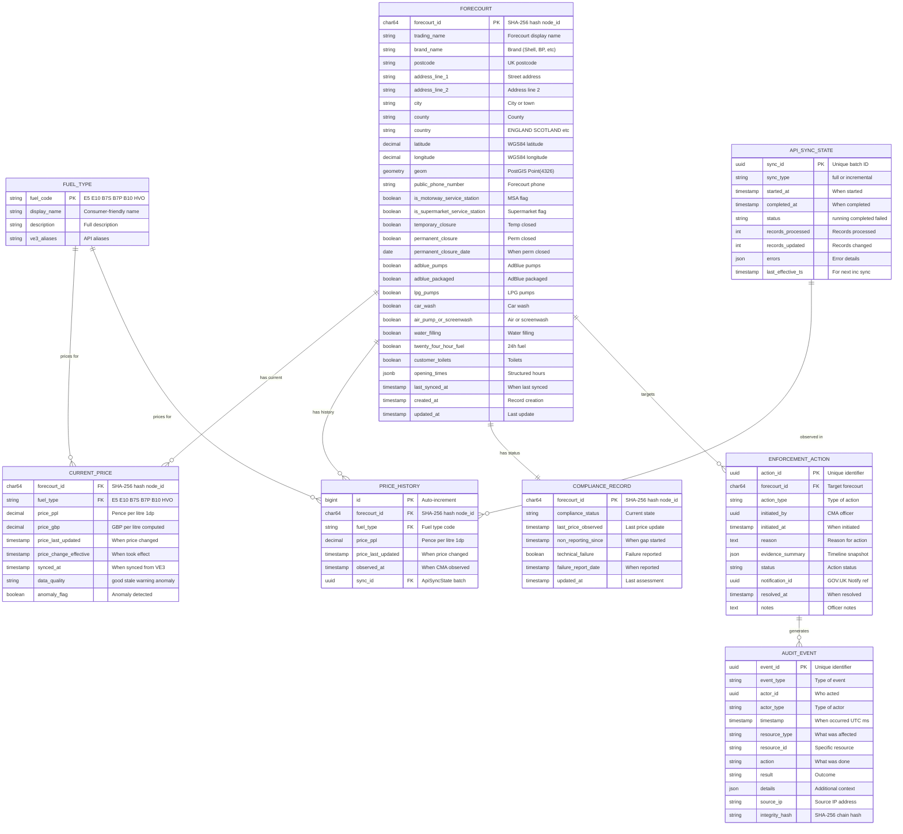

# Data Model: UK Fuel Price Transparency Service

> **Template Origin**: Official | **ArcKit Version**: 4.6.3-rc.3 | **Command**: `/arckit.data-model`

## Document Control

| Field | Value |
|-------|-------|
| **Document ID** | ARC-001-DATA-v3.0 |
| **Document Type** | Data Model |
| **Project** | UK Fuel Price Transparency Service (Project 001) |
| **Classification** | OFFICIAL |
| **Status** | DRAFT |
| **Version** | 3.0 |
| **Created Date** | 2026-04-06 |
| **Last Modified** | 2026-04-06 |
| **Review Cycle** | Monthly |
| **Next Review Date** | 2026-05-06 |
| **Owner** | Data Architect / Data Governance Lead |
| **Reviewed By** | [PENDING] |
| **Approved By** | [PENDING] |
| **Distribution** | CMA Digital, DESNZ Policy, GDS Assessors, Delivery Team, Architecture Review Board |

## Revision History

| Version | Date | Author | Changes | Approved By | Approval Date |
|---------|------|--------|---------|-------------|---------------|
| 1.0 | 2026-01-30 | ArcKit AI | Initial creation from `/arckit.data-model` command — based on CMA-built ingestion model with 8 entities including Organisation and CmaJsonStation | [PENDING] | [PENDING] |
| 2.0 | 2026-04-05 | ArcKit AI | Major revision: architecture pivot to consume VE3 Global Fuel Finder API. Removed Organisation (VE3 manages retailers) and CmaJsonStation (superseded by VE3 API). Added ApiSyncState and ComplianceRecord. Restructured Forecourt to use VE3 node_id format (GB-NNNNN). Replaced PriceSubmission with PriceHistory (append-only observation log). Added PostGIS geometry column for geospatial queries. Aligned with ARC-001-REQ-v3.0 | [PENDING] | [PENDING] |
| 3.0 | 2026-04-06 | ArcKit AI | Major revision validated against live VE3 Fuel Finder CSV export (7,604 records, 68 columns) [UFP-C1]. Key changes: (1) forecourt_id changed from VARCHAR(8) GB-NNNNN to CHAR(64) SHA-256 hash; (2) fuel types expanded from 4 to 6 (E5, E10, B7S, B7P, B10, HVO); (3) price source format corrected to pence-per-litre DECIMAL(5,1); (4) address denormalised from JSONB to structured columns; (5) amenities denormalised from TEXT[] to 8 boolean columns; (6) new forecourt classification and closure tracking fields; (7) opening times JSONB schema formalised. Total attributes increased from 78 to 97 | [PENDING] | [PENDING] |

---

## Executive Summary

### Overview

This data model defines the logical data architecture for the CMA's digital service component of the UK Government Fuel Price Transparency Service ("Fuel Finder"). The model reflects the **v3.0 architecture** where the CMA service **consumes** the VE3 Global Fuel Finder Public API rather than building its own data ingestion infrastructure.

Version 3.0 is a **schema-validated revision** — the entity definitions have been reconciled against a live VE3 Fuel Finder CSV data export containing 7,604 forecourt records across 68 source columns [UFP-C1]. This replaced the API-documentation-based assumptions in v2.0 with ground-truth field names, data types, value ranges, and cardinalities observed in production data.

The CMA service synchronises fuel price and station data from the VE3 API every 15 minutes, enriches it with geospatial indexing (PostGIS), data quality scoring, anomaly detection, and historical price storage. The enriched data serves three downstream use cases: citizen fuel price search, CMA compliance monitoring and enforcement, and an enhanced open data API for third-party consumers.

The model covers seven core entities across three tiers: **data synchronisation** (Forecourt, CurrentPrice, PriceHistory, ApiSyncState), **enforcement** (ComplianceRecord, EnforcementAction), and **governance** (AuditEvent). A reference entity (FuelType) maps VE3 API fuel codes to consumer-friendly display names.

**Key changes from v2.0**: The forecourt identifier is a 64-character SHA-256 hash (not the GB-NNNNN pattern assumed from documentation) [UFP-C2]. Fuel types expanded from 4 to 6 — B7 split into B7S (Standard Diesel) and B7P (Premium Diesel), plus new B10 and HVO grades [UFP-C3]. Prices arrive from VE3 in pence per litre (not GBP as previously assumed) [UFP-C4]. Address, amenity, and opening-time structures have been denormalised from JSONB/array types into structured columns [UFP-C5].

### Model Statistics

- **Total Entities**: 8 entities defined (E-001 through E-008)
- **Total Attributes**: 97 attributes across all entities (was 78 in v2.0)
- **Total Relationships**: 8 relationships mapped
- **Actual Forecourt Volume**: 7,604 forecourts [UFP-C1] (was estimated at ~8,500 in v2.0)
- **Data Classification**:
  - Public: 4 entities (Forecourt, CurrentPrice, PriceHistory, FuelType)
  - Internal: 2 entities (ApiSyncState, ComplianceRecord)
  - Restricted: 2 entities (EnforcementAction, AuditEvent — CMA enforcement-sensitive)

### Compliance Summary

- **GDPR/DPA 2018 Status**: COMPLIANT — CMA service stores no retailer PII (managed by VE3 Global). All data is either open public data or CMA operational/enforcement data
- **PII Entities**: 0 entities contain personally identifiable information in the CMA database (PII is held on VE3 Global's platform)
- **Data Protection Impact Assessment (DPIA)**: COMPLETED (ARC-001-DPIA-v1.0) — covers the overall Fuel Finder service including VE3 Global's platform
- **Data Retention**: Longest retention is 7 years (enforcement actions, audit events — CMA legal requirements)
- **Cross-Border Transfers**: NO — all CMA data stored and processed within UK sovereign cloud regions (AWS eu-west-2)

### Key Data Governance Stakeholders

- **Data Owner (Business)**: CMA Director of Digital Markets — Accountable for data quality and usage
- **Data Steward**: CMA Data Governance Lead — Responsible for data governance policies
- **Data Custodian (Technical)**: CMA Digital Team — Manages data storage and security
- **Data Protection Officer**: CMA DPO — Ensures privacy compliance
- **External Data Provider**: VE3 Global / DESNZ — Operates Fuel Finder API (upstream data source)

---

## Visual Entity-Relationship Diagram (ERD)



**Diagram Notes**:

- **Cardinality**: `||` = exactly one, `o{` = zero or more, `|{` = one or more
- **Primary Keys (PK)**: Uniquely identify each record
- **Foreign Keys (FK)**: Reference other entities
- **PostGIS**: FORECOURT.geom is a PostGIS geometry column enabling spatial queries (ST_DWithin)
- **SHA-256 IDs**: forecourt_id is a 64-character hexadecimal hash, not the GB-NNNNN pattern assumed in v2.0 [UFP-C2]

---

## Entity Catalog

### Entity E-001: Forecourt

**Description**: A physical fuel retail location synced from the VE3 Global Fuel Finder platform. Each forecourt represents a petrol filling station identified by a SHA-256 hash assigned by VE3 [UFP-C2]. The entity structure has been validated against the live CSV export containing 7,604 forecourt records across 68 source columns [UFP-C1].

**Source Requirements**:

- BR-008: Synchronise and enrich Fuel Finder data
- FR-001: API data synchronisation
- FR-002: Geospatial price search

**Business Context**: The forecourt is the central entity — every price, compliance assessment, and enforcement action relates to a specific forecourt. Data is sourced entirely from the VE3 Fuel Finder platform. CMA enriches with PostGIS geospatial index for proximity search. Address fields have been denormalised from a JSONB blob to structured columns based on the actual CSV schema [UFP-C5], enabling direct SQL filtering by postcode, city, county, and country without JSON path queries.

**Data Ownership**:

- **Business Owner**: CMA Director of Digital Markets
- **Technical Owner**: CMA Digital Team
- **Data Steward**: CMA Data Governance Lead
- **Source of Truth**: VE3 Global Fuel Finder platform (CMA holds a synchronised copy)

**Data Classification**: OFFICIAL — PUBLIC (published as open data)

**Volume Estimates**:

- **Actual Volume**: 7,604 forecourts (from CSV export dated April 2026) [UFP-C1]
- **Growth Rate**: +50-100 per year (new builds, minus closures)
- **Peak Volume**: ~9,000 forecourts at Year 3
- **Average Record Size**: ~3 KB (increased from ~2 KB due to structured address and amenity columns)

**Data Retention**:

- **Active Period**: Indefinite (public record)
- **Archive Period**: N/A — retained in primary database
- **Deletion Policy**: Forecourt records are never deleted; `permanent_closure` set to TRUE with `permanent_closure_date` if deregistered

#### Attributes

| Attribute | Type | Required | PII | Description | Validation Rules | Default | Source Req |
|-----------|------|----------|-----|-------------|------------------|---------|------------|
| forecourt_id | CHAR(64) | Yes | No | VE3 SHA-256 hash node_id [UFP-C2] | 64-char lowercase hex string | From VE3 | BR-008 |
| trading_name | VARCHAR(255) | Yes | No | Forecourt display name | Non-empty | From VE3 | BR-008 |
| brand_name | VARCHAR(255) | No | No | Brand (Shell, BP, Tesco, etc.) | None | NULL | BR-008 |
| postcode | VARCHAR(8) | Yes | No | UK postcode [UFP-C5] | UK postcode pattern | From VE3 | BR-008 |
| address_line_1 | VARCHAR(255) | Yes | No | Street address [UFP-C5] | Non-empty | From VE3 | BR-008 |
| address_line_2 | VARCHAR(255) | No | No | Additional address line [UFP-C5] | None | NULL | BR-008 |
| city | VARCHAR(100) | No | No | City or town [UFP-C5] | None | NULL | BR-008 |
| county | VARCHAR(100) | No | No | County [UFP-C5] | None | NULL | BR-008 |
| country | VARCHAR(20) | Yes | No | UK country [UFP-C5] | Enum: ENGLAND, SCOTLAND, WALES, NORTHERN IRELAND | From VE3 | BR-008 |
| latitude | DECIMAL(10,7) | Yes | No | WGS84 latitude | Range: 49.0–61.0 | From VE3 | FR-002 |
| longitude | DECIMAL(10,7) | Yes | No | WGS84 longitude | Range: -8.0–2.0 | From VE3 | FR-002 |
| geom | GEOMETRY(Point, 4326) | Yes | No | PostGIS point for spatial queries | Valid WGS84 point | Computed from lat/lng | FR-002 |
| public_phone_number | VARCHAR(20) | No | No | Forecourt telephone number | Valid UK phone format or NULL | NULL | BR-008 |
| is_motorway_service_station | BOOLEAN | Yes | No | Whether located at a motorway service area [UFP-C5] | true/false | false | BR-008 |
| is_supermarket_service_station | BOOLEAN | Yes | No | Whether operated by a supermarket retailer [UFP-C5] | true/false | false | BR-008 |
| temporary_closure | BOOLEAN | Yes | No | Temporarily closed for trading [UFP-C5] | true/false | false | BR-008 |
| permanent_closure | BOOLEAN | Yes | No | Permanently closed [UFP-C5] | true/false | false | BR-008 |
| permanent_closure_date | DATE | No | No | Date of permanent closure [UFP-C5] | ISO 8601 date, NULL if not closed | NULL | BR-008 |
| adblue_pumps | BOOLEAN | No | No | AdBlue pump dispensers available [UFP-C5] | true/false | false | BR-008 |
| adblue_packaged | BOOLEAN | No | No | Packaged AdBlue products available [UFP-C5] | true/false | false | BR-008 |
| lpg_pumps | BOOLEAN | No | No | LPG fuel pumps available [UFP-C5] | true/false | false | BR-008 |
| car_wash | BOOLEAN | No | No | Car wash facility [UFP-C5] | true/false | false | BR-008 |
| air_pump_or_screenwash | BOOLEAN | No | No | Air pump or screenwash facility [UFP-C5] | true/false | false | BR-008 |
| water_filling | BOOLEAN | No | No | Water filling station [UFP-C5] | true/false | false | BR-008 |
| twenty_four_hour_fuel | BOOLEAN | No | No | 24-hour fuel availability [UFP-C5] | true/false | false | BR-008 |
| customer_toilets | BOOLEAN | No | No | Customer toilet facilities [UFP-C5] | true/false | false | BR-008 |
| opening_times | JSONB | No | No | Structured operating hours (see schema below) | Valid JSON matching schema | From VE3 | BR-008 |
| last_synced_at | TIMESTAMPTZ | Yes | No | When last synced from VE3 | ISO 8601 | NOW() | FR-001 |
| created_at | TIMESTAMPTZ | Yes | No | Record creation in CMA DB | ISO 8601 | NOW() | FR-001 |
| updated_at | TIMESTAMPTZ | Yes | No | Last update | ISO 8601, auto-update | NOW() | FR-001 |

**Total Attributes**: 30 (was 13 in v2.0)

**Opening Times JSONB Schema**:

```json
{
  "usual_days": {
    "monday":    {"open_time": "07:00:00", "close_time": "22:00:00", "is_24_hours": false},
    "tuesday":   {"open_time": "07:00:00", "close_time": "22:00:00", "is_24_hours": false},
    "wednesday": {"open_time": "07:00:00", "close_time": "22:00:00", "is_24_hours": false},
    "thursday":  {"open_time": "07:00:00", "close_time": "22:00:00", "is_24_hours": false},
    "friday":    {"open_time": "07:00:00", "close_time": "22:00:00", "is_24_hours": false},
    "saturday":  {"open_time": "07:00:00", "close_time": "22:00:00", "is_24_hours": false},
    "sunday":    {"open_time": "08:00:00", "close_time": "20:00:00", "is_24_hours": false}
  },
  "bank_holiday": {
    "standard":  {"open_time": "08:00:00", "close_time": "20:00:00", "is_24_hours": false}
  }
}
```

**Attribute Notes**:

- **PII Attributes**: None — forecourt data is public
- **Encrypted Attributes**: None required (public data)
- **Derived Attributes**: `geom` computed from `latitude`/`longitude` via `ST_SetSRID(ST_MakePoint(longitude, latitude), 4326)`
- **v2.0 Migration**: `address` JSONB column denormalised to 6 structured columns (postcode, address_line_1, address_line_2, city, county, country); `amenities` TEXT[] denormalised to 8 boolean columns; `fuel_types` TEXT[] retained as reference but individual fuel availability now tracked via CurrentPrice composite key

#### Relationships

**Outgoing**:
- E-001 → E-002 (CurrentPrice): One-to-many — a forecourt has current prices for each fuel type (up to 6 fuel grades)
- E-001 → E-003 (PriceHistory): One-to-many — a forecourt has many historical price records
- E-001 → E-004 (ComplianceRecord): One-to-one — each forecourt has one compliance status
- E-001 → E-005 (EnforcementAction): One-to-many — a forecourt may have multiple enforcement actions

#### Indexes

**Primary Key**: `pk_forecourt` on `forecourt_id`

**Spatial Index**: `idx_forecourt_geom` GiST index on `geom` (critical for PostGIS proximity queries)

**Performance Indexes**:
- `idx_forecourt_brand` on `brand_name` (filter by brand)
- `idx_forecourt_postcode` on `postcode` (postcode lookup — new in v3.0)
- `idx_forecourt_country` on `country` (national filtering — new in v3.0)
- `idx_forecourt_synced` on `last_synced_at` (find stale records)
- `idx_forecourt_motorway` on `is_motorway_service_station` WHERE `is_motorway_service_station = TRUE` (partial index — new in v3.0)
- `idx_forecourt_supermarket` on `is_supermarket_service_station` WHERE `is_supermarket_service_station = TRUE` (partial index — new in v3.0)
- `idx_forecourt_closure` on (`permanent_closure`, `temporary_closure`) (filter active/closed — new in v3.0)

#### Privacy & Compliance

- **Contains PII**: NO
- **Government Security Classification**: OFFICIAL
- **Legal Basis**: Public Task (GDPR Art 6(1)(e)) — fuel price data published under statutory open data scheme
- **DPIA**: Not required for this entity (no PII, public data)
- **Audit Logging**: Change logging on sync events (via ApiSyncState)

---

### Entity E-002: CurrentPrice

**Description**: The current published fuel price for a specific fuel type at a forecourt, synced from VE3 and enriched with CMA data quality scoring. Prices are sourced in pence per litre (PPL) from VE3 [UFP-C4], with a computed GBP equivalent for API consumers.

**Source Requirements**:

- BR-008: Data sync and enrichment
- FR-006: Data validation and quality scoring
- FR-002: Geospatial price search

**Business Context**: This is the primary query entity for citizen fuel price search. Composite primary key of forecourt_id + fuel_type ensures one current price per fuel grade per forecourt. Each forecourt may have up to 6 fuel types [UFP-C3]. Prices arrive from VE3 in **pence per litre** with one decimal place (e.g., 147.9) [UFP-C4]; CMA derives GBP per litre (e.g., 1.479) as a computed field for API responses.

**Data Classification**: OFFICIAL — PUBLIC

**Volume Estimates**:

- **Actual Volume**: ~26,672 records based on CSV fuel type coverage [UFP-C3]:
  - E10: 7,202 forecourts (95% of 7,604)
  - B7S: 7,008 forecourts (92%)
  - E5: 5,966 forecourts (78%)
  - B7P: 5,367 forecourts (71%)
  - B10: 1,593 forecourts (21%)
  - HVO: 536 forecourts (7%)
- **Growth Rate**: Proportional to forecourt growth + new fuel type adoption
- **Average Record Size**: ~200 bytes

**Data Retention**:

- **Active Period**: Current record replaced on each sync
- **Historical data**: Preserved in PriceHistory entity (E-003)
- **Deletion Policy**: Records overwritten, never deleted

#### Attributes

| Attribute | Type | Required | PII | Description | Validation Rules | Default | Source Req |
|-----------|------|----------|-----|-------------|------------------|---------|------------|
| forecourt_id | CHAR(64) | Yes | No | VE3 SHA-256 hash node_id | FK to E-001 | From VE3 | BR-008 |
| fuel_type | VARCHAR(4) | Yes | No | Fuel type code | FK to E-008 [E5, E10, B7S, B7P, B10, HVO] | From VE3 | BR-008 |
| price_ppl | DECIMAL(5,1) | Yes | No | Price in pence per litre (1dp) — SOURCE format from VE3 [UFP-C4] | Range: 50.0–500.0 | From VE3 | BR-008 |
| price_gbp | DECIMAL(6,3) | Yes | No | Price in GBP per litre (3dp) — COMPUTED | Computed: price_ppl / 100 | Computed | FR-002 |
| price_last_updated | TIMESTAMPTZ | Yes | No | When price changed at forecourt | ISO 8601 | From VE3 | BR-008 |
| price_change_effective | TIMESTAMPTZ | No | No | When price change took effect | ISO 8601 | From VE3 | BR-008 |
| synced_at | TIMESTAMPTZ | Yes | No | When synced from VE3 | ISO 8601 | NOW() | FR-001 |
| data_quality | VARCHAR(10) | Yes | No | Quality indicator | Enum: good, stale, warning, anomaly | 'good' | FR-006 |
| anomaly_flag | BOOLEAN | No | No | Price anomaly detected | true/false | false | FR-006 |

#### Indexes

**Primary Key**: `pk_current_price` on (`forecourt_id`, `fuel_type`) (composite)

**Foreign Keys**:
- `fk_cprice_forecourt` on `forecourt_id` → E-001.`forecourt_id` (ON DELETE CASCADE)
- `fk_cprice_fueltype` on `fuel_type` → E-008.`fuel_code`

**Performance Indexes**:
- `idx_cprice_quality` on `data_quality` (filter stale/anomaly prices)
- `idx_cprice_synced` on `synced_at` (freshness monitoring)
- `idx_cprice_fueltype` on `fuel_type` (aggregate queries by fuel grade — new in v3.0)

#### Privacy & Compliance

- **Contains PII**: NO
- **Government Security Classification**: OFFICIAL
- **Audit Logging**: Not required (data is public and overwritten each sync)

---

### Entity E-003: PriceHistory

**Description**: Append-only historical record of all fuel prices observed from the VE3 platform. Never overwritten — captures every price change for trend analysis, policy reporting, and enforcement evidence. Prices stored in pence per litre (source format) [UFP-C4].

**Source Requirements**:

- BR-008: Historical price storage
- FR-015: Historical price data storage and query
- FR-010: Policy analysis and reporting

**Business Context**: Critical for three use cases: (1) DESNZ policy analysis of fuel price trends, (2) CMA enforcement evidence chain, (3) enhanced API historical price queries for third-party consumers. Partitioned by month for query performance at scale. Now tracks 6 fuel types [UFP-C3] instead of the original 4.

**Data Classification**: OFFICIAL — PUBLIC

**Volume Estimates**:

- **Initial Volume**: 0 (grows from day one)
- **Growth Rate**: ~130,000 records/day (Year 1, based on 7,604 forecourts), ~250,000/day (Year 3)
- **Peak Volume**: ~140M records at Year 3
- **Average Record Size**: ~120 bytes (increased due to longer forecourt_id)

**Data Retention**:

- **Active Period**: Indefinite (public record)
- **Partitioning**: Monthly partitions (PostgreSQL declarative partitioning)
- **Archival**: Hot (current + 90 days), Warm (90 days–2 years), Cold (2+ years)

#### Attributes

| Attribute | Type | Required | PII | Description | Validation Rules | Default | Source Req |
|-----------|------|----------|-----|-------------|------------------|---------|------------|
| id | BIGSERIAL | Yes | No | Auto-increment ID | Auto-generated | Sequence | FR-015 |
| forecourt_id | CHAR(64) | Yes | No | VE3 SHA-256 hash node_id | FK to E-001 | From sync | BR-008 |
| fuel_type | VARCHAR(4) | Yes | No | Fuel type code | FK to E-008 [E5, E10, B7S, B7P, B10, HVO] | From sync | BR-008 |
| price_ppl | DECIMAL(5,1) | Yes | No | Price in pence per litre (source format) [UFP-C4] | Range: 50.0–500.0 | From VE3 | BR-008 |
| price_last_updated | TIMESTAMPTZ | Yes | No | When price changed (from VE3) | ISO 8601 | From VE3 | FR-015 |
| observed_at | TIMESTAMPTZ | Yes | No | When CMA service observed | ISO 8601 | NOW() | FR-001 |
| sync_id | UUID | No | No | ApiSyncState batch reference | FK to E-007 | From sync job | FR-001 |

#### Indexes

**Primary Key**: `pk_price_history` on `id` (partitioned by `observed_at`)

**Performance Indexes**:
- `idx_phist_forecourt_date` on (`forecourt_id`, `price_last_updated`) (forecourt history lookup)
- `idx_phist_observed` on `observed_at` (partition key, time-range queries)
- `idx_phist_fueltype` on `fuel_type` (aggregate queries by fuel type)

#### Privacy & Compliance

- **Contains PII**: NO
- **Government Security Classification**: OFFICIAL
- **Audit Logging**: Data lineage via `sync_id` → ApiSyncState

---

### Entity E-004: ComplianceRecord

**Description**: CMA-computed compliance status for each forecourt, derived from price submission patterns observed via the VE3 platform. Updated on each sync cycle.

**Source Requirements**:

- BR-004: CMA enforcement capability
- FR-005: Compliance monitoring dashboard
- FR-011: Technical failure reporting

**Business Context**: Central to CMA enforcement. Tracks whether each forecourt is submitting prices as required. A forecourt with no observed price update for > 24 hours is flagged as non-reporting. Retailers can self-report technical failures to avoid incorrect non-compliance flags.

**Data Classification**: OFFICIAL — INTERNAL

**Volume Estimates**:

- **Actual Volume**: 7,604 records (one per forecourt) [UFP-C1]
- **Growth Rate**: Proportional to forecourt growth
- **Average Record Size**: ~350 bytes (increased due to longer forecourt_id)

**Data Retention**:

- **Active Period**: Duration of forecourt registration + 7 years
- **Deletion Policy**: Soft delete (status → 'archived') when forecourt permanently closed

#### Attributes

| Attribute | Type | Required | PII | Description | Validation Rules | Default | Source Req |
|-----------|------|----------|-----|-------------|------------------|---------|------------|
| forecourt_id | CHAR(64) | Yes | No | VE3 SHA-256 hash node_id | FK to E-001, PK | From sync | BR-004 |
| compliance_status | VARCHAR(20) | Yes | No | Current state | Enum: compliant, non_reporting, stale, technical_failure, under_investigation | 'compliant' | FR-005 |
| last_price_observed | TIMESTAMPTZ | No | No | When last price update detected | ISO 8601 | NULL | FR-005 |
| non_reporting_since | TIMESTAMPTZ | No | No | When non-reporting began | ISO 8601 | NULL | FR-005 |
| technical_failure_reported | BOOLEAN | No | No | Retailer reported tech failure | true/false | false | FR-011 |
| failure_report_date | TIMESTAMPTZ | No | No | When failure was reported | ISO 8601 | NULL | FR-011 |
| updated_at | TIMESTAMPTZ | Yes | No | Last compliance assessment | ISO 8601, auto-update | NOW() | FR-005 |

#### Indexes

**Primary Key**: `pk_compliance` on `forecourt_id`

**Foreign Keys**: `fk_compliance_forecourt` on `forecourt_id` → E-001.`forecourt_id`

**Performance Indexes**:
- `idx_compliance_status` on `compliance_status` (dashboard filtering)
- `idx_compliance_nonreporting` on `non_reporting_since` WHERE `compliance_status = 'non_reporting'` (partial index)

#### Privacy & Compliance

- **Contains PII**: NO
- **Government Security Classification**: OFFICIAL
- **Audit Logging**: All status changes logged to AuditEvent (E-006)

---

### Entity E-005: EnforcementAction

**Description**: A CMA enforcement action against a non-compliant retailer, including the full evidence chain from compliance timeline through to resolution.

**Source Requirements**:

- BR-004: CMA enforcement capability
- FR-007: Enforcement case management
- FR-009: Audit trail and evidence preservation

**Business Context**: Enforcement actions are the legal mechanism for CMA to compel retailer compliance. Each action must have a defensible evidence chain. Actions follow the published CMA enforcement guidance escalation: reminder → warning → formal_notice → penalty.

**Data Classification**: OFFICIAL — RESTRICTED (enforcement-sensitive)

**Volume Estimates**:

- **Initial Volume**: 0 (grows after grace period ends May 2026)
- **Growth Rate**: Estimated 50–200 actions/month (Year 1)
- **Average Record Size**: ~2 KB (includes evidence JSON)

**Data Retention**:

- **Active Period**: 7 years minimum (CMA legal requirements)
- **Deletion Policy**: Never deleted; archived after 7 years to cold storage

#### Attributes

| Attribute | Type | Required | PII | Description | Validation Rules | Default | Source Req |
|-----------|------|----------|-----|-------------|------------------|---------|------------|
| action_id | UUID | Yes | No | Unique identifier | UUID v4 | Auto-generated | FR-007 |
| forecourt_id | CHAR(64) | Yes | No | Target forecourt | FK to E-001 | From officer | BR-004 |
| action_type | VARCHAR(20) | Yes | No | Type of enforcement action | Enum: reminder, warning, formal_notice, penalty | None | FR-007 |
| initiated_by | UUID | Yes | No | CMA officer identifier | FK to CMA IdP user | From auth | FR-007 |
| initiated_at | TIMESTAMPTZ | Yes | No | When action was initiated | ISO 8601 | NOW() | FR-007 |
| reason | TEXT | Yes | No | Reason for enforcement action | Non-empty | None | FR-007 |
| evidence_summary | JSONB | Yes | No | Compliance timeline snapshot | Valid JSON | None | FR-009 |
| status | VARCHAR(20) | Yes | No | Action lifecycle status | Enum: pending, sent, acknowledged, resolved, escalated | 'pending' | FR-007 |
| notification_id | UUID | No | No | GOV.UK Notify reference | UUID format | NULL | FR-008 |
| resolved_at | TIMESTAMPTZ | No | No | When action was resolved | ISO 8601 | NULL | FR-007 |
| notes | TEXT | No | No | Officer case notes | None | NULL | FR-007 |

#### Indexes

**Primary Key**: `pk_enforcement` on `action_id`

**Foreign Keys**: `fk_enforcement_forecourt` on `forecourt_id` → E-001.`forecourt_id`

**Performance Indexes**:
- `idx_enforcement_forecourt` on `forecourt_id` (lookup by forecourt)
- `idx_enforcement_status` on `status` (active case management)
- `idx_enforcement_initiated` on `initiated_at` (time-range queries)

#### Privacy & Compliance

- **Contains PII**: NO (officer identity is CMA internal user ID, not personal data in this system)
- **Government Security Classification**: OFFICIAL — RESTRICTED
- **Access Control**: CMA Enforcement role only; RBAC enforced (NFR-SEC-002)
- **Audit Logging**: All CRUD operations logged to AuditEvent (E-006)
- **Evidence Integrity**: `evidence_summary` captured at time of action creation; immutable after creation

---

### Entity E-006: AuditEvent

**Description**: Immutable, tamper-evident record of all significant system events for CMA enforcement evidence, compliance, and forensic investigation.

**Source Requirements**:

- FR-009: Audit trail and evidence preservation
- NFR-C-002: Audit logging

**Business Context**: The audit trail is the backbone of CMA's enforcement evidence chain. Every enforcement action, data export, compliance assessment, and administrative change is recorded with cryptographic integrity (SHA-256 chain hashing). Append-only — records can never be modified or deleted.

**Data Classification**: OFFICIAL — RESTRICTED

**Volume Estimates**:

- **Initial Volume**: 0 (grows from day one)
- **Growth Rate**: ~50M events/year (bulk from sync events)
- **Average Record Size**: ~500 bytes

**Data Retention**:

- **Active Period**: 7 years (immutable, append-only)
- **Deletion Policy**: Never deleted; archived to cold storage after 7 years

#### Attributes

| Attribute | Type | Required | PII | Description | Validation Rules | Default | Source Req |
|-----------|------|----------|-----|-------------|------------------|---------|------------|
| event_id | UUID | Yes | No | Unique identifier | UUID v4 | Auto-generated | FR-009 |
| event_type | VARCHAR(30) | Yes | No | Type of event | Enum: enforcement_action, data_export, config_change, sync_event, login, compliance_assessment | None | NFR-C-002 |
| actor_id | UUID | Yes | No | Who performed action | Indexed | None | NFR-C-002 |
| actor_type | VARCHAR(20) | Yes | No | Type of actor | Enum: cma_staff, desnz_staff, system | None | NFR-C-002 |
| timestamp | TIMESTAMPTZ | Yes | No | When event occurred (UTC, ms) | ISO 8601, NOT NULL | NOW() | NFR-C-002 |
| resource_type | VARCHAR(100) | Yes | No | What was affected | Non-empty | None | NFR-C-002 |
| resource_id | VARCHAR(100) | Yes | No | Specific resource ID | Non-empty | None | NFR-C-002 |
| action | VARCHAR(100) | Yes | No | What was done | Non-empty | None | NFR-C-002 |
| result | VARCHAR(10) | Yes | No | Outcome | Enum: success, failure, warning | None | NFR-C-002 |
| details | JSONB | No | No | Additional context | Valid JSON | NULL | NFR-C-002 |
| source_ip | VARCHAR(45) | No | No | Source IP address | Valid IPv4/IPv6 | NULL | NFR-C-002 |
| integrity_hash | VARCHAR(64) | Yes | No | SHA-256 chain hash | 64-char hex string | Computed | FR-009 |

#### Indexes

**Primary Key**: `pk_audit` on `event_id`

**Performance Indexes**:
- `idx_audit_timestamp` on `timestamp` (time-range queries, partitioned)
- `idx_audit_resource` on (`resource_type`, `resource_id`) (lookup by resource)
- `idx_audit_actor` on `actor_id` (lookup by user)
- `idx_audit_type` on `event_type` (filter by event type)

#### Privacy & Compliance

- **Contains PII**: NO (actor_id is internal user reference, not PII)
- **Government Security Classification**: OFFICIAL — RESTRICTED
- **Immutability**: Append-only table; UPDATE and DELETE operations blocked by database policy
- **Tamper Evidence**: Each record's `integrity_hash` = SHA-256(previous_hash + event_data)
- **Audit Logging**: Self-logging entity — access to audit events is itself audited

---

### Entity E-007: ApiSyncState

**Description**: Tracks the state of each data synchronisation batch from the VE3 Fuel Finder platform. Enables incremental sync, failure recovery, and operational monitoring.

**Source Requirements**:

- FR-001: Fuel Finder API data synchronisation
- NFR-P-002: Data synchronisation throughput
- NFR-M-001: Observability

**Business Context**: Operational entity for managing the VE3 sync pipeline. Records each sync batch (full or incremental), its status, records processed, and the `last_effective_timestamp` used for the next incremental sync. Critical for debugging sync failures and monitoring data freshness.

**Data Classification**: OFFICIAL — INTERNAL

**Volume Estimates**:

- **Initial Volume**: 0
- **Growth Rate**: ~100 records/day (96 incremental + 1 full + retries)
- **Average Record Size**: ~300 bytes

**Data Retention**:

- **Active Period**: 90 days (operational data)
- **Deletion Policy**: Hard delete after 90 days (batch job)

#### Attributes

| Attribute | Type | Required | PII | Description | Validation Rules | Default | Source Req |
|-----------|------|----------|-----|-------------|------------------|---------|------------|
| sync_id | UUID | Yes | No | Unique sync batch ID | UUID v4 | Auto-generated | FR-001 |
| sync_type | VARCHAR(15) | Yes | No | Type of sync | Enum: full, incremental | None | FR-001 |
| started_at | TIMESTAMPTZ | Yes | No | When sync started | ISO 8601 | NOW() | FR-001 |
| completed_at | TIMESTAMPTZ | No | No | When sync completed | ISO 8601 | NULL | FR-001 |
| status | VARCHAR(15) | Yes | No | Sync status | Enum: running, completed, failed, partial | 'running' | FR-001 |
| records_processed | INTEGER | No | No | Records processed | Non-negative | 0 | NFR-P-002 |
| records_updated | INTEGER | No | No | Records with changes | Non-negative | 0 | NFR-P-002 |
| errors | JSONB | No | No | Error details if any | Valid JSON | NULL | FR-001 |
| last_effective_timestamp | TIMESTAMPTZ | No | No | For next incremental sync | ISO 8601 | NULL | FR-001 |

#### Indexes

**Primary Key**: `pk_sync` on `sync_id`

**Performance Indexes**:
- `idx_sync_started` on `started_at` (time-range queries)
- `idx_sync_status` on `status` (find running/failed syncs)

---

### Entity E-008: FuelType (Reference)

**Description**: Reference data mapping VE3 fuel type codes to consumer-friendly display names and descriptions. Updated from 4 to 6 fuel types based on the live CSV export [UFP-C3].

**Source Requirements**:

- BR-008: Data enrichment
- FR-003: Citizen search interface (display names)

**Business Context**: Static reference table seeded at deployment. Maps the six VE3 fuel codes to names citizens understand. Expanded from v2.0 to reflect actual fuel types observed in production data [UFP-C3]: B7 has been split into B7S (Standard Diesel) and B7P (Premium Diesel); two new renewable/biodiesel grades B10 and HVO have been added.

**Data Classification**: OFFICIAL — PUBLIC

**Volume Estimates**: 6 records (static) — was 4 in v2.0

**Data Retention**: Indefinite

#### Attributes

| Attribute | Type | Required | PII | Description | Validation Rules | Default | Source Req |
|-----------|------|----------|-----|-------------|------------------|---------|------------|
| fuel_code | VARCHAR(4) | Yes | No | VE3 fuel code | PK, Enum: E5, E10, B7S, B7P, B10, HVO | None | BR-008 |
| display_name | VARCHAR(50) | Yes | No | Consumer-friendly name | Non-empty | None | FR-003 |
| description | VARCHAR(255) | Yes | No | Full description | Non-empty | None | BR-008 |
| ve3_aliases | TEXT[] | No | No | VE3 API alias codes | Array of strings | NULL | BR-008 |

**Seed Data** [UFP-C3]:

| fuel_code | display_name | description | ve3_aliases | coverage |
|-----------|-------------|-------------|-------------|----------|
| E5 | Super Unleaded | Premium unleaded petrol (5% ethanol) | {PREMIUM_UNLEADED} | 78% (5,966 forecourts) |
| E10 | Unleaded | Standard unleaded petrol (10% ethanol) | {UNLEADED} | 95% (7,202 forecourts) |
| B7S | Diesel | Standard diesel (7% biodiesel) | {DIESEL, B7_STANDARD} | 92% (7,008 forecourts) |
| B7P | Premium Diesel | Premium/super diesel variant | {PREMIUM_DIESEL} | 71% (5,367 forecourts) |
| B10 | B10 Diesel | Higher biodiesel blend (10% biodiesel) | {B10_DIESEL} | 21% (1,593 forecourts) |
| HVO | HVO Diesel | Hydrotreated Vegetable Oil — renewable diesel | {HVO, RENEWABLE_DIESEL} | 7% (536 forecourts) |

**Fuel Type Migration from v2.0**:

| v2.0 Code | v3.0 Code | Change |
|-----------|-----------|--------|
| E10 | E10 | Unchanged |
| E5 | E5 | Unchanged |
| B7 | B7S | Renamed — Standard Diesel suffix clarifies it is the standard variant |
| SDV | B7P | Renamed — Premium Diesel now uses B7P code matching VE3 classification |
| N/A | B10 | NEW — Higher biodiesel blend, 21% coverage |
| N/A | HVO | NEW — Renewable diesel, 7% coverage (emerging fuel type) |

---

## Data Governance Matrix

| Entity | Business Owner | Data Steward | Technical Custodian | Sensitivity | Compliance | Quality SLA | Access Control |
|--------|----------------|--------------|---------------------|-------------|------------|-------------|----------------|
| E-001: Forecourt | CMA Digital Lead | Data Governance Lead | CMA Digital Team | PUBLIC | UK GDPR (no PII) | 99% completeness | All (public) |
| E-002: CurrentPrice | CMA Digital Lead | Data Governance Lead | CMA Digital Team | PUBLIC | UK GDPR (no PII) | 95% freshness ( < 20min) | All (public) |
| E-003: PriceHistory | CMA Digital Lead | Data Governance Lead | CMA Digital Team | PUBLIC | UK GDPR (no PII) | 100% append integrity | All (public read) |
| E-004: ComplianceRecord | CMA Enforcement Lead | Data Governance Lead | CMA Digital Team | INTERNAL | UK GDPR (no PII) | 99% accuracy | CMA Enforcement role |
| E-005: EnforcementAction | CMA Enforcement Lead | Data Governance Lead | CMA Digital Team | RESTRICTED | CMA legal | 100% evidence integrity | CMA Enforcement role only |
| E-006: AuditEvent | CMA SIRO | Data Governance Lead | CMA Digital Team | RESTRICTED | CMA legal, UK GDPR | 100% immutability | CMA Admin role only |
| E-007: ApiSyncState | CMA Digital Lead | Data Governance Lead | CMA Digital Team | INTERNAL | None | 99% completeness | CMA Operations role |
| E-008: FuelType | CMA Digital Lead | Data Governance Lead | CMA Digital Team | PUBLIC | None | 100% accuracy | All (public) |

---

## CRUD Matrix

| Entity | VE3 Data Sync | Citizen Web | Enhanced API | Enforcement Dashboard | Policy Reports | Batch Jobs |
|--------|--------------|-------------|-------------|----------------------|----------------|------------|
| E-001: Forecourt | CR-U | -R-- | -R-- | -R-- | -R-- | --U- |
| E-002: CurrentPrice | CRUD | -R-- | -R-- | -R-- | -R-- | --U- |
| E-003: PriceHistory | CR-- | ---- | -R-- | -R-- | -R-- | ---D |
| E-004: ComplianceRecord | -RU- | ---- | ---- | -RU- | -R-- | --U- |
| E-005: EnforcementAction | ---- | ---- | ---- | CRUD | -R-- | ---- |
| E-006: AuditEvent | CR-- | ---- | ---- | -R-- | -R-- | ---- |
| E-007: ApiSyncState | CRUD | ---- | ---- | -R-- | ---- | ---D |
| E-008: FuelType | ---- | -R-- | -R-- | -R-- | -R-- | ---- |

**Legend**: C = Create, R = Read, U = Update, D = Delete, - = No access

**Notes**:
- **VE3 Data Sync** is the only component that writes price data (E-002, E-003)
- **Enforcement Dashboard** is the only component that creates enforcement actions (E-005)
- **Batch Jobs** handle archival (E-003 cold storage) and sync state cleanup (E-007)
- **AuditEvent** is append-only — no component has Update or Delete access

---

## Data Integration Mapping

### Upstream Systems (Data Sources)

#### INT-001: VE3 Global Fuel Finder Platform (Primary)

**Source System**: VE3 Global Fuel Finder (fuel-finder.service.gov.uk)

**Integration Type**: Scheduled CSV/API data export polling

**Entities Affected**:

| Source | Target Entity | Update Frequency | Data Quality SLA |
|--------|---------------|------------------|------------------|
| Forecourt data (CSV/API) | E-001 (Forecourt) | Every 1 hour | 99% completeness |
| Fuel price data (CSV/API) | E-002 (CurrentPrice), E-003 (PriceHistory) | Every 15 minutes | ≤ 20 min freshness |

**Data Mapping** (updated for v3.0 schema validated against CSV [UFP-C1]):

| VE3 Source Field | VE3 Type | Target Entity | Target Attribute | Transformation |
|------------------|----------|---------------|------------------|----------------|
| node_id | String(64) | E-001 | forecourt_id | Direct mapping (SHA-256 hash) |
| trading_name | String | E-001 | trading_name | Direct mapping |
| brand_name | String | E-001 | brand_name | Direct mapping |
| postcode | String | E-001 | postcode | Direct mapping |
| address_line_1 | String | E-001 | address_line_1 | Direct mapping |
| address_line_2 | String | E-001 | address_line_2 | Direct mapping (nullable) |
| city | String | E-001 | city | Direct mapping (nullable) |
| county | String | E-001 | county | Direct mapping (nullable) |
| country | String | E-001 | country | Direct mapping (ENGLAND/SCOTLAND/WALES/NORTHERN IRELAND) |
| latitude | Decimal | E-001 | latitude, longitude, geom | Extract lat/lng; compute PostGIS point |
| longitude | Decimal | E-001 | longitude | Direct mapping |
| is_motorway_service_station | Boolean | E-001 | is_motorway_service_station | Direct mapping |
| is_supermarket_service_station | Boolean | E-001 | is_supermarket_service_station | Direct mapping |
| temporary_closure | Boolean | E-001 | temporary_closure | Direct mapping |
| permanent_closure | Boolean | E-001 | permanent_closure | Direct mapping |
| permanent_closure_date | Date | E-001 | permanent_closure_date | Direct mapping (nullable) |
| public_phone_number | String | E-001 | public_phone_number | Direct mapping (nullable) |
| adblue_pumps | Boolean | E-001 | adblue_pumps | Direct mapping |
| adblue_packaged | Boolean | E-001 | adblue_packaged | Direct mapping |
| lpg_pumps | Boolean | E-001 | lpg_pumps | Direct mapping |
| car_wash | Boolean | E-001 | car_wash | Direct mapping |
| air_pump_or_screenwash | Boolean | E-001 | air_pump_or_screenwash | Direct mapping |
| water_filling | Boolean | E-001 | water_filling | Direct mapping |
| twenty_four_hour_fuel | Boolean | E-001 | twenty_four_hour_fuel | Direct mapping |
| customer_toilets | Boolean | E-001 | customer_toilets | Direct mapping |
| opening_times | JSON | E-001 | opening_times | Parse into structured JSONB schema |
| E5_price / E10_price / etc. | Decimal | E-002 | price_ppl | Direct mapping (pence per litre, 1dp) |
| E5_price / E10_price / etc. | Decimal | E-002 | price_gbp | Compute: price_ppl / 100 |
| fuel_type | String | E-002 | fuel_type | Map to canonical codes (E5, E10, B7S, B7P, B10, HVO) |
| price_last_updated | Timestamp | E-002 | price_last_updated | Direct mapping |

#### INT-002: OS Places API (Geocoding Fallback)

**Source System**: Ordnance Survey Places API

**Entities Affected**: E-001 (Forecourt) — postcode-to-coordinate fallback for citizen search

**Integration Type**: Real-time API on citizen search (not batch)

### Downstream Systems (Data Consumers)

#### INT-101: CMA Enhanced Open Data API

**Target**: Third-party consumers (navigation apps, comparison sites, researchers)

**Entities Shared**: E-001 (Forecourt), E-002 (CurrentPrice), E-003 (PriceHistory), E-008 (FuelType)

**Sync Method**: Real-time REST API (queries CMA PostGIS database directly)

**Data Latency SLA**: < 500ms response time (p95)

#### INT-102: GOV.UK Notify

**Target**: GOV.UK Notify service for retailer notifications

**Entities Shared**: E-005 (EnforcementAction) — notification_id links to Notify delivery tracking

**Sync Method**: REST API call on enforcement action creation

### Master Data Management

| Entity | System of Record | Rationale | Conflict Resolution |
|--------|------------------|-----------|---------------------|
| E-001: Forecourt | VE3 Global platform | VE3 is statutory platform | VE3 always wins |
| E-002: CurrentPrice | VE3 Global platform | VE3 publishes official prices | VE3 always wins |
| E-003: PriceHistory | CMA Database | CMA's enriched historical copy | CMA authoritative for history |
| E-004: ComplianceRecord | CMA Database | CMA computes compliance | CMA authoritative |
| E-005: EnforcementAction | CMA Database | CMA owns enforcement | CMA authoritative |
| E-008: FuelType | VE3 data specification | VE3 defines fuel codes | VE3 spec authoritative |

---

## Privacy & Compliance

### GDPR / UK Data Protection Act 2018 Compliance

#### PII Inventory

**Entities Containing PII**: **NONE** in the CMA database

The CMA service stores no personally identifiable information. Retailer contact details (names, emails, phone numbers) are managed by VE3 Global's platform via GOV.UK One Login. The CMA service references forecourts by VE3 SHA-256 hash node_id only. Note: the `public_phone_number` field on E-001 (Forecourt) is a publicly listed business telephone number, not personal data.

**CMA officer identifiers** (actor_id in AuditEvent, initiated_by in EnforcementAction) are internal CMA system user IDs, not PII within this system's scope.

#### Legal Basis for Processing

| Entity | Purpose | Legal Basis | Notes |
|--------|---------|-------------|-------|
| E-001–E-003 | Fuel price open data publication | Public Task (Art 6(1)(e)) | Statutory open data scheme |
| E-004–E-005 | CMA enforcement | Public Task (Art 6(1)(e)) | CMA statutory enforcement powers |
| E-006 | Audit compliance | Legal Obligation (Art 6(1)(c)) | CMA record-keeping requirements |

#### Data Retention Schedule

| Entity | Active Retention | Archive Retention | Total | Legal Basis | Deletion Method |
|--------|------------------|-------------------|-------|-------------|-----------------|
| E-001: Forecourt | Indefinite | N/A | Indefinite | Public record | permanent_closure = TRUE |
| E-002: CurrentPrice | Current only | N/A | Overwritten | Operating data | Replaced on sync |
| E-003: PriceHistory | Indefinite | Hot/Warm/Cold tiers | Indefinite | Public record | Partitioned archival |
| E-004: ComplianceRecord | Registration + 7y | N/A | ~10 years | CMA legal | Soft delete |
| E-005: EnforcementAction | 7 years | Cold storage | 7+ years | CMA legal | Archive |
| E-006: AuditEvent | 7 years | Cold storage | 7+ years | CMA legal | Archive |
| E-007: ApiSyncState | 90 days | N/A | 90 days | Operational | Hard delete |
| E-008: FuelType | Indefinite | N/A | Indefinite | Reference data | Never deleted |

#### Cross-Border Data Transfers

- **Data Location**: AWS eu-west-2 (London) — UK sovereign region
- **Backup Location**: Secondary UK availability zone
- **Cross-Border**: NO — all data remains within UK
- **Adequacy**: N/A — no transfers

#### Government Security Classifications

| Entity | Classification | Handling |
|--------|---------------|----------|
| E-001–E-003, E-008 | OFFICIAL | Standard handling; published as open data |
| E-004, E-007 | OFFICIAL | Internal access controls; not published |
| E-005, E-006 | OFFICIAL — RESTRICTED | CMA enforcement access only; encrypted at rest; audit logged |

---

## Data Quality Framework

> Aligned with the [UK Government Data Quality Framework](https://www.gov.uk/government/publications/the-government-data-quality-framework) 6 dimensions.

### Quality Dimensions

#### Accuracy

| Entity | Attribute | Accuracy Target | Measurement Method | Owner |
|--------|-----------|-----------------|-------------------|-------|
| E-001 | latitude, longitude | 99.9% (from VE3) | Cross-reference with OS Places | CMA Digital |
| E-001 | postcode | 99.9% (from VE3) | Cross-reference with OS Places | CMA Digital |
| E-002 | price_ppl | 100% (from VE3) | VE3 validation at source | VE3 Global |
| E-002 | data_quality | 99% correct classification | Manual audit sample monthly | CMA Data Steward |
| E-004 | compliance_status | 99% accuracy | Cross-reference with VE3 data | CMA Enforcement |

#### Completeness

| Entity | Required Fields | Target | Owner |
|--------|----------------|--------|-------|
| E-001 | forecourt_id, trading_name, postcode, address_line_1, country, latitude, longitude | 100% | CMA Digital |
| E-002 | All required fields per fuel type | 95% (some forecourts may have missing types) | CMA Digital |
| E-004 | forecourt_id, compliance_status, updated_at | 100% | CMA Enforcement |

#### Timeliness

| Entity | Update Frequency | Staleness Tolerance | Owner |
|--------|------------------|---------------------|-------|
| E-001 | Hourly sync | < 2 hours | CMA Digital |
| E-002 | 15-minute sync | < 20 minutes (SLI) | CMA Digital |
| E-004 | Every sync cycle | < 20 minutes | CMA Enforcement |

#### Uniqueness

| Entity | Unique Key | Deduplication Logic |
|--------|------------|---------------------|
| E-001 | forecourt_id (SHA-256 from VE3) | VE3 assigns unique hash; CMA trusts source [UFP-C2] |
| E-002 | (forecourt_id, fuel_type) | Composite PK prevents duplicates |
| E-003 | id (auto-increment) | Append-only; deduplication via price_last_updated check |

**Overall Data Quality Score Target**: 97% (weighted: Accuracy 40%, Completeness 30%, Timeliness 20%, Uniqueness 10%)

---

## Requirements Traceability

| Requirement ID | Requirement Description | Entity | Attributes | Status |
|----------------|------------------------|--------|------------|--------|
| BR-008 | Synchronise and enrich Fuel Finder data | E-001, E-002, E-003, E-007 | All sync-related attrs | Implemented |
| FR-001 | API data synchronisation | E-001, E-002, E-003, E-007 | sync_id, synced_at, last_effective_timestamp | Implemented |
| FR-002 | Geospatial price search | E-001 | geom, latitude, longitude | Implemented |
| FR-003 | Citizen search interface | E-001, E-002, E-008 | display names, price_ppl | Implemented |
| FR-004 | Enhanced open data API | E-001, E-002, E-003, E-008 | All public attrs | Implemented |
| FR-005 | Compliance monitoring dashboard | E-004 | All compliance attrs | Implemented |
| FR-006 | Data validation and quality scoring | E-002 | data_quality, anomaly_flag | Implemented |
| FR-007 | Enforcement case management | E-005 | All enforcement attrs | Implemented |
| FR-008 | Retailer notifications | E-005 | notification_id | Implemented |
| FR-009 | Audit trail and evidence preservation | E-006 | All audit attrs, integrity_hash | Implemented |
| FR-010 | Policy analysis and reporting | E-003 | Historical price aggregates | Implemented |
| FR-011 | Technical failure reporting | E-004 | technical_failure_reported, failure_report_date | Implemented |
| FR-015 | Historical price data storage | E-003 | All history attrs | Implemented |
| NFR-C-002 | Audit logging | E-006 | All audit attrs | Implemented |
| NFR-SEC-003 | Data encryption | All entities | AES-256 at rest | Implemented |

**Coverage Summary**:

- **Total Data-Related Requirements**: 15
- **Requirements Modeled**: 15
- **Coverage**: 100%

---

## Implementation Guidance

### Database Technology Recommendation

**Recommended Database**: PostgreSQL 15+ with PostGIS 3.x extension

**Rationale**:

- **PostGIS**: Required for geospatial proximity queries (FR-002) — `ST_DWithin()` for finding forecourts within radius of coordinates
- **JSONB**: Native support for structured opening_times schema and evidence_summary
- **Partitioning**: Declarative table partitioning for PriceHistory (monthly partitions, ~47M rows/year based on 7,604 forecourts)
- **UK Government adoption**: Widely used in UK Government contexts (confirmed by gov code search research ARC-001-GCSR-002)
- **Open source**: No vendor lock-in; TCoP compliant (Point 3: Use open source)
- **AWS RDS**: Managed PostgreSQL on AWS eu-west-2 with Multi-AZ for high availability

**Cloud Deployment**: AWS RDS for PostgreSQL (eu-west-2, London) per research recommendation (ARC-001-AWRS-v2.0)

### Schema Migration Strategy (v2.0 → v3.0)

**Migration Tool**: Alembic (Python) or Flyway (Java/polyglot) — decision deferred to HLD

**Versioning**: Semantic versioning (V3.0.0 for this data model release)

**Key Migration Steps**:

1. **forecourt_id type change**: ALTER COLUMN from VARCHAR(8) to CHAR(64) — requires cascading FK updates across all entities referencing forecourt_id (E-002, E-003, E-004, E-005). This is a **breaking change** requiring blue-green deployment
2. **Address denormalisation**: Extract JSONB `address` column into 6 structured columns (postcode, address_line_1, address_line_2, city, county, country); drop original `address` column after migration verification
3. **Amenities denormalisation**: Extract TEXT[] `amenities` column into 8 boolean columns; drop original `amenities` column after migration verification
4. **Fuel type code migration**: UPDATE E-008 seed data — rename B7 → B7S, SDV → B7P; INSERT B10, HVO. Cascade to E-002 and E-003 fuel_type values
5. **Price column semantics**: In v2.0 price_gbp was SOURCE and price_ppl was COMPUTED; in v3.0 this is reversed — price_ppl is SOURCE, price_gbp is COMPUTED. Update application logic accordingly

**Zero-Downtime Migrations**: Additive-only changes where possible; blue-green for the forecourt_id type change

### Backup and Recovery

- **RPO**: 15 minutes (continuous WAL archiving)
- **RTO**: 4 hours
- **Full Backup**: Daily at 02:00 UTC
- **WAL Archiving**: Continuous to S3
- **Multi-AZ**: Automatic failover to standby (AWS RDS Multi-AZ)

### Data Archival

- **PriceHistory (E-003)**: Monthly partitions; Hot (current + 90d on SSD), Warm (90d–2y on standard), Cold (2y+ on S3 Glacier)
- **AuditEvent (E-006)**: Yearly partitions; Hot (current year), Cold (previous years on S3 Glacier)
- **ApiSyncState (E-007)**: Hard delete after 90 days (batch job)

### Testing Data Strategy

- **PII**: No PII in CMA database — production data can be copied to test environments directly
- **Volume Testing**: Use VE3 CSV export (7,604 records) as baseline for integration testing [UFP-C1]
- **Synthetic Data**: Generate fake forecourts and prices for load testing PostGIS queries at scale (10,000+ points)
- **Anonymisation**: Not required (no PII)

---

## Appendix

### Glossary

| Term | Definition |
|------|-----------|
| B7P | Premium diesel variant — VE3 fuel code (formerly SDV in v2.0) |
| B7S | Standard diesel (7% biodiesel) — VE3 fuel code (formerly B7 in v2.0) |
| B10 | Higher biodiesel blend (10% biodiesel) — VE3 fuel code (new in v3.0) |
| E10 | Standard unleaded petrol (10% ethanol) — VE3 fuel code |
| E5 | Super unleaded petrol (5% ethanol) — VE3 fuel code |
| GiST | Generalised Search Tree — PostgreSQL index type used by PostGIS for spatial queries |
| HVO | Hydrotreated Vegetable Oil — renewable diesel, VE3 fuel code (new in v3.0) |
| PostGIS | Open-source geospatial extension for PostgreSQL enabling spatial queries |
| PPL | Pence per litre — UK standard fuel price display unit and VE3 source format |
| SHA-256 | Secure Hash Algorithm producing 64-character hexadecimal digest — used by VE3 for forecourt node_id |
| SRID 4326 | Spatial Reference System Identifier for WGS84 (GPS coordinates) |
| ST_DWithin | PostGIS function for proximity queries ("points within X distance") |
| VE3 Global | Technology company operating the Fuel Finder platform under DESNZ contract |
| WAL | Write-Ahead Log — PostgreSQL transaction log used for replication and point-in-time recovery |

### External References

| Ref ID | Document | Type | Source |
|--------|----------|------|--------|
| UFP | UpdatedFuelPrice-1775466000049.csv | Data Export | projects/001-uk-fuel-price-transparency-service/external/ |

**Inline Citation Index**:

| Citation | Description |
|----------|-------------|
| [UFP-C1] | CSV export contains 7,604 forecourt records across 68 source columns |
| [UFP-C2] | forecourt_id (node_id) is a 64-character SHA-256 hash, not the GB-NNNNN pattern assumed in v2.0 API documentation |
| [UFP-C3] | 6 fuel types observed: E5, E10, B7S, B7P, B10, HVO (was 4: E10, E5, B7, SDV) with coverage ranging from 7% (HVO) to 95% (E10) |
| [UFP-C4] | Prices reported in pence per litre DECIMAL(5,1) — not GBP per litre as assumed in v2.0 |
| [UFP-C5] | Address, amenity, classification, and closure fields are individual structured columns in the CSV — not JSONB blobs or arrays as modelled in v2.0 |

### Architecture Document References

- ARC-001-REQ-v3.0 — Business and Technical Requirements (data entities defined in Section: Data Requirements)
- ARC-001-STKE-v1.0 — Stakeholder Drivers & Goals Analysis (data governance RACI)
- ARC-000-PRIN-v1.0 — Enterprise Architecture Principles (data sovereignty P8, data quality P9)
- ARC-001-DPIA-v1.0 — Data Protection Impact Assessment
- ARC-001-RSCH-v4.1 — Technology Research (VE3 API specification, PostGIS recommendation)
- ARC-001-AWRS-v2.0 — AWS Research (RDS PostgreSQL recommendation)
- [UK Government Data Quality Framework](https://www.gov.uk/government/publications/the-government-data-quality-framework)
- [ICO Data Protection](https://ico.org.uk/for-organisations/guide-to-data-protection/)
- [NCSC Cloud Security Principles](https://www.ncsc.gov.uk/collection/cloud/the-cloud-security-principles)

---

**Generated by**: ArcKit `/arckit:data-model` command
**Generated on**: 2026-04-06 10:00 GMT
**ArcKit Version**: 4.6.3-rc.3
**Project**: UK Fuel Price Transparency Service (Project 001)
**AI Model**: claude-opus-4-6
**Generation Context**: Data model v3.0 — major revision validated against live VE3 Fuel Finder CSV export (UpdatedFuelPrice-1775466000049.csv, 7,604 records, 68 columns). Source documents: ARC-001-REQ-v3.0, ARC-001-DATA-v2.0, ARC-001-STKE-v1.0, ARC-000-PRIN-v1.0, ARC-001-RSCH-v4.1, ARC-001-DPIA-v1.0, [UFP] CSV data export.
