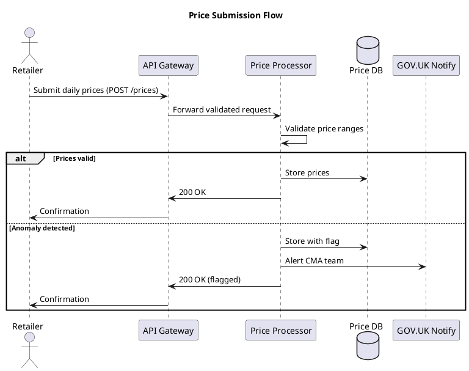
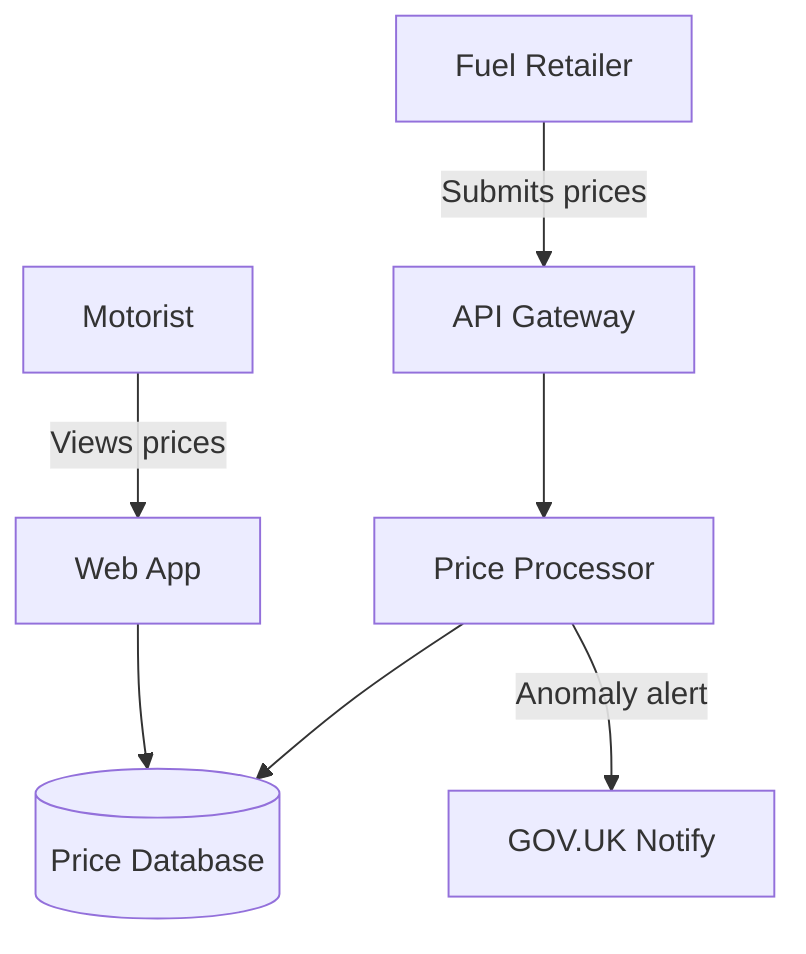

# PlantUML Rendering Test

This document tests PlantUML diagram rendering in ArcKit Pages.

## C4 Context Diagram (PlantUML)

```plantuml
@startuml
!include https://raw.githubusercontent.com/plantuml-stdlib/C4-PlantUML/master/C4_Context.puml

title System Context - UK Fuel Price Transparency Service

Person(motorist, "Motorist", "Checks fuel prices before filling up")
Person(retailer, "Fuel Retailer", "Submits daily fuel prices")

System(fps, "Fuel Price Transparency Service", "Collects, validates, and publishes UK fuel prices")

System_Ext(govuk, "GOV.UK", "Government website for public-facing content")
System_Ext(cma, "CMA Systems", "Competition and Markets Authority reporting")

Rel(motorist, fps, "Views fuel prices", "HTTPS")
Rel(retailer, fps, "Submits prices", "API/HTTPS")
Rel(fps, govuk, "Publishes price data", "API")
Rel(fps, cma, "Sends compliance reports", "API")
@enduml
```

## C4 Container Diagram (PlantUML)

```plantuml
@startuml
!include https://raw.githubusercontent.com/plantuml-stdlib/C4-PlantUML/master/C4_Container.puml

title Container Diagram - Fuel Price Transparency Service

Person(retailer, "Fuel Retailer", "Submits daily prices")

System_Boundary(fps, "Fuel Price Transparency Service") {
    Container(web, "Web Application", "React, GOV.UK Design System", "Public price comparison interface")
    Container(api, "API Gateway", "AWS API Gateway", "Receives price submissions")
    Container(processor, "Price Processor", "Python, Lambda", "Validates and normalises price data")
    Container(db, "Price Database", "PostgreSQL RDS", "Stores historical fuel prices")
    Container(notify, "Notification Service", "GOV.UK Notify", "Alerts on price anomalies")
}

Rel(retailer, api, "Submits prices", "REST/HTTPS")
Rel(api, processor, "Routes submissions")
Rel(processor, db, "Writes validated prices")
Rel(web, db, "Reads price data")
Rel(processor, notify, "Triggers alerts")
@enduml
```

## Simple Sequence Diagram (PlantUML)



## Mermaid Diagram (for comparison)



---

**Generated by**: ArcKit PlantUML rendering test
**Generated on**: 2026-02-25
