# Project Plan: UK Fuel Price Transparency Service

> **Template Status**: Live | **Version**: 1.0.3 | **Command**: `/arckit.plan`

## Document Control

| Field | Value |
|-------|-------|
| **Document ID** | ARC-001-PLAN-v1.0 |
| **Document Type** | Project Plan |
| **Project** | UK Fuel Price Transparency Service (Project 001) |
| **Classification** | OFFICIAL |
| **Status** | DRAFT |
| **Version** | 1.0 |
| **Created Date** | 2026-01-31 |
| **Last Modified** | 2026-01-31 |
| **Review Cycle** | Monthly |
| **Next Review Date** | 2026-03-01 |
| **Owner** | Delivery Manager |
| **Reviewed By** | [PENDING] |
| **Approved By** | [PENDING] |
| **Distribution** | CMA SRO, CMA Digital Lead, DESNZ Policy, GDS Assessors, Programme Board |

## Revision History

| Version | Date | Author | Changes | Approved By | Approval Date |
|---------|------|--------|---------|-------------|---------------|
| 1.0 | 2026-01-31 | ArcKit AI | Initial creation from `/arckit.plan` command | [PENDING] | [PENDING] |

---

## Executive Summary

**Project**: UK Fuel Price Transparency Service ("Fuel Finder")
**Duration**: 44 weeks (11 months)
**Budget**: Subject to CDDO spend control approval and Green Book business case
**Team**: 8–12 FTE average (scaling by phase)
**Delivery Model**: GDS Agile Delivery (Discovery → Alpha → Beta → Live)
**Security Classification**: OFFICIAL

**Objective**: Deliver a citizen-facing fuel price comparison service under the Motor Fuel Price (Open Data) Regulations 2025, enabling ~8,500 UK forecourts to submit real-time pricing data for open publication, CMA enforcement, and third-party innovation.

**Regulatory Constraints**:
- **2 February 2026**: Forecourt registration deadline (set in legislation — IMMOVABLE)
- **Early May 2026**: Enforcement grace period ends (enforcement tools MUST be operational)
- **GDS Service Standard**: Phase gate assessments at Alpha, Beta, and Live (MANDATORY)

**Success Criteria** (from ARC-001-REQ-v2.0):
- ≥97% of known UK forecourts registered by 2 February 2026
- ≥90% submission compliance by May 2026; ≥95% within 6 months
- 1 million monthly unique citizen users within 12 months
- ≥80% citizen user satisfaction (GOV.UK satisfaction survey)
- CMA enforcement tools operational before grace period ends
- GDS Service Standard assessment passed at Alpha, Beta, and Live
- Programme spend within ±10% of approved budget

**Project Complexity**: **LARGE**
- 62+ requirements (7 BRs, 15 FRs, 27 NFRs, 8 INTs, 6 data entities)
- 8 external integrations (address gazetteer, geocoding, GOV.UK Notify, GOV.UK Design System, GOV.UK One Login, CMA IdP, Companies House, Android Auto/CarPlay)
- Multiple compliance regimes: UK GDPR, GDS Service Standard, TCoP, Secure by Design, Orange Book, Green Book
- Cross-departmental governance: CMA (delivery) + DESNZ (policy)
- 20 identified risks, 4 exceeding appetite (ARC-001-RISK-v1.0)
- Fixed regulatory deadline that cannot slip

**Key Milestones**:

| Milestone | Target Date | Week |
|-----------|-------------|------|
| Project Initiation | 2026-02-02 | 0 |
| Discovery Complete | 2026-03-13 | 6 |
| Alpha Assessment Pass | 2026-05-22 | 16 |
| Private Beta Launch | 2026-07-31 | 26 |
| Public Beta Assessment | 2026-10-09 | 36 |
| Live Launch | 2026-11-20 | 42 |
| Hypercare Complete | 2026-12-18 | 44 |

**Note on Discovery/Alpha timing**: Several Discovery and Alpha artifacts have already been generated (stakeholders, requirements v2.0, principles, risk register, DPIA, Secure by Design assessment, research, data model). This plan reflects the remaining work to complete each phase gate, accounting for artifacts already produced. The accelerated Discovery reflects this head start.

---

## Team Structure

### Phase-Based Team Sizing

| Role | Discovery | Alpha | Beta | Live |
|------|-----------|-------|------|------|
| **Delivery Manager** | 1 | 1 | 1 | 0.5 |
| **Product Owner** | 1 | 1 | 1 | 0.5 |
| **User Researcher** | 1 | 1 | 0.5 | 0.25 |
| **Interaction Designer** | 0.5 | 1 | 1 | 0 |
| **Content Designer** | 0.5 | 0.5 | 1 | 0 |
| **Technical Architect** | 1 | 1 | 0.5 | 0.25 |
| **Backend Developers** | 0 | 1 | 4 | 1 |
| **Frontend Developer** | 0 | 1 | 2 | 0.5 |
| **DevOps/SRE** | 0 | 0.5 | 1 | 1 |
| **QA/Test Engineer** | 0 | 0.5 | 2 | 0.5 |
| **Security Specialist** | 0 | 0.5 | 0.5 | 0.25 |
| **Data Engineer** | 0 | 0.5 | 1 | 0.5 |
| **Performance Analyst** | 0 | 0 | 0.5 | 0.25 |
| **Total FTE** | **5** | **9.5** | **16** | **5.5** |

### Key Roles (Named Owners from ARC-001-STKE-v1.0)

| Accountability | Owner |
|---------------|-------|
| Senior Responsible Owner (SRO) | CMA SRO |
| Product Owner | CMA Digital Lead |
| Technical Architect | CMA Technical Architect |
| Enforcement Lead | CMA Enforcement Division Lead |
| Policy Lead | DESNZ Policy Lead |
| SIRO | CMA SIRO |
| DPO | CMA DPO |

---

## Gantt Timeline


---

## Workflow and Gates Diagram

```mermaid
graph TB
    Start["Project Initiation<br/>2 Feb 2026"] --> Discovery

    Discovery["Discovery Phase (Weeks 1-6)<br/>• Stakeholder analysis ✅<br/>• User research round 1<br/>• Requirements v2.0 ✅<br/>• Principles ✅<br/>• DPIA ✅ / Risk register ✅<br/>• Initial SOBC<br/>• Wardley mapping"] --> DiscGate{"Discovery<br/>Assessment<br/>Week 6"}

    DiscGate -->|"✅ Approved"| Alpha
    DiscGate -->|"❌ Rejected"| Stop1["Stop / Pivot"]

    Alpha["Alpha Phase (Weeks 7-16)<br/>• Prototype + user research<br/>• C4 architecture diagrams<br/>• High-Level Design<br/>• Threat model<br/>• Vendor procurement<br/>• TCoP compliance<br/>• Backlog refinement ✅"] --> HLDGate{"HLD Review<br/>Week 14"}

    HLDGate -->|"✅ Approved"| AlphaGate{"Alpha<br/>Assessment<br/>Week 16"}
    HLDGate -->|"❌ Rejected"| RefineHLD["Refine HLD"]
    RefineHLD --> HLDGate

    AlphaGate -->|"✅ Approved"| PrivBeta
    AlphaGate -->|"❌ Rejected"| RefineAlpha["Refine Approach"]
    RefineAlpha --> Alpha

    PrivBeta["Private Beta (Weeks 17-26)<br/>• Sprints 1-5<br/>• Foundation + Submission<br/>• Enforcement dashboard<br/>• Citizen search<br/>• Open Data API<br/>• Accessibility"] --> PBGate{"Private Beta<br/>Review<br/>Week 26"}

    PBGate -->|"✅ Enforcement ready"| PubBeta
    PBGate -->|"❌ Critical gaps"| FixPB["Sprint fixes"]
    FixPB --> PBGate

    PubBeta["Public Beta (Weeks 27-36)<br/>• Sprints 6-8<br/>• Pen testing<br/>• Performance testing<br/>• UAT<br/>• Welsh language<br/>• GDS evidence"] --> BetaGate{"GDS Beta<br/>Assessment<br/>Week 36"}

    BetaGate -->|"✅ Pass"| Live
    BetaGate -->|"⚠️ Conditions"| Conditions["Address conditions"]
    Conditions --> LiveGate
    BetaGate -->|"❌ Not met"| FixBeta["Fix blockers"]
    FixBeta --> BetaGate

    Live["Live Preparation (Weeks 37-40)<br/>• Address conditions<br/>• Operational readiness<br/>• On-call handover"] --> LiveGate{"Live<br/>Assessment<br/>Week 40"}

    LiveGate -->|"✅ Go-Live"| Prod["Production<br/>Deployment<br/>Week 41"]
    LiveGate -->|"❌ No-Go"| FixLive["Address<br/>blockers"]
    FixLive --> LiveGate

    Prod --> Hypercare["Hypercare<br/>4 weeks"]
    Hypercare --> BAU["Business As Usual<br/>+ Benefits Tracking"]

    style DiscGate fill:#FFE4B5
    style HLDGate fill:#FFE4B5
    style AlphaGate fill:#FFE4B5
    style PBGate fill:#FFE4B5
    style BetaGate fill:#FFE4B5
    style LiveGate fill:#FFE4B5
    style Stop1 fill:#FFB6C1
```



---

## Phase 1: Discovery (Weeks 1–6)

**Objective**: Validate the problem, user needs, and approach. Confirm feasibility and stakeholder alignment.

**Status**: Largely complete — 7 of 10 key artifacts already generated. Remaining work focuses on user research, SOBC, Wardley mapping, and service assessment preparation.

### Activities & Timeline

| Week | Activity | ArcKit Command | Deliverable | Status |
|------|----------|----------------|-------------|--------|
| Pre | Stakeholder analysis | `/arckit.stakeholders` | ARC-001-STKE-v1.0 | ✅ Done |
| Pre | Architecture principles | `/arckit.principles` | ARC-000-PRIN-v1.0 | ✅ Done |
| Pre | Requirements v2.0 | `/arckit.requirements` | ARC-001-REQ-v2.0 | ✅ Done |
| Pre | Risk register | `/arckit.risk` | ARC-001-RISK-v1.0 | ✅ Done |
| Pre | DPIA | `/arckit.dpia` | ARC-001-DPIA-v1.0 | ✅ Done |
| Pre | Secure by Design (initial) | `/arckit.secure` | ARC-001-SECD-v1.0 | ✅ Done |
| Pre | Technology research | `/arckit.research` | ARC-001-RSCH-v1.0 | ✅ Done |
| Pre | Data model | `/arckit.data-model` | ARC-001-DATA-v1.0 | ✅ Done |
| 1–2 | User research round 1 | Manual | User needs evidence, pain points, personas validated | Pending |
| 3–4 | Initial SOBC (5-case model) | `/arckit.sobc` | ARC-001-SOBC-v1.0 | Pending |
| 3 | Wardley mapping | `/arckit.wardley` | ARC-001-WARD-001-v1.0 | Pending |
| 5 | Service assessment preparation | `/arckit.service-assessment` | ARC-001-SVCA-v1.0 | Pending |
| 6 | Discovery Assessment | — | GDS Discovery assessment pass | Pending |

### Gate: Discovery Assessment (Week 6)

**Approval Criteria**:
- [ ] Problem clearly defined and validated with user research evidence
- [ ] User needs documented for all 7 personas (Sarah, Raj, Claire, David, Emma, Tom, Mike)
- [ ] 7 Business Requirements defined with measurable success criteria
- [ ] 22 Architecture principles agreed by Architecture Review Board
- [ ] SOBC shows positive value for money
- [ ] 20 risks identified with mitigation plans; 4 exceeding appetite escalated
- [ ] DPIA completed and ICO-ready
- [ ] Stakeholder buy-in confirmed (CMA SRO, DESNZ Policy, GDS)
- [ ] Forecourt registration deadline impact assessed (2 Feb 2026)

**Approvers**: CMA SRO, CMA Digital Lead, DESNZ Policy Lead

**Possible Outcomes**:
- ✅ **Go to Alpha** — Problem validated, regulatory mandate confirmed, approach feasible
- 🔄 **Pivot** — Adjust approach (e.g., phased delivery strategy)
- ❌ **Stop** — Extremely unlikely given statutory mandate

---

## Phase 2: Alpha (Weeks 7–16)

**Objective**: Design the solution, validate with prototypes and user research, procure vendor(s), and produce an approved High-Level Design.

### Activities & Timeline

| Week | Activity | ArcKit Command | Deliverable |
|------|----------|----------------|-------------|
| 7–9 | Prototype development | Manual | Clickable prototype for citizen search, retailer submission, enforcement dashboard |
| 10–11 | User research round 2 (prototype testing) | Manual | Usability findings, design iterations |
| 7–8 | Architecture diagrams (C4) | `/arckit.diagram` | ARC-001-DIAG-001-v1.0 (Context, Container, Component) |
| 9–11 | High-Level Design | Manual / vendor | HLD document with component architecture |
| 12–13 | Threat model | Manual | STRIDE threat model for all components |
| 7–8 | Statement of Work for vendors | `/arckit.sow` | ARC-001-SOW-v1.0 |
| 9–11 | Vendor evaluation | `/arckit.evaluate` | ARC-001-EVAL-v1.0 |
| 12 | Vendor selection | — | Vendor contract signed |
| 13 | TCoP compliance assessment | `/arckit.tcop` | ARC-001-TCOP-v1.0 |
| 13 | Secure by Design update | `/arckit.secure` | ARC-001-SECD-v2.0 (with threat model) |
| 14 | HLD review | `/arckit.hld-review` | HLD review report |
| 14 | HLD Approval | — | Architecture Review Board sign-off |
| 15 | Updated SOBC | `/arckit.sobc` | ARC-001-SOBC-v2.0 (with vendor costs) |
| 15 | ADR documentation | `/arckit.adr` | ARC-001-ADR-001 through ARC-001-ADR-00N |
| 16 | Alpha Assessment | — | GDS Alpha assessment pass |

### Gate: HLD Review (Week 14)

**Approval Criteria**:
- [ ] HLD covers all 7 Business Requirements
- [ ] Component architecture aligns with 22 architecture principles
- [ ] Integration patterns defined for all 8 external systems
- [ ] Security architecture addresses all threats from STRIDE model
- [ ] Data architecture supports 6 data entities (ARC-001-DATA-v1.0)
- [ ] Scalability approach handles Year 3 projections (10,000 forecourts, 5M users)
- [ ] Disaster recovery strategy meets NFR-A-002 (RPO ≤15 min, RTO <4 hours)
- [ ] No critical architectural risks without mitigation
- [ ] Principles compliance assessed (ARC-000-PRIN-v1.0)

**Approvers**: CMA Technical Architect, Architecture Review Board

### Gate: Alpha Assessment (Week 16)

**Approval Criteria**:
- [ ] Prototype tested with real users (motorists, retailers, CMA enforcement officers)
- [ ] HLD approved by Architecture Review Board
- [ ] Vendor selected and contracted (if applicable)
- [ ] TCoP compliance documented
- [ ] Secure by Design assessment updated with threat model
- [ ] SOBC updated with implementation costs
- [ ] Backlog refined and sprint plan agreed (ARC-001-BKLG-v1.0)
- [ ] Team assembled for Beta phase
- [ ] GDS Alpha assessment conditions addressed

**Approvers**: GDS Assessment Panel, CMA SRO

**Possible Outcomes**:
- ✅ **Go to Private Beta** — Design validated, team ready
- ⚠️ **Go with conditions** — Proceed but address specific conditions
- ❌ **Repeat Alpha** — Significant design concerns to address

---

## Phase 3: Private Beta (Weeks 17–26)

**Objective**: Build the core service, achieve enforcement readiness by May 2026, and demonstrate to a limited user group.

**Critical Deadline**: CMA enforcement tools MUST be operational before the enforcement grace period ends (early May 2026). This drives the sprint sequencing in ARC-001-BKLG-v1.0.

### Activities & Timeline

| Week | Activity | Sprint | Deliverable |
|------|----------|--------|-------------|
| 17–18 | Foundation: Registration, Auth, DB, CI/CD | Sprint 1 | Retailers can register; infrastructure operational |
| 19–20 | Core: Submission (web + API), Pipeline, Audit, Dashboard | Sprint 2 | Price submission working; audit trail operational |
| 21–22 | Quality: Validation, Citizen Search, Open API | Sprint 3 | Data quality rules; citizen search; open API v1 |
| 23–24 | Workflow: Enforcement actions, GOV.UK Notify, Results UX | Sprint 4 | Enforcement workflow complete; citizen experience polished |
| 25–26 | Resilience: Accessibility, DR, Runbooks, Evidence export | Sprint 5 | WCAG 2.2 AA; disaster recovery tested; evidence export |
| 24–25 | CMA enforcement tabletop exercise | — | Enforcement process validated with CMA legal |
| 26 | Private Beta review | — | Internal review of readiness for public users |

### Enforcement Readiness Checkpoint (Week 24)

**Purpose**: Verify CMA enforcement tools are operational before the May 2026 grace period end.

**Criteria**:
- [ ] Compliance monitoring dashboard operational (Story-027, 028, 029)
- [ ] Enforcement action workflow tested (Story-030, 031)
- [ ] Immutable audit trail with cryptographic integrity (Story-033)
- [ ] Evidence export validated by CMA legal (Story-034)
- [ ] GOV.UK Notify sending enforcement notices (Story-031)
- [ ] CMA SSO integrated (Story-035)
- [ ] RBAC enforcing enforcement-only access (Task-NFR-005)
- [ ] Tabletop enforcement exercise completed with CMA legal sign-off

**Approvers**: CMA Enforcement Lead, CMA Legal, CMA Digital Lead

### Gate: Private Beta Review (Week 26)

**Approval Criteria**:
- [ ] All Must Have stories for Sprints 1–5 completed (ARC-001-BKLG-v1.0)
- [ ] Enforcement tools operational and tested
- [ ] Core citizen search functional
- [ ] Open data API v1 serving data
- [ ] Data validation pipeline operational with quality metrics
- [ ] Accessibility testing passed (WCAG 2.2 AA automated checks)
- [ ] No critical or high security vulnerabilities
- [ ] Disaster recovery tested
- [ ] Operational runbooks in place

**Approvers**: CMA SRO, CMA Digital Lead, CMA Enforcement Lead

---

## Phase 4: Public Beta (Weeks 27–36)

**Objective**: Open the service to the public, conduct security and performance testing, complete UAT, and pass GDS Beta assessment.

### Activities & Timeline

| Week | Activity | Sprint | Deliverable |
|------|----------|--------|-------------|
| 27–28 | Security hardening: Pen testing, DAST, remediation | Sprint 6 | Pen test report; all critical/high findings remediated |
| 29–30 | Localisation: Welsh language, performance tuning | Sprint 7 | Welsh citizen pages; load test at 10x peak |
| 31–32 | UAT preparation: Benefits tracker, bug fixes | Sprint 8 | UAT-ready environment; benefits tracking operational |
| 27–28 | Penetration testing (CHECK-approved provider) | — | Pen test report with SIRO sign-off |
| 31–32 | Performance and load testing | — | Performance report; 10,000 concurrent citizens verified |
| 33–34 | User acceptance testing (UAT) | — | UAT sign-off from CMA enforcement + retailer representatives |
| 35 | GDS Beta Assessment preparation | `/arckit.service-assessment` | GDS evidence pack updated |
| 35 | Traceability verification | `/arckit.traceability` | ARC-001-TRACE-v1.0 |
| 35 | Quality analysis | `/arckit.analyze` | ARC-001-ANAL-v1.0 |
| 36 | GDS Beta Assessment | — | GDS Beta assessment pass/conditions |

### Gate: GDS Beta Assessment (Week 36)

**Approval Criteria** (GDS Service Standard 14 points):
- [ ] **Point 1**: User research evidence with real motorists, retailers, CMA officers, and DESNZ analysts
- [ ] **Point 2**: Whole problem solved (find fuel → compare → navigate)
- [ ] **Point 3**: Joined-up experience across web and API channels
- [ ] **Point 5**: Accessible — WCAG 2.2 AA, assistive tech tested, map alternative for screen readers
- [ ] **Point 6**: Multidisciplinary team with user researchers, designers, developers
- [ ] **Point 9**: Secure — Pen test passed, Secure by Design assessment, SIRO sign-off
- [ ] **Point 10**: Success metrics defined and tracking (coverage, satisfaction, freshness)
- [ ] **Point 12**: Source code open (unless security exemption)
- [ ] **Point 14**: Reliable — 99.9% citizen availability, DR tested, runbooks in place

**Approvers**: GDS Assessment Panel

**Possible Outcomes**:
- ✅ **Pass** — Proceed to Live
- ⚠️ **Pass with conditions** — Address conditions before Live assessment
- ❌ **Not met** — Significant work needed; reassess

---

## Phase 5: Live (Weeks 37–44)

**Objective**: Address any Beta assessment conditions, achieve Live assessment pass, deploy to production, and transition to BAU.

### Activities & Timeline

| Week | Activity | ArcKit Command | Deliverable |
|------|----------|----------------|-------------|
| 37–38 | Address Beta assessment conditions | — | Conditions evidence pack |
| 39 | Operational readiness review | `/arckit.operationalize` | ARC-001-OPS-v1.0 (support model, SLAs, on-call, handover) |
| 40 | GDS Live Assessment | — | Live assessment pass |
| 41 | Production deployment | — | Service live on GOV.UK |
| 42–44 | Hypercare (4 weeks) | — | Incident resolution, performance monitoring |
| 44+ | Benefits realisation tracking | — | Monthly benefits reports |

### Gate: Live Assessment (Week 40)

**Approval Criteria**:
- [ ] All Beta assessment conditions addressed
- [ ] Operational support model in place (SLAs, on-call, escalation)
- [ ] Incident response plan tested
- [ ] Monitoring and alerting operational
- [ ] On-call handover completed to support team
- [ ] Benefits realisation tracker operational
- [ ] GDS Live assessment evidence submitted

**Approvers**: GDS Assessment Panel, CMA SRO

### Post-Live Activities

| Activity | Frequency | Owner |
|----------|-----------|-------|
| Benefits realisation reporting | Monthly | CMA SRO |
| Risk register review | Monthly | CMA SRO |
| User research | Quarterly | User Researcher |
| Security vulnerability scanning | Continuous (CI/CD) | DevOps |
| Penetration testing | Annually | SIRO |
| Architecture quality review | Quarterly | Technical Architect |
| GDS performance reporting | Quarterly | Product Owner |

---

## ArcKit Commands in Project Flow

### Discovery Phase (Weeks 1–6)

| Command | Purpose | Deliverable | Status |
|---------|---------|-------------|--------|
| `/arckit.stakeholders` | Stakeholder analysis | ARC-001-STKE-v1.0 | ✅ Done |
| `/arckit.principles` | Architecture principles | ARC-000-PRIN-v1.0 | ✅ Done |
| `/arckit.requirements` | Requirements v2.0 | ARC-001-REQ-v2.0 | ✅ Done |
| `/arckit.risk` | Risk register | ARC-001-RISK-v1.0 | ✅ Done |
| `/arckit.dpia` | Data Protection Impact Assessment | ARC-001-DPIA-v1.0 | ✅ Done |
| `/arckit.secure` | Secure by Design (initial) | ARC-001-SECD-v1.0 | ✅ Done |
| `/arckit.research` | Technology research | ARC-001-RSCH-v1.0 | ✅ Done |
| `/arckit.data-model` | Data model | ARC-001-DATA-v1.0 | ✅ Done |
| `/arckit.sobc` | Strategic Outline Business Case | ARC-001-SOBC-v1.0 | Pending |
| `/arckit.wardley` | Wardley mapping | ARC-001-WARD-001-v1.0 | Pending |
| `/arckit.service-assessment` | GDS readiness check | ARC-001-SVCA-v1.0 | Pending |

### Alpha Phase (Weeks 7–16)

| Command | Purpose | Deliverable |
|---------|---------|-------------|
| `/arckit.diagram` | C4 architecture diagrams | ARC-001-DIAG-001-v1.0 |
| `/arckit.sow` | Statement of Work for vendors | ARC-001-SOW-v1.0 |
| `/arckit.evaluate` | Vendor evaluation framework | ARC-001-EVAL-v1.0 |
| `/arckit.tcop` | Technology Code of Practice | ARC-001-TCOP-v1.0 |
| `/arckit.secure` | Secure by Design update (with threat model) | ARC-001-SECD-v2.0 |
| `/arckit.hld-review` | HLD review against principles | HLD review report |
| `/arckit.sobc` | Updated SOBC (with vendor costs) | ARC-001-SOBC-v2.0 |
| `/arckit.adr` | Architecture Decision Records | ARC-001-ADR-001 to N |
| `/arckit.backlog` | Product backlog (DONE) | ARC-001-BKLG-v1.0 |

### Beta Phase (Weeks 17–36)

| Command | Purpose | Deliverable |
|---------|---------|-------------|
| `/arckit.dld-review` | DLD review (if DLD produced by vendor) | DLD review report |
| `/arckit.traceability` | Requirements → Design → Tests matrix | ARC-001-TRACE-v1.0 |
| `/arckit.analyze` | Architecture quality analysis | ARC-001-ANAL-v1.0 |
| `/arckit.service-assessment` | GDS Beta assessment readiness | ARC-001-SVCA-v2.0 |
| `/arckit.principles-compliance` | Principles compliance scorecard | ARC-001-PCOMP-v1.0 |

### Live Phase (Weeks 37–44+)

| Command | Purpose | Deliverable |
|---------|---------|-------------|
| `/arckit.operationalize` | Operational readiness pack | ARC-001-OPS-v1.0 |
| `/arckit.risk` | Update operational risk register | ARC-001-RISK-v2.0 |
| `/arckit.analyze` | Periodic quality reviews | Updated analysis |
| `/arckit.story` | Project story / retrospective | ARC-001-STORY-v1.0 |

---

## Critical Path Analysis

The critical path is driven by the **May 2026 enforcement deadline** and **GDS phase gate assessments**:

```
Discovery Assessment (Week 6)
    → Alpha Assessment (Week 16)
        → Sprint 1-5 Build (Weeks 17-26)
            → Enforcement Readiness (Week 24) ← HARD DEADLINE
                → Private Beta Review (Week 26)
                    → Pen Testing + UAT (Weeks 27-34)
                        → GDS Beta Assessment (Week 36)
                            → Live Assessment (Week 40)
                                → Production (Week 41)
```

**Critical path items**:
1. **Discovery → Alpha assessment**: Must pass to begin build
2. **Sprint 2–5**: Enforcement tools must be built, tested, and legally validated
3. **Enforcement tabletop exercise**: CMA legal must sign off on evidence admissibility
4. **Penetration testing**: Must complete before GDS Beta assessment
5. **GDS Beta assessment**: Must pass before Live

**Float**: Minimal. The regulatory deadline leaves little room for delay. If any critical path item slips by >2 weeks, the enforcement readiness deadline is at risk.

---

## Risk and Assumptions

### Key Risks Affecting the Plan

| Risk | Impact on Plan | Mitigation |
|------|---------------|------------|
| **R-001**: Low independent retailer compliance (Residual 12) | Registration data incomplete → citizen service less useful | Front-load registration in Sprint 1; assisted digital support |
| **R-003**: Enforcement tools not ready by May 2026 (Residual 12) | Miss hard regulatory deadline | Enforcement in Sprints 2–5; tabletop exercise Week 24 |
| **R-006**: Negative media coverage (Residual 12) | Citizen adoption undermined | Proactive comms strategy; ensure data quality before public beta |
| **R-010**: VE3 API specification unavailable (Residual 12) | Primary data integration blocked | Adapter pattern; build against CMA interim JSON endpoints |
| **R-007**: GDS assessment failure (Residual 6) | Phase progression blocked | Pre-assessment check-ins; evidence from Sprint 1 |
| **R-013**: DPIA not completed (Residual 6) | Processing personal data blocked | DPIA already complete (ARC-001-DPIA-v1.0) ✅ |

### Assumptions

| ID | Assumption | Impact if Wrong | Validation Plan |
|----|-----------|----------------|-----------------|
| A-1 | BEIS/DESNZ forecourt master list available by Feb 2026 | Cannot measure registration completeness | Confirm with DESNZ Week 1 |
| A-2 | GOV.UK Notify capacity sufficient (~50K emails/month) | Alternative notification needed | Confirm with GDS Notify team |
| A-3 | Large retailers can integrate API within 3 months | Delayed submission data from chains | Publish API spec in Alpha; sandbox available |
| A-4 | Independent retailers have smartphone with web browser | Assisted digital needed for more retailers | Validate in user research round 1 |
| A-5 | CMA and DESNZ joint governance works | Inter-departmental friction delays decisions | Joint programme board established Week 1 |
| A-6 | Team can be recruited/contracted within 4 weeks | Beta start delayed | Begin recruitment in Discovery |
| A-7 | GDS assessment slots available at planned dates | Phase gate delayed | Book assessment slots in advance |

### Dependencies

| Dependency | Required By | Owner | Status |
|-----------|-------------|-------|--------|
| Forecourt master list from DESNZ | Week 1 | DESNZ | At Risk |
| GOV.UK Notify capacity confirmation | Week 8 | GDS Notify | On Track |
| CMA Identity Provider federation | Week 19 (Sprint 2) | CMA IT | On Track |
| OS AddressBase licence | Week 17 (Sprint 1) | CMA Procurement | On Track |
| CMA Legal — evidence admissibility guidance | Week 23 (Sprint 4) | CMA Legal | On Track |
| GDS Alpha assessment slot | Week 16 | GDS | Pending |
| GDS Beta assessment slot | Week 36 | GDS | Pending |
| CHECK-approved pen tester contracted | Week 27 | CMA Procurement | Pending |

---

## Budget Estimates

### Phase-Based Budget Breakdown

| Phase | Duration | Team FTE | External Costs | Phase Total |
|-------|----------|----------|---------------|-------------|
| Discovery | 6 weeks | 5 FTE | User research recruitment, Wardley facilitation | Subject to SOBC |
| Alpha | 10 weeks | 9.5 FTE | Prototype development, vendor procurement | Subject to SOBC |
| Private Beta | 10 weeks | 16 FTE | Cloud infrastructure, security testing | Subject to SOBC |
| Public Beta | 10 weeks | 16 FTE | Pen testing, load testing, UAT | Subject to SOBC |
| Live + Hypercare | 8 weeks | 5.5 FTE | Production infrastructure, on-call | Subject to SOBC |
| **Total** | **44 weeks** | **~12 FTE avg** | | **Subject to SOBC** |

**Note**: Detailed budget figures will be produced in the SOBC (ARC-001-SOBC-v1.0). Key cost drivers include: team FTE rates, cloud infrastructure (UK sovereign), OS AddressBase licence, CHECK-approved pen testing, and GOV.UK Notify usage. Data API costs are £0 per ARC-001-RSCH-v1.0.

---

## Governance Structure

### Programme Board

| Meeting | Frequency | Attendees | Purpose |
|---------|-----------|-----------|---------|
| Programme Board | Fortnightly | CMA SRO, CMA Digital Lead, DESNZ Policy Lead, CMA Enforcement Lead | Strategic decisions, risk escalation, cross-departmental alignment |
| Sprint Review | End of sprint (bi-weekly) | Delivery team, Product Owner, stakeholder representatives | Demo completed work, gather feedback |
| Sprint Planning | Start of sprint | Delivery team, Product Owner | Commit to sprint backlog |
| Architecture Review Board | Monthly | CMA Technical Architect, Security Specialist, DevOps Lead | Architecture decisions, ADR review, principles compliance |
| Risk Review | Monthly (High risks: weekly) | CMA SRO, risk owners | Risk register update, escalation decisions |

### RACI Summary

| Activity | CMA SRO | CMA Digital Lead | DESNZ Policy | GDS | CMA Enforcement |
|----------|---------|------------------|--------------|-----|-----------------|
| Discovery Assessment | A | R | C | C | I |
| HLD Approval | A | R | I | I | C |
| Alpha Assessment | A | R | C | A | C |
| Sprint Prioritisation | I | A | C | I | R (enforcement) |
| Beta Assessment | A | R | I | A | C |
| Enforcement Readiness | A | R | I | I | A |
| Live Assessment | A | R | C | A | C |

*A = Accountable, R = Responsible, C = Consulted, I = Informed*

---

## Monitoring and Reporting

### KPIs by Phase

| Phase | KPI | Target | Measurement |
|-------|-----|--------|-------------|
| Discovery | Artifact completion | 100% required artifacts | ArcKit artifact tracker |
| Alpha | User research sessions | ≥12 sessions across personas | Research log |
| Alpha | HLD coverage | All 7 BRs addressed | HLD review checklist |
| Private Beta | Sprint velocity | ≥18 points/sprint | Sprint tracking |
| Private Beta | Enforcement stories completed | 100% Must Have by Week 24 | Backlog status |
| Public Beta | Test coverage | ≥80% unit, 100% critical paths | CI/CD metrics |
| Public Beta | Security findings | 0 critical, 0 high unresolved | Pen test report |
| Live | Citizen availability | 99.9% | Uptime monitoring |
| Live | Data freshness (p95) | ≤30 minutes | Pipeline metrics |
| Live | User satisfaction | ≥80% | GOV.UK satisfaction survey |

### Reporting Cadence

| Report | Frequency | Audience | Content |
|--------|-----------|----------|---------|
| Sprint report | Bi-weekly | Programme Board | Velocity, burndown, blockers |
| Risk report | Monthly | CMA SRO, Programme Board | Risk register status, KRI dashboard |
| GDS evidence pack | Per phase gate | GDS Assessment Panel | Service Standard evidence |
| Financial report | Monthly | CMA SRO, HM Treasury | Spend vs budget, forecast |
| Ministerial briefing | Monthly | DESNZ Ministers | Headline metrics, media narrative |

---

## Document Approval

| Role | Name | Signature | Date |
|------|------|-----------|------|
| **SRO** | CMA SRO | | |
| **Product Owner** | CMA Digital Lead | | |
| **Policy Lead** | DESNZ Policy Lead | | |
| **Technical Architect** | CMA Technical Architect | | |

---

## Next Steps

1. **This week**: Contact DESNZ/VE3 Global for API specification (R-010 — URGENT)
2. **This week**: Confirm DESNZ forecourt master list availability (A-1)
3. **Week 1**: Begin user research round 1 (motorists, retailers, CMA officers)
4. **Week 1**: Establish joint CMA-DESNZ programme board
5. **Week 3**: Run `/arckit.sobc` for initial business case
6. **Week 3**: Run `/arckit.wardley` for strategic mapping
7. **Week 5**: Run `/arckit.service-assessment` for Discovery readiness check
8. **Week 6**: Discovery Assessment with GDS
9. **Week 7**: Begin Alpha — prototype development and architecture design

---

**End of Project Plan**

---

*This project plan follows GDS Agile Delivery methodology and integrates with ArcKit's architecture governance framework. The plan should be updated at each phase gate based on actual progress.*

*For questions or updates, contact: CMA Digital Lead (Product Owner)*
