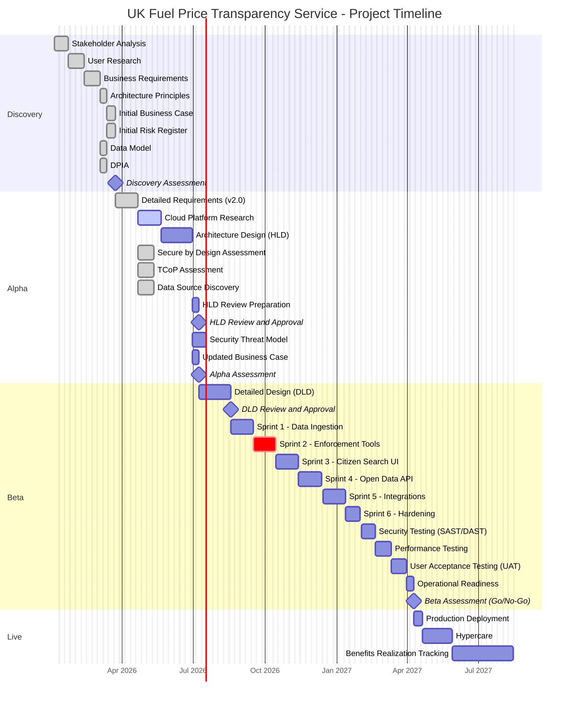
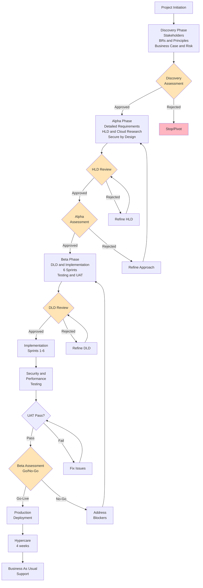

# Project Plan: UK Fuel Price Transparency Service

> **Template Origin**: Official | **ArcKit Version**: 3.0.2 | **Command**: `/arckit.plan`

## Document Control

| Field | Value |
|-------|-------|
| **Document ID** | ARC-001-PLAN-v2.0 |
| **Document Type** | Project Plan |
| **Project** | UK Fuel Price Transparency Service (Project 001) |
| **Classification** | OFFICIAL |
| **Status** | DRAFT |
| **Version** | 2.0 |
| **Created Date** | 2026-03-02 |
| **Last Modified** | 2026-03-02 |
| **Review Cycle** | Monthly |
| **Next Review Date** | 2026-04-01 |
| **Owner** | Delivery Manager |
| **Reviewed By** | PENDING |
| **Approved By** | PENDING |
| **Distribution** | CMA SRO, CMA Digital Lead, DESNZ Policy, GDS Assessors, Programme Board |

## Revision History

| Version | Date | Author | Changes | Approved By | Approval Date |
|---------|------|--------|---------|-------------|---------------|
| 1.0 | 2026-01-31 | ArcKit AI | Initial creation from `/arckit.plan` command | PENDING | PENDING |
| 2.0 | 2026-03-02 | ArcKit AI | Updated with SOBC budget data, refined timeline based on regulatory deadlines, improved Gantt accuracy | PENDING | PENDING |

---

## Executive Summary

**Project**: UK Fuel Price Transparency Service ("Fuel Finder")
**Duration**: 52 weeks (12 months)
**Budget**: £3.6M over 3 years (£1.9M capital, £1.7M operational) — ROM ±30%
**Team**: 8-12 FTE average (scaling from 4 in Discovery to 14 in Beta)
**Delivery Model**: GDS Agile Delivery (Discovery → Alpha → Beta → Live)

**Objective**: Build and operate a government digital service that collects real-time fuel prices from ~8,500 UK forecourts and publishes them as open data for citizens, CMA enforcement, and third-party consumers, implementing the Motor Fuel Price (Open Data) Regulations 2025.

**Success Criteria**:

- ≥95% of UK forecourts publishing accurate, current prices within 12 months of launch
- 1 million monthly unique users within 12 months; ≥80% user satisfaction (GOV.UK survey)
- CMA enforcement capability operational by May 2026; < 24h non-compliance detection
- All mandatory governance gates passed (GDS Service Standard, Secure by Design, DPIA, TCoP)
- Delivered within ±10% of approved budget

**Key Milestones**:

- Discovery Complete: Week 8 (February 2026) — COMPLETED
- Alpha Complete (HLD approved): Week 20 (May 2026)
- Beta Complete (Go-Live approved): Week 44 (November 2026)
- Production Launch: Week 45 (December 2026)

**Regulatory Constraints**:

- Forecourt registration deadline: 2 February 2026 (passed)
- Enforcement grace period ends: early May 2026 — enforcement tools MUST be operational
- GDS Beta assessment: Q3 2026
- Public Beta launch: Q3/Q4 2026

---

## Timeline Overview (Gantt Chart)

---

## Workflow & Gates Diagram

---

## Discovery Phase (Weeks 1-8) — COMPLETED

**Objective**: Validate problem and approach

**Status**: COMPLETED — All Discovery artifacts delivered by end of January 2026

### Activities & Timeline

| Week | Activity | ArcKit Command | Deliverable | Status |
|------|----------|----------------|-------------|--------|
| 1-2 | Stakeholder Analysis | `/arckit:stakeholders` | ARC-001-STKE-v1.0 — 7 goals, 4 outcomes, 12 drivers | Done |
| 3-4 | User Research | Manual | User needs for motorists, retailers, CMA enforcement | Done |
| 5-6 | Business Requirements | `/arckit:requirements` | ARC-001-REQ-v1.0 — 7 BRs with acceptance criteria | Done |
| 7 | Architecture Principles | `/arckit:principles` | ARC-000-PRIN-v1.0 — 22 principles | Done |
| 7 | Data Model | `/arckit:data-model` | ARC-001-DATA-v1.0 — 6 entities | Done |
| 7 | DPIA | `/arckit:dpia` | ARC-001-DPIA-v1.0 — UK GDPR compliance assessment | Done |
| 8 | Initial Business Case | `/arckit:sobc` | ARC-001-SOBC-v1.0 — £3.6M investment, BCR 24:1 | Done |
| 8 | Initial Risk Register | `/arckit:risk` | ARC-001-RISK-v1.0 — 20 risks, 4 exceeding appetite | Done |

### Gate: Discovery Assessment (Week 8) — PASSED

**Approval Criteria**:

- [x] Problem clearly defined and validated — CMA market study, enacted legislation
- [x] User needs documented — motorists, retailers, CMA enforcement, DESNZ policy
- [x] Business Requirements defined — 7 BRs covering registration, submission, search, enforcement, open data
- [x] Architecture principles agreed — 22 principles in ARC-000-PRIN-v1.0
- [x] Business case shows positive ROI — BCR 24:1, NPV £80.7M
- [x] No critical risks without mitigation — All 5 critical risks reduced to high/medium residual
- [x] Stakeholder buy-in confirmed — CMA Board, DESNZ, GDS alignment

**Outcome**: APPROVED — Proceed to Alpha

---

## Alpha Phase (Weeks 9-20)

**Objective**: Design the solution, validate technical approach, select cloud platform

### Activities & Timeline

| Week | Activity | ArcKit Command | Deliverable |
|------|----------|----------------|-------------|
| 9-11 | Detailed Requirements (v2.0) | `/arckit:requirements` | ARC-001-REQ-v2.0 — 63 requirements (BR, FR, NFR, INT, DR) |
| 9-10 | Secure by Design Assessment | `/arckit:secure` | ARC-001-SECD-v1.0 — NCSC compliance |
| 9-10 | TCoP Assessment | `/arckit:tcop` | ARC-001-TCOP-v1.0 — 108/130 score |
| 9-10 | Data Source Discovery | `/arckit:datascout` | ARC-001-DSCT-v1.0/v2.0 — VE3 API, retailer data sources |
| 11-13 | Cloud Platform Research | `/arckit:aws-research`, `/arckit:azure-research` | ARC-001-AWRS, ARC-001-AZRS — Service comparison |
| 12-15 | Architecture Design (HLD) | `/arckit:diagram` | C4 diagrams, component architecture |
| 16 | HLD Review Preparation | `/arckit:hld-review` | HLD review pack |
| 16 | HLD Review & Approval | Gate | Architecture Board sign-off |
| 17-18 | Security Threat Model | Manual | STRIDE analysis against HLD |
| 19 | Updated Business Case | `/arckit:sobc` | Revised costs with vendor/cloud pricing |
| 20 | Alpha Assessment | Gate | SRO + Architecture Board approval |

### Gate: HLD Review (Week 16)

**Approval Criteria**:

- [ ] All 7 MUST_HAVE business requirements addressed in design
- [ ] Architecture principles compliant (22 principles from ARC-000-PRIN-v1.0)
- [ ] Security architecture defined (encryption, authentication, authorisation)
- [ ] Integration approach documented (VE3 API, GOV.UK Notify, Address Gazetteer, Companies House)
- [ ] Performance approach documented (p95 < 3s page load, < 200ms API response)
- [ ] Cloud platform selected with justification
- [ ] No unmitigated high risks

**Approvers**: Architecture Board, Security Lead (SIRO)

### Gate: Alpha Assessment (Week 20)

**Approval Criteria**:

- [ ] HLD approved by Architecture Board
- [ ] Cloud platform selected and procurement completed
- [ ] Business case updated with accurate costs (within ±30% ROM)
- [ ] Team and budget confirmed for Beta phase
- [ ] Technical feasibility demonstrated (prototype or proof of concept)
- [ ] Enforcement tools design validated against May 2026 deadline
- [ ] GDS Alpha assessment passed

**Approvers**: CMA SRO, Architecture Board, CMA Finance

**Possible Outcomes**:

- APPROVED — Go to Beta: Design validated, ready to build
- ITERATE — Refine design based on feedback
- STOP — Approach not feasible or business case negative

---

## Beta Phase (Weeks 21-44)

**Objective**: Build, test, and prepare for live

### Activities & Timeline

| Week | Activity | ArcKit Command | Deliverable |
|------|----------|----------------|-------------|
| 21-24 | Detailed Design (DLD) | Manual | DLD document, API specifications |
| 25 | DLD Review & Approval | `/arckit:dld-review` | DLD sign-off |
| 26-28 | Sprint 1 — Data Ingestion | Manual | Forecourt registration, price submission API and web form |
| 29-31 | Sprint 2 — Enforcement Tools | Manual | Compliance dashboard, non-compliance detection, evidence export |
| 32-34 | Sprint 3 — Citizen Search UI | Manual | GOV.UK fuel price comparison, geolocation search |
| 35-37 | Sprint 4 — Open Data API | Manual | Public API, developer portal, bulk download |
| 38-40 | Sprint 5 — Integrations | Manual | GOV.UK Notify, Address Gazetteer, Companies House |
| 41-42 | Sprint 6 — Hardening | Manual | Security hardening, performance optimisation, observability |
| 43 | Security Testing (SAST/DAST) | Manual | Vulnerability scan results, penetration test report |
| 43 | Performance Testing | Manual | Load test results (8,500 concurrent submissions) |
| 44 | User Acceptance Testing (UAT) | Manual | User sign-off from CMA, retailers, citizens |
| 44 | Operational Readiness | `/arckit:operationalize` | Runbooks, DR plan, on-call rota |
| 44 | Quality Analysis | `/arckit:analyze` | Final quality check across all artifacts |
| 44 | Traceability Matrix | `/arckit:traceability` | Requirements to design to tests |
| 44 | Beta Assessment (Go/No-Go) | Gate | SRO + Architecture Board + Security approval |

### Critical Path: Enforcement Tools (Sprint 2)

> **Regulatory Constraint**: CMA enforcement tools MUST be operational before the grace period ends in early May 2026. Sprint 2 is on the critical path and cannot be deferred.

**Enforcement Sprint Deliverables**:

- Compliance monitoring dashboard (real-time submission rates, coverage)
- Non-compliance detection engine ( < 24h detection threshold)
- Evidence export capability (validated by CMA legal team)
- Tamper-evident audit trail
- Automated notification to non-compliant retailers via GOV.UK Notify

### Gate: DLD Review (Week 25)

**Approval Criteria**:

- [ ] DLD aligns with approved HLD
- [ ] All implementation details documented (API schemas, database design, deployment topology)
- [ ] Security controls specified (encryption, RBAC, audit logging)
- [ ] Test strategy defined (unit, integration, e2e, security, performance)
- [ ] Deployment approach documented (CI/CD pipeline, infrastructure as code)
- [ ] Data migration strategy defined (if applicable)

**Approvers**: Technical Lead, Architecture Board

### Gate: Beta Assessment / Go-Live (Week 44)

**Approval Criteria**:

- [ ] All 7 MUST_HAVE business requirements implemented and tested
- [ ] Security testing passed — no critical/high vulnerabilities
- [ ] Performance testing passed — p95 < 3s page load, < 200ms API, 8,500 concurrent submissions
- [ ] UAT signed off by CMA Digital, retailer representatives, citizen user researchers
- [ ] WCAG 2.2 AA accessibility compliance verified
- [ ] Operational readiness confirmed — runbooks, DR tested, on-call rota established
- [ ] GDS Beta assessment passed
- [ ] No unmitigated critical or high risks

**Approvers**: CMA SRO, Architecture Board, SIRO, DPO, GDS Assessment Lead

**Possible Outcomes**:

- GO-LIVE — Ready for production deployment
- FIX ISSUES — Address blockers before go-live (up to 2-week delay)
- NO-GO — Major issues require significant rework

---

## Live Phase (Week 45+)

**Objective**: Deploy, stabilise, and realise benefits

### Activities & Timeline

| Week | Activity | ArcKit Command | Deliverable |
|------|----------|----------------|-------------|
| 45 | Production Deployment | Manual | Live system on GOV.UK |
| 46-49 | Hypercare | Manual | Issue resolution, performance monitoring, rapid response |
| 50-52 | Benefits Tracking (Month 1) | `/arckit:sobc` | Initial benefits realisation report |
| Quarterly | Quality Reviews | `/arckit:analyze` | Ongoing compliance and quality monitoring |
| Quarterly | Risk Updates | `/arckit:risk` | Updated risk register with operational risks |
| Annually | Benefits Realisation | `/arckit:sobc` | Annual BCR review against £90M+ target |

### Post-Launch Monitoring

| Metric | Target | Measurement |
|--------|--------|-------------|
| System availability | ≥99.9% uptime | Cloud monitoring dashboards |
| API response time (p95) | < 200ms | APM tooling |
| Page load time (p95) | < 3 seconds | Real User Monitoring |
| Forecourt compliance rate | ≥95% within 6 months | Compliance dashboard |
| Monthly unique users | 1 million within 12 months | GOV.UK Analytics |
| User satisfaction | ≥80% | GOV.UK satisfaction survey |
| Non-compliance detection | < 24 hours | Enforcement monitoring |

---

## ArcKit Commands Integration

### Discovery Phase (Weeks 1-8) — COMPLETED

| Week | Command | Deliverable |
|------|---------|-------------|
| 1-2 | `/arckit:stakeholders` | ARC-001-STKE-v1.0 |
| 5-6 | `/arckit:requirements` | ARC-001-REQ-v1.0 |
| 7 | `/arckit:principles` | ARC-000-PRIN-v1.0 |
| 7 | `/arckit:data-model` | ARC-001-DATA-v1.0 |
| 7 | `/arckit:dpia` | ARC-001-DPIA-v1.0 |
| 8 | `/arckit:sobc` | ARC-001-SOBC-v1.0 |
| 8 | `/arckit:risk` | ARC-001-RISK-v1.0 |

### Alpha Phase (Weeks 9-20)

| Week | Command | Deliverable |
|------|---------|-------------|
| 9-11 | `/arckit:requirements` | ARC-001-REQ-v2.0 (63 requirements) |
| 9-10 | `/arckit:secure` | ARC-001-SECD-v1.0 |
| 9-10 | `/arckit:tcop` | ARC-001-TCOP-v1.0 |
| 9-10 | `/arckit:datascout` | ARC-001-DSCT-v1.0, v2.0 |
| 11-13 | `/arckit:aws-research` | ARC-001-AWRS-v1.0, v1.1, v2.0 |
| 11-13 | `/arckit:azure-research` | ARC-001-AZRS-v1.0, v1.1, v2.0 |
| 12-15 | `/arckit:diagram` | ARC-001-DIAG-001-v1.0 (C4 diagrams) |
| 16 | `/arckit:hld-review` | HLD review and approval gate |
| 19 | `/arckit:sobc` | Updated business case |

### Beta Phase (Weeks 21-44)

| Week | Command | Deliverable |
|------|---------|-------------|
| 25 | `/arckit:dld-review` | DLD approval gate |
| 40-42 | `/arckit:analyze` | Quality analysis across all artifacts |
| 43 | `/arckit:traceability` | Requirements to design to tests traceability |
| 44 | `/arckit:operationalize` | Runbooks, DR plan, on-call rota |
| 44 | `/arckit:service-assessment` | GDS Service Standard self-assessment |

### Live Phase (Week 45+)

| Cadence | Command | Deliverable |
|---------|---------|-------------|
| Quarterly | `/arckit:analyze` | Periodic quality reviews |
| Quarterly | `/arckit:risk` | Updated operational risk register |
| Annually | `/arckit:sobc` | Benefits realisation review |
| On change | `/arckit:adr` | Architecture decision records |

---

## Resource Plan

### Team Sizing by Phase

| Phase | Duration | Team Size | Key Roles |
|-------|----------|-----------|-----------|
| Discovery | 8 weeks | 4 FTE | BA, Enterprise Architect, UX Researcher, Delivery Manager |
| Alpha | 12 weeks | 8 FTE | BA, Enterprise Architect, Tech Lead, Security Architect, 2x Developers, UX Designer, Delivery Manager |
| Beta | 24 weeks | 14 FTE | Tech Lead, Security Architect, 6x Developers, 2x QA Engineers, DevOps Engineer, UX Designer, BA, Delivery Manager |
| Live | Ongoing | 4 FTE | Service Manager, 2x Support Engineers, DevOps Engineer |

### Budget Summary

Source: ARC-001-SOBC-v1.0 — Option 2 (Balanced Digital Service)

| Phase | Duration | Team Cost | Infrastructure | Vendor/License | Total |
|-------|----------|-----------|----------------|----------------|-------|
| Discovery | 8 weeks | £120K | £5K | £0 | £125K |
| Alpha | 12 weeks | £360K | £20K | £15K | £395K |
| Beta | 24 weeks | £960K | £120K | £80K | £1,160K |
| Live (Year 1) | 12 months | £320K | £180K | £60K | £560K |
| **Capital Total** | | | | | **£1,900K** |
| **3-Year Operational** | | | | | **£1,700K** |
| **Programme Total** | | | | | **£3,600K** |

**Contingency**: 20% management reserve (£720K) included within ±30% ROM estimate

---

## Risks & Assumptions

### Key Risks (from ARC-001-RISK-v1.0)

| Risk ID | Description | Residual Score | Impact | Mitigation | Owner |
|---------|-------------|----------------|--------|------------|-------|
| R-001 | Low independent retailer compliance (~4,000 sites) | HIGH (12) | Data comprehensiveness, citizen trust | Dedicated onboarding support team, assisted digital | CMA Enforcement Lead |
| R-003 | Enforcement tools not ready by May 2026 | HIGH (12) | Regulatory failure, CMA credibility | Prioritise in Sprint 2 (critical path), weekly progress reporting | CMA Digital Lead |
| R-006 | Negative media coverage undermines citizen adoption | HIGH (12) | User uptake below targets | Proactive media strategy, positive consumer benefit narrative | CMA SRO |
| R-010 | VE3 Global API specification unavailable | HIGH (12) | Integration delays, fallback to manual submission | DESNZ escalation to VE3, design API-agnostic adapter layer | CMA Digital Lead |
| R-002 | Ministerial pressure compromises governance | MEDIUM (6) | Governance shortcuts, technical debt | Clear RACI, SRO as buffer, regular ministerial briefings | CMA SRO |

### Key Assumptions

- **A-1**: Motor Fuel Price (Open Data) Regulations 2025 remain in force — LOW risk of revocation
- **A-2**: VE3 Global API specification is published by April 2026 — HIGH risk if delayed (R-010)
- **A-3**: Cloud hosting in UK sovereign region is available and adequate — LOW risk
- **A-4**: Retailer web form submission is feasible for independent operators — to be validated in user research
- **A-5**: Consumer savings estimates (£30M/year) based on international evidence are applicable to UK
- **A-6**: GDS assessment team is available for scheduled assessments in Q2 and Q3 2026
- **A-7**: CMA can recruit/retain sufficient technical staff for Beta phase (14 FTE)

### Dependencies

| Dependency | Description | Owner | Target Date | Status | Impact if Delayed |
|------------|-------------|-------|-------------|--------|-------------------|
| VE3 API Spec | API specification for automated retailer data submission | DESNZ / VE3 Global | April 2026 | At Risk | HIGH — blocks primary integration |
| GDS Alpha Assessment | Service Standard assessment at Alpha gate | GDS | May 2026 | On Track | HIGH — blocks Beta phase |
| Cloud Procurement | Cloud platform account setup and security accreditation | CMA IT / Crown Commercial Service | April 2026 | On Track | MEDIUM — delays Beta start |
| GOV.UK Notify | Integration for retailer communications | GDS | Available | On Track | LOW — existing platform |
| Address Gazetteer | UK address and geolocation data for forecourt mapping | GeoPlace / OS | Available | On Track | LOW — existing service |

---

## Appendix A: Glossary

| Term | Definition |
|------|------------|
| BA | Business Analyst |
| BCR | Benefit-Cost Ratio |
| CMA | Competition and Markets Authority |
| DESNZ | Department for Energy Security and Net Zero |
| DLD | Detailed-Level Design |
| DPIA | Data Protection Impact Assessment |
| DPO | Data Protection Officer |
| GDS | Government Digital Service |
| HLD | High-Level Design |
| NFR | Non-Functional Requirement |
| NPV | Net Present Value |
| ROM | Rough Order of Magnitude |
| SIRO | Senior Information Risk Owner |
| SRO | Senior Responsible Owner |
| TCoP | Technology Code of Practice |
| UAT | User Acceptance Testing |
| VE3 | VE3 Global — third-party fuel data API specification provider |
| WCAG | Web Content Accessibility Guidelines |

## Appendix B: Source Documents

| Document | ID | Key Extractions |
|----------|----|-----------------|
| Stakeholder Analysis | ARC-001-STKE-v1.0 | 7 goals, 4 outcomes, 12 drivers, complex multi-departmental governance |
| Requirements | ARC-001-REQ-v2.0 | 63 requirements (7 BR, ~15 FR, ~20 NFR, ~8 INT), enforcement deadline May 2026 |
| Architecture Principles | ARC-000-PRIN-v1.0 | 22 principles — Open Data, Citizen-Centred, Cloud First, Security by Design |
| Business Case | ARC-001-SOBC-v1.0 | £3.6M investment, BCR 24:1, NPV £80.7M, Option 2 recommended |
| Risk Register | ARC-001-RISK-v1.0 | 20 risks, 4 HIGH residual, 37% overall risk reduction from controls |
| Data Model | ARC-001-DATA-v1.0 | 6 entities — forecourts, retailers, prices, submissions, users, audit |
| Secure by Design | ARC-001-SECD-v1.0 | NCSC compliance assessment |
| TCoP Assessment | ARC-001-TCOP-v1.0 | Score 108/130 across 13 points |
| DPIA | ARC-001-DPIA-v1.0 | UK GDPR compliance, minimal personal data processing |
| AWS Research | ARC-001-AWRS-v1.0, v1.1, v2.0 | AWS service evaluation for hosting |
| Azure Research | ARC-001-AZRS-v1.0, v1.1, v2.0 | Azure service evaluation for hosting |

## External References

| Document | Type | Source | Key Extractions | Path |
|----------|------|--------|-----------------|------|
| *None provided* | — | — | — | — |

---

**Generated by**: ArcKit `/arckit.plan` command
**Generated on**: 2026-03-02 GMT
**ArcKit Version**: 3.0.2
**Project**: UK Fuel Price Transparency Service (Project 001)
**AI Model**: claude-opus-4-6
**Generation Context**: Generated from 11 existing project artifacts (STKE, REQ v2.0, PRIN, SOBC, RISK, DATA, DPIA, SECD, TCOP, AWRS, AZRS)
