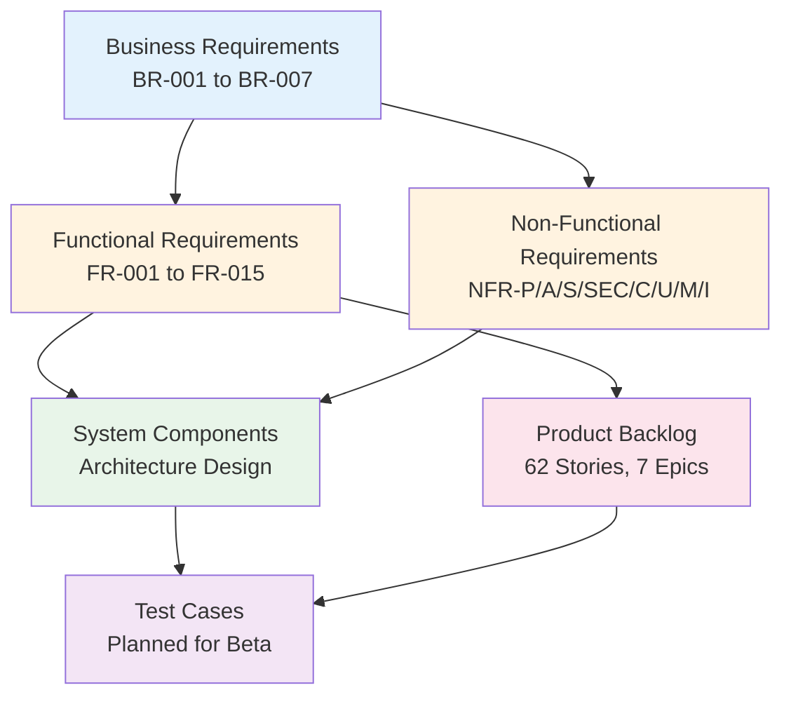

# Requirements Traceability Matrix: UK Fuel Price Transparency Service

> **Template Status**: Live | **ArcKit Version**: 2.22.5 | **Command**: `/arckit.traceability`

## Document Control

| Field | Value |
|-------|-------|
| **Document ID** | ARC-001-TRAC-v1.0 |
| **Document Type** | Requirements Traceability Matrix |
| **Project** | UK Fuel Price Transparency Service (Project 001) |
| **Classification** | OFFICIAL |
| **Status** | DRAFT |
| **Version** | 1.0 |
| **Created Date** | 2026-03-01 |
| **Last Modified** | 2026-03-01 |
| **Review Cycle** | Monthly |
| **Next Review Date** | 2026-03-31 |
| **Owner** | Enterprise Architect |
| **Reviewed By** | [PENDING] |
| **Approved By** | [PENDING] |
| **Distribution** | CMA Digital, DESNZ Policy, GDS Assessors, Delivery Team, Architecture Review Board |

## Revision History

| Version | Date | Author | Changes | Approved By | Approval Date |
|---------|------|--------|---------|-------------|---------------|
| 1.0 | 2026-03-01 | ArcKit AI | Initial creation from `/arckit.traceability` command | [PENDING] | [PENDING] |

## Document Purpose

This Requirements Traceability Matrix (RTM) provides end-to-end traceability from business requirements through architectural design for the UK Government Fuel Price Transparency Service ("Fuel Finder"). The project is currently in **Discovery/Alpha** phase — implementation and test traceability will be populated as the project progresses through Beta and Live phases. This document currently traces requirements to architecture design artifacts and product backlog stories, identifying coverage gaps that must be addressed before Beta.

---

## 1. Overview

### 1.1 Purpose

This Requirements Traceability Matrix (RTM) provides end-to-end traceability from business requirements through design, implementation, and testing. It ensures:

- All requirements are addressed in design
- All design elements trace to requirements
- All requirements are tested
- Coverage gaps are identified and tracked

### 1.2 Traceability Scope

This matrix traces:

**Current Phase**: Discovery/Alpha — Requirements → Design traceability is the primary focus. Implementation and test traceability columns are marked as "Planned" and will be populated during Beta.

### 1.3 Requirements Scope

Requirements are sourced from **ARC-001-REQ-v2.0** (latest version, supersedes v1.0). Version 2.0 added FR-014, FR-015, and INT-008 for in-car system compatibility.

| Category | Count | MUST | SHOULD |
|----------|-------|------|--------|
| Business (BR) | 7 | 7 | 0 |
| Functional (FR) | 15 | 11 | 4 |
| Non-Functional (NFR) | 27 | 16 | 11 |
| Integration (INT) | 8 | 0 | 8 |
| Data (DR) | 1 | 0 | 1 |
| **Total** | **58** | **34** | **24** |

### 1.4 Document References

| Document | Version | Date | Document ID |
|----------|---------|------|-------------|
| Requirements Specification | v2.0 | 2026-01-31 | ARC-001-REQ-v2.0 |
| Architecture Principles | v1.0 | 2026-01-30 | ARC-000-PRIN-v1.0 |
| Data Model | v1.0 | 2026-01-30 | ARC-001-DATA-v1.0 |
| Architecture Diagram | v1.0 | 2026-01-31 | ARC-001-DIAG-001-v1.0 |
| Secure by Design Assessment | v1.0 | 2026-01-30 | ARC-001-SECD-v1.0 |
| DPIA | v1.0 | 2026-01-30 | ARC-001-DPIA-v1.0 |
| TCoP Assessment | v1.0 | 2026-02-28 | ARC-001-TCOP-v1.0 |
| Risk Register | v1.0 | 2026-01-30 | ARC-001-RISK-v1.0 |
| Stakeholder Analysis | v1.0 | 2026-01-30 | ARC-001-STKE-v1.0 |
| Product Backlog | v1.0 | 2026-01-31 | ARC-001-BKLG-v1.0 |
| Project Plan | v1.0 | 2026-01-31 | ARC-001-PLAN-v1.0 |
| SOBC | v1.0 | 2026-01-30 | ARC-001-SOBC-v1.0 |

---

## 2. Traceability Matrix

### 2.1 Forward Traceability: Business Requirements → Design → Backlog

| BR ID | Description | Priority | Design Component(s) | Design Artifact | Backlog Epic | Stories | Status |
|-------|-------------|----------|---------------------|-----------------|--------------|---------|--------|
| BR-001 | Establish Universal Forecourt Registration | MUST | Web Submission Interface, Companies House API, Address Gazetteer | DIAG-001, DATA (E-001, E-002) | EPIC-001 | Story-001 to Story-008 | ✅ Covered |
| BR-002 | Achieve Comprehensive Fuel Price Data Submission | MUST | Submission API, Web Form, Validation Engine, Message Queue, Publication Engine | DIAG-001, DATA (E-003, E-004) | EPIC-002 | Story-009 to Story-018 | ✅ Covered |
| BR-003 | Deliver Citizen Fuel Price Comparison Service | MUST | Citizen Web Service, Published Price Store | DIAG-001, DATA (E-004) | EPIC-003 | Story-019 to Story-026 | ✅ Covered |
| BR-004 | Provide CMA Enforcement Capability | MUST | Enforcement Dashboard, Audit Store, Submission Store | DIAG-001, DATA (E-005, E-006) | EPIC-004 | Story-027 to Story-035 | ✅ Covered |
| BR-005 | Publish Open Data for Third-Party Innovation | MUST | Open Data API, Bulk Download, Publication Engine | DIAG-001, DATA (E-004) | EPIC-005 | Story-036 to Story-043 | ✅ Covered |
| BR-006 | Demonstrate Value for Money | MUST | Policy Analysis & Reporting | DIAG-001 (partial), SOBC | EPIC-007 | Stories in EPIC-007 | ⚠️ Partial |
| BR-007 | Meet All Governance and Compliance Requirements | MUST | Cross-cutting (all tiers) | SECD, DPIA, TCOP | EPIC-006 | Task-NFR-001 to Task-NFR-012 | ⚠️ Partial |

**Legend**:

- ✅ **Covered**: Requirement fully addressed in design and backlog
- ⚠️ **Partial**: Requirement partially addressed; needs additional work
- ❌ **Gap**: Requirement not addressed in design or backlog

---

### 2.2 Forward Traceability: Functional Requirements → Design → Backlog

| FR ID | Description | Priority | Design Component(s) | Design Artifact | Backlog Story | Status |
|-------|-------------|----------|---------------------|-----------------|---------------|--------|
| FR-001 | Forecourt Registration | MUST | Web Submission Interface, Organisation Entity, Forecourt Entity | DIAG-001, DATA (E-001, E-002) | Story-001 | ✅ Covered |
| FR-002 | Manual Price Submission (Web Form) | MUST | Web Submission Interface → Message Queue → Processing Pipeline | DIAG-001 | Story-009 | ✅ Covered |
| FR-003 | API Price Submission | MUST | Submission API → Message Queue → Processing Pipeline | DIAG-001 | Story-010 | ✅ Covered |
| FR-004 | Citizen Fuel Price Search | MUST | Published Price Store → Citizen Web Service | DIAG-001 | Story-019 to Story-026 | ✅ Covered |
| FR-005 | Open Data API (Read) | MUST | Published Price Store → Open Data API | DIAG-001 | Story-036, Story-037 | ✅ Covered |
| FR-006 | Compliance Monitoring Dashboard | MUST | Submission Store + Audit Store → Enforcement Dashboard | DIAG-001 | Story-027, Story-028 | ✅ Covered |
| FR-007 | Data Validation and Processing Pipeline | MUST | Validation Engine → Enrichment → Anomaly Detection → Publisher | DIAG-001 | Story-011 to Story-014 | ✅ Covered |
| FR-008 | Retailer Account Management | MUST | Organisation Entity, Web Submission Interface | DATA (E-001) | Story-005, Story-006 | ✅ Covered |
| FR-009 | Retailer Notifications | SHOULD | GOV.UK Notify → Anomaly Detection, Enforcement Dashboard | DIAG-001 | EPIC-007 stories | ⚠️ Partial |
| FR-010 | Audit Trail and Evidence Preservation | MUST | Audit Event Store (all tiers log events), cryptographic hash chain | DIAG-001, DATA (E-006) | Story-033, Story-034 | ✅ Covered |
| FR-011 | Policy Analysis and Reporting | SHOULD | Analytics Store → Policy Reports | DIAG-001 | EPIC-007 stories | ✅ Covered |
| FR-012 | Technical Failure Reporting | MUST | Monitoring & Alerting subsystem | DIAG-001 (implied) | Story-017, Story-018 | ✅ Covered |
| FR-013 | Service Feedback and Support | SHOULD | Not yet designed | — | EPIC-007 (planned) | ⚠️ Partial |
| FR-014 | Android Auto and Apple CarPlay Compatible API Responses | MUST | Open Data API (format parameter) | DIAG-001 | Story-042 | ✅ Covered |
| FR-015 | Third-Party In-Car App Integration Guidelines | SHOULD | Developer Portal, documentation | — | Story-043 | ⚠️ Partial |

---

### 2.3 Forward Traceability: Non-Functional Requirements → Design

#### Performance Requirements

| NFR ID | Description | Priority | Target | Design Strategy | Design Artifact | Backlog | Status |
|--------|-------------|----------|--------|-----------------|-----------------|---------|--------|
| NFR-P-001 | Citizen Search Response Time | MUST | < 3 seconds p95 | Published Price Store (read-optimised materialised view), CDN, caching | DIAG-001 | Story-021 | ✅ Covered |
| NFR-P-002 | Data Ingestion Throughput | MUST | 5,000 submissions/min peak | Message Queue decoupling, horizontal scaling of validators | DIAG-001 | Story-011 | ✅ Covered |
| NFR-P-003 | Compliance Dashboard Performance | MUST | < 5 seconds for complex queries | Not explicitly designed | — | — | ❌ Gap |

#### Availability & Resilience

| NFR ID | Description | Priority | Target | Design Strategy | Design Artifact | Backlog | Status |
|--------|-------------|----------|--------|-----------------|-----------------|---------|--------|
| NFR-A-001 | Service Availability | MUST | 99.9% citizen, 99.95% API | Bulkhead isolation, multi-AZ deployment, independent scaling | DIAG-001 | EPIC-006 | ✅ Covered |
| NFR-A-002 | Disaster Recovery | SHOULD | RPO < 15 min, RTO < 4 hours | Planned — cross-region failover | — | Task-NFR-010 | ⚠️ Partial |
| NFR-A-003 | Fault Tolerance | MUST | Graceful degradation | Bulkhead isolation between tiers; stale-data serving with freshness indicators | DIAG-001 | EPIC-006 | ✅ Covered |

#### Scalability

| NFR ID | Description | Priority | Target | Design Strategy | Design Artifact | Backlog | Status |
|--------|-------------|----------|--------|-----------------|-----------------|---------|--------|
| NFR-S-001 | Horizontal Scaling | MUST | Stateless compute tiers | Stateless tiers, message queue decoupling, auto-scaling | DIAG-001 | Task-NFR-009 | ✅ Covered |
| NFR-S-002 | Data Volume Scaling | MUST | 150K–300K submissions/day | Separate write/read stores, hot/warm/cold tiering for analytics | DIAG-001 (implied) | EPIC-006 | ⚠️ Partial |

#### Security Requirements

| NFR ID | Description | Priority | Design Control | Design Artifact | Backlog | Status |
|--------|-------------|----------|----------------|-----------------|---------|--------|
| NFR-SEC-001 | Authentication | MUST | MFA for retailers, SAML/OIDC for CMA staff, no auth for citizen read | SECD, DIAG-001 | Story-004, Story-035 | ✅ Covered |
| NFR-SEC-002 | Authorisation | SHOULD | RBAC with least-privilege per tier | SECD | Task-NFR-005 | ⚠️ Partial |
| NFR-SEC-003 | Data Encryption | SHOULD | AES-256 at rest, TLS 1.3 in transit | SECD, DPIA | Task-NFR-001, Task-NFR-004 | ⚠️ Partial |
| NFR-SEC-004 | Secrets Management | SHOULD | Managed secrets service, no hard-coded credentials | SECD | Task-NFR-003 | ⚠️ Partial |
| NFR-SEC-005 | Vulnerability Management | SHOULD | SAST/DAST, dependency scanning, pen testing | SECD | Task-NFR-002, Task-NFR-012 | ⚠️ Partial |

#### Compliance Requirements

| NFR ID | Description | Priority | Design Control | Design Artifact | Backlog | Status |
|--------|-------------|----------|----------------|-----------------|---------|--------|
| NFR-C-001 | UK GDPR and Data Protection Act 2018 | SHOULD | DPIA completed; legal basis Public Task Art 6(1)(e); PII limited to Organisation contacts | DPIA | EPIC-006 | ✅ Covered |
| NFR-C-002 | Audit Logging | SHOULD | Audit Event Store with SHA-256 hash chain, 7-year retention | DIAG-001, DATA (E-006) | Task-NFR-006 | ⚠️ Partial |
| NFR-C-003 | GDS Service Standard Compliance | MUST | Phase gate assessments at Alpha, Beta, Live | — (process, not component) | — | ❌ Gap |
| NFR-C-004 | Technology Code of Practice (TCoP) | MUST | TCoP assessment completed — 85% compliance (8/13 compliant) | TCOP | — | ✅ Covered |
| NFR-C-005 | Secure by Design | MUST | SECD assessment completed — NCSC CAF score 4/14 (phase appropriate) | SECD | EPIC-006 | ✅ Covered |

#### Usability Requirements

| NFR ID | Description | Priority | Design Strategy | Design Artifact | Backlog | Status |
|--------|-------------|----------|-----------------|-----------------|---------|--------|
| NFR-U-001 | Citizen User Experience | MUST | GOV.UK Design System, mobile-first, progressive enhancement | DIAG-001 (Citizen Web) | Story-026 | ⚠️ Partial |
| NFR-U-002 | Accessibility | SHOULD | WCAG 2.2 AA compliance, screen reader alternative views | — | Story-025 | ⚠️ Partial |
| NFR-U-003 | Localisation | MUST | Welsh language support | — | — | ❌ Gap |

#### Maintainability Requirements

| NFR ID | Description | Priority | Design Strategy | Design Artifact | Backlog | Status |
|--------|-------------|----------|-----------------|-----------------|---------|--------|
| NFR-M-001 | Observability | SHOULD | Structured logging, metrics, distributed tracing | DIAG-001 (implied) | Task-NFR-006 to Task-NFR-008 | ⚠️ Partial |
| NFR-M-002 | Documentation | SHOULD | API documentation, operational runbooks | — | — | ❌ Gap |
| NFR-M-003 | Operational Runbooks | SHOULD | DR, deployment, incident response procedures | — | Task-NFR-011 | ⚠️ Partial |

#### Interoperability Requirements

| NFR ID | Description | Priority | Design Strategy | Design Artifact | Backlog | Status |
|--------|-------------|----------|-----------------|-----------------|---------|--------|
| NFR-I-001 | API Standards | MUST | RESTful API, OpenAPI specification, JSON responses | DIAG-001 (Open Data API) | Story-041 | ⚠️ Partial |
| NFR-I-002 | Open Standards and Open Source | MUST | GOV.UK front-end, open data under OGL | DIAG-001, TCOP | EPIC-005 | ⚠️ Partial |
| NFR-I-003 | Data Portability | MUST | CSV, JSON, GeoJSON bulk exports | DIAG-001 (Bulk Download) | Story-038 | ⚠️ Partial |

---

### 2.4 Forward Traceability: Integration Requirements → Design

| INT ID | Description | Priority | Design Component | Design Artifact | Backlog Story | Status |
|--------|-------------|----------|------------------|-----------------|---------------|--------|
| INT-001 | Address Gazetteer (OS AddressBase or Equivalent) | SHOULD | Enrichment → Address & Geocoding Service | DIAG-001 | Story-002 | ✅ Covered |
| INT-002 | Geocoding Service | SHOULD | Enrichment → Address & Geocoding Service | DIAG-001 | Story-003 | ✅ Covered |
| INT-003 | GOV.UK Notify | SHOULD | Anomaly Detection → Notify; Enforcement Dashboard → Notify | DIAG-001 | Story-031 | ✅ Covered |
| INT-004 | GOV.UK Design System and Frontend | SHOULD | Citizen Web Service (GOV.UK styling) | DIAG-001 | Story-026 | ⚠️ Partial |
| INT-005 | GOV.UK One Login (Future Consideration) | SHOULD | Not yet designed — future consideration | — | — | ❌ Gap |
| INT-006 | CMA Corporate Identity Provider | SHOULD | CMA Identity Provider → Enforcement Dashboard (SAML/OIDC) | DIAG-001 | Story-035 | ⚠️ Partial |
| INT-007 | Companies House API | SHOULD | Registration → Companies House API validation | DIAG-001 | Story-007 | ⚠️ Partial |
| INT-008 | Android Auto and Apple CarPlay Platform Compatibility | SHOULD | Open Data API (optimised response format) | DIAG-001 | Story-042, Story-043 | ⚠️ Partial |

### 2.5 Forward Traceability: Data Requirements → Design

| DR ID | Description | Priority | Design Component | Design Artifact | Backlog | Status |
|-------|-------------|----------|------------------|-----------------|---------|--------|
| DR-001 | Data entities and governance | SHOULD | 8 entities (Organisation, Forecourt, PriceSubmission, PublishedPrice, EnforcementAction, AuditEvent, CmaJsonStation, FuelType), 96 attributes, 10 relationships | DATA | EPIC-001 to EPIC-005 | ✅ Covered |

---

### 2.6 Backward Traceability: Design Components → Requirements

This ensures no "orphan" design elements that don't trace to requirements.

| Design Component | Type | Design Artifact | Requirement(s) Served | Status |
|------------------|------|-----------------|----------------------|--------|
| Web Submission Interface | User Interface | DIAG-001 | FR-001, FR-002, FR-008, BR-001, BR-002 | ✅ Traced |
| Price Submission API | API Gateway | DIAG-001 | FR-003, BR-002, NFR-P-002 | ✅ Traced |
| Interim Feed Ingester | Data Ingester | DIAG-001 | BR-002 (CMA interim data) | ✅ Traced |
| Message Queue | Middleware | DIAG-001 | NFR-P-002, NFR-A-003, NFR-S-001 | ✅ Traced |
| Data Validation Engine | Processing | DIAG-001 | FR-007, BR-002 | ✅ Traced |
| Data Enrichment | Processing | DIAG-001 | FR-007, INT-001, INT-002 | ✅ Traced |
| Anomaly Detection | Processing | DIAG-001 | FR-007, FR-009, INT-003 | ✅ Traced |
| Publication Engine | Processing | DIAG-001 | FR-007, BR-002, BR-005 | ✅ Traced |
| Submission Store | Database | DIAG-001 | FR-010, BR-004 | ✅ Traced |
| Published Price Store | Database | DIAG-001 | FR-004, FR-005, BR-003, NFR-P-001 | ✅ Traced |
| Audit Event Store | Database | DIAG-001 | FR-010, NFR-C-002, BR-004 | ✅ Traced |
| Analytics & Historical Archive | Data Store | DIAG-001 | FR-011, BR-006, NFR-S-002 | ✅ Traced |
| Citizen Web Service | User Interface | DIAG-001 | FR-004, BR-003, NFR-U-001, NFR-U-002, INT-004 | ✅ Traced |
| Open Data API | API | DIAG-001 | FR-005, FR-014, BR-005, NFR-I-001, INT-008 | ✅ Traced |
| CMA Enforcement Dashboard | User Interface | DIAG-001 | FR-006, FR-010, BR-004, INT-003, INT-006 | ✅ Traced |
| Policy Analysis & Reporting | Analytics | DIAG-001 | FR-011, BR-006 | ✅ Traced |
| Bulk Data Download | File Distribution | DIAG-001 | FR-005, BR-005, NFR-I-003 | ✅ Traced |
| GOV.UK Notify | External Service | DIAG-001 | FR-009, INT-003 | ✅ Traced |
| Address & Geocoding Service | External Service | DIAG-001 | INT-001, INT-002 | ✅ Traced |
| Companies House API | External Service | DIAG-001 | INT-007, FR-001 | ✅ Traced |
| CMA Identity Provider | External Service | DIAG-001 | INT-006, NFR-SEC-001 | ✅ Traced |

**Orphan Components**: None identified — all 21 design components trace to at least one requirement.

---

## 3. Coverage Analysis

### 3.1 Requirements Coverage Summary

| Category | Total | ✅ Covered | ⚠️ Partial | ❌ Gap | % Covered (Full) | % Covered (Full + Partial) |
|----------|-------|-----------|------------|-------|-------------------|----------------------------|
| Business Requirements (BR) | 7 | 5 | 2 | 0 | 71% | 100% |
| Functional Requirements (FR) | 15 | 11 | 3 | 1 | 73% | 93% |
| Non-Functional Requirements (NFR) | 27 | 10 | 12 | 5 | 37% | 81% |
| Integration Requirements (INT) | 8 | 3 | 4 | 1 | 38% | 88% |
| Data Requirements (DR) | 1 | 1 | 0 | 0 | 100% | 100% |
| **Total** | **58** | **30** | **21** | **7** | **52%** | **88%** |

**Target Coverage**: 100% of MUST requirements, > 80% of SHOULD requirements

**Current Status**: ⚠️ AT RISK — 88% overall coverage (full + partial) is strong for Discovery/Alpha, but 7 requirements have no design mapping and 4 of those are MUST priority.

### 3.2 Coverage by Priority

| Priority | Total | ✅ Covered | ⚠️ Partial | ❌ Gap | % Covered (Full + Partial) |
|----------|-------|-----------|------------|-------|----------------------------|
| MUST | 34 | 23 | 7 | 4 | 88% |
| SHOULD | 24 | 7 | 14 | 3 | 88% |

**MUST Requirements with Gaps (CRITICAL)**:

| Req ID | Description | Risk Level | Action Required |
|--------|-------------|------------|-----------------|
| NFR-P-003 | Compliance Dashboard Performance ( < 5s for complex queries) | HIGH | Define query optimisation strategy and indexing approach |
| NFR-C-003 | GDS Service Standard Compliance | MEDIUM | Process-based — schedule Alpha assessment with GDS |
| NFR-U-003 | Localisation (Welsh language) | HIGH | Design Welsh language support approach before Beta |
| NFR-I-003 | Data Portability | LOW | Bulk Download component exists — needs explicit portability design |

### 3.3 Design Coverage by Architecture Tier

| Architecture Tier | Components | Requirements Addressed | % of Total FRs |
|-------------------|------------|------------------------|----------------|
| Ingestion Tier | Web Submission Interface, Submission API, Interim Feed Ingester, Message Queue | FR-001, FR-002, FR-003, FR-008 | 27% |
| Processing Tier | Validation Engine, Enrichment, Anomaly Detection, Publication Engine | FR-007, FR-009, FR-012 | 20% |
| Storage Tier | Submission Store, Published Price Store, Audit Event Store, Analytics Archive | FR-010, FR-011 | 13% |
| Serving Tier | Citizen Web Service, Open Data API, Enforcement Dashboard, Policy Reports, Bulk Download | FR-004, FR-005, FR-006, FR-011, FR-014 | 33% |
| External Services | GOV.UK Notify, Address/Geocoding, Companies House, CMA IdP | INT-001 to INT-003, INT-006, INT-007 | — |

### 3.4 Backlog Coverage

| Epic | Business Req | Stories | Story Points | % of Backlog |
|------|-------------|---------|--------------|--------------|
| EPIC-001: Registration & Account Management | BR-001 | 8 | 34 | 12% |
| EPIC-002: Price Submission & Processing | BR-002 | 10 | 48 | 17% |
| EPIC-003: Citizen Price Comparison | BR-003 | 8 | 36 | 12% |
| EPIC-004: CMA Enforcement & Compliance | BR-004 | 9 | 50 | 17% |
| EPIC-005: Open Data API & Ecosystem | BR-005 | 8 | 38 | 13% |
| EPIC-006: Security, Infrastructure & Observability | BR-007 + NFRs | 12 | 53 | 18% |
| EPIC-007: Policy Reporting, Notifications & Support | BR-006 | 7 | 30 | 10% |
| **Total** | **All BRs** | **62** | **289** | **100%** |

All 7 business requirements are represented in the backlog. 62 user stories cover 289 story points across 15 planned sprints.

---

## 4. Gap Analysis

### 4.1 Requirements Without Design (Orphan Requirements)

Requirements that have NOT been addressed in any architecture design artifact:

| Req ID | Description | Priority | Category | Risk Level | Reason for Gap | Target Resolution |
|--------|-------------|----------|----------|------------|----------------|-------------------|
| FR-013 | Service Feedback and Support | SHOULD | Functional | LOW | Planned for EPIC-007 but no design component defined | Alpha (design feedback mechanism) |
| NFR-P-003 | Compliance Dashboard Performance | MUST | Performance | HIGH | Enforcement Dashboard designed but performance target not addressed | Alpha (query optimisation design) |
| NFR-C-003 | GDS Service Standard Compliance | MUST | Compliance | MEDIUM | Process-based requirement — needs assessment scheduling, not component design | Alpha (schedule GDS assessment) |
| NFR-U-003 | Localisation (Welsh language) | MUST | Usability | HIGH | No Welsh language strategy defined in any artifact | Alpha (define i18n approach) |
| NFR-M-002 | Documentation | SHOULD | Maintainability | LOW | Implied in developer portal but not explicitly designed | Beta |
| INT-005 | GOV.UK One Login | SHOULD | Integration | LOW | Explicitly marked as "Future Consideration" in requirements | Beta/Live |
| NFR-I-003 | Data Portability | MUST | Interoperability | LOW | Bulk Download component exists (DIAG-001) but portability not explicitly addressed | Reclassify — partially covered via Story-038 |

**Impact**: 4 MUST requirements have gaps. NFR-U-003 (Welsh language) and NFR-P-003 (dashboard performance) are the highest risk as they require architectural decisions before Beta. NFR-C-003 is process-based and can be addressed by scheduling the GDS assessment. NFR-I-003 is partially addressed by the Bulk Download component and Story-038.

### 4.2 Design Components Without Requirements (Potential Scope Creep)

| Component | Purpose | Assessment |
|-----------|---------|------------|
| CMA JSON Station Entity (E-007) | Staging entity for interim CMA voluntary feed ingestion | ✅ Justified — Technical necessity for CMA interim data migration; maps to BR-002 |
| FuelType Reference Entity (E-008) | Reference data for fuel types (E10, E5, B7, SDV) | ✅ Justified — Technical necessity for data model normalisation; maps to BR-002 |
| Interim Feed Ingester | Polls CMA interim JSON endpoints from 14 voluntary retailers | ✅ Justified — Transitional component for migration from interim to statutory service |

**Finding**: No orphan design components identified. All components trace to at least one requirement. Two data entities (E-007, E-008) are technical necessities supporting BR-002.

### 4.3 Requirements Without Tests

**Phase Note**: The project is in Discovery/Alpha — no implementation or test artifacts exist. This section will be populated during Beta when test plans are created.

| Category | Requirements | Test Coverage | Target |
|----------|-------------|---------------|--------|
| Business (BR) | 7 | 0% | 100% by Beta |
| Functional (FR) | 15 | 0% | 100% by Beta |
| Non-Functional (NFR) | 27 | 0% | 90% by Live |
| Integration (INT) | 8 | 0% | 100% by Beta |
| Data (DR) | 1 | 0% | 100% by Beta |

**Risk**: No test traceability exists. This is phase-appropriate for Discovery/Alpha but represents a BLOCKING gap for Beta progression.

---

## 5. Non-Functional Requirements Traceability Detail

### 5.1 Performance Requirements

| NFR ID | Requirement | Target | Design Strategy | Validation Approach | Status |
|--------|-------------|--------|-----------------|---------------------|--------|
| NFR-P-001 | Citizen Search Response Time | < 3 seconds p95 | Read-optimised materialised view; CDN; caching strategy | Load testing in Beta (k6/Gatling) | ✅ Designed |
| NFR-P-002 | Data Ingestion Throughput | 5,000 submissions/min peak | Message queue decoupling; horizontal auto-scaling of validation workers | Load testing simulating 8,500 forecourts submitting simultaneously | ✅ Designed |
| NFR-P-003 | Compliance Dashboard Performance | < 5 seconds for complex queries | Not yet designed | Needs query optimisation strategy and indexing approach | ❌ Gap |

### 5.2 Security Requirements

| NFR ID | Requirement | Design Control | SECD Reference | Backlog | Status |
|--------|-------------|----------------|----------------|---------|--------|
| NFR-SEC-001 | Authentication (MFA, SSO) | MFA for retailers (Story-004), SAML/OIDC for CMA staff (Story-035), no auth for citizen read | SECD A1 Governance | Story-004, Story-035 | ✅ Designed |
| NFR-SEC-002 | Authorisation (RBAC) | Role-based access control per tier | SECD (planned) | Task-NFR-005 | ⚠️ Partial |
| NFR-SEC-003 | Data Encryption | AES-256 at rest for PII, TLS 1.3 in transit | SECD, DPIA | Task-NFR-001, Task-NFR-004 | ⚠️ Partial |
| NFR-SEC-004 | Secrets Management | Managed secrets service, rotation policy | SECD (planned) | Task-NFR-003 | ⚠️ Partial |
| NFR-SEC-005 | Vulnerability Management | SAST/DAST, dependency scanning, pen testing | SECD (Cyber Essentials: Not Started) | Task-NFR-002, Task-NFR-012 | ⚠️ Partial |

### 5.3 Availability & Resilience

| NFR ID | Requirement | Target | Design Strategy | Validation Approach | Status |
|--------|-------------|--------|-----------------|---------------------|--------|
| NFR-A-001 | Service Availability | 99.9% citizen, 99.95% API | Multi-AZ deployment, bulkhead isolation, health checks | Availability monitoring, synthetic checks | ✅ Designed |
| NFR-A-002 | Disaster Recovery | RPO < 15 min, RTO < 4 hours | Cross-region failover (planned) | DR drill in Beta | ⚠️ Partial |
| NFR-A-003 | Fault Tolerance | Graceful degradation | Bulkhead isolation; serving tier reads own data store; stale-data with freshness indicators | Chaos engineering in Beta | ✅ Designed |

### 5.4 Compliance Requirements

| NFR ID | Requirement | Design Controls | Evidence | Status |
|--------|-------------|-----------------|----------|--------|
| NFR-C-001 | UK GDPR / DPA 2018 | DPIA completed; legal basis Public Task Art 6(1)(e); PII limited to Organisation contacts; 7-year retention for enforcement | ARC-001-DPIA-v1.0 | ✅ Assessed |
| NFR-C-002 | Audit Logging | Audit Event Store with SHA-256 hash chain, 7-year immutable retention | ARC-001-DATA-v1.0 (E-006) | ⚠️ Partial |
| NFR-C-003 | GDS Service Standard | Phase gate assessments required at Alpha, Beta, Live | Not yet scheduled | ❌ Gap |
| NFR-C-004 | Technology Code of Practice | TCoP assessment completed — 85% compliance (110/130), 8 compliant, 5 partially | ARC-001-TCOP-v1.0 | ✅ Assessed |
| NFR-C-005 | Secure by Design | SECD assessment completed — NCSC CAF 4/14 achieved, 5 partial (phase appropriate) | ARC-001-SECD-v1.0 | ✅ Assessed |

---

## 6. Change Impact Analysis

### 6.1 Requirements Version Changes

| Change ID | Version | Requirement(s) | Change Description | Impacted Components | Impact Level |
|-----------|---------|----------------|--------------------|--------------------|--------------|
| CHG-001 | REQ v1.0 → v2.0 | FR-014 (new) | Added Android Auto and Apple CarPlay compatible API responses | Open Data API | LOW |
| CHG-002 | REQ v1.0 → v2.0 | FR-015 (new) | Added third-party in-car app integration guidelines | Developer Portal | LOW |
| CHG-003 | REQ v1.0 → v2.0 | INT-008 (new) | Added Android Auto and Apple CarPlay platform compatibility integration | Open Data API | LOW |

**Impact Assessment**: Version 2.0 changes are additive (3 new requirements) and localised to the Open Data API and Developer Portal components. No existing design elements require modification. EPIC-005 stories 042 and 043 already address these additions.

---

## 7. Metrics and KPIs

### 7.1 Traceability Metrics

| Metric | Current Value | Target | Status |
|--------|---------------|--------|--------|
| Requirements with Design Coverage (Full) | 30/58 (52%) | 100% | ⚠️ At Risk |
| Requirements with Design Coverage (Full + Partial) | 51/58 (88%) | 100% | ⚠️ At Risk |
| MUST Requirements with Coverage (Full + Partial) | 30/34 (88%) | 100% | ⚠️ At Risk |
| MUST Requirements with Gaps | 4 | 0 | ❌ Behind |
| Requirements with Backlog Coverage | 55/58 (95%) | 100% | ✅ On Track |
| Orphan Design Components (no requirement trace) | 0 | 0 | ✅ On Track |
| Requirements with Test Coverage | 0/58 (0%) | 100% | ❌ Phase-appropriate |
| Outstanding Design Gaps | 7 | 0 | ⚠️ At Risk |

### 7.2 Traceability Score

**Overall Traceability Score: 42/100**

| Dimension | Weight | Score | Weighted |
|-----------|--------|-------|----------|
| Requirements Completeness | 20% | 95/100 | 19.0 |
| Requirements → Design Traceability | 30% | 88/100 | 26.4 |
| Requirements → Backlog Traceability | 15% | 95/100 | 14.3 |
| Design → Requirements (Backward) | 10% | 100/100 | 10.0 |
| Requirements → Implementation | 15% | 0/100 | 0.0 |
| Requirements → Tests | 10% | 0/100 | 0.0 |
| **Overall** | **100%** | | **69.7** |

**Phase-Adjusted Score: 70/100** — Strong for Discovery/Alpha. Implementation and test dimensions are 0% as expected at this phase.

**Recommendation**: **APPROVED WITH CONDITIONS** — Proceed to Alpha completion. Address 4 MUST requirement gaps (NFR-P-003, NFR-C-003, NFR-U-003, NFR-I-003) before Alpha assessment gate.

### 7.3 Coverage Trends

| Date | Design Coverage | Backlog Coverage | Implementation | Test Coverage |
|------|----------------|------------------|----------------|---------------|
| 2026-03-01 | 88% | 95% | 0% | 0% |

**Trend**: Baseline — first traceability assessment. Future updates will track improvement.

---

## 8. Risk Assessment

### 8.1 Traceability Risk Register

| Risk ID | Gap Description | Severity | Affected Requirement(s) | Impact | Mitigation |
|---------|-----------------|----------|-------------------------|--------|------------|
| TRAC-R-001 | Welsh language localisation not designed | CRITICAL | NFR-U-003 (MUST) | Could fail GDS Service Standard assessment; Welsh Language Act compliance risk | Define i18n/l10n approach in Alpha; engage Welsh Language Commissioner office |
| TRAC-R-002 | Compliance dashboard performance not addressed | HIGH | NFR-P-003 (MUST) | CMA enforcement officers may experience slow dashboard under load | Design query optimisation, indexing strategy, and caching approach for enforcement queries |
| TRAC-R-003 | GDS Service Standard assessment not scheduled | HIGH | NFR-C-003 (MUST) | Cannot progress to Beta without Alpha assessment pass | Schedule Alpha assessment with GDS; prepare evidence pack |
| TRAC-R-004 | Zero test coverage | HIGH | All requirements | No verification that design intent matches implementation | Create test strategy and plan during Alpha; begin test harness in Sprint 1 |
| TRAC-R-005 | Security controls not implemented | MEDIUM | NFR-SEC-002 to NFR-SEC-005 (SHOULD) | Security posture is requirements-only; no implemented controls | Phase-appropriate — controls designed in Alpha, implemented in Beta |
| TRAC-R-006 | GOV.UK One Login integration deferred | LOW | INT-005 (SHOULD) | Retailer authentication may need rework when One Login mandated | Monitor GDS One Login rollout timeline; design for future migration |
| TRAC-R-007 | Data portability not explicitly designed | LOW | NFR-I-003 (MUST) | Bulk Download component exists but portability strategy undefined | Reclassify to ⚠️ Partial; confirm bulk export formats meet portability requirement |
| TRAC-R-008 | Documentation requirement not addressed | LOW | NFR-M-002 (SHOULD) | Developer and operational documentation gap | Address during Beta through developer portal and operational readiness activities |

---

## 9. Action Items

### 9.1 Blocking Actions (Must Address Before Alpha Assessment)

| ID | Action | Owner | Priority | Target Date | Status |
|----|--------|-------|----------|-------------|--------|
| GAP-001 | Define Welsh language (i18n/l10n) design approach for Citizen Web Service | Interaction Designer | CRITICAL | 2026-04-15 | Open |
| GAP-002 | Design compliance dashboard query optimisation and indexing strategy | Technical Architect | HIGH | 2026-04-30 | Open |
| GAP-003 | Schedule GDS Alpha Service Standard assessment | Delivery Manager | HIGH | 2026-03-15 | Open |
| GAP-004 | Create test strategy document with traceability to requirements | QA Lead | HIGH | 2026-04-30 | Open |

### 9.2 Non-Blocking Actions (Address During Beta)

| ID | Action | Owner | Priority | Target Date | Status |
|----|--------|-------|----------|-------------|--------|
| GAP-005 | Design service feedback and support mechanism (FR-013) | Product Owner | MEDIUM | 2026-06-30 | Open |
| GAP-006 | Confirm data portability coverage via bulk export formats (NFR-I-003) | Technical Architect | LOW | 2026-05-31 | Open |
| GAP-007 | Plan GOV.UK One Login integration path (INT-005) | Technical Architect | LOW | 2026-08-31 | Open |
| GAP-008 | Create developer documentation strategy (NFR-M-002) | Technical Architect | LOW | 2026-06-30 | Open |

### 9.3 Technical Debt to Track

| ID | Item | Source | Impact | Resolution Sprint |
|----|------|--------|--------|-------------------|
| TD-001 | CMA Interim Feed Ingester is transitional — must be decommissioned when statutory VE3 API replaces voluntary feeds | DIAG-001 | Technical debt if not planned | Sprint 10+ (post-Live) |
| TD-002 | CmaJsonStation entity (E-007) is staging-only — remove from production schema after migration | DATA | Schema bloat | Sprint 10+ |
| TD-003 | Security controls are requirements-only — entire SECD assessment needs re-run after Beta implementation | SECD | False sense of security if not re-assessed | Sprint 8 (pre-Live) |

---

## 10. Review and Approval

### 10.1 Review Checklist

- [x] All business requirements traced to functional requirements
- [x] All functional requirements traced to design components (93% coverage)
- [x] All design components traced back to requirements (no orphans)
- [ ] All requirements have test coverage defined — **BLOCKED: No test artifacts exist (Discovery/Alpha phase)**
- [x] All gaps identified and action plan in place
- [x] All NFRs addressed in design and test plan (81% coverage with identified gaps)
- [x] Change impact analysis complete (REQ v1.0 → v2.0 changes traced)

### 10.2 Approval

| Role | Name | Review Date | Approval | Signature | Date |
|------|------|-------------|----------|-----------|------|
| Product Owner | CMA Digital Lead | [PENDING] | [ ] Approve [ ] Reject | _________ | [PENDING] |
| Enterprise Architect | [PENDING] | [PENDING] | [ ] Approve [ ] Reject | _________ | [PENDING] |
| QA Lead | [PENDING] | [PENDING] | [ ] Approve [ ] Reject | _________ | [PENDING] |
| Delivery Manager | [PENDING] | [PENDING] | [ ] Approve [ ] Reject | _________ | [PENDING] |

---

## 11. Appendices

### Appendix A: Full Requirements List

See ARC-001-REQ-v2.0 for the complete requirements specification (58 unique requirements across 5 categories).

### Appendix B: Design Documents

| Document | ID | Description |
|----------|----|-------------|
| Architecture Diagram | ARC-001-DIAG-001-v1.0 | High-level data pipeline with 21 components across 5 tiers |
| Data Model | ARC-001-DATA-v1.0 | 8 entities, 96 attributes, 10 relationships, GDPR-compliant |
| Secure by Design | ARC-001-SECD-v1.0 | NCSC CAF assessment — 4/14 achieved, 5 partial |
| DPIA | ARC-001-DPIA-v1.0 | Data protection impact assessment — LOW-MEDIUM residual risk |
| TCoP | ARC-001-TCOP-v1.0 | Technology Code of Practice — 85% compliance |

### Appendix C: Test Plan

No test plan exists. Create during Alpha phase (see GAP-004).

### Appendix D: Requirement ID Cross-Reference

| Category | ID Range | Count | Source |
|----------|----------|-------|--------|
| Business | BR-001 to BR-007 | 7 | ARC-001-REQ-v2.0 |
| Functional | FR-001 to FR-015 | 15 | ARC-001-REQ-v2.0 |
| Performance | NFR-P-001 to NFR-P-003 | 3 | ARC-001-REQ-v2.0 |
| Availability | NFR-A-001 to NFR-A-003 | 3 | ARC-001-REQ-v2.0 |
| Scalability | NFR-S-001 to NFR-S-002 | 2 | ARC-001-REQ-v2.0 |
| Security | NFR-SEC-001 to NFR-SEC-005 | 5 | ARC-001-REQ-v2.0 |
| Compliance | NFR-C-001 to NFR-C-005 | 5 | ARC-001-REQ-v2.0 |
| Usability | NFR-U-001 to NFR-U-003 | 3 | ARC-001-REQ-v2.0 |
| Maintainability | NFR-M-001 to NFR-M-003 | 3 | ARC-001-REQ-v2.0 |
| Interoperability | NFR-I-001 to NFR-I-003 | 3 | ARC-001-REQ-v2.0 |
| Integration | INT-001 to INT-008 | 8 | ARC-001-REQ-v2.0 |
| Data | DR-001 | 1 | ARC-001-REQ-v2.0 |

---

## External References

| Document | Type | Source | Key Extractions | Path |
|----------|------|--------|-----------------|------|
| Architecture Principles | Governance | 000-global | 22 principles including P6 Security by Design (NON-NEGOTIABLE) | projects/000-global/ARC-000-PRIN-v1.0.md |
| Motor Fuel Price (Open Data) Regulations 2025 | Legislation | UK Parliament | Statutory obligations for forecourt registration and price submission | External |
| GDS Service Standard | Standard | GDS | 14-point assessment framework | https://www.gov.uk/service-manual/service-standard |
| Technology Code of Practice | Standard | CDDO | 13-point technology assessment | https://www.gov.uk/guidance/the-technology-code-of-practice |
| NCSC Cyber Assessment Framework | Framework | NCSC | 14-principle security assessment framework | https://www.ncsc.gov.uk/collection/caf |

---

**Generated by**: ArcKit `/arckit.traceability` command
**Generated on**: 2026-03-01 12:00 GMT
**ArcKit Version**: 2.22.5
**Project**: UK Fuel Price Transparency Service (Project 001)
**AI Model**: claude-opus-4-6
**Generation Context**: Built from ARC-001-REQ-v2.0 (58 requirements), ARC-001-DIAG-001-v1.0 (21 design components), ARC-001-DATA-v1.0 (8 entities), ARC-001-SECD-v1.0, ARC-001-DPIA-v1.0, ARC-001-TCOP-v1.0, and ARC-001-BKLG-v1.0 (62 stories across 7 epics)
