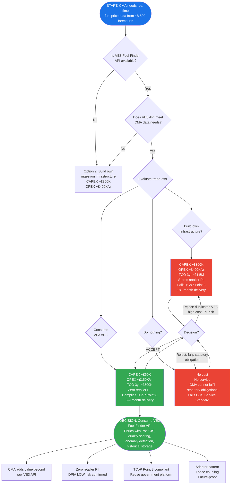

# ARC-001-ADR-001-v1.0 — Consume VE3 Global Fuel Finder API as Primary Data Source

---

## 1. Document Control

| Field | Value |
|---|---|
| **Document ID** | ARC-001-ADR-001-v1.0 |
| **Document Type** | Architecture Decision Record (ADR) |
| **Project** | 001 — UK Fuel Price Transparency Service |
| **Date** | 2026-04-06 |
| **Classification** | OFFICIAL |
| **Status** | Proposed |
| **Escalation** | Department (CMA) |
| **Governance Forum** | CMA Architecture Review Board |
| **Owner** | CMA Digital Lead |
| **Authors** | CMA Architecture Team |
| **Version** | 1.0 |
| **Supersedes** | None (first formal ADR for this decision) |
| **Superseded By** | — |

---

## 2. Revision History

| Version | Date | Author | Change Summary |
|---|---|---|---|
| 1.0 | 2026-04-06 | CMA Architecture Team | Initial formal documentation of decision implicit in requirements evolution v1.0 → v3.0 (Jan–Apr 2026). Closes health check gap on BR-008. |

---

## 3. Decision Title

**Consume VE3 Global Fuel Finder API as Primary Data Source**

---

## 4. Stakeholders

### 4.1 Deciders

| Role | Name / Position | Responsibility |
|---|---|---|
| CMA Senior Responsible Owner (SRO) | CMA SRO | Final decision authority; accountable for delivery |
| CMA Digital Lead | CMA Digital Lead | Architecture and technical governance lead |

### 4.2 Consulted

| Organisation | Role | Consultation Focus |
|---|---|---|
| DESNZ Policy | Policy Owner | Confirmation that VE3 API is the authoritative data source under the 2025 Regulations |
| VE3 Global Ltd | Vendor / Platform Operator | API capabilities, SLA, data model, OAuth 2.0 credentials scope |
| CMA Enforcement Team | Internal Stakeholder | Data adequacy requirements for enforcement use cases |
| CMA SIRO / DPO | Data Governance | GDPR implications of consuming vs. ingesting retailer data |

### 4.3 Informed

| Organisation | Notification Trigger |
|---|---|
| Government Digital Service (GDS) | Service Standard assessment preparation |
| CDDO | Cross-government data sharing; TCoP Point 8 alignment |
| Citizens / Motorists | End users; benefits from faster delivery |

---

## 5. Context and Problem Statement

### 5.1 Background

The Motor Fuel Price (Open Data) Regulations 2025 require UK fuel retailers to publish real-time pricing data for approximately 8,500 forecourts. DESNZ contracted VE3 Global Ltd to operate the **Fuel Finder** platform, which handles:

- Retailer registration via GOV.UK One Login
- Real-time price submission from retailers
- A Public Fuel Stations REST API (`GET /api/v1/pfs`)

The CMA is responsible for enforcing the Regulations and providing a citizen-facing digital service enabling consumers to find and compare fuel prices.

### 5.2 Architectural Question

How should the CMA access real-time fuel price data from ~8,500 UK forecourts?

Two primary approaches were available:

1. **Build own data ingestion infrastructure** — the CMA accepts retailer price submissions directly, managing registration, validation, and storage.
2. **Consume the VE3 Fuel Finder Public API** — the CMA synchronises data from the DESNZ-contracted platform.

This question was first encountered during requirements v1.0 (January 2026) and resolved implicitly during requirements evolution through v2.0 and v3.0 (February–April 2026). This ADR formally documents the decision to close the health check gap identified against requirement **BR-008** (Synchronise and enrich Fuel Finder data), which lacked an explicit ADR trace.

### 5.3 Constraints

| Constraint | Source |
|---|---|
| VE3 Fuel Finder platform already live and mandated by DESNZ contract | DESNZ contractual position |
| GOV.UK One Login used for retailer registration by VE3 | VE3 platform design |
| CMA is a data consumer, not the primary data controller for retailer submissions | Motor Fuel Price (Open Data) Regulations 2025 |
| UK GDPR requires data minimisation; storing retailer PII without justification is prohibited | UK GDPR Article 5(1)(c) |
| GDS Service Standard requires reuse of government platforms where appropriate | GDS Point 3 / TCoP Point 8 |
| DPIA v2.0 (ARC-001-DPIA-v2.0) already completed on this architecture | CMA governance |

---

## 6. Decision Drivers

### 6.1 Technical Drivers

| Driver | Description |
|---|---|
| T1 — Data availability | Real-time price data must be available from ~8,500 forecourts |
| T2 — Integration complexity | CMA team capacity is limited; simpler integration reduces delivery risk |
| T3 — Data quality | Quality scoring and anomaly detection are required regardless of ingestion approach |
| T4 — Geospatial enrichment | PostGIS indexing needed for citizen proximity search; not provided by VE3 API |
| T5 — Historical storage | VE3 API provides current prices only; historical retention requires CMA storage |
| T6 — Authentication | OAuth 2.0 client credentials (`client_id`, `client_secret`, scope `fuelfinder.read`) is an established standard |

### 6.2 Business Drivers

| Driver | Description |
|---|---|
| B1 — Delivery speed | Citizens need the service as soon as possible after the Regulations come into force |
| B2 — Cost efficiency | CMA operates within HM Treasury spending constraints |
| B3 — Reduced operational burden | CMA should not operate retailer helpdesk or registration support |
| B4 — Enforcement capability | CMA needs reliable data for enforcement action under the Regulations |
| B5 — Policy credibility | A visible consumer service demonstrates that the Regulations have effect |

### 6.3 Regulatory and Compliance Drivers

| Driver | Description |
|---|---|
| R1 — UK GDPR Article 5(1)(c) | Data minimisation: store only what is necessary; retailer PII is not necessary for CMA service |
| R2 — GDS Service Standard Point 3 | Reuse tools, technology, and ways of working |
| R3 — TCoP Point 8 | Share and reuse technology across government |
| R4 — Secure by Design | Reduced attack surface by avoiding PII storage |
| R5 — Green Book | Business case must demonstrate value for money |

### 6.4 Principles Alignment

| Principle | Alignment | Notes |
|---|---|---|
| P1 Open Data by Default | SUPPORTS | CMA adds enriched open data API beyond raw VE3 data |
| P2 Citizen-Centred Design | SUPPORTS | Faster delivery means earlier citizen benefit |
| P4 Resilience | PARTIAL | 15-minute cache provides resilience; VE3 dependency introduces single point of failure |
| P5 Interoperability | SUPPORTS | Standard REST/OAuth integration |
| P6 Security by Design | SUPPORTS | Zero PII reduces attack surface and regulatory exposure |
| P8 Data Sovereignty | SUPPORTS | All CMA data stored in AWS eu-west-2 (UK sovereign cloud) |
| P9 Data Quality | PARTIAL | CMA adds quality scoring but cannot control upstream VE3 data quality |
| P10 Single Source of Truth | SUPPORTS | VE3 is canonical source; CMA holds enriched derived copy |
| P11 Loose Coupling | SUPPORTS | Adapter pattern allows future API source swap without downstream impact |
| P13 Reuse Government Platforms | SUPPORTS | Reuses DESNZ-contracted platform (TCoP Point 8 compliance) |
| P21 Privacy by Design | SUPPORTS | Exemplary data minimisation; zero retailer PII |

---

## 7. Considered Options

### 7.1 Option 1 — Consume VE3 Fuel Finder API (CHOSEN)

**Description:** The CMA synchronises data from the VE3 Global Fuel Finder Public API every 15 minutes. CMA enriches the data with PostGIS geospatial indexing, quality scoring, anomaly detection flags, and historical storage. All retailer PII remains with VE3; CMA stores zero retailer personal data.

**Technical Approach:**
- `GET /api/v1/pfs` polled every 15 minutes via scheduled sync pipeline
- OAuth 2.0 client credentials flow with scope `fuelfinder.read`
- CMA ingestion layer: normalise, deduplicate, quality-score, PostGIS-index
- CMA database: FuelStation, FuelPrice, PriceHistory, QualityScore entities (no Organisation/retailer PII)
- Stale data TTL: prices older than 90 minutes flagged as potentially stale

**Wardley Position:** Product — consuming an established vendor platform operated under a DESNZ contract

**GDS Impact:** Straightforward justification for Service Standard; aligns with TCoP Point 8

| Consideration | Assessment |
|---|---|
| **Pros** | Dramatically reduced scope; zero retailer PII; faster delivery (estimated 6–9 months vs. 18+ months); lower cost; reuses government platform; aligns with TCoP Point 8 |
| **Cons** | Single point of failure dependency on VE3; no control over data quality at source; CMA service availability dependent on VE3 API SLA |

**Cost Model:**

| Cost Category | Estimate |
|---|---|
| CAPEX | ~£50K (API integration, PostGIS setup, sync pipeline) |
| OPEX (per year) | ~£150K (cloud hosting, monitoring, operations team) |
| TCO (3-year) | ~£500K |

---

### 7.2 Option 2 — Build Own Data Ingestion Infrastructure (Rejected — v1.0 Architecture)

**Description:** The CMA builds its own REST API for retailer price submission, manages retailer registration and accounts, and stores all pricing data including retailer PII (contact name, email, telephone for ~3,000 contacts across ~8,500 stations).

**Technical Approach:**
- CMA-operated submission API (`POST /api/v1/prices`)
- Retailer registration portal with GOV.UK One Login integration
- CMA manages `Organisation` entity with contact PII
- CMA-operated data validation, format checking, SLA enforcement
- Separate retailer helpdesk function

**Wardley Position:** Custom-Built — duplicates capability already provided by VE3 platform

**GDS Impact:** Harder to justify under TCoP Point 8; requires demonstration that VE3 API is inadequate

| Consideration | Assessment |
|---|---|
| **Pros** | Full control over data pipeline; no external dependency; direct relationship with retailers; independent of VE3 SLA |
| **Cons** | Duplicates VE3 platform capability already funded by DESNZ; stores retailer PII (higher GDPR burden, DPIA risk); substantially higher cost; longer delivery timeline; more complex security surface; requires retailer helpdesk capability CMA does not currently have |

**Cost Model:**

| Cost Category | Estimate |
|---|---|
| CAPEX | ~£300K (submission API, registration portal, data validation, auth system) |
| OPEX (per year) | ~£400K (support team, security operations, retailer helpdesk, PII management) |
| TCO (3-year) | ~£1.5M |

**Reason Rejected:** Duplicates DESNZ-contracted capability; stores unnecessary retailer PII; 3x higher TCO; 12+ months longer delivery; fails TCoP Point 8; DPIA risk significantly higher.

---

### 7.3 Option 3 — Do Nothing (Rejected)

**Description:** CMA does not build a citizen-facing digital service. Citizens rely on third-party apps consuming the VE3 API directly. CMA uses the VE3 admin dashboard for enforcement activity where available.

| Consideration | Assessment |
|---|---|
| **Pros** | No implementation cost; no technical risk; no delivery timeline |
| **Cons** | No citizen-facing GOV.UK service; no enhanced open data API; no geospatial proximity search; no historical price analysis; no structured enforcement monitoring tools; CMA cannot demonstrably fulfil its enforcement obligations under the Regulations; fails GDS Service Standard entirely |

**Reason Rejected:** CMA has a statutory obligation to enforce the Motor Fuel Price (Open Data) Regulations 2025. A digital enforcement and citizen service is required to fulfil this obligation. Option 3 represents a failure to act on a legislative mandate.

---

### 7.4 Options Summary

| Criterion | Option 1 (Chosen) | Option 2 | Option 3 |
|---|---|---|---|
| Delivery timeline | 6–9 months | 18+ months | N/A |
| TCO (3-year) | ~£500K | ~£1.5M | £0 |
| Retailer PII stored | None | ~3,000 contacts | N/A |
| GDPR risk | LOW | HIGH | N/A |
| TCoP Point 8 | Compliant | Requires justification | Not applicable |
| Citizen service | Yes | Yes | No |
| Enforcement capability | Yes | Yes | Inadequate |
| VE3 dependency | Yes | No | Partial |
| GDS Service Standard | Satisfies | Satisfies | Fails |

---

## 8. Decision Outcome

### 8.1 Chosen Option

**Option 1: Consume VE3 Global Fuel Finder Public API**

### 8.2 Y-Statement

> In the context of **building the CMA's Fuel Price Transparency digital service**,
> facing **the need to access real-time fuel price data from ~8,500 UK forecourts while minimising privacy risk and delivery time**,
> we decided to **consume the VE3 Global Fuel Finder Public API rather than build our own data ingestion infrastructure**,
> to achieve **dramatically reduced scope (zero retailer PII, 67% lower TCO), faster delivery, and alignment with TCoP Point 8 (reuse)**,
> accepting **a single-vendor dependency on VE3 Global and limited control over upstream data quality**.

### 8.3 Justification

The VE3 Fuel Finder platform is already live, DESNZ-contracted, and provides an authenticated public API that meets the CMA's data access needs. Building a parallel submission infrastructure would duplicate government expenditure, store unnecessary retailer PII (creating GDPR liability), delay citizen benefit by 12+ months, and fail TCoP Point 8.

The DPIA v2.0 (ARC-001-DPIA-v2.0) confirmed that consuming the VE3 API with zero retailer PII results in a LOW residual privacy risk — a substantially better outcome than Option 2.

The 15-minute sync interval provides adequate data freshness for citizen comparison and CMA enforcement use cases. A local cache means the CMA service remains partially available during VE3 outages (with stale-data TTL enforcement).

The adapter pattern in the CMA integration layer means the API source can be swapped in future without changes to downstream CMA services, mitigating long-term lock-in risk.

---

## 9. Consequences

### 9.1 Positive Consequences

| Consequence | Impact |
|---|---|
| Zero retailer PII in CMA database | GDPR risk reduced from HIGH to LOW; no contact data to protect, breach, or manage |
| Delivery timeline reduced by ~12 months | Citizen benefit earlier; lower delivery risk |
| TCO reduced by ~£1M over 3 years | Better value for taxpayer money; Green Book compliant |
| Alignment with TCoP Point 8 | GDS Service Standard assessment strengthened |
| Reduced attack surface | No retailer credentials or personal data to compromise |
| CMA adds genuine value | Geospatial indexing, quality scoring, anomaly detection, and historical storage are capabilities beyond the raw VE3 API |
| Loose coupling via adapter pattern | Future-proofed against VE3 platform changes or alternative data sources |

### 9.2 Negative Consequences

| Consequence | Mitigation |
|---|---|
| Single point of failure dependency on VE3 Global | 15-minute sync cache; stale data TTL; monitoring and alerting on VE3 API availability |
| No control over upstream data quality | CMA quality scoring and anomaly detection compensate; quality trends are visible to enforcement team |
| CMA-VE3 data controller relationship must be formalised | DESNZ engagement required; data sharing agreement or API terms of use needed |
| VE3 API SLA limits CMA service availability guarantees | SLA dependency documented in NFR; sync cache partially decouples availability |
| VE3 API schema changes require CMA adapter updates | API versioning monitoring; change management process with VE3 |

### 9.3 Neutral Consequences

| Consequence | Note |
|---|---|
| `Organisation` entity removed from CMA data model | Confirmed in data model v2.0 (ARC-001-DM-v2.0); design is cleaner without it |
| CMA has no direct retailer relationship | CMA directs retailers to VE3 registration; enforcement uses VE3 station ID as reference |
| Historical price data stored by CMA only | VE3 provides current prices; CMA becomes the only holder of historical data |

### 9.4 Risks

| Risk ID | Description | Likelihood | Impact | Mitigation |
|---|---|---|---|---|
| R-021 | VE3 Global platform single point of failure | Medium | High | 15-minute sync cache; stale data TTL; incident response runbook; CMA-VE3 SLA monitoring |
| R-022 | CMA-VE3 data controller relationship not formalised | Medium | Medium | DESNZ engagement; formal API terms of use or data sharing agreement before go-live |
| R-023 | VE3 API schema change breaks CMA ingestion | Low | High | Adapter pattern; schema version pinning; change notification agreement with VE3 |
| R-024 | VE3 API rate limits constrain sync frequency | Low | Medium | Negotiate rate limits in API agreement; cache reduces read pressure |

---

## 10. Validation and Compliance

### 10.1 GDS Service Standard

| Point | Requirement | Status |
|---|---|---|
| Point 1 | Understand users and their needs | SATISFIES — citizen geospatial search and CMA enforcement needs documented in requirements |
| Point 2 | Solve a whole problem for users | SATISFIES — end-to-end citizen journey from location to price comparison covered |
| Point 3 | Provide a joined-up experience across channels | SATISFIES — GOV.UK-hosted service aligned with digital-first strategy |
| Point 4 | Make the service simple to use | SATISFIES — requirements specify accessibility and simple UI |
| Point 5 | Make sure everyone can use the service | SATISFIES — WCAG 2.2 AA required in NFR-A-001 |
| Point 6 | Have a multidisciplinary team | IN PROGRESS — team composition documented in project plan |
| Point 7 | Use agile ways of working | IN PROGRESS — delivery approach TBC |
| Point 8 | Iterate and improve frequently | SATISFIES — 15-minute sync and quality scoring enable continuous data improvement |
| Point 9 | Create a secure service | SATISFIES — OAuth 2.0, zero PII, NCSC Cloud Security Principles alignment |
| Point 10 | Define what success looks like | SATISFIES — KPIs defined in requirements (BR-003, BR-004) |
| Point 11 | Choose the right tools and technology | SATISFIES — standard REST, PostGIS, cloud-native; no bespoke stack |
| Point 12 | Make new source code open | TBC — open source strategy to be determined |
| Point 13 | Use and contribute to open standards | SATISFIES — OAuth 2.0, REST, GeoJSON |
| Point 14 | Operate a reliable service | PARTIAL — VE3 dependency risk mitigated but not eliminated |

### 10.2 Technology Code of Practice (TCoP)

| Point | Requirement | Alignment |
|---|---|---|
| Point 1 | Define user needs | COMPLIANT |
| Point 2 | Make things accessible and inclusive | COMPLIANT |
| Point 3 | Be open and use open standards | COMPLIANT — REST, OAuth 2.0, GeoJSON |
| Point 4 | Make use of open source | TBC |
| Point 5 | Use cloud first | COMPLIANT — AWS eu-west-2 |
| Point 6 | Make things secure | COMPLIANT — OAuth 2.0, zero PII, Secure by Design |
| Point 7 | Make privacy integral | COMPLIANT — DPIA v2.0 confirms LOW residual risk |
| **Point 8** | **Share and reuse technology** | **FULLY COMPLIANT — core rationale for this decision** |
| Point 9 | Integrate and adapt technology | COMPLIANT — adapter pattern, loose coupling |
| Point 10 | Make better use of data | COMPLIANT — enriched open data API adds value beyond raw VE3 |
| Point 11 | Define your purchasing strategy | IN PROGRESS |
| Point 12 | Meet the Digital Service Standard | COMPLIANT |
| Point 13 | Be sustainable | IN PROGRESS — FinOps and sustainability assessment TBC |

### 10.3 NCSC Secure by Design

| Area | Assessment |
|---|---|
| Reduced attack surface | Zero retailer PII eliminates a major class of data breach risk |
| Authentication | OAuth 2.0 client credentials — established, audited standard |
| Secrets management | `client_id` and `client_secret` stored in AWS Secrets Manager; not in source code |
| Network | VE3 API consumed over HTTPS/TLS 1.3; no inbound retailer connections to CMA infrastructure |
| Supply chain risk | VE3 dependency documented; R-021 and R-022 in risk register; SLA to be formalised |

### 10.4 Data Protection (DPIA Reference)

| Item | Detail |
|---|---|
| DPIA Reference | ARC-001-DPIA-v2.0 |
| DPIA Outcome | LOW residual risk |
| Personal Data Stored by CMA | None (zero retailer PII; no citizen PII beyond transient API request logs) |
| Lawful Basis | Public task — Motor Fuel Price (Open Data) Regulations 2025, s.1 |
| Data Controller | CMA (for enriched dataset); VE3 / DESNZ (for Fuel Finder platform data) |
| Data Processor | AWS (cloud hosting) |
| International Transfers | None — all data in AWS eu-west-2 (UK) |

---

## 11. Links to Supporting Documents

### 11.1 Requirements Traceability

| Requirement | Description | Relationship |
|---|---|---|
| **BR-008** | Synchronise and enrich Fuel Finder data | PRIMARY — this ADR directly resolves the orphaned ADR trace on BR-008 |
| BR-003 | Deliver citizen fuel price comparison service | ENABLED BY — VE3 API provides the data the citizen service needs |
| BR-004 | Provide CMA enforcement capability | ENABLED BY — enriched dataset supports enforcement analysis |
| BR-005 | Publish enhanced open data | ENABLED BY — CMA adds value to raw VE3 data before publishing |
| FR-001 | API data synchronisation | IMPLEMENTS — 15-minute poll of `GET /api/v1/pfs` |
| FR-002 | Geospatial price search | IMPLEMENTS — PostGIS enrichment of VE3 station coordinates |
| FR-006 | Data validation and quality scoring | IMPLEMENTS — CMA quality scoring layer on top of VE3 data |
| FR-015 | Historical price data storage | IMPLEMENTS — CMA retains history; VE3 provides only current prices |
| NFR-SEC-001 | Authentication | IMPLEMENTS — OAuth 2.0 client credentials for VE3 API access |
| NFR-C-001 | UK GDPR compliance | SUPPORTS — zero PII dramatically simplifies compliance posture |
| NFR-P-002 | Data synchronisation throughput | ADDRESSES — 15-minute sync with rate limit negotiation |

### 11.2 Architecture Artifacts

| Document ID | Title | Relationship |
|---|---|---|
| ARC-001-REQ-v3.0 | Requirements v3.0 | Requirements this decision addresses; VE3 API pivot documented from v2.0 |
| ARC-001-DM-v2.0 | Data Model v2.0 | Implements this decision; Organisation entity removed; VE3 entity structure reflected |
| ARC-001-DPIA-v2.0 | Data Protection Impact Assessment v2.0 | Validates this decision; confirms LOW residual risk |
| ARC-000-PRIN-v1.0 | Architecture Principles | Principles assessed in Section 6.4 |
| ARC-001-RISK-v2.0 | Risk Register v2.0 | R-021 and R-022 documented here |
| ARC-001-TCOP-v1.0 | TCoP Assessment | TCoP Point 8 assessment references this decision |
| ARC-001-SEC-v1.0 | Secure by Design Assessment | Confirms zero PII reduces security risk profile |

### 11.3 External References

> **Note:** No publicly available external documentation for the VE3 Global Fuel Finder API or the Motor Fuel Price (Open Data) Regulations 2025 is cited here as these are government-internal or commercially obtained. References are held in the CMA project document store.

| Reference | Description |
|---|---|
| VE3-API-SPEC-v1 | VE3 Global Fuel Finder API Specification (obtained via DESNZ; CMA internal) |
| DESNZ-VE3-CONTRACT | DESNZ contract with VE3 Global Ltd (CMA internal; redacted copy for reference) |
| MOTOR-FUEL-REGS-2025 | Motor Fuel Price (Open Data) Regulations 2025 (UK Statutory Instrument; public) |
| GDS-SERVICE-STANDARD | GDS Service Standard (public; gov.uk/service-manual) |
| TCOP-2021 | Technology Code of Practice (public; gov.uk) |
| NCSC-CLOUD-12 | NCSC Cloud Security Principles (public; ncsc.gov.uk) |

---

## 12. Implementation Plan

### 12.1 Dependencies

| Dependency | Owner | Status | Required By |
|---|---|---|---|
| VE3 API credentials issued to CMA | DESNZ / VE3 Global | Pending | Sprint 2 |
| API terms of use / data sharing agreement signed | CMA Legal, DESNZ | Pending | Sprint 1 |
| AWS eu-west-2 environment provisioned | CMA Platform Team | In progress | Sprint 1 |
| AWS Secrets Manager configured for `client_id` / `client_secret` | CMA Platform Team | Not started | Sprint 2 |
| PostGIS database schema deployed | CMA Backend Team | Not started | Sprint 3 |
| VE3 API adapter service implemented | CMA Backend Team | Not started | Sprint 3 |
| 15-minute sync scheduler deployed | CMA Backend Team | Not started | Sprint 4 |
| Stale data TTL enforcement implemented | CMA Backend Team | Not started | Sprint 4 |
| Quality scoring pipeline implemented | CMA Data Team | Not started | Sprint 5 |
| VE3 API SLA monitoring configured | CMA Platform Team | Not started | Sprint 4 |

### 12.2 Implementation Timeline

| Phase | Sprint | Key Deliverables |
|---|---|---|
| Foundation | Sprint 1–2 | API agreement signed; credentials issued; AWS environment ready; Secrets Manager configured |
| Integration | Sprint 3–4 | VE3 adapter service; sync scheduler; PostGIS schema; stale data TTL |
| Enrichment | Sprint 5–6 | Quality scoring pipeline; anomaly detection; historical storage |
| Validation | Sprint 7 | End-to-end integration test; load test; VE3 failover drill |
| Go-Live Readiness | Sprint 8 | SLA monitoring live; runbooks complete; DPIA sign-off confirmed |

### 12.3 Rollback Plan

If the VE3 API proves inadequate (data quality, SLA, or schema instability) before go-live:

1. **Trigger:** Three or more VE3 API outages exceeding 4 hours in any 30-day window, or confirmed data quality failure rate above 5%.
2. **Decision Point:** CMA Architecture Review Board convenes within 5 working days.
3. **Rollback Option:** Escalate to DESNZ for contractual remedy with VE3, or initiate procurement for Option 2 (own ingestion infrastructure) as a fallback.
4. **Adapter Pattern:** The CMA integration adapter isolates all VE3-specific logic; a replacement data source can be substituted without changes to downstream services.

---

## 13. Review and Updates

| Trigger | Review Action |
|---|---|
| VE3 API major version change | Review this ADR within 30 days; update if integration approach changes |
| VE3 contract renewal / renegotiation by DESNZ | Review CMA-VE3 dependency and SLA terms |
| CMA service failing GDS Service Standard assessment | Review Section 10.1 and update compliance evidence |
| New data source available (e.g., alternative aggregator) | Evaluate against Option 1 adapter pattern; update ADR if decision changes |
| Annual architecture governance review | Confirm decision remains valid; update status from Proposed to Accepted |
| Risk R-021 or R-022 materialises | Immediate review; consider escalation to Option 2 or DESNZ escalation |

**Next Scheduled Review:** 2027-04-06 (12 months from approval)

---

## 14. Related Decisions

| ADR ID | Title | Relationship |
|---|---|---|
| ARC-001-ADR-002 (planned) | Cloud hosting strategy for CMA Fuel Price Service | Will reference this ADR for AWS eu-west-2 data sovereignty requirement |
| ARC-001-ADR-003 (planned) | PostGIS vs. alternative geospatial indexing approaches | Downstream of this decision (PostGIS is the enrichment layer over VE3 data) |
| ARC-001-ADR-004 (planned) | Authentication and secrets management strategy | Will reference OAuth 2.0 client credentials approach documented here |
| ARC-001-ADR-005 (planned) | Historical data retention and archival strategy | Downstream of this decision (CMA is sole holder of historical price data) |

---

## 15. Appendix — Decision Flow Diagram

---

## 16. Generation Footer

| Field | Value |
|---|---|
| Generated | 2026-04-06 |
| ArcKit Version | 4.6.3-rc.3 |
| Model | Claude Opus 4.6 |
| Document ID | ARC-001-ADR-001-v1.0 |
| Template | ADR-MADR-v4.0 |
| Classification | OFFICIAL |
| Word Count (approx.) | ~2,100 words |
