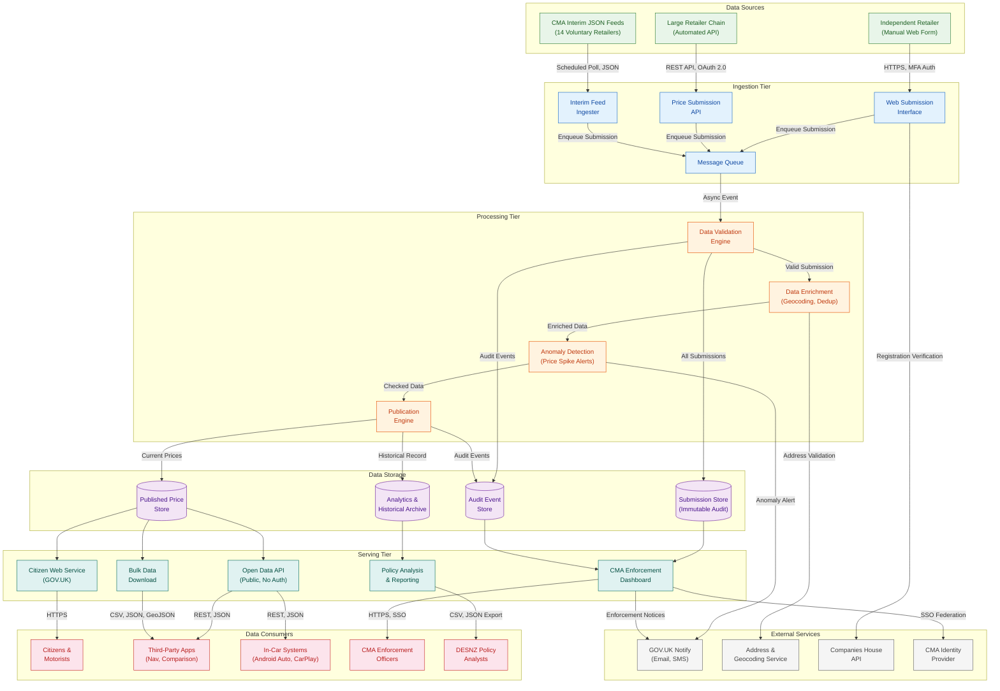
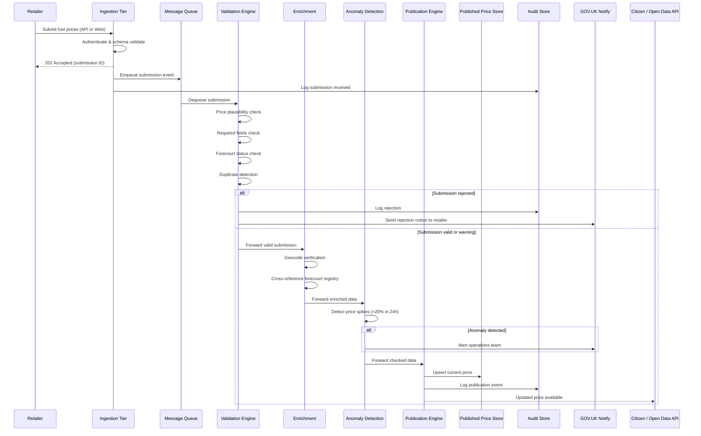

# Architecture Diagram: Data Pipeline — High-Level Data Flow

> **Template Status**: Live | **Version**: 1.0.3 | **Command**: `/arckit.diagram`

## Document Control

| Field | Value |
|-------|-------|
| **Document ID** | ARC-001-DIAG-001-v1.0 |
| **Document Type** | Architecture Diagram |
| **Project** | UK Fuel Price Transparency Service (Project 001) |
| **Classification** | OFFICIAL |
| **Status** | DRAFT |
| **Version** | 1.0 |
| **Created Date** | 2026-01-31 |
| **Last Modified** | 2026-01-31 |
| **Review Cycle** | Monthly |
| **Next Review Date** | 2026-03-01 |
| **Owner** | [OWNER_NAME_AND_ROLE] |
| **Reviewed By** | PENDING |
| **Approved By** | PENDING |
| **Distribution** | CMA Digital, DESNZ Policy, GDS Assessors, Delivery Team, Architecture Review Board |

## Revision History

| Version | Date | Author | Changes | Approved By | Approval Date |
|---------|------|--------|---------|-------------|---------------|
| 1.0 | 2026-01-31 | ArcKit AI | Initial creation from `/arckit.diagram` command — high-level data pipeline, technology-agnostic | PENDING | PENDING |

---

## Diagram

### Data Pipeline — High-Level Architecture

**View this diagram**:
- **GitHub**: Renders automatically in markdown preview
- **VS Code**: Install Mermaid Preview extension
- **Online**: https://mermaid.live (paste code above)
- **Export**: Use mermaid.live to export as PNG/SVG/PDF

---

### Data Pipeline — Submission Processing Sequence

---

## Component Inventory

| Component | Type | Responsibility | Evolution Stage | Build/Buy |
|-----------|------|----------------|-----------------|-----------|
| Web Submission Interface | User Interface | Manual price entry for independent retailers (FR-002) | Custom (0.35) | BUILD |
| Price Submission API | API Gateway | RESTful endpoint for automated bulk submissions (FR-003) | Custom (0.40) | BUILD |
| Interim Feed Ingester | Data Ingester | Polls CMA interim JSON endpoints from 14 voluntary retailers | Custom (0.30) | BUILD |
| Message Queue | Middleware | Decouples ingestion from processing; guarantees delivery | Commodity (0.90) | USE |
| Data Validation Engine | Processing | Plausibility checks, schema validation, duplicate detection (FR-007) | Custom (0.40) | BUILD |
| Data Enrichment | Processing | Geocoding, address normalisation, forecourt cross-reference | Custom (0.35) | BUILD |
| Anomaly Detection | Processing | Price spike detection (>20% change), ops alerting | Custom (0.30) | BUILD |
| Publication Engine | Processing | Transforms validated data into published format; updates read store | Custom (0.40) | BUILD |
| Submission Store | Database | Immutable audit record of all submissions; 7-year retention | Commodity (0.85) | USE |
| Published Price Store | Database | Current prices optimised for read queries; materialised view | Commodity (0.85) | USE |
| Audit Event Store | Database | Tamper-evident log; cryptographic chain hashing; 7-year retention | Commodity (0.80) | USE |
| Analytics & Historical Archive | Data Store | Long-term price history; hot/warm/cold tiering | Commodity (0.80) | USE |
| Citizen Web Service | User Interface | GOV.UK-hosted fuel price comparison for citizens (FR-004) | Custom (0.40) | BUILD |
| Open Data API | API | Public read-only API; no auth; rate-limited (FR-005, FR-014) | Custom (0.40) | BUILD |
| CMA Enforcement Dashboard | User Interface | Compliance monitoring, evidence, enforcement actions (FR-006) | Custom (0.35) | BUILD |
| Policy Analysis & Reporting | Analytics | Aggregate trends, geographic patterns, exports (FR-011) | Custom (0.35) | BUILD |
| Bulk Data Download | File Distribution | CSV, JSON, GeoJSON bulk exports under OGL | Custom (0.45) | BUILD |
| GOV.UK Notify | External Service | Email/SMS for compliance reminders and enforcement notices | Commodity (0.95) | REUSE |
| Address & Geocoding Service | External Service | Address validation, postcode-to-coordinate resolution | Product (0.70) | BUY |
| Companies House API | External Service | Organisation verification during registration | Commodity (0.90) | REUSE |
| CMA Identity Provider | External Service | SSO for CMA staff; SAML/OIDC federation | Commodity (0.85) | REUSE |

---

## Architecture Decisions

### Key Design Decisions

**Decision 1**: Asynchronous submission processing
- **Context**: Retailers submit prices via API or web form; downstream validation, enrichment, anomaly detection, and publication require multiple steps
- **Decision**: Decouple ingestion from processing using a message queue; return 202 Accepted to retailer immediately
- **Rationale**: Principle 12 (Asynchronous Communication) — improves fault tolerance, enables independent scaling of ingestion and processing tiers, and ensures retailer experience is not degraded by downstream latency
- **Consequences**: Eventual consistency between submission and publication; freshness SLA (≤15 minutes) must be monitored

**Decision 2**: Separate ingestion and serving data stores
- **Context**: ~150K–300K submissions/day write-heavy; millions of citizen queries read-heavy
- **Decision**: Maintain separate stores for submissions (write-optimised, immutable audit) and published prices (read-optimised, materialised view)
- **Rationale**: Principle 3 (Scalability) and Principle 11 (Loose Coupling) — ingestion and serving scale independently; different retention, performance, and access control requirements
- **Consequences**: Publication engine maintains consistency between stores; requires monitoring for lag

**Decision 3**: Bulkhead isolation between tiers
- **Context**: Citizen service must remain available even if data pipeline is degraded
- **Decision**: Physical isolation between ingestion, processing, and serving tiers; serving tier reads from its own data store
- **Rationale**: Principle 4 (Resilience and Fault Tolerance), NFR-A-003 — if processing fails, citizens see last-known prices with staleness indicators
- **Consequences**: Stale data visible during outages; staleness indicators required in UI and API responses

**Decision 4**: Technology-agnostic design
- **Context**: User requested high-level diagram without vendor or technology specifics
- **Decision**: All components described by function rather than product name; technology selection deferred to Alpha/Beta research phases
- **Rationale**: Principle philosophy is technology-agnostic; technology selection guided by principles during research (`/arckit.research`) and Wardley mapping (`/arckit.wardley`)
- **Consequences**: Subsequent diagrams (C4 Container, Deployment) will specify technologies after vendor evaluation

---

## Requirements Traceability

### Requirements Coverage

| Requirement ID | Description | Component(s) | Coverage Status |
|----------------|-------------|--------------|-----------------|
| BR-001 | Universal forecourt registration | Web Submission Interface, Companies House API | ✅ Covered |
| BR-002 | Comprehensive fuel price submission | Submission API, Web Interface, Validation Engine | ✅ Covered |
| BR-003 | Citizen fuel price comparison | Citizen Web Service, Published Price Store | ✅ Covered |
| BR-004 | CMA enforcement capability | Enforcement Dashboard, Audit Store, Submission Store | ✅ Covered |
| BR-005 | Open data publication | Open Data API, Bulk Download, Publication Engine | ✅ Covered |
| BR-006 | Value for money | Analytics & Reporting | ⚠️ Partial (benefits tracking not shown) |
| BR-007 | Governance compliance | Cross-cutting (all tiers) | ⚠️ Partial (process, not component) |
| FR-002 | Manual price submission | Web Submission Interface → Message Queue → Processing | ✅ Covered |
| FR-003 | API price submission | Submission API → Message Queue → Processing | ✅ Covered |
| FR-004 | Citizen fuel price search | Published Price Store → Citizen Web Service | ✅ Covered |
| FR-005 | Open data API | Published Price Store → Open Data API | ✅ Covered |
| FR-006 | Compliance monitoring dashboard | Submission Store + Audit Store → Enforcement Dashboard | ✅ Covered |
| FR-007 | Data validation pipeline | Validation Engine → Enrichment → Anomaly Detection → Publisher | ✅ Covered |
| FR-010 | Audit trail | Audit Event Store (all tiers log events) | ✅ Covered |
| FR-011 | Policy analysis and reporting | Analytics Store → Policy Reports | ✅ Covered |
| FR-014 | Android Auto / CarPlay API responses | Open Data API (format parameter) | ✅ Covered |
| NFR-P-001 | Citizen search <3s p95 | Published Price Store (read-optimised) → Citizen Web | ✅ Covered |
| NFR-P-002 | Ingestion 5K submissions/min peak | Message Queue → Validator (horizontal scaling) | ✅ Covered |
| NFR-A-001 | 99.9% citizen, 99.95% submission API | Bulkhead isolation, independent scaling | ✅ Covered |
| NFR-A-003 | Fault tolerance / graceful degradation | Bulkhead isolation, stale-data serving | ✅ Covered |
| NFR-S-001 | Horizontal scaling | Stateless tiers, message queue decoupling | ✅ Covered |
| INT-001 | Address gazetteer | Enrichment → Address & Geocoding Service | ✅ Covered |
| INT-002 | Geocoding service | Enrichment → Address & Geocoding Service | ✅ Covered |
| INT-003 | GOV.UK Notify | Anomaly Detection → Notify; Enforcement Dashboard → Notify | ✅ Covered |
| INT-006 | CMA corporate IdP | Enforcement Dashboard → CMA IdP | ✅ Covered |
| INT-007 | Companies House API | Web Interface → Companies House | ✅ Covered |
| INT-008 | Android Auto / CarPlay compatibility | Open Data API → In-Car Apps | ✅ Covered |

**Coverage Summary**:
- Total Requirements Mapped: 27
- Fully Covered: 25 (93%)
- Partially Covered: 2 (7%) — BR-006, BR-007 are process/governance requirements
- Not Covered: 0

---

## Integration Points

### External Systems

| External System | Interface | Protocol | Responsibility | SLA |
|----------------|-----------|----------|----------------|-----|
| GOV.UK Notify | REST API + Webhook | HTTPS | Email/SMS for compliance and enforcement | Per GOV.UK Notify SLA |
| Address & Geocoding Service | REST API | HTTPS | Address validation, postcode-to-coordinate | <2s response, 99.9% |
| Companies House API | REST API | HTTPS | Organisation verification | Best-effort, fallback to manual |
| CMA Identity Provider | SAML 2.0 / OIDC | HTTPS | CMA staff SSO authentication | Per CMA IT SLA |
| CMA Interim JSON Feeds | Polling (JSON) | HTTPS | Ingest voluntary retailer data (transitional) | N/A (polling, not SLA-bound) |

### Internal APIs

| API | Direction | Purpose | Authentication |
|-----|-----------|---------|----------------|
| Price Submission API (Write) | Inbound | Retailer automated price submission | OAuth 2.0 Client Credentials |
| Open Data API (Read) | Outbound | Public price queries, no auth | None (rate-limited by IP) |
| Enforcement API (Internal) | Internal | Dashboard queries submission/audit stores | CMA SSO + RBAC |
| Publication Events | Internal | Notify serving tier of price updates | Service-to-service token |

---

## Data Flow

### Data Sources

| Data Source | Type | Data Format | Update Frequency | Owner |
|-------------|------|-------------|------------------|-------|
| Independent Retailers (Web) | Manual submission | Form data → JSON | Ad hoc (at price change) | Retailer |
| Large Retailers (API) | Automated submission | JSON (bulk, up to 1K forecourts) | Multiple times daily | Retailer IT |
| CMA Interim JSON Feeds | Polling | JSON (stations + prices) | Scheduled (transitional) | CMA |

### Data Sinks

| Data Sink | Type | Data Format | Retention | Backup |
|-----------|------|-------------|-----------|--------|
| Submission Store | Relational DB | Structured (immutable) | 7 years (1yr hot, 6yr cold) | Continuous replication |
| Published Price Store | Read-optimised DB | Structured (materialised view) | Current + 90 days hot | Continuous replication |
| Audit Event Store | Append-only log | Structured + integrity hash | 7 years (immutable) | Continuous replication |
| Analytics Archive | Columnar / cold store | Structured | Indefinite | Hourly snapshots |
| Bulk Download | Object storage | CSV, JSON, GeoJSON | Current snapshot | Daily refresh |

### PII Handling (UK GDPR Compliance)

| Component | PII Type | Processing | Legal Basis | Retention | Deletion |
|-----------|----------|------------|-------------|-----------|----------|
| Web Submission Interface | Retailer contact (name, email, phone) | Collection during registration | Public Task Art 6(1)(e) | Registration + 6 years | Anonymise after retention |
| Submission Store | Submitted_by (user identity), source_ip | Audit record of who submitted | Public Task Art 6(1)(e) | 7 years | Hard delete after 7 years |
| Enforcement Dashboard | Retailer contact details (read access) | Display for enforcement | Public Task Art 6(1)(e) | Access-logged | N/A (read-only) |
| Published Price Store | None | Forecourt prices are public data | N/A | Indefinite | N/A |

**DPIA Required**: Yes — ARC-001-DPIA-v1.0 completed
**DPO Consulted**: Yes

---

## Security Architecture

### Security Zones

| Zone | Components | Security Level | Controls |
|------|------------|----------------|----------|
| Public Zone | Citizen Web Service, Open Data API, Bulk Download | PUBLIC | Rate limiting, WAF, DDoS protection, no auth required |
| Retailer Zone | Web Submission Interface, Submission API | OFFICIAL | MFA (web), OAuth 2.0 (API), TLS 1.2+, input validation |
| Processing Zone | Message Queue, Validation, Enrichment, Anomaly, Publisher | OFFICIAL | Service-to-service auth, network isolation, no public access |
| Data Zone | Submission Store, Price Store, Audit Store, Analytics | OFFICIAL | Encryption at rest (AES-256), access-logged, network-isolated |
| Enforcement Zone | CMA Enforcement Dashboard | OFFICIAL-SENSITIVE | SSO + MFA, RBAC, audit logging, network-restricted |
| External Zone | GOV.UK Notify, Address Service, Companies House, CMA IdP | External | Outbound-only, circuit breakers, timeouts |

### Authentication & Authorisation

| Component | Authentication | Authorisation | Session Management |
|-----------|----------------|---------------|-------------------|
| Citizen Web Service | None (public) | Read-only public data | Stateless |
| Open Data API | None (public) | Read-only, rate-limited | Stateless |
| Retailer Web Interface | Username/password + MFA | Own forecourts only (RBAC) | 30-min idle timeout, 8-hr absolute |
| Submission API | OAuth 2.0 Client Credentials | Own organisation forecourts | Token-based, 1-hr expiry |
| CMA Enforcement Dashboard | CMA IdP SSO + MFA | Role-based (Operations, Enforcement, Admin) | 30-min idle timeout |
| Processing Tier | Service-to-service tokens | Internal only | Mutual TLS |

---

## Non-Functional Requirements

### Performance

| Requirement | Target | Component(s) | How Achieved |
|-------------|--------|--------------|--------------|
| Citizen search response | <3s (p95) mobile; <500ms (p95) API | Citizen Web, Published Price Store | Read-optimised store, caching, CDN |
| Data ingestion throughput | 5,000 submissions/min peak | Submission API, Message Queue, Validator | Horizontal scaling, async queue |
| Processing freshness | ≤15 min submission-to-publication (p95) | Queue → Validator → Enricher → Publisher | Monitored pipeline SLI |
| Enforcement dashboard | <5s page load | Enforcement Dashboard, Submission Store | Pre-aggregated compliance metrics |

### Scalability

| Scalability Type | Approach | Component(s) | Growth Projection |
|-----------------|----------|--------------|-------------------|
| Horizontal (compute) | Stateless tiers, auto-scale on CPU/queue depth | Ingestion, Processing, Serving tiers | Year 1: 8.5K stations → Year 3: 10K |
| Horizontal (data) | Hot/warm/cold tiering | All data stores | 55M records/yr; 200M audit events/yr |
| Read scaling | Read replicas, caching, CDN | Published Price Store, Citizen Web, Open Data API | 1M → 5M monthly users over 3 years |

### Availability & Resilience

| Requirement | Target | Component(s) | How Achieved |
|-------------|--------|--------------|--------------|
| Citizen service availability | 99.9% | Citizen Web, Published Price Store | Multi-AZ, auto-failover |
| Submission API availability | 99.95% | Submission API, Message Queue | Multi-AZ, durable queue |
| RPO | 15 min (submissions); 0 (audit) | All data stores | Continuous replication |
| RTO | 4 hours | All tiers | Automated failover, DR runbook |
| Graceful degradation | Serve stale data with indicators | Serving tier | Bulkhead isolation from processing |

---

## UK Government Compliance

### Technology Code of Practice

| TCoP Point | Compliance | Component(s) | Evidence |
|------------|------------|--------------|----------|
| 1. User Needs | ✅ | Citizen Web, Retailer Web, Enforcement Dashboard | Three distinct user-facing services for three user groups |
| 3. Open Source | ✅ | All tiers | Technology-agnostic; open source preferred per principles |
| 4. Open Standards | ✅ | All APIs | REST, JSON, OpenAPI 3.0, OAuth 2.0, SAML 2.0 |
| 5. Cloud First | ✅ | All tiers | Cloud-hosted in UK sovereign region |
| 6. Security | ✅ | All tiers | Defence-in-depth, zone isolation, encryption |
| 7. Privacy | ✅ | All tiers handling PII | DPIA completed; PII minimised to Organisation entity |
| 8. Share & Reuse | ✅ | Notify, GOV.UK Design System, Companies House | Government platforms reused; open data published |
| 10. Better Use of Data | ✅ | Analytics, Open Data API, Bulk Download | Open data by default; analytics for policy |

### GOV.UK Services

| GOV.UK Service | Used | Component | Rationale |
|----------------|------|-----------|-----------|
| GOV.UK Notify | Yes | Enforcement Dashboard, Processing Tier | Compliance reminders, enforcement notices (INT-003) |
| GOV.UK Design System | Yes | Citizen Web Service | Mandatory for government citizen-facing services (INT-004) |
| GOV.UK One Login | Future | N/A (Phase 2) | Not required for anonymous citizen access in Phase 1 (INT-005) |
| Companies House API | Yes | Registration flow | Organisation verification (INT-007) |

### AI Playbook Compliance

**AI Risk Level**: N/A — No AI/ML components in the data pipeline. Anomaly detection uses rule-based thresholds, not machine learning.

---

## Wardley Map Integration

**Related Wardley Map**: Not yet created — recommend `/arckit.wardley` to map component evolution and validate build/buy decisions.

### Component Positioning (Estimated)

| Component | Visibility | Evolution | Stage | Strategic Action |
|-----------|-----------|-----------|-------|------------------|
| Citizen Web Service | 0.95 | 0.40 | Custom | BUILD |
| Open Data API | 0.90 | 0.40 | Custom | BUILD |
| Price Submission API | 0.85 | 0.40 | Custom | BUILD |
| Data Validation Engine | 0.60 | 0.40 | Custom | BUILD |
| Anomaly Detection | 0.50 | 0.30 | Custom | BUILD |
| Publication Engine | 0.55 | 0.40 | Custom | BUILD |
| Message Queue | 0.30 | 0.90 | Commodity | USE |
| Databases (all stores) | 0.25 | 0.85 | Commodity | USE |
| GOV.UK Notify | 0.40 | 0.95 | Commodity | REUSE |
| GOV.UK Design System | 0.90 | 0.95 | Commodity | REUSE |
| Address/Geocoding Service | 0.35 | 0.70 | Product | BUY |
| Companies House API | 0.30 | 0.90 | Commodity | REUSE |
| CMA Identity Provider | 0.25 | 0.85 | Commodity | REUSE |

### Strategic Alignment

- [x] All BUILD decisions align with Custom stage (bespoke regulatory data pipeline)
- [x] All BUY decisions align with Product stage (address/geocoding)
- [x] All USE decisions align with Commodity stage (queue, databases)
- [x] All REUSE decisions are government shared platforms
- [x] No commodity components being custom-built

---

## Linked Artifacts

**Requirements**: `projects/001-uk-fuel-price-transparency-service/ARC-001-REQ-v2.0.md`
**Architecture Principles**: `projects/000-global/ARC-000-PRIN-v1.0.md`
**Data Model**: `projects/001-uk-fuel-price-transparency-service/ARC-001-DATA-v1.0.md`
**Stakeholders**: `projects/001-uk-fuel-price-transparency-service/ARC-001-STKE-v1.0.md`
**Risk Register**: `projects/001-uk-fuel-price-transparency-service/ARC-001-RISK-v1.0.md`
**DPIA**: `projects/001-uk-fuel-price-transparency-service/ARC-001-DPIA-v1.0.md`
**Secure by Design**: `projects/001-uk-fuel-price-transparency-service/ARC-001-SECD-v1.0.md`
**Wardley Map**: Not yet created
**HLD**: Not yet created
**DLD**: Not yet created

---

## Change Log

| Version | Date | Author | Changes | Rationale |
|---------|------|--------|---------|-----------|
| v1.0 | 2026-01-31 | ArcKit AI | Initial high-level data pipeline diagram — technology-agnostic | Provide architectural overview of data flow from retailer submission through validation, enrichment, publication, to citizen/third-party consumption |

**Next Review Date**: 2026-03-01

---

**Generated by**: ArcKit `/arckit.diagram` command
**Generated on**: 2026-01-31
**ArcKit Version**: 1.0.3
**Project**: UK Fuel Price Transparency Service (Project 001)
**Model**: Claude Opus 4.5
