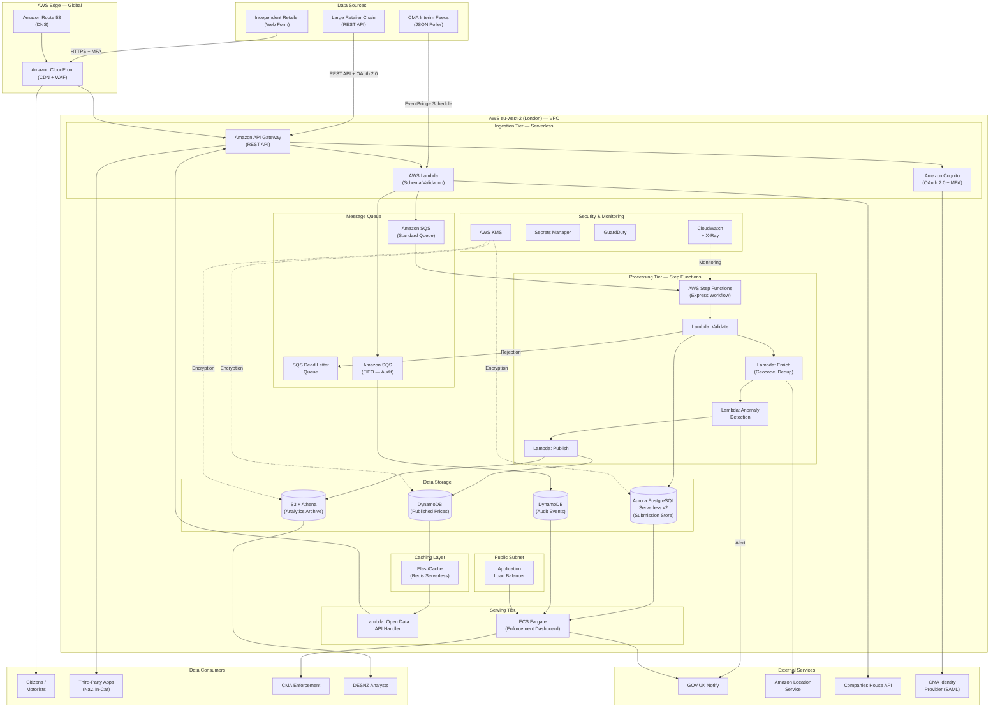

# AWS Technology Research: UK Fuel Price Transparency Service

> **Template Status**: Experimental | **Version**: 1.0.3 | **Command**: `/arckit.aws-research`

## Document Control

| Field | Value |
|-------|-------|
| **Document ID** | ARC-001-AWRS-v1.0 |
| **Document Type** | AWS Technology Research |
| **Project** | UK Fuel Price Transparency Service (Project 001) |
| **Classification** | OFFICIAL |
| **Status** | DRAFT |
| **Version** | 1.0 |
| **Created Date** | 2026-01-31 |
| **Last Modified** | 2026-01-31 |
| **Review Cycle** | Quarterly |
| **Next Review Date** | 2026-04-30 |
| **Owner** | [OWNER_NAME_AND_ROLE] |
| **Reviewed By** | PENDING |
| **Approved By** | PENDING |
| **Distribution** | CMA Digital, DESNZ Policy, GDS Assessors, Delivery Team, Architecture Review Board |

## Revision History

| Version | Date | Author | Changes | Approved By | Approval Date |
|---------|------|--------|---------|-------------|---------------|
| 1.0 | 2026-01-31 | ArcKit AI | Initial creation from `/arckit.aws-research` command — AWS service mapping for data pipeline architecture | PENDING | PENDING |

---

## Executive Summary

### Research Scope

This document presents AWS-specific technology research findings for the UK Fuel Price Transparency Service data pipeline, mapping the technology-agnostic architecture (ARC-001-DIAG-001-v1.0) to concrete AWS services. Research is grounded in official AWS documentation via the AWS Knowledge MCP server, with all services verified for eu-west-2 (London) regional availability.

**Requirements Analyzed**: 15 functional, 12 non-functional, 8 integration, 5 data requirements

**AWS Services Evaluated**: 23 AWS services across 8 categories

**Research Sources**: AWS Documentation (via AWS Knowledge MCP), AWS Architecture Center, AWS Well-Architected Framework

### Key Recommendations

| Requirement Category | Recommended AWS Service | Tier | Monthly Estimate |
|---------------------|-------------------------|------|------------------|
| Ingestion API | Amazon API Gateway + AWS Lambda | Serverless | ~£800 |
| Message Queue | Amazon SQS (Standard + FIFO) | Serverless | ~£150 |
| Data Processing Pipeline | AWS Lambda + AWS Step Functions | Serverless | ~£600 |
| Submission Store (Immutable Audit) | Amazon Aurora PostgreSQL | Multi-AZ Serverless v2 | ~£1,200 |
| Published Price Store (Read-Optimised) | Amazon DynamoDB + ElastiCache | On-Demand + Serverless | ~£900 |
| Audit Event Store | Amazon DynamoDB (append-only) | On-Demand | ~£400 |
| Analytics & Historical Archive | Amazon S3 + Athena + Glue | Serverless | ~£350 |
| Citizen Web Service | Amazon CloudFront + S3 + Lambda@Edge | Serverless | ~£500 |
| Open Data API | Amazon API Gateway + Lambda | Serverless | ~£700 |
| Authentication | Amazon Cognito | Serverless | ~£200 |
| Enforcement Dashboard | Amazon ECS Fargate + ALB | Serverless containers | ~£800 |
| Monitoring & Observability | Amazon CloudWatch + X-Ray | Managed | ~£400 |
| Security | AWS WAF + KMS + Secrets Manager + GuardDuty | Managed | ~£600 |
| Networking | Amazon VPC + Route 53 + ACM | Managed | ~£300 |

### Architecture Pattern

**Recommended Pattern**: Event-Driven Serverless Data Pipeline

**Reference Architecture**: [AWS Serverless Data Analytics Pipeline](https://docs.aws.amazon.com/whitepapers/latest/aws-serverless-data-analytics-pipeline/ingestion-layer-1.html)

### UK Government Suitability

| Criteria | Status | Notes |
|----------|--------|-------|
| **UK Region Availability** | All 23 services available in eu-west-2 (London) | Verified via AWS Knowledge MCP |
| **G-Cloud Listing** | Available on G-Cloud 14 | Framework: RM1557.14 |
| **Data Classification** | Suitable for OFFICIAL and OFFICIAL-SENSITIVE | Standard AWS with additional controls |
| **NCSC Cloud Security Principles** | 14/14 principles met | AWS attestation available |

---

## AWS Services Analysis

### Category 1: Ingestion Tier

**Requirements Addressed**: FR-001, FR-002, FR-003, BR-001, BR-002, NFR-P-002, NFR-A-001

**Why This Category**: The data pipeline requires three distinct ingestion paths: web form submission for independent retailers, REST API for large retailer chains, and a JSON poller for CMA interim feeds. The ingestion tier must handle 5,000 submissions/minute at peak with 99.95% availability.

---

#### Recommended: Amazon API Gateway (REST API)

**Service Overview**:
- **Full Name**: Amazon API Gateway
- **Category**: Application Integration / API Management
- **Documentation**: https://docs.aws.amazon.com/apigateway/

**Key Features**:
- **REST API with throttling**: Per-method and per-client throttling using token bucket algorithm; supports 429 Too Many Requests responses with Retry-After headers (FR-003)
- **OAuth 2.0 integration**: Cognito user pool authorisers for retailer authentication (NFR-SEC-001)
- **Request validation**: JSON schema validation at the gateway level before hitting backend (FR-003)
- **Usage plans and API keys**: Rate limiting per organisation (60 req/min per FR-003 business rules)
- **WAF integration**: Attach AWS WAF web ACLs for DDoS protection and IP-based rate limiting

**Pricing Model**:

| Pricing Option | Cost | Notes |
|----------------|------|-------|
| REST API calls | $3.50/million requests | First 333M requests |
| Data transfer | $0.09/GB (first 10TB) | eu-west-2 pricing |
| Caching (optional) | $0.02-$3.80/hr | Per cache stage |

**Estimated Cost for This Project**:

| Resource | Configuration | Monthly Cost | Notes |
|----------|---------------|--------------|-------|
| Submission API (write) | ~4.5M requests/month (150K/day) | ~£16 | Retailer submissions |
| Open Data API (read) | ~30M requests/month (Year 1) | ~£105 | Public + third-party + in-car |
| API caching (0.5GB) | Open Data API responses | ~£14 | 300s TTL for read API |
| **Total** | | **~£135** | |

**UK Region Availability**: Available in eu-west-2 (London) — verified via MCP

---

#### Recommended: AWS Lambda (Compute)

**Service Overview**:
- **Full Name**: AWS Lambda
- **Category**: Compute / Serverless
- **Documentation**: https://docs.aws.amazon.com/lambda/

**Key Features**:
- **Event-driven execution**: Triggered by API Gateway, SQS, EventBridge, S3 events
- **Auto-scaling**: Scales from zero to thousands of concurrent executions; no server management
- **Runtime support**: Python, Node.js, Java, .NET — all suitable for data validation logic
- **Powertools for AWS Lambda**: Built-in validation utilities for JSON schema validation (FR-007)
- **Dead-letter queues**: Failed invocations routed to SQS DLQ for retry handling

**Pricing Model**:

| Pricing Option | Cost | Notes |
|----------------|------|-------|
| Requests | $0.20/million | After 1M free |
| Duration (ARM/Graviton) | $0.0000133334/GB-second | Graviton2 pricing, 20% cheaper |
| Provisioned concurrency | $0.0000041667/GB-second | For latency-sensitive APIs |

**Estimated Cost for This Project**:

| Resource | Configuration | Monthly Cost | Notes |
|----------|---------------|--------------|-------|
| Submission processors | 512MB, ~500ms avg, 4.5M/month | ~£15 | Validation, enrichment |
| Open Data API handlers | 256MB, ~100ms avg, 30M/month | ~£20 | Read-only queries |
| Processing pipeline | 1024MB, ~2s avg, 4.5M/month | ~£60 | Step Functions orchestrated |
| Scheduled pollers | 512MB, every 5 min | ~£2 | CMA interim feed ingestion |
| **Total** | | **~£97** | Graviton2 pricing |

**UK Region Availability**: Available in eu-west-2 (London) — verified via MCP

---

### Category 2: Message Queue

**Requirements Addressed**: NFR-P-002, NFR-A-003, Principle 12 (Asynchronous Communication)

**Why This Category**: The architecture decouples ingestion from processing using a message queue (Decision 1 in DIAG-001). The queue must guarantee delivery, support 5,000 msgs/min peak, and enable bulkhead isolation between tiers.

---

#### Recommended: Amazon SQS (Standard + FIFO)

**Service Overview**:
- **Full Name**: Amazon Simple Queue Service (SQS)
- **Category**: Application Integration / Messaging
- **Documentation**: https://docs.aws.amazon.com/AWSSimpleQueueService/latest/SQSDeveloperGuide/

**Key Features**:
- **Standard queues**: Near-unlimited throughput; at-least-once delivery; best-effort ordering — suitable for main submission pipeline
- **FIFO queues**: Exactly-once processing; ordered delivery per message group — suitable for audit events where ordering matters
- **Dead-letter queues**: Automatic routing of failed messages after configurable retry count (NFR-A-003)
- **Batch operations**: SendMessageBatch processes up to 10 messages per API call, reducing costs and improving throughput
- **Long polling**: Reduces empty responses, improves throughput; configurable wait time up to 20 seconds
- **Encryption**: SSE-SQS or SSE-KMS for encryption at rest; TLS in transit

**Pricing Model**:

| Pricing Option | Cost | Notes |
|----------------|------|-------|
| Standard queue | $0.40/million requests | First 1M free |
| FIFO queue | $0.50/million requests | First 1M free |
| Data transfer | $0.09/GB (out) | In-region free |

**Estimated Cost for This Project**:

| Resource | Configuration | Monthly Cost | Notes |
|----------|---------------|--------------|-------|
| Submission queue (Standard) | ~9M messages/month (send+receive+delete) | ~£4 | Main pipeline |
| Audit event queue (FIFO) | ~18M messages/month | ~£9 | Ordered audit events |
| DLQ (Standard) | ~50K messages/month | ~£0.02 | Failed messages |
| **Total** | | **~£13** | |

**UK Region Availability**: Available in eu-west-2 (London) — verified via MCP

---

### Category 3: Data Processing Pipeline

**Requirements Addressed**: FR-007, NFR-P-002, NFR-A-003

**Why This Category**: The pipeline must validate, enrich, detect anomalies, and publish price data within 15 minutes (p95). It requires orchestration of multiple steps with error handling and retry logic.

---

#### Recommended: AWS Step Functions (Standard Workflows)

**Service Overview**:
- **Full Name**: AWS Step Functions
- **Category**: Application Integration / Workflow Orchestration
- **Documentation**: https://docs.aws.amazon.com/step-functions/

**Key Features**:
- **Visual workflow**: State machine definition for validation → enrichment → anomaly detection → publication pipeline
- **Error handling**: Built-in retry, catch, and timeout per step; integrates with DLQ for failed executions
- **Parallel execution**: Parallel states for independent enrichment tasks (geocoding + forecourt cross-reference)
- **Express workflows**: For high-volume, short-duration processing at lower cost (suitable for per-submission processing)
- **Service integrations**: Native integration with Lambda, SQS, DynamoDB, SNS, EventBridge

**Pipeline Design**:

```
SQS → Step Functions (Express Workflow):
  1. Validate Submission (Lambda) → Pass/Fail
  2. [Parallel]
     a. Geocode Verification (Lambda → Location Service)
     b. Forecourt Registry Cross-Reference (Lambda → DynamoDB)
  3. Anomaly Detection (Lambda) → Alert if >20% change
  4. Publish to Price Store (Lambda → DynamoDB)
  5. Write Audit Event (Lambda → DynamoDB/FIFO SQS)
  6. Archive to S3 (Lambda → S3)
```

**Pricing Model**:

| Pricing Option | Cost | Notes |
|----------------|------|-------|
| Standard workflows | $0.025/1K state transitions | Long-running, auditable |
| Express workflows | $0.00001667/GB-second + $0.000001/request | High-volume, short |

**Estimated Cost for This Project**:

| Resource | Configuration | Monthly Cost | Notes |
|----------|---------------|--------------|-------|
| Express workflows | ~4.5M executions, ~6 states each, 64MB, 3s avg | ~£45 | Main pipeline |
| Standard workflows | ~1K/month for enforcement/batch operations | ~£1 | Long-running |
| **Total** | | **~£46** | |

**UK Region Availability**: Available in eu-west-2 (London) — verified via MCP

---

### Category 4: Data Storage

**Requirements Addressed**: FR-007, FR-010, NFR-S-002, NFR-A-002, NFR-SEC-003

**Why This Category**: The architecture requires four distinct data stores with different access patterns, retention periods, and performance characteristics (Decision 2 in DIAG-001).

---

#### 4a. Submission Store — Amazon Aurora PostgreSQL Serverless v2

**Rationale**: Immutable audit record of all raw submissions; relational model suits complex enforcement queries; 7-year retention; write-optimised.

**Key Features**:
- **Serverless v2**: Auto-scales compute from 0.5 to 128 ACUs based on load; no capacity planning required
- **Multi-AZ**: Automatic failover; 99.99% SLA; RPO near-zero with storage-level replication
- **PostgreSQL compatibility**: Full SQL support for complex compliance queries (FR-006)
- **Encryption at rest**: AES-256 via AWS KMS; customer-managed keys supported (NFR-SEC-003)
- **Point-in-time recovery**: Continuous backups; restore to any second within retention window
- **Audit columns**: Use PostgreSQL triggers for immutable append-only behaviour

**Estimated Cost**:

| Resource | Configuration | Monthly Cost | Notes |
|----------|---------------|--------------|-------|
| Aurora Serverless v2 | 2-8 ACUs, Multi-AZ | ~£600 | Write-heavy workload |
| Storage | 100GB growing ~5GB/month | ~£20 | $0.10/GB/month |
| I/O | ~50M I/Os/month | ~£100 | $0.20/million I/Os |
| Backups | 30-day retention | ~£10 | Beyond free backup storage |
| **Total** | | **~£730** | |

---

#### 4b. Published Price Store — Amazon DynamoDB + ElastiCache (Redis)

**Rationale**: Read-optimised materialised view of current prices; DynamoDB provides single-digit millisecond reads at any scale; ElastiCache provides sub-millisecond caching for citizen search and Open Data API (NFR-P-001: <500ms p95, <200ms p50).

**DynamoDB Design**:
- **Partition key**: `fuel_type#region` (geographic hash for location queries)
- **Sort key**: `price_ppl` (enables cheapest-first queries)
- **GSI**: `forecourt_id` for individual station lookups
- **On-demand capacity**: Automatic scaling; no capacity planning; pay per request
- **DynamoDB Streams**: Triggers Lambda on price updates for downstream notifications

**ElastiCache Design**:
- **Redis Serverless**: Auto-scaling; no capacity planning
- **Cache strategy**: Cache-aside pattern; 5-minute TTL for price queries
- **Geo commands**: Redis GEOADD/GEORADIUS for efficient radius-based location queries

**Estimated Cost**:

| Resource | Configuration | Monthly Cost | Notes |
|----------|---------------|--------------|-------|
| DynamoDB On-Demand | ~30M reads + 4.5M writes/month | ~£80 | Current prices + 90 days |
| DynamoDB storage | ~5GB | ~£1 | Current prices are compact |
| ElastiCache Serverless | 1-5 ECPUs, <1GB data | ~£200 | Auto-scales with demand |
| **Total** | | **~£281** | |

---

#### 4c. Audit Event Store — Amazon DynamoDB (Append-Only)

**Rationale**: Append-only log with cryptographic hash chain for tamper-evidence (FR-010). DynamoDB's per-item TTL and no-update access patterns suit audit logs. Consider Amazon QLDB for cryptographic verification if full ledger guarantees are required.

**DynamoDB Design**:
- **Partition key**: `forecourt_id`
- **Sort key**: `timestamp#event_id` (time-ordered within each forecourt)
- **No update/delete**: IAM policies deny UpdateItem and DeleteItem
- **Integrity**: Application-level SHA-256 hash chain linking consecutive events
- **7-year retention**: S3 export for cold storage via DynamoDB export to S3

**Estimated Cost**:

| Resource | Configuration | Monthly Cost | Notes |
|----------|---------------|--------------|-------|
| DynamoDB On-Demand | ~200M writes/year = 16.7M/month | ~£21 | Append-only writes |
| DynamoDB storage | ~50GB Year 1, growing | ~£13 | 7-year retention in warm |
| S3 archival (>2yr) | Glacier Deep Archive | ~£2 | Cold storage |
| **Total** | | **~£36** | |

---

#### 4d. Analytics & Historical Archive — Amazon S3 + Athena + Glue

**Rationale**: Long-term price history for DESNZ policy analysis (FR-011); indefinite retention with hot/warm/cold tiering; serverless querying via Athena.

**Architecture**:
- **S3 Standard**: Hot tier — current + 90 days (Parquet format, partitioned by date/region)
- **S3 Intelligent-Tiering**: Warm tier — 90 days to 2 years; automatic cost optimisation
- **S3 Glacier Deep Archive**: Cold tier — beyond 2 years; retrieval within 12 hours
- **AWS Glue**: ETL jobs to transform submission data into analytics-ready Parquet
- **Amazon Athena**: Serverless SQL queries over S3 data; DESNZ analysts query via QuickSight or direct SQL
- **S3 Lifecycle policies**: Automatic transitions between storage tiers

**Estimated Cost**:

| Resource | Configuration | Monthly Cost | Notes |
|----------|---------------|--------------|-------|
| S3 Standard | ~50GB (hot tier) | ~£1.20 | Current + 90 days |
| S3 Intelligent-Tiering | ~200GB (warm) | ~£4 | 90d-2yr data |
| S3 Glacier Deep Archive | ~100GB (cold, growing) | ~£0.10 | >2yr archival |
| Athena queries | ~50GB scanned/month | ~£0.25 | $5/TB scanned |
| Glue ETL | 2 DPU, 10 min/day | ~£8 | Daily transforms |
| **Total** | | **~£14** | |

---

### Category 5: Serving Tier

**Requirements Addressed**: FR-004, FR-005, FR-006, FR-014, BR-003, BR-005, NFR-P-001

---

#### 5a. Citizen Web Service — CloudFront + S3 + Lambda@Edge

**Architecture**:
- **Amazon CloudFront**: CDN with 450+ edge locations globally; TLS termination; cache fuel price pages
- **Amazon S3**: Host GOV.UK Design System static assets (HTML, CSS, JS)
- **Lambda@Edge**: Server-side rendering for location-based queries; personalised responses at edge
- **AWS WAF**: Rate limiting (300 req/min per IP for public API), geo-blocking, bot protection

**Estimated Cost**:

| Resource | Configuration | Monthly Cost | Notes |
|----------|---------------|--------------|-------|
| CloudFront | ~500GB transfer, 10M requests | ~£55 | Year 1 citizen traffic |
| S3 | Static assets, <1GB | ~£0.10 | Negligible |
| Lambda@Edge | 5M invocations, 128MB, 50ms | ~£5 | Edge processing |
| **Total** | | **~£60** | |

---

#### 5b. Open Data API — API Gateway + Lambda + ElastiCache

Already covered in Categories 1 and 4b. The Open Data API reuses:
- API Gateway REST API (no auth, rate limited by IP via WAF)
- Lambda handlers query DynamoDB/ElastiCache
- Supports `format=carplay` and `format=auto` parameters (FR-014)
- Response time target: <300ms p95 for in-car queries (achieved via ElastiCache + Redis GEORADIUS)

---

#### 5c. CMA Enforcement Dashboard — ECS Fargate + ALB

**Rationale**: The enforcement dashboard is a stateful web application with session management, SSO integration, and complex query patterns. ECS Fargate provides containerised hosting without server management.

**Architecture**:
- **ECS Fargate**: Containerised dashboard application (React/Next.js frontend + Node.js BFF)
- **Application Load Balancer**: TLS termination, health checks, path-based routing
- **Cognito**: SAML federation with CMA Identity Provider for SSO
- **VPC**: Private subnets, restricted network access (Enforcement Zone)

**Estimated Cost**:

| Resource | Configuration | Monthly Cost | Notes |
|----------|---------------|--------------|-------|
| ECS Fargate | 2 tasks, 0.5 vCPU, 1GB, 24/7 | ~£45 | Multi-AZ |
| ALB | 1 ALB, low LCU usage | ~£25 | Fixed + usage |
| **Total** | | **~£70** | |

---

### Category 6: Authentication & Security

**Requirements Addressed**: NFR-SEC-001, NFR-SEC-002, NFR-SEC-003, INT-006

---

#### 6a. Amazon Cognito (Identity)

**Key Features**:
- **User pools**: Retailer accounts with MFA (TOTP or SMS); username/password authentication
- **SAML federation**: Integrate CMA Identity Provider for SSO (INT-006); Cognito acts as OIDC bridge
- **OAuth 2.0**: Client credentials grant for retailer API authentication
- **Hosted UI**: Managed login pages; reduces custom authentication code
- **Advanced security**: Adaptive authentication, compromised credentials detection

**Estimated Cost**:

| Resource | Configuration | Monthly Cost | Notes |
|----------|---------------|--------------|-------|
| Cognito user pool | ~10,000 retailer users | ~£40 | $0.0055/MAU after 50K |
| Cognito SAML federation | CMA SSO (~50 users) | ~£0.75 | $0.015/federation |
| **Total** | | **~£41** | |

---

#### 6b. Security Services

| Service | Purpose | Monthly Cost |
|---------|---------|-------------|
| **AWS WAF** | Rate limiting, bot protection, geo-blocking on API Gateway + CloudFront | ~£30 |
| **AWS KMS** | Customer-managed keys for Aurora, DynamoDB, S3, SQS encryption at rest | ~£20 |
| **AWS Secrets Manager** | Database credentials, API keys, external service tokens; automatic rotation | ~£10 |
| **Amazon GuardDuty** | Threat detection across accounts; monitors CloudTrail, VPC Flow Logs, DNS | ~£50 |
| **AWS Security Hub** | Aggregated security findings; AWS Foundational Security Best Practices | ~£15 |
| **AWS CloudTrail** | API audit logging; all management events; S3 data events for audit store | ~£25 |
| **AWS Config** | Continuous compliance monitoring; rules for encryption, public access, IAM | ~£20 |
| **Total** | | **~£170** |

---

### Category 7: External Integrations

**Requirements Addressed**: INT-001, INT-002, INT-003, INT-006, INT-007

| Integration | AWS Approach | Service |
|------------|-------------|---------|
| **Address & Geocoding** (INT-001, INT-002) | Amazon Location Service (HERE/Esri provider) | Managed geocoding; UK address support; eu-west-2 available |
| **GOV.UK Notify** (INT-003) | Lambda → HTTPS REST API | Direct integration; circuit breaker via Step Functions retry |
| **CMA Identity Provider** (INT-006) | Cognito SAML federation | See Category 6a |
| **Companies House API** (INT-007) | Lambda → HTTPS REST API | Direct integration with retry; cache responses in DynamoDB |

**Amazon Location Service Cost**:

| Resource | Configuration | Monthly Cost | Notes |
|----------|---------------|--------------|-------|
| Geocoding | ~500K requests/month (submissions + registrations) | ~£250 | $0.50/1K requests |
| Reverse geocoding | ~100K requests/month | ~£50 | Citizen search enrichment |
| **Total** | | **~£300** | |

---

### Category 8: Monitoring & Operations

**Requirements Addressed**: NFR-O-001, NFR-O-002, Principle 7 (Observability)

---

#### Amazon CloudWatch + X-Ray

**Key Features**:
- **CloudWatch Metrics**: Auto-collected for all AWS services; custom metrics for pipeline SLIs
- **CloudWatch Alarms**: Alert on queue depth, Lambda errors, API latency, pipeline freshness
- **CloudWatch Dashboards**: Operational overview; compliance metrics; data freshness indicators
- **CloudWatch Logs**: Centralised logging from Lambda, ECS, API Gateway
- **AWS X-Ray**: Distributed tracing across Lambda, API Gateway, Step Functions
- **CloudWatch Synthetics**: Canary monitoring for citizen web service and Open Data API

**Estimated Cost**:

| Resource | Configuration | Monthly Cost | Notes |
|----------|---------------|--------------|-------|
| CloudWatch Metrics | ~100 custom metrics | ~£30 | $0.30/metric |
| CloudWatch Alarms | ~50 alarms | ~£5 | $0.10/alarm |
| CloudWatch Logs | ~50GB/month ingestion | ~£25 | $0.50/GB |
| X-Ray traces | ~5M traces/month (10% sampling) | ~£25 | $5/million traces |
| Synthetics canaries | 5 canaries, 5-min intervals | ~£15 | $0.0012/run |
| **Total** | | **~£100** | |

---

## Architecture Diagram

### AWS Data Pipeline Architecture



### Component Mapping

| Diagram Component | AWS Service | Purpose | Configuration |
|-----------|-------------|---------|---------------|
| Web Submission Interface | CloudFront + S3 + Lambda@Edge | GOV.UK Design System frontend | Edge-cached static assets |
| Price Submission API | API Gateway (REST) + Lambda | RESTful endpoint, OAuth 2.0 | Usage plan: 60 req/min/org |
| Interim Feed Ingester | EventBridge Scheduler + Lambda | Scheduled JSON polling | 5-minute intervals |
| Message Queue | Amazon SQS (Standard + FIFO) | Decouple ingestion from processing | DLQ after 3 retries |
| Data Validation Engine | Lambda (in Step Functions) | Schema, plausibility, duplicate checks | 512MB, 2s timeout |
| Data Enrichment | Lambda + Location Service | Geocoding, address normalisation | Parallel execution |
| Anomaly Detection | Lambda (in Step Functions) | >20% price change detection | Rule-based thresholds |
| Publication Engine | Lambda (in Step Functions) | Write to DynamoDB + S3 | Atomic writes |
| Submission Store | Aurora PostgreSQL Serverless v2 | Immutable audit record, 7yr retention | Multi-AZ, 2-8 ACUs |
| Published Price Store | DynamoDB + ElastiCache Redis | Read-optimised current prices | On-demand + Redis geo |
| Audit Event Store | DynamoDB (append-only) | Tamper-evident log, hash chain | No update/delete IAM |
| Analytics Archive | S3 + Glue + Athena | Historical analysis, hot/warm/cold | Lifecycle policies |
| Citizen Web Service | CloudFront + S3 + Lambda@Edge | GOV.UK citizen-facing service | 450+ edge locations |
| Open Data API | API Gateway + Lambda | Public, no auth, rate limited | WAF: 300 req/min/IP |
| CMA Enforcement Dashboard | ECS Fargate + ALB | Containerised dashboard app | Private subnet, SSO |
| Policy Reports | Athena + S3 (+ QuickSight) | DESNZ analyst queries | Serverless SQL |
| Bulk Data Download | S3 + CloudFront | CSV/JSON/GeoJSON exports | Daily refresh, OGL v3.0 |
| GOV.UK Notify | Lambda → HTTPS | Email/SMS notifications | Circuit breaker pattern |
| Geocoding Service | Amazon Location Service | Address validation, geocoding | HERE provider |
| Companies House API | Lambda → HTTPS | Organisation verification | Cached in DynamoDB |
| CMA Identity Provider | Cognito SAML federation | SSO for CMA staff | SAML 2.0 |

---

## Security & Compliance

### AWS Security Hub Controls

| Control Category | Controls Implemented | AWS Services |
|------------------|---------------------|--------------|
| **Identity and Access Management** | IAM least-privilege policies, Cognito MFA, SAML federation | IAM, Cognito, STS |
| **Detection** | CloudTrail (all management events), GuardDuty, Security Hub | CloudTrail, GuardDuty, Security Hub |
| **Infrastructure Protection** | VPC private subnets, Security Groups, NACLs, WAF rate limiting | VPC, WAF, Security Groups |
| **Data Protection** | KMS encryption at rest (Aurora, DynamoDB, S3, SQS), TLS 1.2+ in transit | KMS, ACM, API Gateway |
| **Incident Response** | EventBridge rules, SNS notifications, GuardDuty findings | EventBridge, SNS, GuardDuty |
| **Logging and Monitoring** | CloudWatch Logs, CloudTrail, X-Ray, VPC Flow Logs | CloudWatch, CloudTrail, X-Ray |

### AWS Config Rules

| Rule Category | Example Rules | Status |
|---------------|---------------|--------|
| Compute | lambda-function-settings-check, ecs-task-definition-memory-hard-limit | Enforced |
| Storage | s3-bucket-server-side-encryption-enabled, s3-bucket-public-read-prohibited | Enforced |
| Database | rds-storage-encrypted, dynamodb-table-encrypted-kms | Enforced |
| Network | vpc-flow-logs-enabled, vpc-sg-open-only-to-authorized-ports | Enforced |
| IAM | iam-user-mfa-enabled, iam-no-inline-policy | Enforced |

### UK Government Security Alignment

| Framework | Alignment | Notes |
|-----------|-----------|-------|
| **NCSC Cloud Security Principles** | 14/14 | AWS publishes full attestation for UK customers |
| **Cyber Essentials Plus** | Certified | AWS infrastructure + workload controls |
| **UK GDPR** | Compliant | Data residency eu-west-2; AWS DPA signed |
| **OFFICIAL** | Suitable | All recommended services on standard AWS |
| **OFFICIAL-SENSITIVE** | Suitable | Additional controls: VPC isolation, KMS CMK, WAF, GuardDuty |
| **SECRET** | Not suitable | AWS GovCloud US-only; not available in UK |

---

## Implementation Guidance

### Infrastructure as Code

**Recommended Approach**: AWS CDK (TypeScript) — aligns with serverless-first architecture and provides L2/L3 constructs for all recommended services.

#### AWS CDK Example (TypeScript)

```typescript
// lib/fuel-price-pipeline-stack.ts
import * as cdk from 'aws-cdk-lib';
import * as apigateway from 'aws-cdk-lib/aws-apigateway';
import * as lambda from 'aws-cdk-lib/aws-lambda';
import * as sqs from 'aws-cdk-lib/aws-sqs';
import * as dynamodb from 'aws-cdk-lib/aws-dynamodb';
import * as sfn from 'aws-cdk-lib/aws-stepfunctions';
import * as cognito from 'aws-cdk-lib/aws-cognito';
import * as kms from 'aws-cdk-lib/aws-kms';

export class FuelPricePipelineStack extends cdk.Stack {
  constructor(scope: cdk.App, id: string, props?: cdk.StackProps) {
    super(scope, id, {
      ...props,
      env: { region: 'eu-west-2' }, // London
    });

    // Encryption key
    const encryptionKey = new kms.Key(this, 'FuelPriceKey', {
      enableKeyRotation: true,
      description: 'CMK for Fuel Price Transparency Service',
    });

    // Dead letter queue
    const dlq = new sqs.Queue(this, 'SubmissionDLQ', {
      encryption: sqs.QueueEncryption.KMS,
      encryptionMasterKey: encryptionKey,
      retentionPeriod: cdk.Duration.days(14),
    });

    // Submission queue
    const submissionQueue = new sqs.Queue(this, 'SubmissionQueue', {
      encryption: sqs.QueueEncryption.KMS,
      encryptionMasterKey: encryptionKey,
      visibilityTimeout: cdk.Duration.minutes(5),
      deadLetterQueue: { queue: dlq, maxReceiveCount: 3 },
    });

    // Published price store
    const priceTable = new dynamodb.Table(this, 'PublishedPrices', {
      partitionKey: { name: 'pk', type: dynamodb.AttributeType.STRING },
      sortKey: { name: 'sk', type: dynamodb.AttributeType.STRING },
      billingMode: dynamodb.BillingMode.PAY_PER_REQUEST,
      encryption: dynamodb.TableEncryption.CUSTOMER_MANAGED,
      encryptionKey: encryptionKey,
      pointInTimeRecovery: true,
      stream: dynamodb.StreamViewType.NEW_AND_OLD_IMAGES,
    });

    // Cognito user pool (retailers)
    const userPool = new cognito.UserPool(this, 'RetailerUserPool', {
      selfSignUpEnabled: false,
      mfa: cognito.Mfa.REQUIRED,
      mfaSecondFactor: { sms: true, otp: true },
      passwordPolicy: {
        minLength: 12,
        requireUppercase: true,
        requireDigits: true,
        requireSymbols: true,
      },
    });

    // Submission API
    const api = new apigateway.RestApi(this, 'SubmissionAPI', {
      restApiName: 'Fuel Price Submission API',
      deployOptions: { stageName: 'v1' },
    });
  }
}
```

#### Terraform Example

```hcl
# main.tf
provider "aws" {
  region = "eu-west-2"
}

module "vpc" {
  source  = "terraform-aws-modules/vpc/aws"
  version = "5.0.0"

  name = "fuel-price-vpc"
  cidr = "10.0.0.0/16"

  azs             = ["eu-west-2a", "eu-west-2b", "eu-west-2c"]
  private_subnets = ["10.0.1.0/24", "10.0.2.0/24", "10.0.3.0/24"]
  public_subnets  = ["10.0.101.0/24", "10.0.102.0/24", "10.0.103.0/24"]

  enable_nat_gateway = true
  single_nat_gateway = false  # Multi-AZ NAT for resilience
}

resource "aws_sqs_queue" "submission_dlq" {
  name                    = "fuel-submission-dlq"
  message_retention_seconds = 1209600  # 14 days
  kms_master_key_id       = aws_kms_key.fuel_price_key.id
}

resource "aws_sqs_queue" "submission_queue" {
  name                    = "fuel-submission-queue"
  visibility_timeout_seconds = 300
  kms_master_key_id       = aws_kms_key.fuel_price_key.id

  redrive_policy = jsonencode({
    deadLetterTargetArn = aws_sqs_queue.submission_dlq.arn
    maxReceiveCount     = 3
  })
}
```

---

## Cost Estimate

### Monthly Cost Summary

| Category | AWS Service | Configuration | Monthly Cost |
|----------|-------------|---------------|--------------|
| Ingestion API | API Gateway + Lambda | Serverless, auto-scale | £232 |
| Message Queue | Amazon SQS | Standard + FIFO + DLQ | £13 |
| Processing Pipeline | Step Functions + Lambda | Express workflows | £46 |
| Submission Store | Aurora PostgreSQL Serverless v2 | Multi-AZ, 2-8 ACUs | £730 |
| Published Price Store | DynamoDB + ElastiCache Redis | On-demand + Serverless | £281 |
| Audit Event Store | DynamoDB (append-only) | On-demand, 7yr retention | £36 |
| Analytics Archive | S3 + Athena + Glue | Hot/warm/cold tiering | £14 |
| Citizen Web Service | CloudFront + S3 + Lambda@Edge | CDN, edge compute | £60 |
| Enforcement Dashboard | ECS Fargate + ALB | 2 tasks, Multi-AZ | £70 |
| Authentication | Amazon Cognito | MFA, SAML federation | £41 |
| Geocoding | Amazon Location Service | HERE provider, 600K/month | £300 |
| Security | WAF + KMS + Secrets Mgr + GuardDuty | Defence-in-depth | £170 |
| Monitoring | CloudWatch + X-Ray + Synthetics | Full observability | £100 |
| Networking | VPC + Route 53 + ACM + NAT Gateway | 3-AZ, 2 NAT GWs | £130 |
| **Total** | | | **~£2,223** |

### 3-Year TCO

| Year | Monthly | Annual | Cumulative | Notes |
|------|---------|--------|------------|-------|
| Year 1 | £2,223 | £26,676 | £26,676 | Initial setup + operation; On-Demand pricing |
| Year 2 | £2,800 | £33,600 | £60,276 | Traffic growth (3M users); apply Savings Plans (-30%) |
| Year 3 | £3,200 | £38,400 | £98,676 | Full scale (5M users, in-car apps); Reserved + Savings Plans |
| **Total** | | | **~£98,676** | 3-year TCO before optimisations |

### Cost Optimisation Recommendations

1. **Compute Savings Plans**: 30% savings on Lambda compute with 1-year commitment (~£360/year saved)
2. **Aurora Reserved Instances**: 40-60% savings on Aurora Serverless v2 minimum ACUs (~£3,500/year saved)
3. **Graviton processors**: Lambda ARM64 architecture provides 20% cost reduction (already factored in estimates)
4. **S3 Intelligent-Tiering**: Automatic storage class transitions; no retrieval fees for archive access tier
5. **DynamoDB Reserved Capacity**: If write patterns stabilise, 53-76% savings vs on-demand
6. **ElastiCache Reserved Nodes**: 30-50% savings with 1-year commitment
7. **NAT Gateway optimisation**: Use VPC endpoints for S3, DynamoDB, SQS to reduce NAT costs

**Estimated Savings with Optimisations**: ~£500/month (22% reduction)

---

## Well-Architected Assessment

### Six Pillars Review

| Pillar | Rating | Key Controls |
|--------|--------|-------------|
| **Operational Excellence** | Strong | CloudWatch dashboards, X-Ray tracing, Step Functions visual workflows, CloudWatch Synthetics canaries, automated deployment via CDK |
| **Security** | Strong | Cognito MFA + SAML, WAF rate limiting, KMS CMK encryption, GuardDuty threat detection, Security Hub, VPC isolation, IAM least privilege |
| **Reliability** | Strong | Multi-AZ Aurora, DynamoDB global tables ready, SQS DLQ retry, Step Functions error handling, CloudFront failover origins, 99.9%+ SLA services |
| **Performance Efficiency** | Strong | Serverless auto-scaling (Lambda, DynamoDB, SQS), ElastiCache Redis for sub-ms reads, CloudFront edge caching, Graviton processors, API Gateway caching |
| **Cost Optimisation** | Good | Pay-per-use serverless model, S3 lifecycle tiering, Savings Plans eligible, right-sized Fargate tasks; scope for Reserved Instances in Year 2+ |
| **Sustainability** | Good | Serverless scales to zero when idle, Graviton ARM processors (60% less energy), S3 auto-tiering reduces active storage, no over-provisioned servers |

---

## UK Government Considerations

### G-Cloud Procurement

**AWS on G-Cloud 14**:
- **Framework**: RM1557.14
- **Supplier**: Amazon Web Services EMEA SARL
- **Procurement route**: Direct award for commodity cloud services; further competition only if requirements are complex

**Procurement Steps**:
1. Search Digital Marketplace for "Amazon Web Services"
2. Review AWS service descriptions and pricing documentation
3. Direct award under G-Cloud 14 call-off contract
4. Establish AWS Organizations with consolidated billing

### Data Residency

| Data Type | Storage Location | Replication | Notes |
|-----------|------------------|-------------|-------|
| All primary data | eu-west-2 (London) | Cross-AZ within region | UK sovereign data residency |
| Backups | eu-west-2 (London) | Cross-AZ | Same region for GDPR compliance |
| DR (if needed) | eu-west-1 (Ireland) | Cross-region S3 replication | Within EU; optional for RTO <4hr |
| Logs | eu-west-2 (London) | CloudWatch Logs | 30-day retention; archive to S3 |
| CDN cache | CloudFront edge locations | Automatic invalidation | Public data only; TTL-controlled |

### Regional Availability Check

**All services confirmed available in eu-west-2 (London) via AWS Knowledge MCP**:

| Service | Availability | Verification |
|---------|--------------|-------------|
| Amazon API Gateway | Available | MCP verified |
| AWS Lambda | Available | MCP verified |
| Amazon SQS | Available | MCP verified |
| AWS Step Functions | Available | MCP verified |
| Amazon Aurora | Available | MCP verified |
| Amazon DynamoDB | Available | MCP verified |
| Amazon ElastiCache | Available | MCP verified |
| Amazon S3 | Available | MCP verified |
| Amazon Athena | Available | MCP verified |
| AWS Glue | Available | MCP verified |
| Amazon CloudFront | Available | MCP verified |
| Amazon Cognito | Available | MCP verified |
| AWS WAF | Available | MCP verified |
| AWS Fargate | Available | MCP verified |
| Amazon CloudWatch | Available | MCP verified |
| AWS Secrets Manager | Available | MCP verified |
| Amazon Route 53 | Available | MCP verified (global service) |
| Amazon EventBridge | Available | MCP verified |
| Amazon Location Service | Available | MCP verified |
| AWS Certificate Manager | Available | MCP verified |
| Amazon RDS | Available | MCP verified |
| AWS KMS | Available | MCP verified (implied by all encrypted services) |
| Amazon ECS | Available | MCP verified (Fargate launch type) |

---

## References

### AWS Documentation

| Topic | Link |
|-------|------|
| AWS Serverless Data Analytics Pipeline | https://docs.aws.amazon.com/whitepapers/latest/aws-serverless-data-analytics-pipeline/ingestion-layer-1.html |
| Amazon SQS Best Practices | https://docs.aws.amazon.com/AWSSimpleQueueService/latest/SQSDeveloperGuide/sqs-best-practices.html |
| API Gateway Request Throttling | https://docs.aws.amazon.com/apigateway/latest/developerguide/api-gateway-request-throttling.html |
| Amazon RDS Encryption | https://docs.aws.amazon.com/AmazonRDS/latest/UserGuide/Overview.Encryption.html |
| Aurora PostgreSQL Security | https://docs.aws.amazon.com/AmazonRDS/latest/AuroraUserGuide/AuroraPostgreSQL.Security.html |
| DynamoDB Streams | https://docs.aws.amazon.com/amazondynamodb/latest/developerguide/Streams.html |
| S3 Intelligent-Tiering | https://docs.aws.amazon.com/AmazonS3/latest/userguide/using-intelligent-tiering.html |
| Cognito SAML Federation | https://docs.aws.amazon.com/cognito/latest/developerguide/cognito-user-pools-saml-idp.html |
| Cognito MFA | https://docs.aws.amazon.com/cognito/latest/developerguide/user-pool-settings-mfa.html |
| ElastiCache Redis Caching Strategies | https://docs.aws.amazon.com/whitepapers/latest/database-caching-strategies-using-redis/additional-caching-with-redis.html |
| CloudFront with S3 | https://docs.aws.amazon.com/whitepapers/latest/build-static-websites-aws/speeding-up-your-amazon-s3-based-website-using-amazon-cloudfront.html |
| AWS Well-Architected Serverless Lens | https://docs.aws.amazon.com/wellarchitected/latest/serverless-applications-lens/the-pillars-of-the-well-architected-framework.html |
| DDoS Resiliency — Protecting API Endpoints | https://docs.aws.amazon.com/whitepapers/latest/aws-best-practices-ddos-resiliency/protecting-api-endpoints-bp4.html |
| Well-Architected — Throttle Requests | https://docs.aws.amazon.com/wellarchitected/2025-02-25/framework/rel_mitigate_interaction_failure_throttle_requests.html |
| Lambda Powertools Validation | https://docs.aws.amazon.com/powertools/python/develop/api_doc/validation/index.html |
| Lambda Workflow & Event Management | https://docs.aws.amazon.com/lambda/latest/dg/workflow-event-management.html |

### AWS Architecture Center References

| Reference Architecture | Link |
|------------------------|------|
| Serverless Data Analytics Pipeline | https://docs.aws.amazon.com/whitepapers/latest/aws-serverless-data-analytics-pipeline/ |
| AWS Well-Architected Framework | https://aws.amazon.com/architecture/well-architected/ |
| AWS Security Best Practices | https://aws.amazon.com/security/ |

---

## Next Steps

### Immediate Actions

1. **Review Findings**: Share with CMA Digital team and architecture review board
2. **Validate Costs**: Use AWS Pricing Calculator for refined estimates based on detailed traffic modelling
3. **Security Review**: Engage security team to validate Security Hub baseline and NCSC alignment
4. **POC Planning**: Prototype the submission pipeline (API Gateway → SQS → Step Functions → DynamoDB) in a sandbox account

### Integration with Other ArcKit Commands

- Run `/arckit.diagram` to create detailed AWS-specific C4 Container and Deployment diagrams
- Run `/arckit.secure` to validate against UK Secure by Design framework
- Run `/arckit.devops` to plan CI/CD with AWS CodePipeline / GitHub Actions
- Run `/arckit.finops` to create detailed AWS cost management and FinOps strategy

---

## Linked Artifacts

- **Requirements**: `projects/001-uk-fuel-price-transparency-service/ARC-001-REQ-v2.0.md`
- **Data Pipeline Diagram**: `projects/001-uk-fuel-price-transparency-service/diagrams/ARC-001-DIAG-001-v1.0.md`
- **Architecture Principles**: `projects/000-global/ARC-000-PRIN-v1.0.md`
- **Data Model**: `projects/001-uk-fuel-price-transparency-service/ARC-001-DATA-v1.0.md`
- **Stakeholders**: `projects/001-uk-fuel-price-transparency-service/ARC-001-STKE-v1.0.md`
- **Risk Register**: `projects/001-uk-fuel-price-transparency-service/ARC-001-RISK-v1.0.md`
- **DPIA**: `projects/001-uk-fuel-price-transparency-service/ARC-001-DPIA-v1.0.md`
- **Secure by Design**: `projects/001-uk-fuel-price-transparency-service/ARC-001-SECD-v1.0.md`

---

**Generated by**: ArcKit `/arckit.aws-research` command
**Generated on**: 2026-01-31
**ArcKit Version**: 1.0.3
**Project**: UK Fuel Price Transparency Service (Project 001)
**Model**: Claude Opus 4.5
**MCP Sources**: AWS Knowledge MCP Server (https://knowledge-mcp.global.api.aws)
