# AWS Technology Research: UK Fuel Price Transparency Service

> **Template Status**: Experimental | **Version**: 1.1.0 | **Command**: `/arckit.aws-research`

## Document Control

| Field | Value |
|-------|-------|
| **Document ID** | ARC-001-AWRS-v2.0 |
| **Document Type** | AWS Technology Research |
| **Project** | UK Fuel Price Transparency Service (Project 001) |
| **Classification** | OFFICIAL |
| **Status** | DRAFT |
| **Version** | 2.0 |
| **Created Date** | 2026-02-02 |
| **Last Modified** | 2026-02-02 |
| **Review Cycle** | Quarterly |
| **Next Review Date** | 2026-05-02 |
| **Owner** | [OWNER_NAME_AND_ROLE] |
| **Reviewed By** | PENDING |
| **Approved By** | PENDING |
| **Distribution** | CMA Digital, DESNZ Policy, GDS Assessors, Delivery Team, Architecture Review Board |

## Revision History

| Version | Date | Author | Changes | Approved By | Approval Date |
|---------|------|--------|---------|-------------|---------------|
| 1.0 | 2026-02-01 | ArcKit AI | Initial creation from `/arckit.aws-research` command | PENDING | PENDING |
| 1.1 | 2026-02-02 | ArcKit AI | Refreshed MCP regional availability; aligned to requirements v2.0 (FR-014, FR-015, UC-7, INT-008 in-car platform); updated CDK code samples; refined cost estimates | PENDING | PENDING |
| 2.0 | 2026-02-02 | ArcKit AI | Major revision: expanded Well-Architected assessment across all 6 pillars with detailed guidance per service; added Aurora RDS Data API analysis; deepened disaster recovery section with cross-region strategy; enhanced Security Hub controls mapping with specific control IDs; added NCSC CAF conformance pack mapping; expanded VPC endpoint cost optimisation guidance; added comprehensive networking tier (VPC design, NAT alternatives, PrivateLink); added API Gateway HTTP API as alternative analysis; strengthened sustainability pillar assessment; added 3-year data growth projections; expanded IaC examples with Terraform modules | PENDING | PENDING |

---

## Executive Summary

### Research Scope

This document presents AWS-specific technology research findings for the UK Fuel Price Transparency Service ("Fuel Finder"). It provides AWS service recommendations, architecture patterns, and implementation guidance based on official AWS documentation accessed via the AWS Knowledge MCP Server.

**Requirements Analyzed**: 15 functional, 17 non-functional, 8 integration, 6 data requirements (from ARC-001-REQ-v2.0)

**AWS Services Evaluated**: 22 AWS services across 8 categories

**Research Sources**: AWS Documentation, AWS Architecture Center, AWS Well-Architected Framework, AWS Serverless Applications Lens, AWS Knowledge MCP Server (https://knowledge-mcp.global.api.aws)

### Key Recommendations

| Requirement Category | Recommended AWS Service | Tier | Monthly Estimate |
|---------------------|-------------------------|------|------------------|
| Compute -- API and Web | AWS Lambda + API Gateway | On-Demand (Serverless) | ~GBP 500 |
| Compute -- Data Pipeline | AWS Step Functions + Lambda | On-Demand (Serverless) | ~GBP 155 |
| Primary Database | Amazon Aurora PostgreSQL (Serverless v2) | On-Demand | ~GBP 1,050 |
| Caching / Geospatial | Amazon ElastiCache (Redis OSS) | Reserved | ~GBP 350 |
| Object Storage | Amazon S3 | Standard / Intelligent-Tiering | ~GBP 92 |
| CDN | Amazon CloudFront | On-Demand | ~GBP 200 |
| Authentication | Amazon Cognito | Free Tier + On-Demand | ~GBP 50 |
| Messaging | Amazon SQS + Amazon SNS | On-Demand | ~GBP 4 |
| Monitoring | Amazon CloudWatch + X-Ray | On-Demand | ~GBP 220 |
| Security | AWS Security Hub + GuardDuty | On-Demand | ~GBP 145 |
| Secrets | AWS Secrets Manager | On-Demand | ~GBP 10 |
| Audit | AWS CloudTrail + CloudTrail Lake | On-Demand | ~GBP 65 |
| Networking | VPC + NAT Gateways + VPC Endpoints | On-Demand | ~GBP 55 |

### Architecture Pattern

**Recommended Pattern**: Serverless Multi-Tier Architecture with API Gateway, Lambda, and Aurora PostgreSQL

**Reference Architecture**: [AWS Serverless Multi-Tier Architectures](https://docs.aws.amazon.com/whitepapers/latest/serverless-multi-tier-architectures-api-gateway-lambda/sample-architecture-patterns.html)

### UK Government Suitability

| Criteria | Status | Notes |
|----------|--------|-------|
| **UK Region Availability** | All 22 services available in eu-west-2 (London) | Verified via `get_regional_availability` MCP tool (2026-02-02) |
| **G-Cloud Listing** | G-Cloud 14 | Framework: RM1557.14, Supplier: Amazon Web Services EMEA SARL |
| **Data Classification** | OFFICIAL / OFFICIAL-SENSITIVE | Standard AWS with additional controls for OFFICIAL-SENSITIVE |
| **NCSC Cloud Security Principles** | 14/14 principles met | Full attestation available via AWS Artifact |
| **NCSC Cyber Assessment Framework** | Conformance pack available | AWS Config rules mapped to NCSC CAF v3 controls |

---

## AWS Services Analysis

### Category 1: Compute -- Citizen-Facing API and Web Application

**Requirements Addressed**: FR-004 (Citizen Search), FR-005 (Open Data API), FR-014 (In-Car API -- carplay/auto format, <300ms p95), FR-015 (Third-party in-car app guidelines), NFR-P-001 (<3s page load, <500ms API p95, <200ms p50), NFR-A-001 (99.9% availability), NFR-S-001 (horizontal scaling to 10,000 concurrent)

**Why This Category**: The Fuel Finder citizen-facing service needs to serve up to 5M monthly users (Year 3) with sub-second API response times, auto-scaling from normal (100 concurrent) to peak (10,000 concurrent during fuel crises), with 99.9% availability. The v2.0 requirements add in-car platform API support (FR-014) requiring <300ms p95 response times for simplified result sets. Serverless compute eliminates capacity planning and provides automatic scaling.

---

#### Recommended: Amazon API Gateway + AWS Lambda

**Service Overview**:
- **Full Name**: Amazon API Gateway (REST API) + AWS Lambda
- **Category**: Serverless Compute
- **Documentation**: [API Gateway](https://docs.aws.amazon.com/apigateway/latest/developerguide/), [Lambda](https://docs.aws.amazon.com/lambda/latest/dg/), [Lambda Best Practices](https://docs.aws.amazon.com/lambda/latest/dg/best-practices.html)

**Key Features**:
- **Auto-scaling**: Lambda scales automatically from 0 to thousands of concurrent executions -- directly addresses NFR-S-001 (horizontal scaling) and peak load of 10,000 concurrent citizen searches. Ref: [Lambda Best Practices - Scalability](https://docs.aws.amazon.com/lambda/latest/dg/best-practices.html)
- **Pay-per-request**: No idle cost; aligns with value-for-money requirements (BR-006) and UK Government FinOps principles
- **API Gateway caching**: Built-in response caching reduces Lambda invocations and improves response time for repeated queries. Cache TTL of 5-15 minutes is appropriate since fuel prices change infrequently. Ref: [API Gateway Caching](https://docs.aws.amazon.com/apigateway/latest/developerguide/api-gateway-caching.html)
- **WAF integration**: API Gateway integrates with AWS WAF for request filtering, rate limiting (NFR-SEC-005), and DDoS protection
- **OpenAPI support**: API Gateway natively imports/exports OpenAPI 3.0 specifications (NFR-I-001)
- **Custom domain**: Map to GOV.UK subdomain via Route 53 (TC-2)
- **Versioning**: URL path versioning (/v1/, /v2/) supported natively (FR-005 deprecation policy)
- **In-car API format support**: API Gateway request mapping templates can route `format=carplay` and `format=auto` query parameters to a dedicated Lambda function returning simplified JSON with navigation-ready `geo:` URIs (FR-014)
- **Graviton2 (arm64)**: Lambda supports ARM_64 architecture for ~20% better price-performance. Ref: [Lambda Cost and Performance Optimization](https://docs.aws.amazon.com/wellarchitected/latest/serverless-applications-lens/cost-and-performance-optimization.html)
- **RDS Data API integration**: Aurora PostgreSQL Serverless v2 supports the RDS Data API, enabling Lambda to query the database via HTTP without managing VPC connections or connection pools. Available in eu-west-2. Ref: [RDS Data API](https://docs.aws.amazon.com/AmazonRDS/latest/AuroraUserGuide/data-api.html)

**Pricing Model**:

| Pricing Option | Cost | Commitment | Notes |
|----------------|------|------------|-------|
| API Gateway REST API | $3.50/million requests | None | First 333M requests/month |
| Lambda | $0.20/million requests + $0.0000166667/GB-sec | None | 1M free requests/month |
| API Gateway caching | $0.02-$0.24/hr per cache | None | 0.5GB-237GB cache sizes |

**Estimated Cost for This Project**:

| Resource | Configuration | Monthly Cost | Notes |
|----------|---------------|--------------|-------|
| API Gateway (Citizen API) | ~30M requests/month (Year 1) | ~GBP 85 | 1M users, avg 30 requests each |
| API Gateway (Open Data API) | ~10M requests/month | ~GBP 30 | Third-party consumers incl. in-car apps |
| API Gateway (Submission API) | ~5M requests/month | ~GBP 15 | 150k submissions/day |
| Lambda (All functions) | ~45M invocations, 256MB, 200ms avg | ~GBP 120 | Compute cost |
| API Gateway Cache | 1GB, 3 caches (citizen, open data, submission) | ~GBP 45 | Reduces backend calls ~80% |
| CloudFront (CDN) | 500GB/month transfer, 30M requests | ~GBP 200 | Static assets + API acceleration |
| **Total Compute** | | **~GBP 495** | |

**AWS Well-Architected Assessment**:

| Pillar | Rating | Notes |
|--------|--------|-------|
| **Operational Excellence** | 5/5 | CloudWatch Logs, X-Ray tracing, deployment via SAM/CDK, canary deployments. Ref: [Serverless Lens - Deploying](https://docs.aws.amazon.com/wellarchitected/latest/serverless-applications-lens/opex-deploying.html) |
| **Security** | 5/5 | IAM execution roles, resource policies, WAF integration, VPC Lambda for database access. Security Hub and GuardDuty Lambda Protection for monitoring. Ref: [Lambda Best Practices - Security](https://docs.aws.amazon.com/lambda/latest/dg/best-practices.html) |
| **Reliability** | 5/5 | Multi-AZ by default, automatic scaling, no single point of failure, provisioned concurrency for consistent latency |
| **Performance Efficiency** | 5/5 | Provisioned concurrency for consistent latency, API caching, CloudFront edge caching, arm64 Graviton2 processors |
| **Cost Optimization** | 5/5 | Pay-per-use, no idle cost, automatic right-sizing, VPC endpoints to reduce NAT costs. Ref: [Leverage VPC Endpoints](https://docs.aws.amazon.com/wellarchitected/latest/serverless-applications-lens/leverage-vpc-endpoints.html) |
| **Sustainability** | 5/5 | Shared infrastructure, Graviton2 processors for Lambda (arm64), resources consumed only when needed. Ref: [Sustainability Pillar](https://docs.aws.amazon.com/wellarchitected/latest/framework/a-sustainability.html) |

**UK Region Availability**:
- Amazon API Gateway: Available in eu-west-2 (London) -- MCP verified 2026-02-02
- AWS Lambda: Available in eu-west-2 (London) -- MCP verified 2026-02-02
- Amazon CloudFront: Available in eu-west-2 (London) -- edge locations throughout UK

---

#### Alternative: AWS App Runner

**Service Overview**: Fully managed container service for web applications and APIs. Simpler than ECS/EKS but less flexible than Lambda for event-driven workloads.

**Why Not Recommended**: App Runner is container-based with minimum running instances (always-on cost). For a government service with variable traffic (low overnight, spikes during fuel crises), serverless Lambda provides better cost efficiency and automatic scaling without capacity planning. Ref: [Fargate vs Lambda Decision Guide](https://docs.aws.amazon.com/decision-guides/latest/fargate-or-lambda/fargate-or-lambda.html)

---

#### Comparison Matrix

| Criteria | Lambda + API Gateway | App Runner | Winner |
|----------|---------------------|------------|--------|
| Cost (monthly) | ~GBP 495 | ~GBP 800+ | Lambda |
| Auto-scaling | Instant, to 1000s concurrent | Slower scale-up | Lambda |
| Operational overhead | Minimal (serverless) | Low (managed containers) | Lambda |
| UK Availability | eu-west-2 | eu-west-2 | Tie |
| GOV.UK TCoP alignment | Cloud-first, pay-per-use | Good | Lambda |
| Cold start concern | Mitigated with provisioned concurrency | None (always warm) | App Runner |
| RDS Data API support | Yes (HTTP-based, no VPC needed) | N/A (uses standard connections) | Lambda |

**Recommendation**: Lambda + API Gateway -- best fit for variable-traffic government service with cost-sensitivity and auto-scaling requirements.

---

### Category 2: Primary Database

**Requirements Addressed**: FR-001 (Registration), FR-002-003 (Price Submission), FR-004 (Citizen Search -- geospatial), FR-006 (Compliance Dashboard), FR-010 (Audit Trail), NFR-P-001 (<500ms query), NFR-S-002 (55M records/year), NFR-A-001 (99.95% availability for submission API)

**Why This Category**: The service requires a relational database with geospatial query support (PostGIS for proximity search), ACID transactions (price submissions), strong consistency (compliance data), and the ability to scale to 55M price submission records per year while maintaining sub-500ms query performance.

---

#### Recommended: Amazon Aurora PostgreSQL (Serverless v2)

**Service Overview**:
- **Full Name**: Amazon Aurora PostgreSQL-Compatible Edition (Serverless v2)
- **Category**: Relational Database
- **Documentation**: [Aurora PostgreSQL](https://docs.aws.amazon.com/AmazonRDS/latest/AuroraUserGuide/Aurora.AuroraPostgreSQL.html), [Aurora Serverless v2](https://docs.aws.amazon.com/AmazonRDS/latest/AuroraUserGuide/aurora-serverless-v2.html)

**Key Features**:
- **PostGIS extension**: Native support for geospatial queries -- essential for "find fuel near me" proximity search (FR-004, UC-1). Documented at [Managing spatial data with PostGIS](https://docs.aws.amazon.com/AmazonRDS/latest/AuroraUserGuide/Appendix.PostgreSQL.CommonDBATasks.PostGIS.html)
- **Serverless v2**: Auto-scales compute capacity from 0.5 to 256 ACUs based on demand -- handles normal load (100 concurrent) to peak (10,000 concurrent) without provisioning. Ref: [How Aurora Serverless v2 works](https://docs.aws.amazon.com/AmazonRDS/latest/AuroraUserGuide/aurora-serverless-v2.how-it-works.html)
- **Multi-AZ**: Automatic failover with <30 seconds RTO (NFR-A-002); RPO near-zero with synchronous replication
- **Read replicas**: Up to 15 read replicas for scaling citizen search queries independently from write workload (submission API)
- **Encryption at rest**: AES-256 via AWS KMS (NFR-SEC-003)
- **Point-in-time recovery**: Continuous backup with 5-minute RPO (NFR-A-002)
- **Performance Insights**: Query-level performance monitoring for optimization
- **RDS Data API**: HTTP-based database access for Lambda functions, eliminating VPC connection management overhead. Available for Aurora PostgreSQL Serverless v2 in eu-west-2. Ref: [RDS Data API](https://docs.aws.amazon.com/AmazonRDS/latest/AuroraUserGuide/data-api.html), [RDS Data API Regional Availability](https://docs.aws.amazon.com/AmazonRDS/latest/AuroraUserGuide/Concepts.Aurora_Fea_Regions_DB-eng.Feature.Data_API.html)
- **Cross-region replication**: Aurora global databases support cross-region replication to eu-west-1 (Ireland) for disaster recovery. Ref: [Comparing Aurora replication options](https://docs.aws.amazon.com/prescriptive-guidance/latest/aurora-replication-options/introduction.html)
- **eu-west-2 confirmed**: Aurora Serverless v2 for Aurora PostgreSQL is [supported in Europe (London)](https://docs.aws.amazon.com/AmazonRDS/latest/AuroraUserGuide/Concepts.Aurora_Fea_Regions_DB-eng.Feature.ServerlessV2.html)

**Pricing Model**:

| Pricing Option | Cost | Commitment | Savings |
|----------------|------|------------|---------|
| Serverless v2 | ~$0.12/ACU-hour | None | Pay for actual usage |
| Provisioned (On-Demand) | ~$0.298/hr (db.r6g.large) | None | Baseline |
| Provisioned (Reserved 1yr) | ~$0.189/hr (db.r6g.large) | 1 year | ~37% |
| Provisioned (Reserved 3yr) | ~$0.120/hr (db.r6g.large) | 3 years | ~60% |

**Estimated Cost for This Project**:

| Resource | Configuration | Monthly Cost | Notes |
|----------|---------------|--------------|-------|
| Aurora Serverless v2 (Primary) | Min 2 ACU, Max 16 ACU, Multi-AZ | ~GBP 650 | Writer instance, auto-scales |
| Aurora Serverless v2 (Read Replica) | Min 1 ACU, Max 8 ACU | ~GBP 300 | Citizen search queries |
| Storage | 50GB initial, growing ~5GB/month | ~GBP 50 | Aurora storage auto-grows |
| Backups | Continuous, 30-day retention | ~GBP 30 | Point-in-time recovery |
| Data transfer | Cross-AZ replication | ~GBP 20 | Multi-AZ data sync |
| **Total Database** | | **~GBP 1,050** | |

**AWS Well-Architected Assessment**:

| Pillar | Rating | Notes |
|--------|--------|-------|
| **Operational Excellence** | 5/5 | Performance Insights, automated patching, CloudWatch metrics, RDS Data API reduces connection management |
| **Security** | 5/5 | KMS encryption, IAM auth, VPC isolation, SSL enforcement, Secrets Manager integration |
| **Reliability** | 5/5 | Multi-AZ, automatic failover <30s, PITR, cross-region replication to eu-west-1 for DR |
| **Performance Efficiency** | 5/5 | Serverless v2 auto-scaling, read replicas, PostGIS spatial indexing, GiST indexes for sub-millisecond geospatial queries |
| **Cost Optimization** | 4/5 | Serverless v2 scales to min ACU during quiet periods; Reserved capacity for predictable baseline available |
| **Sustainability** | 4/5 | Graviton3 processors (r7g instances), shared infrastructure, scales with demand |

**PostGIS Geospatial Capability**:

The citizen fuel price search (FR-004) and in-car API (FR-014) require geospatial proximity queries. Aurora PostgreSQL with PostGIS supports:
- `ST_DWithin()` -- find forecourts within X miles of a point (core search)
- `ST_Distance()` -- calculate distance for sorting results
- `ST_MakePoint()` -- create geometry from lat/lng coordinates
- GiST spatial indexes for sub-millisecond geospatial queries on 10,000 forecourts

Example query pattern:
```sql
SELECT f.name, f.brand, f.address_line_1, f.postcode,
       p.fuel_type, p.price_ppl, p.data_quality,
       ST_Distance(
         f.location,
         ST_SetSRID(ST_MakePoint(:lng, :lat), 4326)::geography
       ) AS distance_m
FROM forecourt f
JOIN published_price p ON f.forecourt_id = p.forecourt_id
WHERE ST_DWithin(
        f.location,
        ST_SetSRID(ST_MakePoint(:lng, :lat), 4326)::geography,
        :radius_m
      )
  AND f.status = 'active'
  AND p.fuel_type = :fuel_type
ORDER BY p.price_ppl ASC
LIMIT 20;
```

For in-car API (FR-014), the same query with `LIMIT 5` and a projection that includes `navigation_uri` constructed as:
```sql
CONCAT('geo:', f.latitude, ',', f.longitude, '?q=', REPLACE(f.name, ' ', '+')) AS navigation_uri
```

**Data Volume Projections**:

| Year | PriceSubmission Records | Cumulative | Storage (Hot) | Storage (Cold/Archive) |
|------|------------------------|------------|---------------|----------------------|
| Year 1 | ~55M | 55M | ~82GB | 0 |
| Year 2 | ~80M | 135M | ~120GB | ~82GB (Year 1 archived) |
| Year 3 | ~110M | 245M | ~165GB | ~200GB |

Table partitioning by `submitted_at` (monthly partitions) is essential. Partitions older than 12 months are exported to S3 in Parquet format and dropped from Aurora, keeping hot storage manageable.

**UK Region Availability**:
- Amazon Aurora: Available in eu-west-2 (London) -- MCP verified 2026-02-02
- Multi-AZ deployment within eu-west-2 AZs (eu-west-2a, eu-west-2b, eu-west-2c)
- Cross-region replication to eu-west-1 (Ireland) for DR

---

#### Alternative: Amazon RDS for PostgreSQL (Provisioned)

Standard RDS PostgreSQL with PostGIS. Lower cost for steady-state workloads but requires manual capacity planning and doesn't auto-scale compute.

**Why Not Primary Recommendation**: Aurora Serverless v2 provides automatic scaling that matches the variable-traffic pattern of a citizen-facing government service without requiring capacity planning expertise. Aurora's storage auto-scaling and multi-AZ failover are also superior.

---

### Category 3: Caching and Geospatial Acceleration

**Requirements Addressed**: NFR-P-001 (<500ms API, <200ms p50), FR-004 (Citizen Search), FR-014 (In-Car API <300ms p95)

**Why This Category**: Published fuel prices change infrequently (most forecourts update once daily). A Redis cache layer eliminates repeated database queries and provides sub-10ms response for cached results. Redis also supports native geospatial commands (GEOADD, GEOSEARCH) for ultra-fast proximity queries. The in-car API requirement (FR-014, <300ms p95) particularly benefits from cache-first architecture.

---

#### Recommended: Amazon ElastiCache (Redis OSS)

**Service Overview**:
- **Full Name**: Amazon ElastiCache for Redis OSS
- **Category**: In-Memory Cache / Geospatial Index
- **Documentation**: [ElastiCache for Redis](https://docs.aws.amazon.com/AmazonElastiCache/latest/dg/), [Supported Commands](https://docs.aws.amazon.com/AmazonElastiCache/latest/dg/SupportedCommands.html), [Database Caching with Redis](https://docs.aws.amazon.com/whitepapers/latest/database-caching-strategies-using-redis/)

**Key Features**:
- **GEOADD / GEOSEARCH**: Native Redis geospatial commands for proximity search -- sub-millisecond fuel price lookups by location. Redis GEOSEARCH supports `BYRADIUS` and `FROMLONLAT` for direct location-based queries
- **Cache-aside pattern**: Cache published prices with TTL (5-15 minutes); serve 95%+ of citizen requests from cache
- **Multi-AZ**: Automatic failover with read replicas (NFR-A-001)
- **Encryption**: In-transit (TLS) and at-rest encryption (NFR-SEC-003)

**Estimated Cost**:

| Resource | Configuration | Monthly Cost | Notes |
|----------|---------------|--------------|-------|
| ElastiCache Redis | cache.r6g.large, 2 nodes (primary + replica) | ~GBP 350 | Multi-AZ, ~10,000 forecourt dataset fits in <100MB |
| **Total Cache** | | **~GBP 350** | |

**UK Region Availability**: Available in eu-west-2 (London) -- MCP verified 2026-02-02

#### Alternative: Amazon ElastiCache Serverless

ElastiCache Serverless provides automatic scaling without node management. Higher per-request cost but eliminates capacity planning. Consider if traffic patterns prove more variable than projected.

---

### Category 4: Authentication and Authorisation

**Requirements Addressed**: NFR-SEC-001 (Authentication -- MFA for retailers, SSO for CMA, OAuth2 for API), NFR-SEC-002 (RBAC), INT-006 (CMA IdP federation)

**Why This Category**: The service has four distinct user populations with different authentication needs: anonymous citizens, MFA-authenticated retailers, SSO-federated CMA staff, and OAuth2 API clients.

---

#### Recommended: Amazon Cognito

**Service Overview**:
- **Full Name**: Amazon Cognito User Pools + Identity Pools
- **Category**: Identity and Access Management
- **Documentation**: [Cognito User Pools](https://docs.aws.amazon.com/cognito/latest/developerguide/cognito-user-pools.html), [SAML Federation](https://docs.aws.amazon.com/cognito/latest/developerguide/cognito-user-pools-saml-idp.html), [SAML IdP Guidance](https://docs.aws.amazon.com/cognito/latest/developerguide/cognito-user-pools-saml-idp-things-to-know.html)

**Key Features**:
- **User Pools**: Managed user directory for retailer registration and authentication with built-in MFA (NFR-SEC-001). Supports SMS and TOTP MFA.
- **SAML 2.0 / OIDC federation**: Integrate CMA corporate identity provider for SSO (INT-006). Amazon Cognito processes SAML assertions and acts as a service provider, supporting both SP-initiated and IdP-initiated SSO. Ref: [Using SAML IdPs](https://docs.aws.amazon.com/cognito/latest/developerguide/cognito-user-pools-saml-idp.html)
- **OAuth 2.0 client credentials**: Machine-to-machine authentication for retailer API submission (FR-003)
- **Custom attributes and groups**: Map to RBAC roles (Citizen, Retailer User, Retailer Admin, CMA Operations, CMA Enforcement, CMA Admin, DESNZ Analyst) per NFR-SEC-002
- **Hosted UI**: Optional sign-in pages that can be customised, reducing development effort
- **Advanced security**: Adaptive authentication, compromised credential checks, risk-based MFA
- **AWS WAF integration**: Web ACL protection for Cognito hosted UI

**Estimated Cost**:

| Resource | Configuration | Monthly Cost | Notes |
|----------|---------------|--------------|-------|
| Cognito User Pool | ~5,000 retailer users + 200 CMA/DESNZ users | ~GBP 50 | First 50,000 MAUs at $0.0055/MAU |
| **Total Auth** | | **~GBP 50** | |

**UK Region Availability**: Available in eu-west-2 (London) -- MCP verified 2026-02-02

---

### Category 5: Data Ingestion Pipeline

**Requirements Addressed**: FR-007 (Data Validation Pipeline), NFR-P-002 (5,000 submissions/min peak, <=15min processing), NFR-A-003 (Fault tolerance -- circuit breaker, retry, bulkhead)

**Why This Category**: The data ingestion pipeline must asynchronously validate, enrich, and publish fuel price submissions. It needs to handle peak loads of 5,000 submissions per minute (all large chains submitting simultaneously) with guaranteed processing within 15 minutes.

---

#### Recommended: Amazon SQS + AWS Step Functions + AWS Lambda

**Service Overview**:
- **SQS**: Decouples submission receipt from processing (bulkhead isolation per NFR-A-003)
- **Step Functions**: Orchestrates the multi-step validation pipeline (validate -> enrich -> publish -> notify). Ref: [Step Functions Express Workflows](https://docs.aws.amazon.com/wellarchitected/latest/serverless-applications-lens/step-functions-workflows.html)
- **Lambda**: Executes each processing step

**Key Features**:
- **SQS dead letter queue**: Failed messages quarantined for investigation (NFR-A-003 fault tolerance)
- **Step Functions Express Workflows**: Designed for high-volume, event-processing workloads, supporting over 100K executions per second with at-most-once or at-least-once execution model. Maximum duration of 5 minutes -- well within the 15-minute processing SLA. Billed based on executions, duration, and memory consumed (more cost-effective than Standard Workflows for this use case). Ref: [Express Workflows](https://docs.aws.amazon.com/wellarchitected/latest/serverless-applications-lens/aws-step-functions.html)
- **Step Functions error handling**: Built-in retry with exponential backoff, catch blocks, timeout handling
- **Visibility timeout**: Prevents duplicate processing (FR-003 idempotency)
- **FIFO ordering**: Optional per-forecourt ordering to prevent out-of-order price updates
- **CloudWatch metrics**: Queue depth monitoring for auto-scaling triggers (NFR-S-001)

**Pipeline Architecture**:

```
Submission API -> SQS Queue -> Lambda (Validate) -> Step Functions:
  |- Validate schema and plausibility
  |- Check forecourt status (active?)
  |- Enrich (geocode if needed)
  |- Write to Aurora (PriceSubmission)
  |- Update PublishedPrice (materialised view)
  |- Invalidate Redis cache
  |- Write AuditEvent
  +- Send notification (if configured) via SNS -> GOV.UK Notify
```

**Estimated Cost**:

| Resource | Configuration | Monthly Cost | Notes |
|----------|---------------|--------------|-------|
| SQS | ~5M messages/month | ~GBP 3 | Standard queue |
| Step Functions | ~5M state transitions/month | ~GBP 100 | Express Workflows |
| Lambda (pipeline) | ~5M invocations, 512MB, 500ms avg | ~GBP 50 | Processing functions |
| SNS | ~500K notifications/month | ~GBP 1 | Notification fan-out |
| **Total Pipeline** | | **~GBP 154** | |

**UK Region Availability**: All services available in eu-west-2 (London) -- MCP verified 2026-02-02

---

### Category 6: Object Storage and Data Export

**Requirements Addressed**: FR-005 (Bulk download), NFR-I-003 (CSV/JSON/GeoJSON export), NFR-S-002 (data archival -- hot/warm/cold), NFR-C-002 (7-year audit log retention)

---

#### Recommended: Amazon S3

**Service Overview**:
- **Full Name**: Amazon Simple Storage Service (S3)
- **Category**: Object Storage
- **Documentation**: [Amazon S3](https://docs.aws.amazon.com/AmazonS3/latest/userguide/), [S3 Object Lock](https://docs.aws.amazon.com/AmazonS3/latest/userguide/object-lock.html), [S3 Security Hub Controls](https://docs.aws.amazon.com/securityhub/latest/userguide/s3-controls.html)

**Key Features**:
- **Bulk data export**: Pre-generated CSV/JSON/GeoJSON bulk downloads served via CloudFront (FR-005)
- **S3 Intelligent-Tiering**: Automatic cost optimisation for archival data (hot -> warm -> cold)
- **S3 Object Lock**: WORM (Write Once Read Many) for tamper-evident audit trail storage (FR-010, NFR-C-002). Supports both Governance and Compliance retention modes. Ref: [S3 Object Lock](https://docs.aws.amazon.com/AmazonS3/latest/userguide/object-lock.html)
- **S3 Lifecycle policies**: Automate transition from Standard -> Infrequent Access -> Glacier for data retention tiers
- **Server-side encryption**: AES-256 with KMS customer-managed keys (NFR-SEC-003)
- **Versioning**: Protect against accidental deletion

**Estimated Cost**:

| Resource | Configuration | Monthly Cost | Notes |
|----------|---------------|--------------|-------|
| S3 Standard | 100GB (bulk exports, current data) | ~GBP 2 | Regenerated daily |
| S3 Intelligent-Tiering | 500GB Year 1, growing (historical data) | ~GBP 10 | Automatic tiering |
| S3 Glacier | Audit archives (>2 years) | ~GBP 5 | 7-year retention |
| S3 Object Lock | Audit trail WORM storage | ~GBP 5 | Tamper-evident |
| Data transfer | 1TB/month outbound (bulk downloads) | ~GBP 70 | Via CloudFront |
| **Total Storage** | | **~GBP 92** | |

**UK Region Availability**: Available in eu-west-2 (London) -- MCP verified 2026-02-02

---

### Category 7: Monitoring, Observability, and Audit

**Requirements Addressed**: NFR-M-001 (Observability -- logging, metrics, tracing, dashboards, alerts), NFR-C-002 (Tamper-evident audit logging, 7-year retention), FR-010 (Audit trail)

---

#### Recommended: Amazon CloudWatch + AWS X-Ray + AWS CloudTrail + CloudTrail Lake

**CloudWatch** -- Centralised logging, metrics, dashboards, and alerting:
- Structured JSON logs from Lambda functions with correlation IDs
- Custom metrics: data freshness, submission volumes, compliance rates, API usage (including in-car API format breakdown)
- CloudWatch Dashboards for operational and business metrics
- CloudWatch Alarms with SNS notifications for SLO breaches

**X-Ray** -- Distributed tracing:
- End-to-end trace of request through API Gateway -> Lambda -> Aurora -> ElastiCache
- Service map visualisation of component dependencies
- Latency analysis for performance optimisation (NFR-P-001, FR-014 <300ms target)
- Ref: [Well-Architected Serverless Lens -- Operate](https://docs.aws.amazon.com/wellarchitected/latest/serverless-applications-lens/operate.html)

**CloudTrail** -- AWS API audit trail:
- All AWS API calls logged (who did what, when, from where)
- Log file integrity validation (tamper-evident)
- Multi-region trail for comprehensive coverage
- Ref: [CloudTrail compliance](https://docs.aws.amazon.com/awscloudtrail/latest/userguide/CloudTrail-compliance.html)

**CloudTrail Lake** -- Immutable audit storage:
- Immutable, append-only event data store (NFR-C-002 tamper-evident requirement)
- SQL-based querying of audit events
- 7-year retention option available for CMA enforcement requirements. Ref: [CloudTrail Lake](https://docs.aws.amazon.com/awscloudtrail/latest/userguide/cloudtrail-lake.html)
- Events stored in Apache ORC format, optimised for fast retrieval

**Estimated Cost**:

| Resource | Configuration | Monthly Cost | Notes |
|----------|---------------|--------------|-------|
| CloudWatch Logs | ~100GB/month ingestion | ~GBP 50 | Lambda, API Gateway, application logs |
| CloudWatch Metrics | ~200 custom metrics | ~GBP 60 | Business and technical metrics |
| CloudWatch Dashboards | 5 dashboards | ~GBP 15 | Operations, business, compliance |
| CloudWatch Alarms | 50 alarms | ~GBP 5 | SLO-based alerting |
| X-Ray | ~5M traces/month | ~GBP 25 | Sampled at 5% |
| CloudTrail | Multi-region trail | ~GBP 5 | Management events |
| CloudTrail Lake | ~50GB/year growing | ~GBP 60 | 7-year immutable retention |
| **Total Observability** | | **~GBP 220** | |

**UK Region Availability**: All services available in eu-west-2 (London) -- MCP verified 2026-02-02

---

### Category 8: Security Services

**Requirements Addressed**: NFR-SEC-001-005 (Authentication, Authorisation, Encryption, Secrets, Vulnerability), NFR-C-005 (Secure by Design)

---

#### Recommended Security Stack

| AWS Service | Purpose | Requirements |
|-------------|---------|--------------|
| **AWS WAF** | Web application firewall -- rate limiting, SQL injection protection, bot control | NFR-SEC-005, FR-005 (rate limiting) |
| **AWS Shield Standard** | DDoS protection (included free with CloudFront/ALB) | NFR-SEC-005 |
| **AWS KMS** | Customer-managed encryption keys for data at rest | NFR-SEC-003 |
| **AWS Secrets Manager** | Secrets storage with automatic rotation | NFR-SEC-004 |
| **AWS Security Hub** | Centralised security findings, compliance checks | NFR-C-005 |
| **Amazon GuardDuty** | Threat detection -- malicious activity, anomalous API calls, Lambda protection | NFR-SEC-005 |
| **AWS Config** | Continuous compliance monitoring -- detect configuration drift | NFR-C-004, NFR-C-005 |
| **AWS Certificate Manager (ACM)** | TLS certificate management for APIs and web | NFR-SEC-003 |

**AWS Security Hub Controls**:

| Control Category | Controls Implemented | AWS Services |
|------------------|---------------------|--------------|
| **Identity and Access Management** | IAM.1-IAM.21, Cognito MFA enforcement | IAM, Cognito, Organizations |
| **Detection** | CloudTrail.1-5, GuardDuty.1, Config rules | CloudTrail, GuardDuty, Security Hub |
| **Infrastructure Protection** | VPC isolation, WAF rules, Security Groups | VPC, WAF, Security Groups |
| **Data Protection** | S3.1-14, RDS.1-25, KMS.1-4 | KMS, S3 encryption, Aurora encryption |
| **Incident Response** | EventBridge rules, SNS alerts, runbooks | EventBridge, SNS, CloudWatch |
| **Logging and Monitoring** | CloudWatch.1-4, CloudTrail Lake immutability | CloudWatch, CloudTrail, Config |

Ref: [AWS Foundational Security Best Practices standard](https://docs.aws.amazon.com/securityhub/latest/userguide/fsbp-standard.html), [Security Hub recommendations](https://docs.aws.amazon.com/securityhub/latest/userguide/securityhub-v2-recommendations.html)

**NCSC Compliance Mapping**:

AWS Config provides conformance packs that map directly to UK security frameworks:

| Framework | AWS Config Conformance Pack | Status |
|-----------|---------------------------|--------|
| **NCSC Cloud Security Principles (14)** | [Operational Best Practices for NCSC](https://docs.aws.amazon.com/config/latest/developerguide/operational-best-practices-for-ncsc.html) | Available -- covers data in transit, asset protection, operational security, secure development, user management, external interface protection, secure service administration, audit information |
| **NCSC Cyber Assessment Framework (CAF v3)** | [Operational Best Practices for NCSC CAF](https://docs.aws.amazon.com/config/latest/developerguide/operational-best-practices-for-ncsc_cafv3.html) | Available -- covers asset management, identity/access, data protection, secure design, monitoring, incident response |

These conformance packs enable automated, continuous compliance checking against UK-specific security frameworks using AWS Config rules.

**Estimated Security Cost**:

| Resource | Configuration | Monthly Cost | Notes |
|----------|---------------|--------------|-------|
| AWS WAF | 3 Web ACLs, 10 rules each, ~30M requests | ~GBP 60 | API Gateway + CloudFront |
| AWS KMS | 5 CMKs, ~10M requests/month | ~GBP 25 | Database, S3, Secrets encryption |
| AWS Secrets Manager | ~20 secrets, auto-rotation | ~GBP 10 | DB credentials, API keys |
| AWS Security Hub | ~5,000 findings/month | ~GBP 5 | Foundational Security Best Practices |
| Amazon GuardDuty | Standard tier + Lambda Protection | ~GBP 30 | Threat detection |
| AWS Config | ~50 rules + NCSC conformance packs | ~GBP 15 | Continuous compliance |
| ACM | TLS certificates | Free | Public certificates |
| **Total Security** | | **~GBP 145** | |

**UK Region Availability**: All services available in eu-west-2 (London) -- MCP verified 2026-02-02

---

### Category 9: Networking

**Requirements Addressed**: NFR-SEC-003 (TLS), NFR-A-001 (Availability), TC-1 (UK data residency)

---

#### Recommended: VPC with VPC Endpoints

**VPC Design**:
- 3 Availability Zones in eu-west-2 (2a, 2b, 2c)
- Public subnets: NAT Gateways, bastion (if needed)
- Private subnets with egress: Lambda functions, application tier
- Isolated subnets: Aurora PostgreSQL, ElastiCache Redis

**VPC Endpoints** (cost optimisation):
VPC Gateway Endpoints for S3 and DynamoDB are free and eliminate NAT Gateway data processing charges. Interface Endpoints (AWS PrivateLink) for Secrets Manager, SQS, SNS, Step Functions, and KMS reduce NAT Gateway costs and improve security. Ref: [Leverage VPC Endpoints](https://docs.aws.amazon.com/wellarchitected/latest/serverless-applications-lens/leverage-vpc-endpoints.html), [COST08-BP03](https://docs.aws.amazon.com/wellarchitected/latest/cost-optimization-pillar/cost_data_transfer_implement_services.html)

**NAT Gateway optimisation**: Using VPC endpoints for frequently accessed AWS services reduces NAT Gateway data processing costs by approximately 50%, saving ~GBP 10/month.

**Estimated Cost**:

| Resource | Configuration | Monthly Cost | Notes |
|----------|---------------|--------------|-------|
| NAT Gateways | 2 NAT Gateways (Multi-AZ) | ~GBP 45 | Reduced from 3 by using VPC endpoints |
| VPC Endpoints | 5 Interface Endpoints | ~GBP 10 | Secrets Manager, SQS, SNS, Step Functions, KMS |
| VPC Gateway Endpoints | S3 | Free | Gateway endpoint |
| **Total Networking** | | **~GBP 55** | |

---

## Architecture Pattern

### Recommended AWS Reference Architecture

**Pattern Name**: Serverless Multi-Tier Web Application with Geospatial Data

**AWS Architecture Center Reference**: [Serverless Multi-Tier Architectures](https://docs.aws.amazon.com/whitepapers/latest/serverless-multi-tier-architectures-api-gateway-lambda/sample-architecture-patterns.html)

**Pattern Description**:

The architecture follows a serverless multi-tier pattern optimised for a UK Government open data service. The presentation tier uses CloudFront to serve the GOV.UK Design System frontend (static assets) with API Gateway providing the API layer. The logic tier uses Lambda functions for stateless request processing, with Step Functions orchestrating the asynchronous data ingestion pipeline. The data tier combines Aurora PostgreSQL (with PostGIS for geospatial queries) as the primary database with ElastiCache Redis for caching and geospatial acceleration.

This pattern is ideal for the Fuel Finder service because: (1) traffic is highly variable -- low overnight, moderate during commuter hours, potentially spiking 100x during fuel crises or media events; (2) the service is read-heavy (~99% reads from citizens, third-party consumers, and in-car apps, ~1% writes from retailer submissions); (3) UK Government Cloud-first policy and value-for-money requirements favour pay-per-use serverless over provisioned infrastructure.

The separation between the submission pipeline (SQS -> Step Functions -> Lambda) and the serving layer (API Gateway -> Lambda -> ElastiCache/Aurora) implements the bulkhead isolation pattern required by NFR-A-003. If the ingestion pipeline fails, citizens and in-car apps continue to see last-known prices with staleness indicators.

**Disaster Recovery Strategy**:

The architecture uses a Pilot Light DR strategy with eu-west-1 (Ireland) as the secondary region. Ref: [Disaster Recovery Options](https://docs.aws.amazon.com/whitepapers/latest/disaster-recovery-workloads-on-aws/disaster-recovery-options-in-the-cloud.html)

| Component | Primary (eu-west-2) | DR (eu-west-1) | RPO | RTO |
|-----------|---------------------|-----------------|-----|-----|
| Aurora PostgreSQL | Multi-AZ writer + reader | Global database replica (inactive) | <1 minute | <30 minutes |
| S3 (bulk exports) | Primary bucket | Cross-region replication | <15 minutes | <5 minutes |
| S3 (audit archives) | Primary bucket (Object Lock) | Cross-region replication | <15 minutes | <5 minutes |
| CloudTrail Lake | eu-west-2 event data store | Separate event data store | <5 minutes | <15 minutes |
| Lambda/API Gateway | Active | CDK/Terraform ready to deploy | N/A | <1 hour |
| Route 53 | Health check + failover routing | Failover target | N/A | <5 minutes |

### Architecture Diagram

```mermaid
graph TB
    subgraph "Users"
        Citizens["Citizens / Motorists<br/>(Mobile and Desktop)"]
        InCar["In-Car Apps<br/>(Android Auto / CarPlay)"]
        Retailers["Retailers<br/>(Web Form and API)"]
        CMA["CMA Enforcement<br/>(Dashboard)"]
        ThirdParty["Third-Party Developers<br/>(Open Data API)"]
        DESNZ["DESNZ Analysts<br/>(Reports)"]
    end

    subgraph "AWS eu-west-2 (London)"
        subgraph "Edge Layer"
            R53[Route 53<br/>DNS + Health Checks]
            CF[CloudFront<br/>CDN + Static Assets]
            WAF[AWS WAF<br/>Rate Limiting + Protection]
        end

        subgraph "API Layer"
            APIGW[API Gateway<br/>REST APIs v1]
            CognitoUP[Cognito User Pools<br/>Retailer Auth + MFA]
            CognitoFed[Cognito Federation<br/>CMA SAML SSO]
        end

        subgraph "Compute Layer -- Serving"
            LCitizen[Lambda: Citizen Search<br/>Geospatial Query<br/>arm64 Graviton2]
            LOpenData[Lambda: Open Data API<br/>Public Read-Only<br/>incl. carplay/auto format]
            LDashboard[Lambda: Enforcement Dashboard<br/>Compliance Queries]
            LAccount[Lambda: Retailer Account<br/>Registration + Management]
        end

        subgraph "Compute Layer -- Ingestion Pipeline"
            SQS[SQS Queue<br/>Submission Buffer]
            DLQ[SQS Dead Letter Queue<br/>Failed Messages]
            SF[Step Functions Express<br/>Pipeline Orchestration]
            LValidate[Lambda: Validate<br/>Schema + Plausibility]
            LEnrich[Lambda: Enrich<br/>Geocode + Quality]
            LPublish[Lambda: Publish<br/>Update Prices + Cache]
            LAudit[Lambda: Audit<br/>Write Event Trail]
        end

        subgraph "Data Layer"
            AuroraW[Aurora PostgreSQL<br/>Writer -- Serverless v2<br/>PostGIS Enabled]
            AuroraR[Aurora PostgreSQL<br/>Reader Replica]
            Redis[ElastiCache Redis<br/>Price Cache + Geo Index]
            S3Bulk[S3: Bulk Exports<br/>CSV / JSON / GeoJSON]
            S3Audit[S3: Audit Archives<br/>Object Lock -- WORM]
        end

        subgraph "Security Layer"
            KMS[AWS KMS<br/>Customer Managed Keys]
            SM[Secrets Manager<br/>Auto-Rotation 90d]
            SHub[Security Hub<br/>FSBP + NCSC Controls]
            GD[GuardDuty<br/>Threat + Lambda Protection]
            CT[CloudTrail + Lake<br/>API Audit -- 7yr Immutable]
            Config[AWS Config<br/>NCSC CAF Conformance]
        end

        subgraph "Operations Layer"
            CW[CloudWatch<br/>Logs + Metrics + Alarms]
            XRay[X-Ray<br/>Distributed Tracing]
            SNSTopic[SNS Topics<br/>Alerts + Notifications]
            EB[EventBridge<br/>Event Routing]
        end

        subgraph "VPC Endpoints"
            VPCE[PrivateLink Endpoints<br/>S3, SQS, SNS, SM, KMS]
        end

        subgraph "Integration Layer"
            Notify[GOV.UK Notify<br/>Email + SMS]
            GazInt[OS Places API<br/>Address Validation]
            GeoInt[Geocoding Service]
            CHInt[Companies House API]
            CMAIdP[CMA Identity Provider<br/>SAML 2.0]
        end
    end

    subgraph "DR: AWS eu-west-1 (Ireland)"
        AuroraDR[Aurora Global DB<br/>Read Replica -- Pilot Light]
        S3DR[S3 Cross-Region<br/>Replication]
    end

    Citizens --> R53
    InCar --> R53
    ThirdParty --> R53
    Retailers --> R53
    CMA --> R53
    DESNZ --> R53

    R53 --> CF
    CF --> WAF
    WAF --> APIGW

    APIGW --> CognitoUP
    APIGW --> CognitoFed
    CognitoFed --> CMAIdP

    APIGW --> LCitizen
    APIGW --> LOpenData
    APIGW --> LDashboard
    APIGW --> LAccount

    LCitizen --> Redis
    LCitizen --> AuroraR
    LOpenData --> Redis
    LOpenData --> AuroraR
    LDashboard --> AuroraR
    LAccount --> AuroraW
    LAccount --> GazInt
    LAccount --> GeoInt
    LAccount --> CHInt

    APIGW --> SQS
    SQS --> SF
    SQS --> DLQ
    SF --> LValidate
    SF --> LEnrich
    SF --> LPublish
    SF --> LAudit

    LValidate --> AuroraR
    LEnrich --> GeoInt
    LPublish --> AuroraW
    LPublish --> Redis
    LPublish --> S3Bulk
    LAudit --> CT
    LAudit --> S3Audit

    SF --> SNSTopic
    SNSTopic --> Notify

    AuroraW --> KMS
    S3Audit --> KMS
    Redis --> KMS
    LAccount --> SM

    CW --> SNSTopic
    LCitizen --> XRay
    SHub --> GD
    SHub --> Config

    AuroraW --> AuroraDR
    S3Audit --> S3DR

    LCitizen --> VPCE
    LPublish --> VPCE
```



### Component Mapping

| Component | AWS Service | Purpose | Configuration |
|-----------|-------------|---------|---------------|
| DNS | Route 53 | Domain management, health checks, failover | Hosted zone for GOV.UK subdomain |
| CDN | CloudFront | Static assets, API acceleration, edge caching | UK + EU edge locations |
| Web Firewall | AWS WAF | Rate limiting, bot protection, OWASP rules | 3 Web ACLs, custom rules |
| API Gateway | API Gateway (REST) | API management, auth integration, caching | 3 APIs (citizen, submission, enforcement) |
| Auth (Retailers) | Cognito User Pools | User registration, MFA, password policy | MFA mandatory, password policy per NCSC |
| Auth (CMA Staff) | Cognito Federation | SAML 2.0 SSO with CMA IdP | Federated sign-in |
| Auth (API Clients) | Cognito App Clients | OAuth 2.0 client credentials | Machine-to-machine auth |
| Citizen Search | Lambda | Geospatial fuel price search | 256MB, 5s timeout, arm64, VPC |
| Open Data API | Lambda | Public read-only price data, carplay/auto format | 256MB, 5s timeout, arm64 |
| Submission API | Lambda + SQS | Async price submission | 512MB, 30s timeout |
| Ingestion Pipeline | Step Functions (Express) | Validate -> Enrich -> Publish -> Audit | Express workflow, <5min |
| Primary Database | Aurora PostgreSQL Serverless v2 | Relational data + PostGIS | Multi-AZ, 2-16 ACU |
| Read Replica | Aurora PostgreSQL Reader | Read-heavy citizen queries | 1-8 ACU |
| Cache | ElastiCache Redis | Price cache + geospatial index | Multi-AZ, r6g.large |
| Bulk Storage | S3 Standard | CSV/JSON/GeoJSON exports | Lifecycle policies |
| Audit Storage | S3 Object Lock | WORM audit archive | 7-year Compliance retention |
| Encryption | AWS KMS | Customer-managed keys | 5 CMKs |
| Secrets | Secrets Manager | DB credentials, API keys | 90-day auto-rotation |
| Monitoring | CloudWatch | Logs, metrics, dashboards, alarms | Structured JSON logs |
| Tracing | X-Ray | Distributed request tracing | 5% sampling |
| Audit Trail | CloudTrail + Lake | AWS API audit, 7-year immutable | Multi-region trail |
| Security Monitoring | Security Hub + GuardDuty + Config | Compliance + threat detection + drift | FSBP + NCSC conformance |
| Event Routing | EventBridge | Security event automation | Automated remediation rules |
| Networking | VPC + NAT + VPC Endpoints | Network isolation, private connectivity | 3 AZs, PrivateLink |
| DR Database | Aurora Global Database | Cross-region pilot light | eu-west-1, async replication |
| Notifications | SNS -> GOV.UK Notify | Retailer comms | Via Lambda integration |

---

## Security and Compliance

### AWS Security Hub Controls

| Control Category | Controls Implemented | AWS Services |
|------------------|---------------------|--------------|
| **Identity and Access Management** | IAM.1-IAM.21, Cognito MFA enforcement | IAM, Cognito, Organizations |
| **Detection** | CloudTrail.1-5, GuardDuty.1, Config rules | CloudTrail, GuardDuty, Security Hub |
| **Infrastructure Protection** | VPC isolation, WAF rules, Security Groups | VPC, WAF, Security Groups |
| **Data Protection** | S3.1-14 (incl. S3.6 Object Lock), RDS.1-25, KMS.1-4 | KMS, S3 encryption, Aurora encryption |
| **Incident Response** | EventBridge rules, SNS alerts, runbooks | EventBridge, SNS, CloudWatch |
| **Logging and Monitoring** | CloudWatch.1-4, CloudTrail Lake immutability | CloudWatch, CloudTrail, Config |

### AWS Config Rules

| Rule Category | Example Rules | Status |
|---------------|---------------|--------|
| Compute | lambda-function-settings-check, lambda-inside-vpc | Enabled |
| Storage | s3-bucket-server-side-encryption-enabled, s3-bucket-public-read-prohibited, s3-bucket-ssl-requests-only | Enabled |
| Database | rds-instance-public-access-check, rds-storage-encrypted, rds-multi-az-support | Enabled |
| Network | vpc-flow-logs-enabled, vpc-sg-open-only-to-authorized-ports | Enabled |
| IAM | iam-password-policy, iam-user-mfa-enabled, cognito-user-pool-mfa-enabled | Enabled |
| Encryption | kms-cmk-not-scheduled-for-deletion, secretsmanager-rotation-enabled-check | Enabled |
| NCSC | NCSC Cloud Security Principles conformance pack | Enabled |
| NCSC CAF | NCSC Cyber Assessment Framework v3 conformance pack | Enabled |

### UK Government Security Alignment

| Framework | Alignment | Notes |
|-----------|-----------|-------|
| **NCSC Cloud Security Principles** | 14/14 | Full attestation via AWS Artifact. Automated compliance via [NCSC conformance pack](https://docs.aws.amazon.com/config/latest/developerguide/operational-best-practices-for-ncsc.html) |
| **NCSC Cyber Assessment Framework** | Mapped | AWS Config conformance pack available. Ref: [NCSC CAF v3 mapping](https://docs.aws.amazon.com/config/latest/developerguide/operational-best-practices-for-ncsc_cafv3.html) |
| **Cyber Essentials Plus** | Certified | AWS controls map to CE+ requirements |
| **UK GDPR** | Compliant | UK data residency (eu-west-2), DPA signed, encryption at rest. Ref: [GDPR on AWS](https://docs.aws.amazon.com/whitepapers/latest/navigating-gdpr-compliance/) |
| **NHS Cloud Security Guidance** | Applicable (reference) | AWS whitepaper maps to NCSC 14 principles. Ref: [NHS Cloud Security Using AWS](https://docs.aws.amazon.com/whitepapers/latest/nhs-cloud-security-guidance-using-aws/implement-controls.html) |
| **OFFICIAL** | Suitable | Standard AWS services in eu-west-2 |
| **OFFICIAL-SENSITIVE** | Suitable | Additional controls: VPC isolation, KMS CMK, WAF, Cognito MFA |
| **SECRET** | Not applicable | Service classified as OFFICIAL (TC-4) |

### AWS GuardDuty and Security Hub

**Recommendations**:
- Enable GuardDuty in all accounts and eu-west-2 region, including Lambda Protection feature
- Enable Security Hub with AWS Foundational Security Best Practices standard
- Deploy NCSC Cloud Security Principles and NCSC CAF conformance packs via AWS Config
- Configure automated remediation via EventBridge and Lambda for critical findings
- Enable AWS Config for continuous compliance monitoring with ~50 rules
- Use AWS Organizations for centralised security management (if multi-account)
- Enable CloudTrail Lake for immutable 7-year audit retention

---

## Implementation Guidance

### Infrastructure as Code

**Recommended Approach**: AWS CDK (TypeScript) -- aligns with TCoP open standards, provides type-safety, and generates CloudFormation

#### AWS CDK Example (TypeScript)

Based on [PostgreSQL and Lambda Integration Example](https://github.com/aws-samples/aws-cdk-examples/tree/main/typescript/postgres-lambda/README.md) from aws-cdk-examples:

```typescript
// lib/fuel-finder-stack.ts
import * as cdk from 'aws-cdk-lib';
import * as apigateway from 'aws-cdk-lib/aws-apigateway';
import * as lambda from 'aws-cdk-lib/aws-lambda';
import * as rds from 'aws-cdk-lib/aws-rds';
import * as ec2 from 'aws-cdk-lib/aws-ec2';
import * as cognito from 'aws-cdk-lib/aws-cognito';
import * as sqs from 'aws-cdk-lib/aws-sqs';
import * as s3 from 'aws-cdk-lib/aws-s3';
import * as wafv2 from 'aws-cdk-lib/aws-wafv2';

export class FuelFinderStack extends cdk.Stack {
  constructor(scope: cdk.App, id: string, props?: cdk.StackProps) {
    super(scope, id, {
      ...props,
      env: { region: 'eu-west-2' },  // UK London region
    });

    // VPC with private subnets for database/cache
    const vpc = new ec2.Vpc(this, 'FuelFinderVpc', {
      maxAzs: 3,
      natGateways: 2,
      subnetConfiguration: [
        { name: 'public', subnetType: ec2.SubnetType.PUBLIC, cidrMask: 24 },
        { name: 'private', subnetType: ec2.SubnetType.PRIVATE_WITH_EGRESS, cidrMask: 24 },
        { name: 'isolated', subnetType: ec2.SubnetType.PRIVATE_ISOLATED, cidrMask: 24 },
      ],
    });

    // VPC Gateway Endpoint for S3 (free, reduces NAT costs)
    vpc.addGatewayEndpoint('S3Endpoint', {
      service: ec2.GatewayVpcEndpointAwsService.S3,
    });

    // VPC Interface Endpoints for AWS services (PrivateLink)
    vpc.addInterfaceEndpoint('SecretsManagerEndpoint', {
      service: ec2.InterfaceVpcEndpointAwsService.SECRETS_MANAGER,
    });
    vpc.addInterfaceEndpoint('SqsEndpoint', {
      service: ec2.InterfaceVpcEndpointAwsService.SQS,
    });

    // Aurora PostgreSQL Serverless v2 with PostGIS
    const dbCluster = new rds.DatabaseCluster(this, 'FuelFinderDb', {
      engine: rds.DatabaseClusterEngine.auroraPostgres({
        version: rds.AuroraPostgresEngineVersion.VER_15_4,
      }),
      vpc,
      vpcSubnets: { subnetType: ec2.SubnetType.PRIVATE_ISOLATED },
      serverlessV2MinCapacity: 2,
      serverlessV2MaxCapacity: 16,
      writer: rds.ClusterInstance.serverlessV2('writer'),
      readers: [rds.ClusterInstance.serverlessV2('reader', { scaleWithWriter: true })],
      storageEncrypted: true,
      deletionProtection: true,
      backup: { retention: cdk.Duration.days(30) },
      enableDataApi: true,  // Enable RDS Data API
    });

    // Cognito User Pool for retailer authentication
    const userPool = new cognito.UserPool(this, 'RetailerUserPool', {
      selfSignUpEnabled: true,
      mfa: cognito.Mfa.REQUIRED,
      mfaSecondFactor: { sms: true, otp: true },
      passwordPolicy: {
        minLength: 12,
        requireUppercase: true,
        requireLowercase: true,
        requireDigits: true,
        requireSymbols: true,
      },
      accountRecovery: cognito.AccountRecovery.EMAIL_ONLY,
    });

    // SQS queue for submission pipeline (bulkhead isolation)
    const submissionQueue = new sqs.Queue(this, 'SubmissionQueue', {
      visibilityTimeout: cdk.Duration.minutes(15),
      deadLetterQueue: {
        queue: new sqs.Queue(this, 'SubmissionDLQ', {
          retentionPeriod: cdk.Duration.days(14),
        }),
        maxReceiveCount: 3,
      },
      encryption: sqs.QueueEncryption.KMS_MANAGED,
    });

    // S3 bucket for bulk data exports
    const bulkExportBucket = new s3.Bucket(this, 'BulkExportBucket', {
      encryption: s3.BucketEncryption.S3_MANAGED,
      blockPublicAccess: s3.BlockPublicAccess.BLOCK_ALL,
      versioned: true,
      lifecycleRules: [{
        transitions: [{
          storageClass: s3.StorageClass.INFREQUENT_ACCESS,
          transitionAfter: cdk.Duration.days(90),
        }],
      }],
    });

    // S3 bucket for audit trail (WORM -- Object Lock)
    const auditBucket = new s3.Bucket(this, 'AuditBucket', {
      encryption: s3.BucketEncryption.KMS_MANAGED,
      blockPublicAccess: s3.BlockPublicAccess.BLOCK_ALL,
      objectLockEnabled: true,
      versioned: true,
    });

    // Lambda function for citizen search (arm64 for Graviton2)
    const citizenSearchFn = new lambda.Function(this, 'CitizenSearchFn', {
      runtime: lambda.Runtime.NODEJS_20_X,
      architecture: lambda.Architecture.ARM_64,  // Graviton2 -- sustainability + cost
      handler: 'index.handler',
      code: lambda.Code.fromAsset('lambda/citizen-search'),
      memorySize: 256,
      timeout: cdk.Duration.seconds(5),
      vpc,
      vpcSubnets: { subnetType: ec2.SubnetType.PRIVATE_WITH_EGRESS },
      environment: {
        DB_CLUSTER_ARN: dbCluster.clusterArn,
        REDIS_ENDPOINT: 'redis-cluster.internal',
      },
      tracing: lambda.Tracing.ACTIVE,  // X-Ray
    });

    // API Gateway
    const api = new apigateway.RestApi(this, 'FuelFinderApi', {
      restApiName: 'Fuel Finder API',
      deployOptions: {
        stageName: 'v1',
        tracingEnabled: true,
        cachingEnabled: true,
        cacheClusterEnabled: true,
        cacheClusterSize: '1.6',
      },
      defaultCorsPreflightOptions: {
        allowOrigins: apigateway.Cors.ALL_ORIGINS,
        allowMethods: apigateway.Cors.ALL_METHODS,
      },
    });

    // Citizen search endpoint (no auth)
    const prices = api.root.addResource('prices');
    prices.addMethod('GET', new apigateway.LambdaIntegration(citizenSearchFn));
  }
}
```

#### Terraform Example

```hcl
# main.tf
provider "aws" {
  region = "eu-west-2"  # London
}

module "vpc" {
  source  = "terraform-aws-modules/vpc/aws"
  version = "5.0.0"
  name    = "fuel-finder-vpc"
  cidr    = "10.0.0.0/16"
  azs             = ["eu-west-2a", "eu-west-2b", "eu-west-2c"]
  private_subnets = ["10.0.1.0/24", "10.0.2.0/24", "10.0.3.0/24"]
  public_subnets  = ["10.0.101.0/24", "10.0.102.0/24", "10.0.103.0/24"]
  database_subnets = ["10.0.201.0/24", "10.0.202.0/24", "10.0.203.0/24"]
  enable_nat_gateway = true
  single_nat_gateway = false
}

# VPC Endpoints for cost optimisation
module "vpc_endpoints" {
  source  = "terraform-aws-modules/vpc/aws//modules/vpc-endpoints"
  version = "5.0.0"
  vpc_id  = module.vpc.vpc_id

  endpoints = {
    s3 = {
      service      = "s3"
      service_type = "Gateway"
      route_table_ids = flatten([module.vpc.private_route_table_ids, module.vpc.database_route_table_ids])
    }
    secretsmanager = {
      service             = "secretsmanager"
      private_dns_enabled = true
      subnet_ids          = module.vpc.private_subnets
    }
    sqs = {
      service             = "sqs"
      private_dns_enabled = true
      subnet_ids          = module.vpc.private_subnets
    }
  }
}

module "aurora" {
  source  = "terraform-aws-modules/rds-aurora/aws"
  version = "9.0.0"
  name           = "fuel-finder-db"
  engine         = "aurora-postgresql"
  engine_version = "15.4"
  instance_class = "db.serverless"
  instances      = { writer = {}, reader = {} }
  serverlessv2_scaling_configuration = {
    min_capacity = 2
    max_capacity = 16
  }
  vpc_id               = module.vpc.vpc_id
  db_subnet_group_name = module.vpc.database_subnet_group_name
  storage_encrypted    = true
  deletion_protection  = true
  enable_http_endpoint = true  # RDS Data API
}
```

### Code Samples

**Official AWS Samples**:

| Sample | Description | Link |
|--------|-------------|------|
| PostgreSQL Lambda CDK | Aurora PostgreSQL Serverless v2 + Lambda integration with VPC, Secrets Manager, bidirectional invocation | [aws-cdk-examples/postgres-lambda](https://github.com/aws-samples/aws-cdk-examples/tree/main/typescript/postgres-lambda) |
| API Gateway HTTP API Lambda CDK | API Gateway HTTP API with Lambda backend in TypeScript CDK | [serverless-patterns/apigw-http-api-lambda-ts-cdk](https://github.com/aws-samples/serverless-patterns/tree/main/apigw-http-api-lambda-ts-cdk) |
| Aurora Serverless Global DB CDK | Aurora Serverless v2 Global Database for cross-region replication | [serverless-patterns/aurora-serverless-global-db-cdk](https://github.com/aws-samples/serverless-patterns/tree/main/aurora-serverless-global-db-cdk) |

---

## Cost Estimate

### Monthly Cost Summary

| Category | AWS Service | Configuration | Monthly Cost |
|----------|-------------|---------------|--------------|
| Compute (APIs) | API Gateway + Lambda + CloudFront | Serverless, auto-scaling, arm64 | GBP 495 |
| Database | Aurora PostgreSQL Serverless v2 | Multi-AZ, 2-16 ACU, PostGIS, Data API | GBP 1,050 |
| Caching | ElastiCache Redis | r6g.large, Multi-AZ | GBP 350 |
| Storage | S3 (Standard + Intelligent-Tiering + Glacier) | Lifecycle policies, Object Lock | GBP 92 |
| Ingestion Pipeline | SQS + Step Functions + Lambda | Express workflows | GBP 154 |
| Authentication | Cognito | User Pools + Federation | GBP 50 |
| Monitoring | CloudWatch + X-Ray + CloudTrail Lake | 7-year audit retention | GBP 220 |
| Security | WAF + KMS + Secrets Manager + Security Hub + GuardDuty + Config | FSBP + NCSC conformance packs | GBP 145 |
| Networking | VPC + NAT Gateways + VPC Endpoints | 2 NATs + 5 PrivateLink endpoints | GBP 55 |
| **Total** | | | **~GBP 2,611/month** |

### 3-Year TCO

| Year | Monthly | Annual | Cumulative | Notes |
|------|---------|--------|------------|-------|
| Year 1 | GBP 2,611 | GBP 31,332 | GBP 31,332 | Initial setup + operation; On-Demand pricing |
| Year 2 | GBP 2,340 | GBP 28,080 | GBP 59,412 | ElastiCache Reserved (-30%); traffic growth offset by caching efficiency |
| Year 3 | GBP 2,780 | GBP 33,360 | GBP 92,772 | Data volume growth (55M to 110M records); Aurora ACU increase; additional read replica |
| **Total** | | | **~GBP 92,772** | 3-year total cost of ownership |

### Cost Optimization Recommendations

1. **ElastiCache Reserved Instances**: Save ~30% on Redis with 1-year reservation (~GBP 105/month saving)
2. **Aurora Reserved Capacity**: If baseline ACU usage is predictable, commit to reserved capacity (~GBP 200/month saving)
3. **Lambda Graviton2 (arm64)**: Use arm64 architecture for ~20% better price/performance (~GBP 25/month saving). Ref: [Lambda Cost Optimization](https://docs.aws.amazon.com/wellarchitected/latest/serverless-applications-lens/cost-and-performance-optimization.html)
4. **S3 Intelligent-Tiering**: Automatic cost optimisation for historical data (already recommended)
5. **API Gateway caching**: Reduces Lambda invocations by ~80% for citizen search (already included)
6. **CloudFront caching**: Serve static GOV.UK assets from edge locations, reducing origin requests
7. **VPC Endpoints**: Use PrivateLink for S3, SQS, SNS, Secrets Manager, KMS to reduce NAT Gateway data processing charges (~GBP 10/month saving). Ref: [Leverage VPC Endpoints](https://docs.aws.amazon.com/wellarchitected/latest/serverless-applications-lens/leverage-vpc-endpoints.html)
8. **RDS Data API**: Eliminate VPC Lambda cold start overhead and NAT Gateway requirements for database access (reduces networking costs)

**Estimated Savings with Optimizations**: ~GBP 340/month (13% reduction) from Year 2

---

## UK Government Considerations

### G-Cloud Procurement

**AWS on G-Cloud 14**:
- **Framework**: RM1557.14
- **Supplier**: Amazon Web Services EMEA SARL
- **Service Category**: Cloud Hosting
- **Digital Marketplace**: Search "Amazon Web Services" on https://www.digitalmarketplace.service.gov.uk/

**Procurement Steps**:
1. Search Digital Marketplace for "Amazon Web Services" under G-Cloud 14
2. Review AWS service description, pricing document, and terms
3. Direct award (if requirements clear and single supplier meets need) or further competition
4. Execute call-off contract under G-Cloud framework terms
5. AWS bills monthly based on actual usage (pay-as-you-go aligns with G-Cloud)

### Data Residency

| Data Type | Storage Location | Replication | Notes |
|-----------|------------------|-------------|-------|
| Primary Database (Aurora) | eu-west-2 (London) | Cross-AZ within eu-west-2 | UK sovereign territory |
| DR Database (Aurora Global) | eu-west-1 (Ireland) | Async from eu-west-2 | Pilot light, activated on DR only |
| Cache (ElastiCache) | eu-west-2 (London) | Cross-AZ within eu-west-2 | In-memory, no persistence required |
| Object Storage (S3) | eu-west-2 (London) | Cross-AZ within eu-west-2 | Lifecycle to Glacier within eu-west-2 |
| Audit Trail (CloudTrail Lake) | eu-west-2 (London) | Managed by AWS | Immutable, 7-year retention |
| Backups | eu-west-2 (London) | Cross-AZ | Option: cross-region to eu-west-1 for DR |
| CDN Edge Cache | CloudFront UK PoPs | Ephemeral | Public data only, auto-expires |
| Application Logs | eu-west-2 (London) | CloudWatch Logs | 90-day retention |

**Data Sovereignty Compliance**: All persistent data stored within eu-west-2 (London), within UK sovereign territory. The DR replica in eu-west-1 (Ireland) contains only replicated data and is activated only during declared disaster scenarios. CloudFront edge caching of public fuel price data is permissible as this is published open data under OGL. No cross-border transfer of personal data (retailer PII remains in eu-west-2).

### Regional Availability Check

**All 22 recommended services confirmed available in eu-west-2 (London)** via AWS Knowledge MCP `get_regional_availability` tool (verified 2026-02-02):

| Service | Availability | Verification Method |
|---------|--------------|-------------------|
| Amazon API Gateway | Available | MCP verified |
| AWS Lambda | Available | MCP verified |
| Amazon Aurora | Available | MCP verified |
| Amazon ElastiCache | Available | MCP verified |
| Amazon Cognito | Available | MCP verified |
| AWS Step Functions | Available | MCP verified |
| Amazon CloudWatch | Available | MCP verified |
| AWS WAF | Available | MCP verified |
| Amazon GuardDuty | Available | MCP verified |
| AWS Security Hub | Available | MCP verified |
| Amazon S3 | Available | MCP verified |
| Amazon CloudFront | Available | MCP verified |
| Amazon Route 53 | Available | MCP verified (global service) |
| Amazon SQS | Available | MCP verified |
| Amazon SNS | Available | MCP verified |
| AWS KMS | Available | MCP verified |
| AWS Secrets Manager | Available | MCP verified |
| AWS CloudTrail | Available | MCP verified |
| AWS X-Ray | Available | MCP verified |
| AWS Config | Available | MCP verified |
| AWS Certificate Manager (ACM) | Available | MCP verified |
| Amazon EventBridge | Available | MCP verified |

---

## Well-Architected Framework Summary

### Assessment Against All Six Pillars

| Pillar | Overall Rating | Key Design Decisions |
|--------|---------------|---------------------|
| **Operational Excellence** | 5/5 | CloudWatch structured logging, X-Ray distributed tracing, CDK/Terraform IaC, Step Functions visual workflow monitoring, automated deployments via CodePipeline |
| **Security** | 5/5 | Cognito MFA + SAML federation, KMS CMK encryption, VPC isolation, WAF rate limiting, Security Hub with NCSC conformance packs, GuardDuty threat detection, CloudTrail Lake 7-year immutable audit |
| **Reliability** | 5/5 | Multi-AZ Aurora with <30s failover, SQS dead letter queues, Step Functions error handling with retry, bulkhead isolation between serving and ingestion, pilot light DR in eu-west-1 |
| **Performance Efficiency** | 5/5 | ElastiCache Redis for sub-10ms geospatial queries, API Gateway caching, CloudFront CDN, Aurora read replicas, arm64 Graviton2 Lambda, PostGIS spatial indexes |
| **Cost Optimization** | 5/5 | Serverless pay-per-use, VPC endpoints to reduce NAT costs, API/CloudFront caching to reduce compute, S3 Intelligent-Tiering, Reserved Instances for ElastiCache, arm64 for Lambda |
| **Sustainability** | 5/5 | Serverless resources consumed only when needed, Graviton2 ARM processors (~20% more energy efficient), CloudFront reduces origin requests, S3 lifecycle tiering, right-sized Aurora Serverless v2. Ref: [Sustainability Pillar](https://docs.aws.amazon.com/wellarchitected/latest/framework/a-sustainability.html) |

---

## References

### AWS Documentation

| Topic | Link |
|-------|------|
| Serverless Multi-Tier Architectures | https://docs.aws.amazon.com/whitepapers/latest/serverless-multi-tier-architectures-api-gateway-lambda/ |
| Aurora PostgreSQL | https://docs.aws.amazon.com/AmazonRDS/latest/AuroraUserGuide/Aurora.AuroraPostgreSQL.html |
| Aurora Serverless v2 | https://docs.aws.amazon.com/AmazonRDS/latest/AuroraUserGuide/aurora-serverless-v2.html |
| Aurora Serverless v2 Regional Availability | https://docs.aws.amazon.com/AmazonRDS/latest/AuroraUserGuide/Concepts.Aurora_Fea_Regions_DB-eng.Feature.ServerlessV2.html |
| RDS Data API | https://docs.aws.amazon.com/AmazonRDS/latest/AuroraUserGuide/data-api.html |
| RDS Data API Regional Availability | https://docs.aws.amazon.com/AmazonRDS/latest/AuroraUserGuide/Concepts.Aurora_Fea_Regions_DB-eng.Feature.Data_API.html |
| PostGIS on RDS/Aurora | https://docs.aws.amazon.com/AmazonRDS/latest/AuroraUserGuide/Appendix.PostgreSQL.CommonDBATasks.PostGIS.html |
| Aurora Replication Options | https://docs.aws.amazon.com/prescriptive-guidance/latest/aurora-replication-options/introduction.html |
| ElastiCache for Redis | https://docs.aws.amazon.com/AmazonElastiCache/latest/dg/ |
| ElastiCache Supported Commands | https://docs.aws.amazon.com/AmazonElastiCache/latest/dg/SupportedCommands.html |
| Database Caching with Redis | https://docs.aws.amazon.com/whitepapers/latest/database-caching-strategies-using-redis/ |
| Cognito User Pools | https://docs.aws.amazon.com/cognito/latest/developerguide/cognito-user-pools.html |
| Cognito SAML Federation | https://docs.aws.amazon.com/cognito/latest/developerguide/cognito-user-pools-saml-idp.html |
| Cognito SAML Guidance | https://docs.aws.amazon.com/cognito/latest/developerguide/cognito-user-pools-saml-idp-things-to-know.html |
| API Gateway Caching | https://docs.aws.amazon.com/apigateway/latest/developerguide/api-gateway-caching.html |
| Lambda Best Practices | https://docs.aws.amazon.com/lambda/latest/dg/best-practices.html |
| Lambda Cost Optimization | https://docs.aws.amazon.com/wellarchitected/latest/serverless-applications-lens/cost-and-performance-optimization.html |
| Step Functions Workflows | https://docs.aws.amazon.com/wellarchitected/latest/serverless-applications-lens/step-functions-workflows.html |
| CloudTrail Lake | https://docs.aws.amazon.com/awscloudtrail/latest/userguide/cloudtrail-lake.html |
| CloudTrail Compliance | https://docs.aws.amazon.com/awscloudtrail/latest/userguide/CloudTrail-compliance.html |
| S3 Object Lock | https://docs.aws.amazon.com/AmazonS3/latest/userguide/object-lock.html |
| VPC Endpoints for Serverless | https://docs.aws.amazon.com/wellarchitected/latest/serverless-applications-lens/leverage-vpc-endpoints.html |
| Data Transfer Cost Optimization | https://docs.aws.amazon.com/wellarchitected/latest/cost-optimization-pillar/cost_data_transfer_implement_services.html |
| Disaster Recovery Options | https://docs.aws.amazon.com/whitepapers/latest/disaster-recovery-workloads-on-aws/disaster-recovery-options-in-the-cloud.html |
| GDPR Compliance on AWS | https://docs.aws.amazon.com/whitepapers/latest/navigating-gdpr-compliance/ |
| NHS Cloud Security Guidance | https://docs.aws.amazon.com/whitepapers/latest/nhs-cloud-security-guidance-using-aws/implement-controls.html |
| NCSC Cloud Security Principles -- Config Rules | https://docs.aws.amazon.com/config/latest/developerguide/operational-best-practices-for-ncsc.html |
| NCSC Cyber Assessment Framework -- Config Rules | https://docs.aws.amazon.com/config/latest/developerguide/operational-best-practices-for-ncsc_cafv3.html |
| Well-Architected Framework | https://docs.aws.amazon.com/wellarchitected/latest/framework/the-pillars-of-the-framework.html |
| Well-Architected Serverless Lens | https://docs.aws.amazon.com/wellarchitected/latest/serverless-applications-lens/welcome.html |
| Serverless Lens Design Principles | https://docs.aws.amazon.com/wellarchitected/latest/serverless-applications-lens/general-design-principles.html |
| Well-Architected Sustainability Pillar | https://docs.aws.amazon.com/wellarchitected/latest/framework/a-sustainability.html |
| Security Hub FSBP Standard | https://docs.aws.amazon.com/securityhub/latest/userguide/fsbp-standard.html |
| Security Hub Recommendations | https://docs.aws.amazon.com/securityhub/latest/userguide/securityhub-v2-recommendations.html |
| S3 Security Hub Controls | https://docs.aws.amazon.com/securityhub/latest/userguide/s3-controls.html |
| Fargate vs Lambda Decision Guide | https://docs.aws.amazon.com/decision-guides/latest/fargate-or-lambda/fargate-or-lambda.html |
| Microservices on AWS | https://docs.aws.amazon.com/whitepapers/latest/microservices-on-aws/microservices-on-aws.html |

### AWS Architecture Center References

| Reference Architecture | Link |
|------------------------|------|
| Serverless Web Application | https://docs.aws.amazon.com/whitepapers/latest/serverless-multi-tier-architectures-api-gateway-lambda/web-application.html |
| Microservices with Lambda | https://docs.aws.amazon.com/whitepapers/latest/serverless-multi-tier-architectures-api-gateway-lambda/microservices-with-lambda.html |

### Code Samples

| Sample | Repository |
|--------|------------|
| PostgreSQL Lambda CDK (TypeScript) | https://github.com/aws-samples/aws-cdk-examples/tree/main/typescript/postgres-lambda |
| API Gateway HTTP API Lambda CDK | https://github.com/aws-samples/serverless-patterns/tree/main/apigw-http-api-lambda-ts-cdk |
| Aurora Serverless Global DB CDK | https://github.com/aws-samples/serverless-patterns/tree/main/aurora-serverless-global-db-cdk |

---

## Next Steps

### Immediate Actions

1. **Review Findings**: Share with CMA Digital Team and architecture review board
2. **Validate Costs**: Use AWS Pricing Calculator (https://calculator.aws/) for detailed eu-west-2 estimates
3. **Security Review**: Engage SIRO for Security Hub baseline review and classification confirmation
4. **POC Planning**: Build proof-of-concept for geospatial search (Lambda + Aurora PostGIS + ElastiCache Redis) to validate <500ms p95 and <300ms p95 (in-car API) response times
5. **G-Cloud Procurement**: Initiate AWS procurement via G-Cloud 14 framework
6. **NCSC Conformance**: Deploy NCSC Cloud Security Principles and CAF conformance packs in AWS Config to establish automated compliance baseline

### Integration with Other ArcKit Commands

- Run `/arckit.diagram` to create detailed AWS architecture diagrams with expanded network topology
- Run `/arckit.secure` to validate against UK Secure by Design using this AWS architecture
- Run `/arckit.devops` to plan CI/CD with AWS CodePipeline or GitHub Actions deploying via CDK
- Run `/arckit.finops` to create detailed AWS cost management and FinOps strategy
- Run `/arckit.dpia` to assess data protection impact with AWS data residency details

---

**Generated by**: ArcKit `/arckit.aws-research` command
**Generated on**: 2026-02-02
**ArcKit Version**: 1.1.0
**Project**: UK Fuel Price Transparency Service (Project 001)
**AI Model**: claude-opus-4-5-20251101
**MCP Sources**: AWS Knowledge MCP Server (https://knowledge-mcp.global.api.aws)
