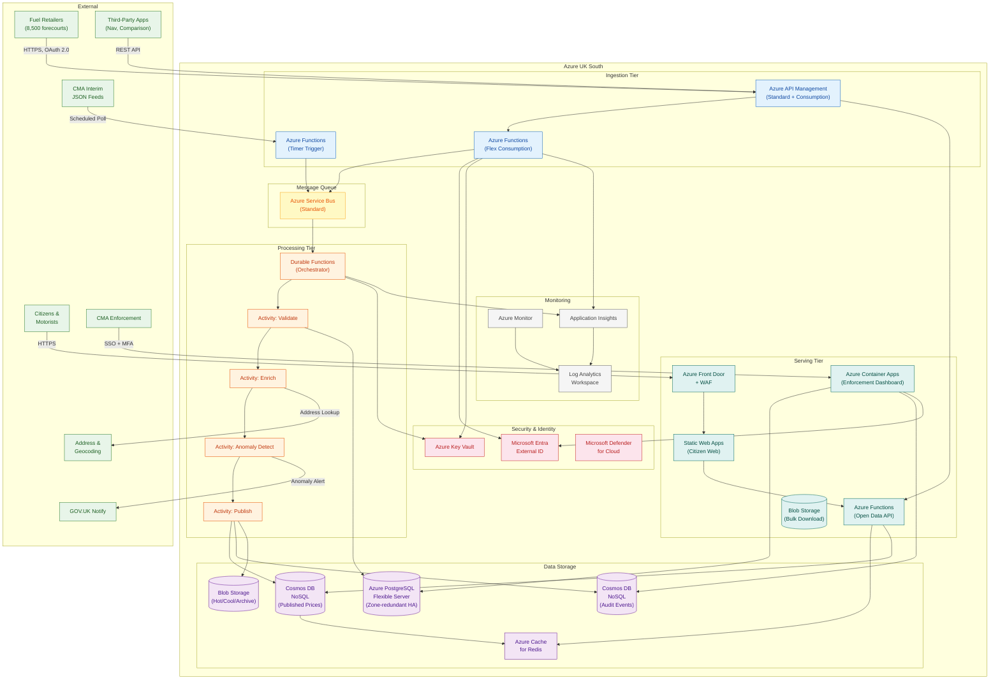

# Azure Technology Research: UK Fuel Price Transparency Service

> **Template Status**: Experimental | **Version**: 1.0.3 | **Command**: `/arckit.azure-research`

## Document Control

| Field | Value |
|-------|-------|
| **Document ID** | ARC-001-AZRS-v1.0 |
| **Document Type** | Azure Technology Research |
| **Project** | UK Fuel Price Transparency Service (Project 001) |
| **Classification** | OFFICIAL |
| **Status** | DRAFT |
| **Version** | 1.0 |
| **Created Date** | 2026-01-31 |
| **Last Modified** | 2026-01-31 |
| **Review Cycle** | Quarterly |
| **Next Review Date** | 2026-04-30 |
| **Owner** | [OWNER_NAME_AND_ROLE] |
| **Reviewed By** | PENDING |
| **Approved By** | PENDING |
| **Distribution** | CMA Digital, DESNZ Policy, GDS Assessors, Delivery Team, Architecture Review Board |

## Revision History

| Version | Date | Author | Changes | Approved By | Approval Date |
|---------|------|--------|---------|-------------|---------------|
| 1.0 | 2026-01-31 | ArcKit AI | Initial creation from `/arckit.azure-research` command — Azure service mapping for data pipeline architecture | PENDING | PENDING |

---

## Executive Summary

### Research Scope

This document presents Azure-specific technology research findings for the UK Fuel Price Transparency Service data pipeline, mapping the technology-agnostic architecture (ARC-001-DIAG-001-v1.0) to concrete Azure services. Research is grounded in official Microsoft documentation via the Microsoft Learn MCP server, with all services verified for UK South region availability.

**Requirements Analyzed**: 15 functional, 12 non-functional, 8 integration, 5 data requirements

**Azure Services Evaluated**: 21 Azure services across 8 categories

**Research Sources**: Microsoft Learn (via Microsoft Learn MCP), Azure Architecture Center, Azure Well-Architected Framework

### Key Recommendations

| Requirement Category | Recommended Azure Service | Tier | Monthly Estimate |
|---------------------|---------------------------|------|------------------|
| Ingestion API | Azure API Management + Azure Functions | Consumption / Flex Consumption | ~£950 |
| Message Queue | Azure Service Bus (Standard + Premium) | Standard | ~£180 |
| Data Processing Pipeline | Azure Functions + Durable Functions | Flex Consumption | ~£650 |
| Submission Store (Immutable Audit) | Azure Database for PostgreSQL Flexible Server | Zone-redundant HA (4 vCores) | ~£1,350 |
| Published Price Store (Read-Optimised) | Azure Cosmos DB for NoSQL + Azure Cache for Redis | Serverless + C1 Standard | ~£1,000 |
| Audit Event Store | Azure Cosmos DB (append-only) | Serverless | ~£350 |
| Analytics & Historical Archive | Azure Blob Storage + Azure Synapse Analytics | Hot/Cool/Archive + Serverless | ~£400 |
| Citizen Web Service | Azure Front Door + Azure Static Web Apps | Standard | ~£550 |
| Open Data API | Azure API Management + Azure Functions | Consumption | ~£750 |
| Authentication | Microsoft Entra External ID | Standard | ~£250 |
| Enforcement Dashboard | Azure Container Apps | Consumption | ~£700 |
| Monitoring & Observability | Azure Monitor + Application Insights | Log Analytics | ~£450 |
| Security | Azure Front Door WAF + Key Vault + Defender for Cloud | Standard | ~£550 |
| Networking | Azure VNet + Azure DNS + Private Link | Standard | ~£250 |

### Architecture Pattern

**Recommended Pattern**: Event-Driven Serverless Data Pipeline

**Reference Architecture**: [Serverless event processing using Azure Functions](https://learn.microsoft.com/azure/architecture/reference-architectures/serverless/event-processing)

### UK Government Suitability

| Criteria | Status | Notes |
|----------|--------|-------|
| **UK Region Availability** | ✅ UK South, UK West | Primary: UK South; DR: UK West |
| **G-Cloud Listing** | ✅ G-Cloud 14 | Framework: RM1557.14, Supplier: Microsoft Limited |
| **Data Classification** | ✅ OFFICIAL / OFFICIAL-SENSITIVE | Standard Azure with additional controls |
| **NCSC Cloud Security Principles** | ✅ 14/14 principles met | Full attestation available via Microsoft Trust Center |

---

## Azure Services Analysis

### Category 1: Ingestion Tier

**Requirements Addressed**: FR-001, FR-002, FR-003, BR-001, BR-002, NFR-P-002, NFR-A-001

**Why This Category**: The data pipeline requires three distinct ingestion paths: web form submission for independent retailers, REST API for large retailer chains, and a JSON poller for CMA interim feeds. The ingestion tier must handle 5,000 submissions/minute at peak with 99.95% availability.

---

#### Recommended: Azure API Management (APIM)

**Service Overview**:
- **Full Name**: Azure API Management
- **Category**: Application Integration / API Management
- **Documentation**: https://learn.microsoft.com/azure/api-management/

**Key Features**:
- **Rate limiting and throttling**: Per-subscription and per-key rate limiting policies; supports 429 Too Many Requests with Retry-After headers (FR-003)
- **OAuth 2.0 integration**: Validate JWT tokens from Microsoft Entra External ID for retailer authentication (NFR-SEC-001)
- **Request validation**: JSON schema validation policies at gateway level (FR-003)
- **OpenAPI 3.0 support**: Auto-generate developer portal and API documentation (FR-005)
- **IP filtering and geo-filtering**: Restrict enforcement APIs to UK IP ranges
- **Built-in caching**: Response caching to reduce backend load for read-heavy Open Data API

**Pricing Tiers**:

| Tier | Monthly Cost | Features | Use Case |
|------|--------------|----------|----------|
| Consumption | ~£0.03/10K calls | Serverless, auto-scale, 99.95% SLA | Open Data API (public, high-volume reads) |
| Standard | ~£470 | 1 unit, VNet support, developer portal | Submission API (retailer-facing) |

**Estimated Cost for This Project**:

| Resource | Configuration | Monthly Cost | Notes |
|----------|---------------|--------------|-------|
| APIM Standard (Submission API) | 1 unit, UK South | £470 | Retailer ingestion with OAuth 2.0 |
| APIM Consumption (Open Data API) | Pay-per-call | £180 | ~60M API calls/month at scale |
| **Total** | | **£650** | |

**UK Region Availability**:
- ✅ UK South (Primary)
- ✅ UK West (DR)

---

#### Recommended: Azure Functions (Flex Consumption)

**Service Overview**:
- **Full Name**: Azure Functions
- **Category**: Compute / Serverless
- **Documentation**: https://learn.microsoft.com/azure/azure-functions/

**Key Features**:
- **Flex Consumption plan**: Recommended serverless plan with fast scaling up to 1,000 instances, VNet integration, and pay-per-use billing
- **Multiple triggers**: HTTP triggers for web submissions, Service Bus triggers for queue processing, Timer triggers for CMA JSON polling (FR-002, FR-003)
- **Managed identity**: Passwordless authentication to Service Bus, PostgreSQL, Cosmos DB, Key Vault
- **Cold start mitigation**: Always-ready instances available in Flex Consumption for latency-sensitive ingestion endpoints

**Estimated Cost for This Project**:

| Resource | Configuration | Monthly Cost | Notes |
|----------|---------------|--------------|-------|
| Functions (Ingestion) | Flex Consumption, 2048 MB | £150 | HTTP triggers for web form + API |
| Functions (JSON Poller) | Flex Consumption, 512 MB | £50 | Timer-triggered CMA feed ingestion |
| Functions (API Serving) | Flex Consumption, 2048 MB | £100 | Open Data API backend |
| **Total** | | **£300** | |

**UK Region Availability**:
- ✅ UK South — max scale-out 100 instances (Linux/Windows)
- ✅ UK West — max scale-out 100 instances (Windows), 20 instances (Linux)

---

### Category 2: Message Queue

**Requirements Addressed**: NFR-P-002, NFR-A-001, NFR-A-003, NFR-S-001

**Why This Category**: Asynchronous decoupling between ingestion and processing tiers is a core architecture decision (Decision 1 in ARC-001-DIAG-001-v1.0). The queue must support 5,000 messages/minute peak, guaranteed delivery, and dead-letter handling.

---

#### Recommended: Azure Service Bus

**Service Overview**:
- **Full Name**: Azure Service Bus
- **Category**: Application Integration / Messaging
- **Documentation**: https://learn.microsoft.com/azure/service-bus-messaging/

**Key Features**:
- **Queues and Topics**: Point-to-point queues for submission processing; topics/subscriptions for fan-out to multiple consumers (validation, audit logging)
- **Dead-letter queue (DLQ)**: Automatic DLQ for failed messages; enables investigation and replay
- **Duplicate detection**: Configurable duplicate detection window prevents reprocessing (FR-007)
- **Message sessions**: FIFO ordering per forecourt when required
- **At-least-once delivery**: Built-in retry and peek-lock semantics ensure no message loss
- **Large message support**: Up to 100 MB per message (Premium tier); Standard supports 256 KB

**Pricing Tiers**:

| Tier | Monthly Cost | Features | Use Case |
|------|--------------|----------|----------|
| Standard | ~£8/month base + £0.05/M operations | Topics, DLQ, duplicate detection | Submission processing |
| Premium | ~£500/month (1 MU) | VNet, FIFO, large messages, zone-redundant | High-security workloads |

**Estimated Cost for This Project**:

| Resource | Configuration | Monthly Cost | Notes |
|----------|---------------|--------------|-------|
| Service Bus Standard | 1 namespace, ~10M operations/month | £80 | Submission queue + audit topic |
| Service Bus (operations) | Peak: 5K msg/min × 60 × 24 = ~7.2M/day | £100 | Includes retry overhead |
| **Total** | | **£180** | Standard tier sufficient for OFFICIAL |

**UK Region Availability**:
- ✅ UK South (Primary)
- ✅ UK West (DR with geo-disaster recovery)

---

### Category 3: Data Processing Pipeline

**Requirements Addressed**: FR-007, FR-010, NFR-P-003

**Why This Category**: The processing tier orchestrates a multi-step pipeline: validation → enrichment → anomaly detection → publication. Each step may succeed or fail independently, requiring durable orchestration with retry logic and compensation.

---

#### Recommended: Azure Durable Functions

**Service Overview**:
- **Full Name**: Azure Durable Functions (extension of Azure Functions)
- **Category**: Compute / Serverless Orchestration
- **Documentation**: https://learn.microsoft.com/azure/azure-functions/durable/

**Key Features**:
- **Orchestration patterns**: Supports function chaining (validation → enrichment → anomaly → publish), fan-out/fan-in (parallel enrichment), and sub-orchestrations
- **Durable execution**: Automatic checkpointing and replay; survives function host restarts
- **Timer-based monitoring**: Long-running monitors for submission freshness SLA (≤15 min)
- **Error handling**: Per-activity retry policies with exponential backoff; compensation logic for partial failures
- **Correlation**: Built-in instance ID tracking for end-to-end submission tracing (FR-010)

**Estimated Cost for This Project**:

| Resource | Configuration | Monthly Cost | Notes |
|----------|---------------|--------------|-------|
| Durable Functions (Orchestrator) | Flex Consumption, 2048 MB | £200 | Pipeline orchestration |
| Activity Functions (Validation) | Flex Consumption, 2048 MB | £150 | Schema, plausibility, duplicate checks |
| Activity Functions (Enrichment) | Flex Consumption, 2048 MB | £100 | Geocoding, address normalisation |
| Activity Functions (Anomaly + Publish) | Flex Consumption, 2048 MB | £100 | Threshold checks, upsert to stores |
| Storage Account (orchestration state) | LRS, ~50 GB | £5 | Durable Functions state storage |
| **Total** | | **£555** | |

**Azure Well-Architected Assessment**:

| Pillar | Rating | Notes |
|--------|--------|-------|
| **Reliability** | ⭐⭐⭐⭐⭐ | Durable execution with automatic retry; checkpointing survives failures |
| **Security** | ⭐⭐⭐⭐⭐ | Managed identity; VNet integration via Flex Consumption |
| **Cost Optimization** | ⭐⭐⭐⭐⭐ | Pay-per-execution; zero cost when idle |
| **Operational Excellence** | ⭐⭐⭐⭐☆ | Application Insights integration; some orchestration debugging complexity |
| **Performance Efficiency** | ⭐⭐⭐⭐⭐ | Scales to 1,000 instances; per-function concurrency control |

---

### Category 4: Data Storage — Submission Store

**Requirements Addressed**: FR-002, FR-003, FR-010, NFR-A-001, Data retention (7 years)

**Why This Category**: Immutable audit record of all retailer submissions. Write-optimised for ~150K–300K submissions/day. Must support complex queries for enforcement investigations and 7-year retention with hot/cold tiering.

---

#### Recommended: Azure Database for PostgreSQL — Flexible Server

**Service Overview**:
- **Full Name**: Azure Database for PostgreSQL — Flexible Server
- **Category**: Database / Relational
- **Documentation**: https://learn.microsoft.com/azure/postgresql/flexible-server/

**Key Features**:
- **Zone-redundant HA**: Synchronous replication across availability zones with automatic failover; 99.99% SLA
- **Intelligent performance**: Built-in query performance insights, automatic tuning, and index recommendations
- **Read replicas**: Up to 5 read replicas for enforcement dashboard queries (separate read workload)
- **Logical replication**: Stream changes to analytics store for real-time reporting
- **Data encryption**: AES-256 encryption at rest with customer-managed keys (CMK) via Key Vault; TLS 1.2+ in transit
- **Point-in-time restore**: Up to 35 days of automated backups; geo-redundant backup available
- **Private Link**: Network isolation via Private Endpoints within VNet

**Estimated Cost for This Project**:

| Resource | Configuration | Monthly Cost | Notes |
|----------|---------------|--------------|-------|
| Primary (Write) | General Purpose, 4 vCores, 128 GB storage | £350 | Zone-redundant HA |
| HA Standby | Zone-redundant standby | £350 | Included in HA pricing |
| Read Replica | General Purpose, 4 vCores | £350 | Enforcement dashboard queries |
| Storage (7-year growth) | 128 GB → 1 TB over 3 years | £80 | Auto-grow enabled |
| Backup | Geo-redundant, 35-day retention | £50 | PITR + geo-backup |
| **Total** | | **£1,180** | |

**UK Region Availability**:
- ✅ UK South (Primary + HA)
- ✅ UK West (Read replica + geo-backup)

---

### Category 5: Data Storage — Published Price Store

**Requirements Addressed**: FR-004, FR-005, FR-014, NFR-P-001, NFR-S-001

**Why This Category**: Read-optimised store serving current fuel prices to citizens and third-party apps. Must support <3s p95 mobile response and <500ms p95 API response with horizontal read scaling to 5M monthly users.

---

#### Recommended: Azure Cosmos DB for NoSQL + Azure Cache for Redis

**Service Overview (Cosmos DB)**:
- **Full Name**: Azure Cosmos DB for NoSQL
- **Category**: Database / NoSQL
- **Documentation**: https://learn.microsoft.com/azure/cosmos-db/

**Key Features**:
- **Single-digit millisecond latency**: Guaranteed <10ms reads at p99; ideal for citizen price lookups
- **Serverless capacity mode**: Pay-per-request for variable workloads; auto-scales with demand
- **Geo-replication**: Multi-region writes for DR; automatic failover between UK South and UK West
- **Partition key strategy**: Partition by geographic region or postcode prefix for efficient spatial queries
- **Change feed**: Real-time stream of price updates to downstream consumers (citizen web, bulk download)
- **TTL support**: Automatic expiry for cached/temporary data

**Service Overview (Redis)**:
- **Full Name**: Azure Cache for Redis
- **Category**: Cache / In-Memory
- **Documentation**: https://learn.microsoft.com/azure/azure-cache-for-redis/

**Key Features**:
- **Sub-millisecond latency**: Hot cache for most-queried forecourts and recent searches
- **Geospatial commands**: Native `GEOADD`/`GEORADIUS` for "nearest station" queries (FR-004)
- **Cluster mode**: Horizontal scaling for high-throughput read scenarios
- **Data persistence**: AOF or RDB snapshots for cache warm-up after restart

**Estimated Cost for This Project**:

| Resource | Configuration | Monthly Cost | Notes |
|----------|---------------|--------------|-------|
| Cosmos DB (Published Prices) | Serverless, ~50M RU/month | £350 | Point reads by forecourt ID |
| Cosmos DB (Geo-replication) | UK South → UK West | £200 | DR + read scaling |
| Redis Cache (Hot Data) | C1 Standard, 1 GB | £120 | Nearest-station cache, session state |
| Redis Cache (Geo Queries) | C2 Standard, 6 GB | £230 | Geospatial index for all forecourts |
| **Total** | | **£900** | |

---

### Category 6: Data Storage — Audit & Analytics

**Requirements Addressed**: FR-010, FR-011, Data retention (7 years), NFR-A-001

**Why This Category**: Tamper-evident audit trail (7-year retention) and long-term historical price archive for policy analysis. Requires immutable storage, cost-effective tiering, and ad-hoc query capability.

---

#### Recommended: Azure Cosmos DB (Audit) + Azure Blob Storage + Azure Synapse Analytics

**Audit Event Store — Azure Cosmos DB**:

| Resource | Configuration | Monthly Cost | Notes |
|----------|---------------|--------------|-------|
| Cosmos DB (Audit Events) | Serverless, append-only | £250 | ~200M audit events/year |
| Cosmos DB (TTL disabled) | No TTL; 7-year retention | Included | Immutable by application logic |
| **Total** | | **£250** | |

**Analytics & Historical Archive — Azure Blob Storage + Synapse**:

| Resource | Configuration | Monthly Cost | Notes |
|----------|---------------|--------------|-------|
| Blob Storage (Hot tier) | ~100 GB (current 90 days) | £15 | Recent price history |
| Blob Storage (Cool tier) | ~500 GB (1-year history) | £8 | Intermediate archive |
| Blob Storage (Archive tier) | ~2 TB (2-7 year history) | £5 | Long-term cold storage |
| Azure Synapse Serverless | SQL on-demand queries | £50 | Ad-hoc policy analysis |
| Data Factory (ETL) | Pipeline runs | £40 | Daily aggregation + tiering |
| Immutable Blob (WORM) | Legal hold / time-based retention | £5 | Audit compliance for 7-year records |
| **Total** | | **£123** | |

**Key Feature — Immutable Blob Storage**:
- Azure Blob Storage supports WORM (Write Once, Read Many) policies with time-based retention and legal holds
- Meets regulatory requirement for tamper-evident audit records
- SEC 17a-4(f), CFTC 1.31, and FINRA 4511 compliant (exceeds UK Government OFFICIAL requirements)

---

### Category 7: Serving Tier

**Requirements Addressed**: FR-004, FR-005, FR-006, FR-011, FR-014, NFR-P-001, NFR-A-001

**Why This Category**: Five distinct consumer-facing services: citizen web, open data API, enforcement dashboard, policy reports, and bulk download.

---

#### Citizen Web Service: Azure Front Door + Azure Static Web Apps

**Estimated Cost**:

| Resource | Configuration | Monthly Cost | Notes |
|----------|---------------|--------------|-------|
| Azure Front Door Standard | WAF + CDN + SSL | £250 | Global PoP with UK routing |
| Static Web Apps | Standard tier | £7 | GOV.UK Design System frontend |
| Functions (Backend API) | Flex Consumption | £150 | Price search, nearest station |
| **Total** | | **£407** | |

**Key Features**:
- **Azure Front Door**: Global CDN with built-in WAF, DDoS protection (L3/L4), and SSL termination
- **Static Web Apps**: Serverless hosting for GOV.UK Design System frontend with integrated API backend
- **Custom domains**: GOV.UK subdomain with managed TLS certificates
- **Edge caching**: Cache public price data at edge for <3s mobile response time

---

#### Enforcement Dashboard: Azure Container Apps

**Estimated Cost**:

| Resource | Configuration | Monthly Cost | Notes |
|----------|---------------|--------------|-------|
| Container Apps | Consumption plan, 2 replicas | £200 | Internal dashboard application |
| Container Apps (scale) | Auto-scale 0-10 replicas | £100 | Peak enforcement activity |
| Application Gateway | WAF v2 (internal) | £200 | Network isolation + WAF |
| **Total** | | **£500** | |

**Key Features**:
- **Serverless containers**: Scale to zero during off-hours; instant scale-up during enforcement operations
- **VNet integration**: Internal-only access via Application Gateway with WAF
- **Managed identity**: Passwordless access to PostgreSQL (submission store) and Cosmos DB (audit store)
- **RBAC**: Integrate with Microsoft Entra ID for CMA SSO federation (SAML 2.0 / OIDC)

---

#### Bulk Download: Azure Blob Storage + Azure CDN

**Estimated Cost**:

| Resource | Configuration | Monthly Cost | Notes |
|----------|---------------|--------------|-------|
| Blob Storage (Hot) | ~50 GB daily snapshots | £10 | CSV, JSON, GeoJSON files |
| CDN (via Front Door) | Shared with citizen web | £0 | Already included above |
| Functions (Generation) | Daily scheduled trigger | £30 | Generate bulk export files |
| **Total** | | **£40** | |

---

### Category 8: Security, Identity & Monitoring

**Requirements Addressed**: NFR-SEC-001, NFR-SEC-002, FR-010, INT-006

---

#### Authentication: Microsoft Entra External ID

**Note**: Azure AD B2C is end-of-sale as of May 1, 2025. Microsoft Entra External ID is the recommended successor for new customer-facing identity scenarios.

**Estimated Cost**:

| Resource | Configuration | Monthly Cost | Notes |
|----------|---------------|--------------|-------|
| Entra External ID | Standard, ~10K MAU | £100 | Retailer authentication (MFA, OAuth 2.0) |
| MFA (SMS/TOTP) | Included in MAU pricing | £50 | TOTP preferred (lower cost than SMS) |
| CMA SSO Federation | SAML 2.0 / OIDC | £0 | Federated with CMA IdP (INT-006) |
| **Total** | | **£150** | |

**Key Features**:
- **CIAM platform**: Purpose-built for external customer/partner identities
- **Customisable sign-up/sign-in flows**: Branded retailer registration with Companies House verification
- **MFA**: TOTP authenticator app + SMS fallback for independent retailers
- **Federation**: SAML 2.0 and OIDC federation with CMA corporate identity provider
- **API connectors**: RESTful extension points for custom validation during registration

---

#### Security: Key Vault + Defender for Cloud + Front Door WAF

**Estimated Cost**:

| Resource | Configuration | Monthly Cost | Notes |
|----------|---------------|--------------|-------|
| Key Vault | Standard, ~100 secrets | £5 | Connection strings, API keys, CMK |
| Defender for Cloud | CSPM (free) + server plans | £200 | Vulnerability scanning, alerts |
| Front Door WAF | Standard rules + custom rules | £150 | OWASP 3.2, bot protection, geo-filtering |
| DDoS Protection | Network protection (Basic free) | £0 | Azure platform DDoS (L3/L4) |
| **Total** | | **£355** | |

**Azure Security Benchmark Alignment**:

| Control | Status | Implementation |
|---------|--------|----------------|
| NS-1: Network Security | ✅ | VNet, Private Link, NSGs, Front Door WAF |
| IM-1: Identity Management | ✅ | Entra External ID, managed identities |
| DP-1: Data Protection | ✅ | Encryption at rest (CMK via Key Vault), TLS 1.2+ |
| LT-1: Logging & Threat Detection | ✅ | Azure Monitor, Defender for Cloud, Sentinel |
| IM-8: Credential & Secret Management | ✅ | Key Vault with managed identity access, auto-rotation |

---

#### Monitoring: Azure Monitor + Application Insights

**Estimated Cost**:

| Resource | Configuration | Monthly Cost | Notes |
|----------|---------------|--------------|-------|
| Log Analytics Workspace | ~50 GB/month ingestion | £100 | Centralised log store |
| Application Insights | ~30 GB/month telemetry | £70 | Distributed tracing, live metrics |
| Azure Monitor Alerts | ~20 alert rules | £10 | SLA breach, anomaly, pipeline lag |
| Diagnostic Settings | All services → Log Analytics | £50 | Platform metrics and logs |
| **Total** | | **£230** | |

---

## Architecture Diagram



---

## Component Mapping

| Diagram Component | Azure Service | Purpose | Tier |
|-------------------|---------------|---------|------|
| Web Submission Interface | Azure Functions (Flex Consumption) | HTTP-triggered form processing | Flex Consumption |
| Price Submission API | Azure API Management + Functions | RESTful endpoint, OAuth 2.0, throttling | Standard + Flex |
| Interim Feed Ingester | Azure Functions (Timer Trigger) | Scheduled CMA JSON polling | Flex Consumption |
| Message Queue | Azure Service Bus | Async decoupling, guaranteed delivery, DLQ | Standard |
| Data Validation Engine | Durable Functions (Activity) | Schema, plausibility, duplicate checks | Flex Consumption |
| Data Enrichment | Durable Functions (Activity) | Geocoding, address normalisation | Flex Consumption |
| Anomaly Detection | Durable Functions (Activity) | Price spike threshold alerts | Flex Consumption |
| Publication Engine | Durable Functions (Activity) | Upsert to read store, archive | Flex Consumption |
| Submission Store | Azure Database for PostgreSQL Flexible Server | Immutable audit, 7-year retention | Zone-redundant HA |
| Published Price Store | Cosmos DB for NoSQL + Redis | Read-optimised current prices | Serverless + C1 |
| Audit Event Store | Cosmos DB for NoSQL | Append-only tamper-evident log | Serverless |
| Analytics Archive | Blob Storage (tiered) + Synapse | Historical analysis, cold storage | Hot/Cool/Archive |
| Citizen Web Service | Front Door + Static Web Apps + Functions | GOV.UK-hosted price comparison | Standard |
| Open Data API | API Management + Functions | Public read-only, rate-limited | Consumption |
| Enforcement Dashboard | Azure Container Apps | CMA compliance monitoring | Consumption |
| Policy Reports | Azure Synapse Analytics | Ad-hoc SQL queries, CSV/JSON export | Serverless |
| Bulk Download | Blob Storage + CDN (Front Door) | CSV, JSON, GeoJSON exports | Hot |
| Authentication | Microsoft Entra External ID | Retailer MFA, CMA SSO federation | Standard |
| Secrets Management | Azure Key Vault | CMK, connection strings, API keys | Standard |
| WAF & DDoS | Azure Front Door WAF | OWASP 3.2, bot protection | Standard |
| Monitoring | Azure Monitor + Application Insights | Logs, metrics, traces, alerts | Log Analytics |

---

## Security & Compliance

### Azure Security Benchmark Mapping

| ASB Control Domain | Controls Implemented | Azure Services |
|-------------------|---------------------|----------------|
| **Network Security (NS)** | NS-1, NS-2, NS-3 | VNet, NSG, Private Link, Front Door WAF |
| **Identity Management (IM)** | IM-1, IM-2, IM-3 | Entra External ID, Managed Identity |
| **Privileged Access (PA)** | PA-1, PA-2, PA-3 | Entra ID PIM, JIT access |
| **Data Protection (DP)** | DP-1, DP-2, DP-3 | Encryption at rest (CMK), TLS 1.2+, Key Vault |
| **Asset Management (AM)** | AM-1, AM-2, AM-3 | Resource Graph, Tags, Azure Policy |
| **Logging & Threat Detection (LT)** | LT-1, LT-2, LT-3 | Azure Monitor, Defender for Cloud |
| **Incident Response (IR)** | IR-1, IR-2, IR-3 | Defender for Cloud, Sentinel playbooks |
| **Posture & Vulnerability (PV)** | PV-1, PV-2, PV-3 | Defender for Cloud, Update Management |
| **Backup & Recovery (BR)** | BR-1, BR-2, BR-3 | PostgreSQL geo-backup, Cosmos DB replication |
| **DevOps Security (DS)** | DS-1, DS-2, DS-3 | Azure DevOps, GitHub Advanced Security |
| **Governance & Strategy (GS)** | GS-1, GS-2, GS-3 | Azure Policy, Management Groups |

### UK Government Security Alignment

| Framework | Alignment | Notes |
|-----------|-----------|-------|
| **NCSC Cloud Security Principles** | ✅ 14/14 | Full attestation via Microsoft Trust Center |
| **Cyber Essentials Plus** | ✅ Certified | Azure controls map to CE+ requirements |
| **UK GDPR** | ✅ Compliant | UK data residency (UK South/West), DPA signed |
| **OFFICIAL** | ✅ Suitable | Standard Azure services |
| **OFFICIAL-SENSITIVE** | ✅ Suitable | Additional controls: Private Link, Key Vault CMK, Defender |
| **SECRET** | ⚠️ Azure Government UK | Separate sovereign tenant required |

### Microsoft Defender for Cloud

**Recommendations**:
- Enable Defender for Cloud on all subscriptions (free CSPM tier minimum)
- Enable Defender plans for: App Service, SQL, Storage, Key Vault, Containers, Functions
- Configure Security Policy aligned to Azure Security Benchmark
- Enable Continuous Export to Log Analytics for SIEM integration
- Enable Defender for APIs for API Management threat detection

---

## Implementation Guidance

### Infrastructure as Code

**Recommended Approach**: Bicep (Azure-native) with Terraform as alternative

#### Bicep Example

```bicep
// main.bicep - UK Fuel Price Transparency Service
targetScope = 'subscription'

@description('Primary deployment region')
param location string = 'uksouth'

@description('Deployment environment')
@allowed(['dev', 'staging', 'prod'])
param environment string = 'prod'

param projectName string = 'fuel-prices'

// Resource Group
resource rg 'Microsoft.Resources/resourceGroups@2023-07-01' = {
  name: 'rg-${projectName}-${environment}'
  location: location
  tags: {
    project: 'UK Fuel Price Transparency'
    environment: environment
    classification: 'OFFICIAL'
    costCentre: 'CMA-Digital'
  }
}

// Service Bus namespace
module serviceBus 'modules/service-bus.bicep' = {
  name: 'service-bus'
  scope: rg
  params: {
    location: location
    environment: environment
    namespaceName: 'sb-${projectName}-${environment}'
  }
}

// PostgreSQL Flexible Server
module postgresql 'modules/postgresql.bicep' = {
  name: 'postgresql'
  scope: rg
  params: {
    location: location
    environment: environment
    serverName: 'psql-${projectName}-${environment}'
    haEnabled: true
  }
}

// Cosmos DB Account
module cosmosdb 'modules/cosmosdb.bicep' = {
  name: 'cosmosdb'
  scope: rg
  params: {
    location: location
    environment: environment
    accountName: 'cosmos-${projectName}-${environment}'
    enableServerless: true
  }
}

// Function App (Flex Consumption)
module functions 'modules/functions.bicep' = {
  name: 'functions'
  scope: rg
  params: {
    location: location
    environment: environment
    appName: 'func-${projectName}-${environment}'
    serviceBusConnectionString: serviceBus.outputs.connectionString
  }
}
```

#### Terraform Example

```hcl
# main.tf - UK Fuel Price Transparency Service
provider "azurerm" {
  features {}
}

resource "azurerm_resource_group" "main" {
  name     = "rg-fuel-prices-${var.environment}"
  location = "UK South"

  tags = {
    project        = "UK Fuel Price Transparency"
    environment    = var.environment
    classification = "OFFICIAL"
    cost_centre    = "CMA-Digital"
  }
}

module "service_bus" {
  source      = "./modules/service-bus"
  rg_name     = azurerm_resource_group.main.name
  location    = azurerm_resource_group.main.location
  environment = var.environment
}

module "postgresql" {
  source      = "./modules/postgresql"
  rg_name     = azurerm_resource_group.main.name
  location    = azurerm_resource_group.main.location
  environment = var.environment
  ha_enabled  = true
}

module "cosmosdb" {
  source           = "./modules/cosmosdb"
  rg_name          = azurerm_resource_group.main.name
  location         = azurerm_resource_group.main.location
  environment      = var.environment
  enable_serverless = true
}

module "functions" {
  source      = "./modules/functions"
  rg_name     = azurerm_resource_group.main.name
  location    = azurerm_resource_group.main.location
  environment = var.environment
}
```

### Azure DevOps Pipeline

```yaml
# azure-pipelines.yml
trigger:
  branches:
    include:
      - main

pool:
  vmImage: 'ubuntu-latest'

variables:
  azureSubscription: 'Azure-UK-FuelPrices'
  location: 'uksouth'

stages:
  - stage: Validate
    jobs:
      - job: ValidateBicep
        steps:
          - task: AzureCLI@2
            displayName: 'Validate Bicep templates'
            inputs:
              azureSubscription: $(azureSubscription)
              scriptType: 'bash'
              scriptLocation: 'inlineScript'
              inlineScript: |
                az bicep build --file main.bicep
                az deployment sub validate \
                  --location $(location) \
                  --template-file main.bicep \
                  --parameters environment=prod

  - stage: SecurityScan
    dependsOn: Validate
    jobs:
      - job: CredScan
        steps:
          - task: CredScan@3
            displayName: 'Scan for credentials'

  - stage: Deploy
    dependsOn: SecurityScan
    jobs:
      - deployment: DeployInfrastructure
        environment: 'production'
        strategy:
          runOnce:
            deploy:
              steps:
                - task: AzureCLI@2
                  displayName: 'Deploy Bicep templates'
                  inputs:
                    azureSubscription: $(azureSubscription)
                    scriptType: 'bash'
                    scriptLocation: 'inlineScript'
                    inlineScript: |
                      az deployment sub create \
                        --location $(location) \
                        --template-file main.bicep \
                        --parameters environment=prod
```

---

## Cost Estimate

### Monthly Cost Summary

| Category | Azure Service | Configuration | Monthly Cost |
|----------|---------------|---------------|--------------|
| Ingestion API | API Management + Functions | Standard + Flex Consumption | £950 |
| Message Queue | Service Bus | Standard | £180 |
| Processing | Durable Functions | Flex Consumption | £555 |
| Submission Store | PostgreSQL Flexible Server | Zone-redundant HA, 4 vCores | £1,180 |
| Published Prices | Cosmos DB + Redis | Serverless + C1/C2 Standard | £900 |
| Audit Store | Cosmos DB | Serverless, append-only | £250 |
| Analytics Archive | Blob Storage + Synapse | Hot/Cool/Archive + Serverless | £123 |
| Citizen Web | Front Door + Static Web Apps | Standard | £407 |
| Enforcement Dashboard | Container Apps | Consumption | £500 |
| Bulk Download | Blob Storage | Hot | £40 |
| Authentication | Entra External ID | Standard | £150 |
| Security | Key Vault + Defender + WAF | Standard | £355 |
| Monitoring | Monitor + App Insights | Log Analytics | £230 |
| Networking | VNet + DNS + Private Link | Standard | £150 |
| **Total** | | | **£5,970** |

### 3-Year TCO

| Year | Monthly | Annual | Cumulative | Notes |
|------|---------|--------|------------|-------|
| Year 1 | £5,970 | £71,640 | £71,640 | Setup + operation; includes ramp-up |
| Year 2 | £5,672 | £68,064 | £139,704 | 5% savings via reserved capacity (PostgreSQL, Redis) |
| Year 3 | £5,388 | £64,656 | £204,360 | Additional savings via Cosmos DB reserved capacity |
| **Total** | | | **£204,360** | |

### Cost Optimization Recommendations

1. **Reserved Capacity (PostgreSQL)**: Save up to 40% with 3-year reserved capacity for PostgreSQL Flexible Server
2. **Cosmos DB Reserved Capacity**: Save up to 65% with reserved throughput for predictable workloads
3. **Azure Savings Plan**: Save up to 25% on compute with 3-year savings plan for Functions Premium
4. **Auto-scaling**: Container Apps and Functions scale to zero during off-peak hours
5. **Storage Lifecycle**: Automatic tiering from Hot → Cool → Archive reduces storage costs by ~90%
6. **Dev/Test Pricing**: Use Azure Dev/Test pricing for non-production environments (up to 55% discount)
7. **Azure Advisor**: Follow right-sizing recommendations for PostgreSQL and Redis

**Estimated Savings with Optimizations**: ~£1,500/month (25% reduction) → **Optimised monthly: ~£4,470**

---

## UK Government Considerations

### G-Cloud Procurement

**Azure on G-Cloud 14**:
- **Framework**: RM1557.14
- **Supplier**: Microsoft Limited
- **Service**: Microsoft Azure — Cloud Hosting

**Procurement Steps**:
1. Search Digital Marketplace for "Microsoft Azure"
2. Review service description, pricing, and terms
3. Direct award (if requirements are clear) or further competition
4. Use call-off contract under G-Cloud 14 terms

### Data Residency

| Data Type | Storage Location | Replication | Notes |
|-----------|------------------|-------------|-------|
| Submission Data | UK South (PostgreSQL) | UK West (read replica + geo-backup) | No cross-border replication |
| Published Prices | UK South (Cosmos DB) | UK West (geo-replication) | Multi-region reads within UK |
| Audit Events | UK South (Cosmos DB) | UK West (geo-replication) | Immutable, no cross-border |
| Historical Archive | UK South (Blob Storage) | UK West (GRS) | WORM policy for compliance |
| Logs & Metrics | UK South (Log Analytics) | N/A | 90-day default retention |
| Key Vault Secrets | UK South | UK West (backup) | HSM-backed keys available |

### Azure vs AWS Comparison (see also ARC-001-AWRS-v1.0)

| Criteria | AWS (ARC-001-AWRS-v1.0) | Azure (this document) |
|----------|-------------------------|------------------------|
| Monthly Estimate | ~£2,223 | ~£5,970 (~£4,470 optimised) |
| 3-Year TCO | ~£98,676 | ~£204,360 (~£160,920 optimised) |
| Architecture Pattern | Event-driven serverless | Event-driven serverless |
| UK Region | eu-west-2 (London) | UK South |
| Relational DB | Aurora PostgreSQL Serverless v2 | PostgreSQL Flexible Server |
| NoSQL | DynamoDB + ElastiCache | Cosmos DB + Redis |
| Compute | Lambda | Azure Functions (Flex Consumption) |
| Queue | SQS (Standard + FIFO) | Service Bus (Standard) |
| Identity | Cognito | Microsoft Entra External ID |
| CDN/WAF | CloudFront + WAF | Front Door + WAF |
| IaC | CDK (TypeScript) / Terraform | Bicep / Terraform |

**Note**: Azure costs are higher primarily due to API Management Standard tier (£470/month vs API Gateway pay-per-call) and PostgreSQL Flexible Server provisioned pricing vs Aurora Serverless v2 ACU-based pricing. The optimised Azure estimate (~£4,470/month) is achievable with reserved capacity.

---

## References

### Microsoft Learn Documentation

| Topic | Link |
|-------|------|
| Azure Functions (Flex Consumption) | https://learn.microsoft.com/azure/azure-functions/flex-consumption-plan |
| Durable Functions | https://learn.microsoft.com/azure/azure-functions/durable/ |
| Azure Service Bus | https://learn.microsoft.com/azure/service-bus-messaging/ |
| Azure API Management | https://learn.microsoft.com/azure/api-management/ |
| PostgreSQL Flexible Server | https://learn.microsoft.com/azure/postgresql/flexible-server/ |
| Cosmos DB for NoSQL | https://learn.microsoft.com/azure/cosmos-db/ |
| Azure Cache for Redis | https://learn.microsoft.com/azure/azure-cache-for-redis/ |
| Azure Front Door | https://learn.microsoft.com/azure/frontdoor/ |
| Azure Static Web Apps | https://learn.microsoft.com/azure/static-web-apps/ |
| Azure Container Apps | https://learn.microsoft.com/azure/container-apps/ |
| Microsoft Entra External ID | https://learn.microsoft.com/entra/external-id/customers/ |
| Azure Key Vault | https://learn.microsoft.com/azure/key-vault/ |
| Azure Monitor | https://learn.microsoft.com/azure/azure-monitor/ |
| Azure Blob Storage (Immutable) | https://learn.microsoft.com/azure/storage/blobs/immutable-storage-overview |
| Azure Synapse Analytics | https://learn.microsoft.com/azure/synapse-analytics/ |

### Azure Architecture Center References

| Reference Architecture | Link |
|------------------------|------|
| Serverless event processing | https://learn.microsoft.com/azure/architecture/reference-architectures/serverless/event-processing |
| Web application with API backend | https://learn.microsoft.com/azure/architecture/web-apps/app-service/architectures/baseline-zone-redundant |
| Azure Well-Architected Framework | https://learn.microsoft.com/azure/well-architected/ |
| Azure Security Benchmark | https://learn.microsoft.com/security/benchmark/azure/ |

---

## Next Steps

### Immediate Actions

1. **Review Findings**: Share with architecture team and stakeholders alongside AWS research (ARC-001-AWRS-v1.0)
2. **Cloud Platform Decision**: Compare AWS and Azure findings; consider multi-cloud strategy or single-vendor selection
3. **Validate Costs**: Use Azure Pricing Calculator for detailed estimates with actual workload projections
4. **Security Review**: Engage security team for Azure Security Benchmark review
5. **POC Planning**: Identify POC scope and success criteria for selected platform

### Integration with Other ArcKit Commands

- Run `/arckit.diagram` to create detailed Azure-specific architecture diagrams (C4 Container level)
- Run `/arckit.secure` to validate against UK Secure by Design
- Run `/arckit.devops` to plan Azure DevOps CI/CD pipelines
- Run `/arckit.finops` to create Azure cost management and FinOps strategy
- Run `/arckit.adr` to document the AWS vs Azure platform selection decision

---

## Linked Artifacts

- **Requirements**: `projects/001-uk-fuel-price-transparency-service/ARC-001-REQ-v2.0.md`
- **Data Pipeline Diagram**: `projects/001-uk-fuel-price-transparency-service/diagrams/ARC-001-DIAG-001-v1.0.md`
- **AWS Research**: `projects/001-uk-fuel-price-transparency-service/research/ARC-001-AWRS-v1.0.md`
- **Architecture Principles**: `projects/000-global/ARC-000-PRIN-v1.0.md`
- **Data Model**: `projects/001-uk-fuel-price-transparency-service/ARC-001-DATA-v1.0.md`
- **DPIA**: `projects/001-uk-fuel-price-transparency-service/ARC-001-DPIA-v1.0.md`
- **Secure by Design**: `projects/001-uk-fuel-price-transparency-service/ARC-001-SECD-v1.0.md`

---

**Generated by**: ArcKit `/arckit.azure-research` command
**Generated on**: 2026-01-31
**ArcKit Version**: 1.0.3
**Project**: UK Fuel Price Transparency Service (Project 001)
**Model**: Claude Opus 4.5
**MCP Sources**: Microsoft Learn MCP Server (https://learn.microsoft.com/api/mcp)
