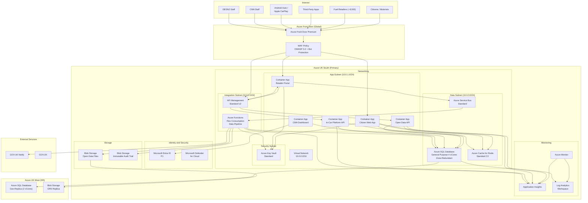

# Azure Technology Research: UK Fuel Price Transparency Service

> **Template Status**: Experimental | **Version**: 1.0.0 | **Command**: `/arckit.azure-research`

## Document Control

| Field | Value |
|-------|-------|
| **Document ID** | ARC-001-AZRS-v1.1 |
| **Document Type** | Azure Technology Research |
| **Project** | UK Fuel Price Transparency Service (Project 001) |
| **Classification** | OFFICIAL |
| **Status** | DRAFT |
| **Version** | 1.1 |
| **Created Date** | 2026-02-02 |
| **Last Modified** | 2026-02-02 |
| **Review Cycle** | Quarterly |
| **Next Review Date** | 2026-05-02 |
| **Owner** | CMA Digital Lead |
| **Reviewed By** | PENDING |
| **Approved By** | PENDING |
| **Distribution** | CMA Digital, DESNZ Policy, Architecture Review Board, Delivery Team |

## Revision History

| Version | Date | Author | Changes | Approved By | Approval Date |
|---------|------|--------|---------|-------------|---------------|
| 1.0 | 2026-02-02 | ArcKit AI | Initial creation from `/arckit.azure-research` command | PENDING | PENDING |
| 1.1 | 2026-02-02 | ArcKit AI | Updated for requirements v2.0: added in-car platform API guidance (FR-014, FR-015, INT-008, UC-7), updated Azure Functions to recommend Flex Consumption plan (Linux Consumption retiring Sept 2028), refreshed APIM v2 tier details including Premium v2 GA with availability zones, added Android Auto/Apple CarPlay API design patterns | PENDING | PENDING |

---

## Executive Summary

### Research Scope

This document presents Azure-specific technology research findings for the UK Fuel Price Transparency Service ("Fuel Finder"). It provides Azure service recommendations, architecture patterns, and implementation guidance based on official Microsoft documentation accessed via the Microsoft Learn MCP server.

**Requirements Analyzed**: 15 functional, 20 non-functional, 8 integration, 6 data entity requirements (from ARC-001-REQ-v2.0, including Android Auto/Apple CarPlay use case UC-7)

**Azure Services Evaluated**: 12 Azure services across 9 categories

**Research Sources**: Microsoft Learn, Azure Architecture Center, Azure Well-Architected Framework, Azure Security Benchmark, Microsoft Learn MCP Server

### Key Recommendations

| Requirement Category | Recommended Azure Service | Tier | Monthly Estimate |
|---------------------|---------------------------|------|------------------|
| Web Application and API Hosting | Azure Container Apps | Consumption | GBP 350 |
| Event-Driven Processing | Azure Functions | Flex Consumption | GBP 50 |
| Relational Database | Azure SQL Database | General Purpose (Zone-Redundant) | GBP 580 |
| Caching | Azure Cache for Redis | Standard C2 | GBP 135 |
| Messaging and Queuing | Azure Service Bus | Standard | GBP 25 |
| API Gateway | Azure API Management | Standard v2 | GBP 230 |
| Secrets Management | Azure Key Vault | Standard | GBP 10 |
| CDN and WAF | Azure Front Door | Premium | GBP 310 |
| Identity | Microsoft Entra ID | P1 | GBP 45 |
| Object Storage and Audit | Azure Blob Storage | Hot + Immutable | GBP 55 |
| Monitoring | Azure Monitor + Application Insights | Standard | GBP 180 |
| Networking | Virtual Network + Private Endpoints | Standard | GBP 95 |
| **Total** | | | **GBP 2,065** |

### Architecture Pattern

**Recommended Pattern**: Reliable Web App Pattern (Azure Architecture Center)

**Reference Architecture**: https://learn.microsoft.com/azure/architecture/web-apps/guides/reliable-web-app/dotnet/plan-implementation

This pattern targets the migration and modernisation of web applications to Azure with reliability, security, and cost optimisation as primary concerns. It aligns with the Fuel Finder's need for a citizen-facing web application backed by APIs, data processing pipelines, and open data publication. For v1.1, the pattern is extended to include in-car platform API endpoints optimised for Android Auto and Apple CarPlay consumption.

### UK Government Suitability

| Criteria | Status | Notes |
|----------|--------|-------|
| **UK Region Availability** | All services available | Primary: UK South, DR: UK West |
| **G-Cloud Listing** | G-Cloud 14 | Framework: RM1557.14, Digital Marketplace |
| **Data Classification** | OFFICIAL | Standard Azure services are suitable |
| **NCSC Cloud Security Principles** | 14/14 principles met | Full attestation published on Microsoft Learn |
| **UK GDPR** | Compliant | Data Processing Agreement, UK data residency |
| **Cyber Essentials Plus** | Certified | Azure controls map to CE+ requirements |

---

## Azure Services Analysis

### Category 1: Compute - Application Hosting

**Requirements Addressed**: FR-001, FR-002, FR-003, FR-005, FR-006, FR-007, FR-008, FR-010, FR-014, FR-015, NFR-P-001, NFR-P-002, NFR-S-001, NFR-S-002, NFR-A-001, NFR-A-002

**Why This Category**: The Fuel Finder service requires hosting for a citizen-facing web application (price search and comparison), a retailer-facing submission portal, a CMA enforcement dashboard, RESTful APIs for open data access, and in-car platform APIs optimised for Android Auto and Apple CarPlay (FR-014, FR-015). The workload is containerised, event-driven, and must scale to handle peak traffic from approximately 8,500 forecourts submitting prices and millions of citizen searches.

---

#### Recommended: Azure Container Apps

**Service Overview**:
- **Full Name**: Azure Container Apps
- **Category**: Compute / Serverless Containers
- **Documentation**: https://learn.microsoft.com/azure/container-apps/overview

**Key Features**:
- **Serverless containers**: Run containers without managing infrastructure; automatic scaling from zero to thousands of replicas
- **Built-in ingress**: HTTPS ingress with automatic TLS termination, traffic splitting for blue/green deployments
- **Dapr integration**: Built-in Dapr sidecar for service-to-service invocation, pub/sub messaging, state management
- **KEDA-based autoscaling**: Scale based on HTTP traffic, Azure Service Bus queue depth, custom metrics; up to 1,000 instances per app
- **Managed identity**: System-assigned and user-assigned managed identities for secure access to Azure resources
- **VNet integration**: Deploy into a custom virtual network for network isolation with private endpoints
- **Revisions and traffic splitting**: Multiple active revisions with percentage-based traffic routing for canary deployments
- **Cold start optimisation**: Sub-second cold starts; proactive wake strategies documented for latency-sensitive endpoints

**Pricing Tiers**:

| Plan | Monthly Cost (est.) | Features | Use Case |
|------|---------------------|----------|----------|
| Consumption | Pay-per-use | Auto-scale 0-N, 2M free requests/month | Production (standard) |
| Dedicated | From GBP 220/month | Reserved capacity, GPU workloads, higher limits | High-throughput, predictable |

**Estimated Cost for This Project**:

| Resource | Configuration | Monthly Cost | Notes |
|----------|---------------|--------------|-------|
| Citizen Web App | 2 vCPU, 4 GiB memory, 2-8 replicas | GBP 120 | Auto-scales based on HTTP traffic |
| Retailer Portal | 1 vCPU, 2 GiB memory, 1-4 replicas | GBP 60 | Lower traffic, scales during submission windows |
| Open Data API | 2 vCPU, 4 GiB memory, 2-10 replicas | GBP 100 | High read throughput, KEDA scaling on requests |
| CMA Dashboard | 1 vCPU, 2 GiB memory, 1-2 replicas | GBP 40 | Internal only, low replica count |
| In-Car Platform API | 1 vCPU, 2 GiB memory, 1-6 replicas | GBP 30 | Lightweight JSON responses for Android Auto / Apple CarPlay (FR-014, FR-015) |
| **Total** | | **GBP 350** | Consumption plan with auto-scaling |

**In-Car Platform API Design (v1.1 Addition)**:

The in-car platform API is a dedicated Container App serving simplified JSON payloads optimised for Android Auto and Apple CarPlay consumption (FR-014, FR-015, INT-008). Design considerations:

- **Endpoint**: `/api/v1/in-car/prices` -- returns minimal JSON payload (<5KB) with nearby fuel prices, optimised for low-bandwidth in-car data connections
- **Response format**: Compact JSON with fuel station name, distance, price, and navigation coordinates only
- **Latency target**: <200ms p95 (stricter than the general <500ms API target) to support real-time in-car displays
- **Caching**: Aggressive Redis caching with 15-minute TTL aligned to price update frequency; Front Door edge caching for location-based responses
- **Scaling**: KEDA HTTP scaler with burst capacity for commuter peak hours (07:00-09:00, 16:30-18:30)
- **Versioning**: Separate API version (`v1-car`) to allow independent evolution without affecting web/open data consumers
- **Navigation integration**: Response includes `navigation_uri` field with `geo:` URI scheme for direct handoff to car navigation

**Azure Well-Architected Assessment**:

| Pillar | Rating | Notes |
|--------|--------|-------|
| **Reliability** | 4/5 | 99.95% SLA, availability zones, health probes, automatic restarts |
| **Security** | 5/5 | Managed identity, VNet integration, private endpoints, mTLS between containers |
| **Cost Optimization** | 5/5 | Scale to zero, consumption billing, no idle cost for low-traffic services |
| **Operational Excellence** | 4/5 | Built-in observability via Azure Monitor, revision management, GitOps support |
| **Performance Efficiency** | 4/5 | KEDA autoscaling, HTTP-aware scaling, sub-second cold starts |

**Azure Security Benchmark Alignment**:

| Control | Status | Implementation |
|---------|--------|----------------|
| NS-1: Network Security | Implemented | VNet integration, private endpoints, NSGs on subnet |
| IM-1: Identity Management | Implemented | Managed identity for all Azure resource access |
| DP-1: Data Protection | Implemented | TLS 1.2+ ingress, encrypted environment variables |
| LT-1: Logging and Threat Detection | Implemented | Azure Monitor, Container Apps system logs, Application Insights |

**Integration Capabilities**:
- **APIs**: REST ingress, gRPC support, WebSocket support
- **SDKs**: .NET, Python, Java, JavaScript, Go container images
- **Event-Driven**: Dapr pub/sub with Azure Service Bus, KEDA scaling on queue depth
- **Other Azure Services**: Key Vault references for secrets, Azure SQL via private endpoint, Azure Cache for Redis, Azure Front Door origin

**UK Region Availability**:
- UK South: Available
- UK West: Available
- No limitations for Container Apps in UK regions

**Compliance Certifications**:
- ISO 27001, 27017, 27018
- SOC 1, 2, 3
- UK Cyber Essentials Plus
- UK G-Cloud 14
- GDPR compliant

---

#### Alternative: Azure App Service

**Service Overview**:
- **Full Name**: Azure App Service
- **Category**: Compute / PaaS Web Hosting
- **Documentation**: https://learn.microsoft.com/azure/app-service/overview

Azure App Service is a fully managed PaaS for hosting web applications, REST APIs, and mobile backends. It supports .NET, Java, Node.js, Python, and PHP. While simpler to configure than Container Apps, it offers less flexibility for containerised workloads and does not support scale-to-zero.

**Pricing**: P1v3 (Production) from GBP 95/month per instance; minimum 1 instance always running.

**Why Not Recommended**: App Service requires always-on instances (no scale-to-zero), leading to higher costs for low-traffic services like the CMA dashboard and the in-car API during off-peak hours. Container Apps provides better cost efficiency through consumption billing and more flexibility for a multi-service architecture including the dedicated in-car platform endpoint.

---

#### Comparison Matrix

| Criteria | Azure Container Apps | Azure App Service | Winner |
|----------|---------------------|-------------------|--------|
| Cost (monthly, 5 services) | GBP 350 | GBP 475+ | Container Apps |
| Scale-to-zero | Yes | No | Container Apps |
| Container native | Yes | Limited | Container Apps |
| Ease of setup | Medium | Easy | App Service |
| UK Availability | UK South, UK West | UK South, UK West | Tie |
| Feature Match | 95% | 75% | Container Apps |

**Recommendation**: Azure Container Apps - provides consumption-based billing with scale-to-zero, native container support, and Dapr integration for service-to-service communication, making it the best fit for a multi-service architecture with variable traffic patterns including the new in-car platform API.

---

### Category 2: Compute - Event-Driven Processing

**Requirements Addressed**: FR-004, FR-009, FR-011, INT-001, INT-002, INT-003, INT-005

**Why This Category**: The data ingestion pipeline (receiving approximately 8,500 price submissions per update cycle), validation, transformation, and publication requires event-driven processing that triggers on message arrival, scheduled intervals, or HTTP webhooks.

---

#### Recommended: Azure Functions (Flex Consumption Plan)

**Service Overview**:
- **Full Name**: Azure Functions
- **Category**: Compute / Serverless Functions
- **Documentation**: https://learn.microsoft.com/azure/azure-functions/functions-overview

**v1.1 Update - Flex Consumption Plan**: Microsoft now recommends the Flex Consumption plan as the preferred serverless hosting option for Azure Functions. The classic Linux Consumption plan is retiring on 30 September 2028. Flex Consumption offers faster horizontal scaling (up to 1,000 instances), configurable memory sizes (512 MB, 2,048 MB, or 4,096 MB), VNet integration, and always-ready instances to reduce cold starts.

**Key Features**:
- **Event-driven triggers**: Service Bus, HTTP, Timer, Blob Storage (Event Grid source), Event Grid triggers
- **Flex Consumption billing**: Pay only for execution time and memory; configurable per-instance concurrency for optimal efficiency
- **Language support**: C#, Python, JavaScript/TypeScript, Java, PowerShell
- **Durable Functions**: Orchestrate complex workflows (fan-out/fan-in for batch validation); Azure Storage and Durable Task Scheduler supported as storage providers
- **VNet integration**: Native VNet integration via subnet delegation (Microsoft.App/environments) for secure access to private resources
- **Always-ready instances**: Pre-provisioned instances to eliminate cold starts for latency-sensitive functions
- **Configurable memory**: Choose 512 MB, 2,048 MB, or 4,096 MB per instance based on workload requirements
- **Fast scaling**: Dynamic scale-out up to 1,000 instances based on per-instance concurrency and incoming events

**Estimated Cost for This Project**:

| Resource | Configuration | Monthly Cost | Notes |
|----------|---------------|--------------|-------|
| Price Ingestion Function | Service Bus trigger, approx 500K executions/month, 2048 MB | GBP 18 | Validates and transforms submissions |
| Scheduled Compliance Check | Timer trigger, hourly, 512 MB | GBP 5 | Detects late/missing submissions |
| Data Publication Pipeline | Event Grid trigger + Durable Functions, 2048 MB | GBP 17 | Generates open data snapshots |
| GOV.UK Notify Integration | HTTP trigger, approx 50K/month, 512 MB | GBP 10 | Sends retailer notifications |
| **Total** | | **GBP 50** | Flex Consumption plan |

**Azure Well-Architected Assessment**:

| Pillar | Rating | Notes |
|--------|--------|-------|
| **Reliability** | 4/5 | Built-in retry policies, dead-letter queues, Durable Functions for orchestration, always-ready instances |
| **Security** | 5/5 | Managed identity, VNet integration (native in Flex Consumption), no public endpoint required |
| **Cost Optimization** | 5/5 | Flex Consumption billing, configurable memory to avoid over-provisioning, no idle cost |
| **Operational Excellence** | 4/5 | Application Insights integration, distributed tracing, per-function scaling metrics |
| **Performance Efficiency** | 5/5 | Up to 1,000 instances, always-ready for cold-start elimination, configurable concurrency |

**Migration Note**: If the project initially deploys on the classic Consumption plan (Windows), migration to Flex Consumption is recommended before September 2028. Flex Consumption currently supports Linux only and does not support deployment slots; use site update strategies for zero-downtime deployments.

---

### Category 3: Database

**Requirements Addressed**: DR-001 through DR-006, NFR-P-003, NFR-P-004, NFR-A-001, NFR-A-003, NFR-SEC-001, NFR-SEC-003

**Why This Category**: The Fuel Finder data model includes 8 entities (Organisation, Forecourt, PriceSubmission, PublishedPrice, EnforcementAction, AuditEvent, CmaJsonStation, FuelType) with 96 attributes and 10 relationships. Projected volumes are approximately 55M price records/year and approximately 200M audit events/year. Strong ACID transactions, referential integrity, and full-text search are required.

---

#### Recommended: Azure SQL Database

**Service Overview**:
- **Full Name**: Azure SQL Database
- **Category**: Database / Relational PaaS
- **Documentation**: https://learn.microsoft.com/azure/azure-sql/database/sql-database-paas-overview

**Key Features**:
- **Fully managed**: Automated patching, backups (up to 35 days PITR), high availability
- **Zone redundancy**: Available in UK South with availability zone distribution at no additional cost on General Purpose tier
- **Transparent Data Encryption (TDE)**: Encryption at rest enabled by default with Microsoft-managed or customer-managed keys
- **Advanced Threat Protection**: SQL injection detection, anomalous access patterns, vulnerability assessment
- **Elastic pools**: Share resources across multiple databases for cost efficiency
- **Read replicas**: Up to 4 readable secondaries for read-heavy workloads (Hyperscale/Business Critical)
- **Auditing**: Built-in audit to Blob Storage or Log Analytics

**Pricing Tiers**:

| Tier | Monthly Cost | Features | Use Case |
|------|-------------|----------|----------|
| Basic (DTU) | GBP 4 | 5 DTUs, 2 GB | Dev/Test |
| Standard (DTU) | GBP 12-370 | 10-3000 DTUs | Low-medium workloads |
| General Purpose (vCore) | GBP 150-2,400 | 2-80 vCores, zone-redundant | Production |
| Business Critical (vCore) | GBP 350-5,000 | 2-80 vCores, local SSD, read replica | Mission-critical |
| Hyperscale (vCore) | GBP 200-3,000 | 2-80 vCores, 100TB, named replicas | Large-scale |

**Estimated Cost for This Project**:

| Resource | Configuration | Monthly Cost | Notes |
|----------|---------------|--------------|-------|
| Primary Database | General Purpose, 4 vCores, zone-redundant, 250 GB | GBP 460 | UK South, production workload |
| Geo-Replica (DR) | General Purpose, 2 vCores, UK West | GBP 120 | Disaster recovery, failover group |
| **Total** | | **GBP 580** | Includes zone redundancy and geo-replication |

**Azure Well-Architected Assessment**:

| Pillar | Rating | Notes |
|--------|--------|-------|
| **Reliability** | 5/5 | 99.995% SLA (zone-redundant), auto-failover groups, 35-day PITR |
| **Security** | 5/5 | TDE, Always Encrypted, row-level security, Azure AD auth, Advanced Threat Protection |
| **Cost Optimization** | 4/5 | Reserved capacity (1yr: 33% saving, 3yr: 55%), elastic pools for multi-DB |
| **Operational Excellence** | 5/5 | Automatic tuning, intelligent performance insights, Query Performance Insight |
| **Performance Efficiency** | 4/5 | Read replicas, columnstore indexes, in-memory OLTP (Business Critical) |

**Azure Security Benchmark Alignment**:

| Control | Status | Implementation |
|---------|--------|----------------|
| NS-1: Network Security | Implemented | Private endpoint, deny public access, VNet service endpoint |
| IM-1: Identity Management | Implemented | Azure AD authentication, contained database users |
| DP-1: Data Protection | Implemented | TDE (AES-256), Always Encrypted for sensitive columns, TLS 1.2 |
| DP-4: Data at Rest Encryption | Implemented | TDE with customer-managed keys in Key Vault |
| LT-1: Logging | Implemented | SQL Audit to Blob Storage and Log Analytics |
| BR-1: Backup and Recovery | Implemented | Automated backups, 35-day PITR, geo-redundant backup |

**UK Region Availability**:
- UK South: Available (all tiers, zone-redundant)
- UK West: Available (for geo-replica / DR)
- Geo-replication stays within UK (UK South to UK West failover group)

---

### Category 4: Caching

**Requirements Addressed**: NFR-P-001, NFR-P-002, FR-005, FR-006, FR-014, FR-015

**Why This Category**: The citizen-facing price search must respond in <500ms (API) and <3s (page load). The in-car platform API has a stricter <200ms p95 target. Published fuel prices are read-heavy (millions of searches vs thousands of submissions per day), making caching essential for performance and cost reduction.

---

#### Recommended: Azure Cache for Redis

**Service Overview**:
- **Full Name**: Azure Cache for Redis
- **Category**: Database / In-Memory Cache
- **Documentation**: https://learn.microsoft.com/azure/azure-cache-for-redis/cache-overview

**Key Features**:
- **Sub-millisecond latency**: In-memory data store for ultra-fast reads
- **Data structures**: Strings, hashes, sorted sets (ideal for geospatial price lookup)
- **Geo-replication**: Active geo-replication across regions (Premium/Enterprise)
- **Persistence**: RDB/AOF persistence for data durability
- **VNet integration**: Deploy into a VNet for network isolation (Premium tier)
- **Redis Cluster**: Automatic sharding for horizontal scaling (Premium tier)
- **Zone redundancy**: Standard tier now provides zone-redundant replication by default in supported regions

**Pricing Tiers**:

| Tier | Monthly Cost | Features | Use Case |
|------|-------------|----------|----------|
| Basic C0 | GBP 12 | 250 MB, no SLA, no replication | Dev/Test |
| Standard C2 | GBP 135 | 6 GB, replicated, zone-redundant, 99.9% SLA | Production |
| Premium P1 | GBP 300 | 6 GB, VNet, clustering, persistence | Enterprise |
| Enterprise E10 | GBP 550 | 12 GB, RediSearch, active geo-replication | Mission-critical |

**Estimated Cost for This Project**:

| Resource | Configuration | Monthly Cost | Notes |
|----------|---------------|--------------|-------|
| Price Cache | Standard C2, 6 GB | GBP 135 | Caches published prices, location data, search results, in-car API responses |
| **Total** | | **GBP 135** | Standard tier sufficient; zone-redundant by default |

**Caching Strategy**:
- **Published prices**: Cache with 30-minute TTL (prices update every 30 minutes per regulations)
- **Forecourt metadata**: Cache with 24-hour TTL (location, opening hours rarely change)
- **Search results**: Cache popular postcode/location searches with 15-minute TTL
- **In-car API responses**: Cache by geohash grid cell with 15-minute TTL; compact JSON format pre-serialised in cache to minimise response assembly time (supports <200ms target for FR-014, FR-015)
- **Session data**: Store retailer portal sessions (if needed)
- **Expected hit rate**: >90% for citizen price searches, >95% for in-car API (limited result set)

**Azure Well-Architected Assessment**:

| Pillar | Rating | Notes |
|--------|--------|-------|
| **Reliability** | 4/5 | Standard tier has built-in zone-redundant replication, 99.9% SLA |
| **Security** | 4/5 | TLS encryption, access keys, firewall rules; Premium adds VNet |
| **Cost Optimization** | 4/5 | Standard C2 handles projected load; reserved pricing available |
| **Operational Excellence** | 4/5 | Azure Monitor metrics, diagnostic logs, alerts |
| **Performance Efficiency** | 5/5 | Sub-millisecond latency, >100K ops/second on C2 |

---

### Category 5: Messaging and Integration

**Requirements Addressed**: INT-001, INT-002, INT-003, INT-005, INT-006, INT-008, FR-004, FR-009, FR-011

**Why This Category**: The data pipeline requires asynchronous processing: price submissions arrive via API, are validated, transformed, and published. Decoupling submission from processing ensures reliability (submissions are not lost during processing failures) and scalability (processing scales independently). INT-008 (in-car platform integration) uses the same messaging backbone for price update propagation.

---

#### Recommended: Azure Service Bus

**Service Overview**:
- **Full Name**: Azure Service Bus
- **Category**: Integration / Enterprise Messaging
- **Documentation**: https://learn.microsoft.com/azure/service-bus-messaging/service-bus-messaging-overview

**Key Features**:
- **Queues and Topics**: Point-to-point queues and publish-subscribe topics with subscriptions
- **Dead-letter queue**: Automatic dead-lettering for failed messages
- **Sessions**: FIFO ordering with message sessions (ensures per-forecourt ordering)
- **Scheduled delivery**: Schedule messages for future delivery (batch publication windows)
- **Duplicate detection**: Configurable duplicate detection window
- **Message size**: Up to 256 KB (Standard) or 100 MB (Premium)

**Estimated Cost for This Project**:

| Resource | Configuration | Monthly Cost | Notes |
|----------|---------------|--------------|-------|
| Service Bus Namespace | Standard tier | GBP 8 | Base cost |
| Operations | Approximately 5M operations/month | GBP 17 | Price submissions, validation events, notifications |
| **Total** | | **GBP 25** | Standard tier sufficient for projected volumes |

**Queue Design**:
- `price-submissions`: Incoming price data from retailer API (sessions by forecourt ID for ordering)
- `validation-results`: Validated submissions ready for publication
- `compliance-alerts`: Non-compliance events for CMA enforcement
- `notification-requests`: Outbound notifications via GOV.UK Notify
- `cache-invalidation` (v1.1 addition): Topic with subscriptions for price cache and in-car API cache invalidation on price update

---

### Category 6: API Gateway

**Requirements Addressed**: FR-005, FR-006, FR-010, FR-014, FR-015, INT-004, INT-007, INT-008, NFR-SEC-002, NFR-P-002

**Why This Category**: The service exposes multiple APIs: open data API (public, unauthenticated, high-volume), price submission API (authenticated, retailer-facing), in-car platform API (public, optimised for Android Auto/Apple CarPlay), and internal APIs (CMA enforcement tools). API Management provides rate limiting, authentication, documentation, versioning, and analytics.

---

#### Recommended: Azure API Management

**Service Overview**:
- **Full Name**: Azure API Management (APIM)
- **Category**: Integration / API Gateway
- **Documentation**: https://learn.microsoft.com/azure/api-management/api-management-key-concepts

**Key Features**:
- **Developer portal**: Auto-generated API documentation portal for third-party consumers
- **Rate limiting and quotas**: Per-subscription rate limiting to protect backend services
- **Authentication policies**: OAuth 2.0, API keys, JWT validation, client certificates
- **Caching**: Built-in response caching to reduce backend load
- **Versioning and revisions**: API versioning with non-breaking revision management
- **Analytics**: Built-in analytics dashboard for API usage, latency, errors
- **OpenAPI support**: Import/export OpenAPI 3.0 specifications
- **MCP server support** (v1.1 note): APIM now supports Model Context Protocol (MCP) server management across all tiers for AI agent integration

**Pricing Tiers (v2)** -- Updated for v1.1:

| Tier | Monthly Cost | Features | Use Case |
|------|-------------|----------|----------|
| Basic v2 | GBP 115 | 250 req/s, no VNet, SLA backed | Dev/Test, small production |
| Standard v2 | GBP 230 | 500 req/s, VNet integration (outbound) | Production |
| Premium v2 | GBP 460 | 2500 req/s, full VNet injection, availability zones, workspaces | Enterprise, multi-region |

**v1.1 Update**: Premium v2 is now generally available with full VNet injection (both inbound and outbound isolation), availability zone support, and workspace-based federated API management. For this project, Standard v2 remains sufficient, but Premium v2 is available for upgrade if full network isolation or availability zone support is required for the API gateway itself.

**Estimated Cost for This Project**:

| Resource | Configuration | Monthly Cost | Notes |
|----------|---------------|--------------|-------|
| APIM Instance | Standard v2, 1 unit | GBP 230 | Open data API + submission API + in-car API + internal APIs |
| **Total** | | **GBP 230** | Standard v2 provides VNet integration and sufficient throughput |

**API Design** (Updated for v1.1):
- **Open Data API** (`/api/v1/prices`): Public, unauthenticated, rate-limited (60 req/min per IP), cached responses
- **Submission API** (`/api/v1/submissions`): Authenticated (API key + OAuth 2.0), retailer-specific rate limits
- **In-Car Platform API** (`/api/v1-car/prices`): Public, unauthenticated, rate-limited (120 req/min per IP), compact JSON responses (<5KB), aggressive caching (FR-014, FR-015, INT-008)
- **Enforcement API** (`/api/v1/enforcement`): Internal only, Azure AD authentication, no public access
- **Developer Portal**: Self-service API key registration for third-party consumers, including Android Auto / Apple CarPlay integration guide

**In-Car API APIM Policy** (v1.1 Addition):
```xml
<!-- In-Car Platform API Policy -->
<policies>
    <inbound>
        <rate-limit calls="120" renewal-period="60" />
        <cache-lookup vary-by-query-parameter="lat,lon,radius,fuel_type" />
        <set-header name="X-Response-Format" exists-action="override">
            <value>compact</value>
        </set-header>
    </inbound>
    <outbound>
        <cache-store duration="900" /> <!-- 15 minute cache -->
        <set-header name="Cache-Control" exists-action="override">
            <value>public, max-age=900</value>
        </set-header>
    </outbound>
</policies>
```

---

### Category 7: Security

**Requirements Addressed**: NFR-SEC-001 through NFR-SEC-005, NFR-C-001, NFR-C-003

**Why This Category**: The service handles OFFICIAL classified data, retailer account credentials, and must comply with UK GDPR, Secure by Design, and the GDS Service Standard. Security services provide identity management, secrets storage, network protection, and threat detection.

---

#### 7a: Azure Key Vault

**Service Overview**:
- **Full Name**: Azure Key Vault
- **Category**: Security / Secrets Management
- **Documentation**: https://learn.microsoft.com/azure/key-vault/general/overview

**Key Features**:
- **Secrets management**: Store and access API keys, connection strings, certificates
- **Key management**: HSM-backed cryptographic keys (FIPS 140-2 Level 2/3)
- **Certificate management**: Automated certificate lifecycle with auto-renewal
- **Access policies**: RBAC or vault access policies with fine-grained permissions
- **Soft delete and purge protection**: 7-90 day soft delete retention, purge protection for compliance
- **Private endpoint**: Access only via private network

**Estimated Cost for This Project**:

| Resource | Configuration | Monthly Cost | Notes |
|----------|---------------|--------------|-------|
| Key Vault | Standard, approximately 10K operations/month | GBP 10 | Secrets: DB connection strings, API keys, certificates |
| **Total** | | **GBP 10** | |

---

#### 7b: Microsoft Entra ID

**Service Overview**:
- **Full Name**: Microsoft Entra ID (formerly Azure Active Directory)
- **Category**: Security / Identity
- **Documentation**: https://learn.microsoft.com/entra/identity/

**Key Features**:
- **Single sign-on**: SSO for CMA and DESNZ staff via SAML/OIDC federation
- **Conditional Access**: Location-based, device-based, risk-based access policies
- **Multi-factor authentication**: Enforced for all administrative and CMA enforcement access
- **Managed identities**: System-assigned identities for Azure resources (no credentials in code)
- **Application registrations**: OAuth 2.0 client credentials for retailer API access
- **Privileged Identity Management (PIM)**: Just-in-time elevated access for administrators

**Estimated Cost for This Project**:

| Resource | Configuration | Monthly Cost | Notes |
|----------|---------------|--------------|-------|
| Entra ID P1 | Approximately 50 CMA/DESNZ users | GBP 45 | Conditional Access, MFA, PIM |
| **Total** | | **GBP 45** | Retailer identity uses API keys (no Entra cost) |

**Identity Architecture**:
- **CMA Staff**: Federated SSO via CMA's existing IdP (SAML 2.0 or OIDC)
- **DESNZ Staff**: Federated SSO via DESNZ's existing IdP
- **Retailers**: API key authentication (issued per forecourt) + OAuth 2.0 client credentials for automated submissions
- **Citizens**: Anonymous access (no authentication for price search or in-car API)
- **In-Car API**: Anonymous access, rate-limited per IP; no user authentication required (FR-014, FR-015)
- **Service-to-Service**: Managed identities (no credentials stored or rotated)

---

#### 7c: Azure Front Door with WAF

**Service Overview**:
- **Full Name**: Azure Front Door Premium
- **Category**: Networking / CDN + WAF + DDoS Protection
- **Documentation**: https://learn.microsoft.com/azure/frontdoor/front-door-overview

**Key Features**:
- **Global load balancing**: Layer 7 load balancing with health probes and automatic failover
- **Web Application Firewall (WAF)**: OWASP 3.2 Core Rule Set, bot protection, custom rules
- **DDoS Protection**: Layer 3/4 DDoS protection included
- **TLS termination**: Managed certificates, TLS 1.2+ enforcement, HTTP/2
- **Caching**: Edge caching at Microsoft PoPs for static content and API responses
- **Private Link origins**: Connect to Container Apps via Private Link (no public backend)
- **Rules engine**: URL rewrite, header manipulation, rate limiting

**Estimated Cost for This Project**:

| Resource | Configuration | Monthly Cost | Notes |
|----------|---------------|--------------|-------|
| Front Door Premium | Base fee + routing | GBP 260 | Includes WAF, Private Link origins |
| WAF Policy | OWASP 3.2 + custom rules | GBP 30 | Bot protection, geo-filtering |
| Data transfer | Approximately 500 GB outbound/month | GBP 20 | Static content + API responses |
| **Total** | | **GBP 310** | |

**WAF Rules**:
- OWASP 3.2 Core Rule Set (SQL injection, XSS, LFI, RFI, command injection)
- Bot protection (block known bad bots, allow search engines)
- Rate limiting (per IP: 60 req/min for open data API, 120 req/min for in-car API, 10 req/min for submission API)
- Geo-filtering (allow UK only for submission API; worldwide for open data API and in-car API)
- Custom rule: Block requests without valid User-Agent header

---

### Category 8: Storage

**Requirements Addressed**: NFR-SEC-004, NFR-C-002, FR-009, FR-011

**Why This Category**: The service requires object storage for open data file publication (CSV, JSON snapshots), audit trail storage with tamper-evidence (immutable WORM storage), and backup/archive of historical price data.

---

#### Recommended: Azure Blob Storage

**Service Overview**:
- **Full Name**: Azure Blob Storage
- **Category**: Storage / Object Storage
- **Documentation**: https://learn.microsoft.com/azure/storage/blobs/storage-blobs-overview

**Key Features**:
- **Immutable storage (WORM)**: Time-based retention policies and legal holds for tamper-evident audit trails
- **Access tiers**: Hot, Cool, Cold, Archive for cost-optimised lifecycle management
- **Versioning**: Blob versioning for point-in-time recovery
- **Soft delete**: Configurable retention for accidental deletion recovery
- **Private endpoint**: Access only via private network
- **Lifecycle management**: Automatic tier transition based on age or access patterns

**Estimated Cost for This Project**:

| Resource | Configuration | Monthly Cost | Notes |
|----------|---------------|--------------|-------|
| Open Data Files | Hot tier, approximately 100 GB, GRS | GBP 15 | Published CSV/JSON snapshots, geo-redundant |
| Audit Trail | Hot tier, approximately 200 GB, immutable WORM | GBP 25 | Tamper-evident audit log, 7-year retention |
| SQL Audit Logs | Cool tier, approximately 50 GB | GBP 5 | Azure SQL audit destination |
| Historical Archive | Cool tier, approximately 500 GB | GBP 10 | Historical price data archive |
| **Total** | | **GBP 55** | |

**Immutable Storage Configuration** (Audit Trail):
- Time-based retention policy: 7 years (2,555 days) locked
- Legal hold capability for enforcement investigations
- Write-once, read-many (WORM) compliance
- Meets SEC 17a-4(f) and CFTC 1.31(d) equivalent tamper-evidence requirements
- All audit events written as append blobs with immutable policy

---

### Category 9: Monitoring and Observability

**Requirements Addressed**: NFR-M-001, NFR-M-002, NFR-M-003, NFR-A-002, NFR-A-003

**Why This Category**: The service requires comprehensive monitoring for SLA compliance (99.9% citizen availability, 99.95% API availability), performance tracking (<500ms API response, <200ms in-car API response), security event detection, and operational alerting.

---

#### Recommended: Azure Monitor + Application Insights + Log Analytics

**Service Overview**:
- **Full Name**: Azure Monitor (umbrella service)
- **Category**: Management / Monitoring and Observability
- **Documentation**: https://learn.microsoft.com/azure/azure-monitor/overview

**Key Features**:
- **Application Insights**: Distributed tracing, live metrics, smart detection, application map
- **Log Analytics**: Centralised log aggregation with KQL (Kusto Query Language)
- **Metrics**: Platform and custom metrics with alerting
- **Alerts**: Multi-signal alerts (metric, log, activity log) with action groups
- **Workbooks**: Custom dashboards and reports
- **OpenTelemetry**: Native OpenTelemetry Collector support for vendor-neutral instrumentation
- **Autoscale**: Metric-based autoscale rules for Container Apps and other services

**Estimated Cost for This Project**:

| Resource | Configuration | Monthly Cost | Notes |
|----------|---------------|--------------|-------|
| Application Insights | Approximately 5 GB ingestion/month | GBP 10 | First 5 GB free; distributed tracing, live metrics |
| Log Analytics Workspace | Approximately 20 GB ingestion/month, 90-day retention | GBP 100 | Centralised logs from all services |
| Alerts | Approximately 20 alert rules | GBP 20 | SLA, performance, security, compliance alerts |
| Azure Monitor Metrics | Platform metrics (free) + custom | GBP 10 | Container Apps, SQL, Redis, Service Bus metrics |
| Diagnostic Settings | All services to Log Analytics | GBP 40 | Activity logs, resource logs |
| **Total** | | **GBP 180** | |

**Alerting Strategy**:
- **P1 (Critical)**: Service down, SLA breach, security incident - PagerDuty/phone
- **P2 (High)**: API latency >500ms, in-car API latency >200ms, error rate >1%, database failover - email + Teams
- **P3 (Medium)**: Compliance submission rate drop, cache miss ratio >20% - email
- **P4 (Low)**: Cost anomaly, capacity threshold warning - daily digest

**Dashboards**:
- **Operations Dashboard**: Service health, SLA compliance, error rates, latency percentiles
- **Business Dashboard**: Submission volumes, forecourt coverage %, API consumer analytics
- **Security Dashboard**: Authentication failures, WAF blocks, threat detections
- **Compliance Dashboard**: Retailer submission rates, enforcement case metrics
- **In-Car API Dashboard** (v1.1 addition): p95/p99 latency, cache hit rates, peak-hour traffic patterns, geographic distribution of requests

---

## Architecture Pattern

### Recommended Azure Reference Architecture

**Pattern Name**: Reliable Web App Pattern for .NET

**Azure Architecture Center Reference**: https://learn.microsoft.com/azure/architecture/web-apps/guides/reliable-web-app/dotnet/plan-implementation

**Pattern Description**:

The Reliable Web App (RWA) pattern provides prescriptive guidance for web applications migrating to or built on Azure. It emphasises reliability through retry policies, circuit breakers, and health endpoints; security through managed identities and private networking; and cost optimisation through right-sizing and caching. The pattern is designed for applications that need high availability (99.9%+), support millions of users, and integrate with multiple backend services.

For the Fuel Finder service, this pattern is adapted to use Azure Container Apps instead of App Service (for scale-to-zero and multi-service hosting) while retaining the core patterns: cache-aside for published prices, queue-based load levelling for price submissions, and the retry pattern for all external integrations (GOV.UK Notify, retailer API calls). The architecture uses Azure Front Door as the entry point with WAF protection, routes traffic to Container Apps via private endpoints, and stores data in Azure SQL Database with Redis caching.

The event-driven processing layer uses Azure Functions (Flex Consumption plan) triggered by Service Bus queues, implementing the competing consumers pattern for horizontal scaling of the data validation and publication pipeline. This decouples the submission API from the processing pipeline, ensuring that high submission volumes during peak periods do not affect citizen-facing search performance.

**v1.1 Extension -- In-Car Platform API**: The architecture is extended with a dedicated Container App serving the in-car platform API (`/api/v1-car/prices`). This endpoint returns compact JSON payloads (<5KB) optimised for Android Auto and Apple CarPlay consumption. It shares the same Redis cache and SQL Database backend but uses pre-serialised cache entries and aggressive Front Door edge caching to achieve the <200ms p95 latency target. The in-car API is exposed through the same APIM gateway with a dedicated product and rate limiting policy, and is documented in the developer portal with Android Auto / Apple CarPlay integration patterns.

### Architecture Diagram



### Component Mapping

| Component | Azure Service | Purpose | Tier |
|-----------|---------------|---------|------|
| Citizen Web App | Azure Container Apps | Price search, comparison, map view | Consumption (2 vCPU) |
| Retailer Portal | Azure Container Apps | Price submission, account management | Consumption (1 vCPU) |
| Open Data API | Azure Container Apps | RESTful API for third-party consumers | Consumption (2 vCPU) |
| CMA Dashboard | Azure Container Apps | Enforcement monitoring, compliance tools | Consumption (1 vCPU) |
| In-Car Platform API | Azure Container Apps | Android Auto / Apple CarPlay optimised API | Consumption (1 vCPU) |
| Data Pipeline | Azure Functions | Ingestion, validation, publication | Flex Consumption |
| API Gateway | Azure API Management | Rate limiting, auth, documentation | Standard v2 |
| Primary Database | Azure SQL Database | Relational data, ACID transactions | General Purpose 4 vCores |
| DR Database | Azure SQL Database | Geo-replica for disaster recovery | General Purpose 2 vCores |
| Price Cache | Azure Cache for Redis | Published price caching, search results, in-car API cache | Standard C2 |
| Message Broker | Azure Service Bus | Async processing, queue-based load levelling | Standard |
| Secrets | Azure Key Vault | Connection strings, API keys, certificates | Standard |
| CDN + WAF | Azure Front Door | Edge caching, DDoS, OWASP WAF | Premium |
| Identity | Microsoft Entra ID | SSO, MFA, Conditional Access, managed identities | P1 |
| Open Data Storage | Azure Blob Storage | CSV/JSON snapshots for download | Hot, GRS |
| Audit Trail | Azure Blob Storage | Tamper-evident audit log | Hot, Immutable WORM |
| Monitoring | Azure Monitor + App Insights | Logs, metrics, traces, alerts | Standard |

---

## Security and Compliance

### Azure Security Benchmark Mapping

| ASB Control Domain | Controls Implemented | Azure Services |
|-------------------|---------------------|----------------|
| **Network Security (NS)** | NS-1, NS-2, NS-3, NS-5 | VNet, NSGs, Private Endpoints, Azure Front Door WAF, DDoS Protection |
| **Identity Management (IM)** | IM-1, IM-2, IM-3, IM-7 | Entra ID, Managed Identities, Conditional Access, MFA |
| **Privileged Access (PA)** | PA-1, PA-2, PA-4, PA-7 | Entra PIM, JIT access, RBAC with least privilege |
| **Data Protection (DP)** | DP-1, DP-2, DP-3, DP-4, DP-5 | TDE (AES-256), TLS 1.2+, Key Vault CMK, Always Encrypted |
| **Asset Management (AM)** | AM-1, AM-2, AM-5 | Resource Graph, Azure Policy, tagging strategy |
| **Logging and Threat Detection (LT)** | LT-1, LT-2, LT-3, LT-4 | Azure Monitor, Log Analytics, Defender for Cloud, SQL ATP |
| **Incident Response (IR)** | IR-1, IR-2, IR-3 | Defender for Cloud alerts, Log Analytics queries, action groups |
| **Posture and Vulnerability (PV)** | PV-1, PV-2, PV-5 | Defender for Cloud secure score, vulnerability assessment |
| **Endpoint Security (ES)** | ES-1 | Container image scanning, Defender for Containers |
| **Backup and Recovery (BR)** | BR-1, BR-2, BR-3 | SQL automated backups, Blob soft delete, geo-replication |
| **DevOps Security (DS)** | DS-1, DS-2, DS-6 | GitHub Advanced Security, branch protection, secret scanning |
| **Governance and Strategy (GS)** | GS-1, GS-2, GS-6 | Azure Policy, Management Groups, cost management |

### UK Government Security Alignment

| Framework | Alignment | Notes |
|-----------|-----------|-------|
| **NCSC Cloud Security Principles** | 14/14 | Microsoft publishes full attestation for all 14 principles |
| **Cyber Essentials Plus** | Certified | Azure platform certified; project inherits certification |
| **UK GDPR** | Compliant | Data Processing Agreement signed, UK data residency confirmed |
| **OFFICIAL** | Suitable | All recommended services operate at OFFICIAL classification |
| **OFFICIAL-SENSITIVE** | Suitable with controls | Additional: Conditional Access, forced MFA, audit logging |
| **SECRET** | Not suitable | Standard Azure not suitable; requires Azure Government UK |
| **Secure by Design** | Aligned | Threat modelling, security controls, continuous assessment |
| **GDS Service Standard** | Point 9 aligned | Security controls mapped to Point 9 (secure service) |

### Microsoft Defender for Cloud

**Recommendations**:
- Enable Defender for Cloud on all subscriptions (free tier provides secure score and recommendations)
- Enable Defender plans for: App Service, SQL, Storage, Key Vault, Containers
- Configure Security Policy aligned to Azure Security Benchmark v3
- Enable Continuous Export to Log Analytics workspace
- Configure email notifications for high-severity alerts to CMA SIRO
- Enable regulatory compliance dashboard for ISO 27001 and NCSC tracking

**Estimated Additional Cost**: GBP 50-80/month for Defender plans across all resources

---

## Implementation Guidance

### Infrastructure as Code

**Recommended Approach**: Bicep (Azure-native IaC)

Bicep is recommended over Terraform for this project because:
1. First-class Azure support with same-day resource provider coverage
2. No state file management required (ARM handles state)
3. Native integration with Azure DevOps and GitHub Actions
4. Simpler syntax than ARM templates with full ARM feature parity

#### Bicep Example - Core Infrastructure

```bicep
// main.bicep - UK Fuel Price Transparency Service
targetScope = 'subscription'

@description('Primary deployment region')
param location string = 'uksouth'

@description('DR region')
param drLocation string = 'ukwest'

@description('Environment name')
@allowed(['dev', 'staging', 'prod'])
param environment string = 'prod'

param projectName string = 'fuelfinder'

// Resource Group
resource rg 'Microsoft.Resources/resourceGroups@2023-07-01' = {
  name: 'rg-${projectName}-${environment}-${location}'
  location: location
  tags: {
    project: 'uk-fuel-price-transparency'
    environment: environment
    classification: 'OFFICIAL'
    costCentre: 'CMA-Digital'
    managedBy: 'bicep'
  }
}

// DR Resource Group
resource rgDr 'Microsoft.Resources/resourceGroups@2023-07-01' = {
  name: 'rg-${projectName}-${environment}-${drLocation}'
  location: drLocation
  tags: {
    project: 'uk-fuel-price-transparency'
    environment: environment
    classification: 'OFFICIAL'
    purpose: 'disaster-recovery'
  }
}

// Deploy networking
module networking 'modules/networking.bicep' = {
  name: 'networking'
  scope: rg
  params: {
    location: location
    environment: environment
    projectName: projectName
  }
}

// Deploy SQL Database
module database 'modules/sql-database.bicep' = {
  name: 'database'
  scope: rg
  params: {
    location: location
    environment: environment
    projectName: projectName
    subnetId: networking.outputs.dataSubnetId
    administratorLogin: 'sqladmin'
  }
}

// Deploy Container Apps Environment
module compute 'modules/container-apps.bicep' = {
  name: 'compute'
  scope: rg
  params: {
    location: location
    environment: environment
    projectName: projectName
    subnetId: networking.outputs.appSubnetId
    logAnalyticsWorkspaceId: monitoring.outputs.logAnalyticsWorkspaceId
  }
}

// Deploy monitoring
module monitoring 'modules/monitoring.bicep' = {
  name: 'monitoring'
  scope: rg
  params: {
    location: location
    environment: environment
    projectName: projectName
  }
}
```

#### Bicep Example - SQL Database Module

```bicep
// modules/sql-database.bicep
param location string
param environment string
param projectName string
param subnetId string
param administratorLogin string

@secure()
param administratorPassword string

resource sqlServer 'Microsoft.Sql/servers@2023-05-01-preview' = {
  name: 'sql-${projectName}-${environment}'
  location: location
  properties: {
    administratorLogin: administratorLogin
    administratorLoginPassword: administratorPassword
    minimalTlsVersion: '1.2'
    publicNetworkAccess: 'Disabled'
  }
  identity: {
    type: 'SystemAssigned'
  }
}

resource sqlDb 'Microsoft.Sql/servers/databases@2023-05-01-preview' = {
  parent: sqlServer
  name: 'sqldb-${projectName}-${environment}'
  location: location
  sku: {
    name: 'GP_Gen5'
    tier: 'GeneralPurpose'
    capacity: 4
  }
  properties: {
    zoneRedundant: true
    requestedBackupStorageRedundancy: 'Geo'
    collation: 'SQL_Latin1_General_CP1_CI_AS'
    maxSizeBytes: 268435456000 // 250 GB
  }
}

resource privateEndpoint 'Microsoft.Network/privateEndpoints@2023-05-01' = {
  name: 'pe-${sqlServer.name}'
  location: location
  properties: {
    subnet: {
      id: subnetId
    }
    privateLinkServiceConnections: [
      {
        name: 'sqlConnection'
        properties: {
          privateLinkServiceId: sqlServer.id
          groupIds: ['sqlServer']
        }
      }
    ]
  }
}

// Enable auditing to Blob Storage
resource sqlAudit 'Microsoft.Sql/servers/auditingSettings@2023-05-01-preview' = {
  parent: sqlServer
  name: 'default'
  properties: {
    state: 'Enabled'
    retentionDays: 90
    auditActionsAndGroups: [
      'SUCCESSFUL_DATABASE_AUTHENTICATION_GROUP'
      'FAILED_DATABASE_AUTHENTICATION_GROUP'
      'BATCH_COMPLETED_GROUP'
    ]
  }
}

// Enable Advanced Threat Protection
resource sqlAtp 'Microsoft.Sql/servers/advancedThreatProtectionSettings@2023-05-01-preview' = {
  parent: sqlServer
  name: 'Default'
  properties: {
    state: 'Enabled'
  }
}

output sqlServerFqdn string = sqlServer.properties.fullyQualifiedDomainName
output databaseName string = sqlDb.name
```

#### Bicep Example - In-Car Platform Container App (v1.1 Addition)

```bicep
// modules/in-car-api.bicep
param location string
param environment string
param projectName string
param containerAppsEnvironmentId string
param registryLoginServer string
param appInsightsConnectionString string

resource inCarApi 'Microsoft.App/containerApps@2024-03-01' = {
  name: 'ca-${projectName}-incar-${environment}'
  location: location
  identity: {
    type: 'SystemAssigned'
  }
  properties: {
    managedEnvironmentId: containerAppsEnvironmentId
    configuration: {
      ingress: {
        external: false // Internal only; exposed via APIM + Front Door
        targetPort: 8080
        transport: 'http'
        corsPolicy: {
          allowedOrigins: ['*']
          allowedMethods: ['GET']
        }
      }
      registries: [
        {
          server: registryLoginServer
          identity: 'system'
        }
      ]
    }
    template: {
      containers: [
        {
          name: 'incar-api'
          image: '${registryLoginServer}/${projectName}-incar-api:latest'
          resources: {
            cpu: json('1.0')
            memory: '2Gi'
          }
          env: [
            {
              name: 'APPLICATIONINSIGHTS_CONNECTION_STRING'
              value: appInsightsConnectionString
            }
          ]
        }
      ]
      scale: {
        minReplicas: 1
        maxReplicas: 6
        rules: [
          {
            name: 'http-scaling'
            http: {
              metadata: {
                concurrentRequests: '100'
              }
            }
          }
        ]
      }
    }
  }
}

output inCarApiFqdn string = inCarApi.properties.configuration.ingress.fqdn
```

#### Terraform Example - Core Infrastructure

```hcl
# main.tf - UK Fuel Price Transparency Service
terraform {
  required_providers {
    azurerm = {
      source  = "hashicorp/azurerm"
      version = "~> 3.90"
    }
  }
  backend "azurerm" {
    resource_group_name  = "rg-terraform-state"
    storage_account_name = "stfuelfindertfstate"
    container_name       = "tfstate"
    key                  = "fuelfinder.terraform.tfstate"
  }
}

provider "azurerm" {
  features {}
}

variable "environment" {
  type    = string
  default = "prod"
}

variable "location" {
  type    = string
  default = "uksouth"
}

variable "dr_location" {
  type    = string
  default = "ukwest"
}

resource "azurerm_resource_group" "main" {
  name     = "rg-fuelfinder-${var.environment}-${var.location}"
  location = var.location
  tags = {
    project        = "uk-fuel-price-transparency"
    environment    = var.environment
    classification = "OFFICIAL"
    cost_centre    = "CMA-Digital"
    managed_by     = "terraform"
  }
}

module "networking" {
  source       = "./modules/networking"
  rg_name      = azurerm_resource_group.main.name
  location     = azurerm_resource_group.main.location
  environment  = var.environment
  project_name = "fuelfinder"
}

module "database" {
  source       = "./modules/database"
  rg_name      = azurerm_resource_group.main.name
  location     = azurerm_resource_group.main.location
  environment  = var.environment
  project_name = "fuelfinder"
  subnet_id    = module.networking.data_subnet_id
}
```

### Azure DevOps Pipeline

```yaml
# azure-pipelines.yml - Fuel Finder Infrastructure Deployment
trigger:
  branches:
    include:
      - main
  paths:
    include:
      - infrastructure/**

pool:
  vmImage: 'ubuntu-latest'

variables:
  - group: fuelfinder-prod-secrets
  - name: location
    value: 'uksouth'
  - name: environment
    value: 'prod'

stages:
  - stage: Validate
    displayName: 'Validate Bicep'
    jobs:
      - job: ValidateBicep
        steps:
          - task: AzureCLI@2
            displayName: 'Build and validate Bicep'
            inputs:
              azureSubscription: 'FuelFinder-ServiceConnection'
              scriptType: 'bash'
              scriptLocation: 'inlineScript'
              inlineScript: |
                az bicep build --file infrastructure/main.bicep
                az deployment sub validate \
                  --location $(location) \
                  --template-file infrastructure/main.bicep \
                  --parameters environment=$(environment)

  - stage: WhatIf
    displayName: 'What-If Analysis'
    dependsOn: Validate
    jobs:
      - job: WhatIf
        steps:
          - task: AzureCLI@2
            displayName: 'Run what-if deployment'
            inputs:
              azureSubscription: 'FuelFinder-ServiceConnection'
              scriptType: 'bash'
              scriptLocation: 'inlineScript'
              inlineScript: |
                az deployment sub what-if \
                  --location $(location) \
                  --template-file infrastructure/main.bicep \
                  --parameters environment=$(environment)

  - stage: Deploy
    displayName: 'Deploy Infrastructure'
    dependsOn: WhatIf
    jobs:
      - deployment: DeployInfrastructure
        environment: 'production'
        strategy:
          runOnce:
            deploy:
              steps:
                - task: AzureCLI@2
                  displayName: 'Deploy Bicep to UK South'
                  inputs:
                    azureSubscription: 'FuelFinder-ServiceConnection'
                    scriptType: 'bash'
                    scriptLocation: 'inlineScript'
                    inlineScript: |
                      az deployment sub create \
                        --location $(location) \
                        --template-file infrastructure/main.bicep \
                        --parameters environment=$(environment)
```

### Code Samples

**Official Microsoft Samples**:

| Sample | Description | Link |
|--------|-------------|------|
| Container Apps Album API | Multi-container app with Dapr | https://learn.microsoft.com/azure/container-apps/tutorial-code-to-cloud |
| SQL Database Private Endpoint | Bicep template for SQL with PE | https://learn.microsoft.com/azure/azure-sql/database/private-endpoint-overview |
| API Management Policies | Rate limiting, caching, auth policies | https://learn.microsoft.com/azure/api-management/api-management-policies |
| Functions Service Bus Trigger | Processing messages from Service Bus | https://learn.microsoft.com/azure/azure-functions/functions-bindings-service-bus-trigger |
| Flex Consumption Plan Quickstart | Azure Functions Flex Consumption setup | https://learn.microsoft.com/azure/azure-functions/flex-consumption-plan |

---

## Cost Estimate

### Monthly Cost Summary

| Category | Azure Service | Configuration | Monthly Cost |
|----------|---------------|---------------|--------------|
| Compute | Azure Container Apps | 5 apps, Consumption plan | GBP 350 |
| Compute | Azure Functions | Flex Consumption, approx 1M executions | GBP 50 |
| Database | Azure SQL Database | GP 4 vCores (primary) + GP 2 vCores (DR) | GBP 580 |
| Caching | Azure Cache for Redis | Standard C2 (6 GB) | GBP 135 |
| Messaging | Azure Service Bus | Standard, approx 5M ops/month | GBP 25 |
| API Gateway | Azure API Management | Standard v2 | GBP 230 |
| Security | Azure Key Vault | Standard | GBP 10 |
| Security | Microsoft Entra ID | P1, approx 50 users | GBP 45 |
| Networking | Azure Front Door Premium | CDN + WAF + DDoS | GBP 310 |
| Storage | Azure Blob Storage | Hot + Immutable, approx 850 GB | GBP 55 |
| Monitoring | Azure Monitor suite | App Insights + Log Analytics + Alerts | GBP 180 |
| Networking | VNet + Private Endpoints | Approximately 14 private endpoints | GBP 95 |
| **Total** | | | **GBP 2,065** |

**v1.1 Cost Change**: GBP 2,065/month (up from GBP 2,030 in v1.0). The increase of GBP 35/month is due to the additional In-Car Platform API Container App (GBP 30) and slightly higher Azure Functions cost (GBP 5) from the Flex Consumption plan with configurable memory.

### 3-Year TCO

| Year | Monthly | Annual | Cumulative | Notes |
|------|---------|--------|------------|-------|
| Year 1 | GBP 2,065 | GBP 24,780 | GBP 24,780 | Full production + setup costs |
| Year 2 | GBP 1,900 | GBP 22,800 | GBP 47,580 | Reserved instances (SQL, Redis) save approx 8% |
| Year 3 | GBP 1,900 | GBP 22,800 | GBP 70,380 | Continued reserved pricing |
| **Total** | | | **GBP 70,380** | 3-year TCO |

### Cost Optimization Recommendations

1. **Azure SQL Reserved Capacity**: 1-year reservation saves approximately 33% on SQL Database costs (GBP 190/month saving). 3-year reservation saves approximately 55%.

2. **Azure Cache for Redis Reserved**: 1-year reservation saves approximately 20% on Redis (GBP 27/month saving).

3. **Container Apps Scale-to-Zero**: The CMA Dashboard, Retailer Portal, and In-Car API can scale to zero outside business hours or off-peak, reducing compute costs by approximately 30% for those services.

4. **Blob Storage Lifecycle Policies**: Move audit trail data >90 days old to Cool tier, >1 year to Archive tier (saves approximately 60% on storage for archived data).

5. **Azure Front Door Caching**: Aggressive caching of open data API and in-car API responses (15-30 minute TTL aligned with price update frequency) reduces origin requests by approximately 80%.

6. **Dev/Test Pricing**: Use Azure Dev/Test pricing for non-production environments (up to 55% discount on compute).

7. **Azure Advisor**: Enable Azure Advisor for continuous right-sizing recommendations.

8. **Flex Consumption Memory Tuning** (v1.1): Use 512 MB instances for lightweight functions (Timer triggers, HTTP notifications) and 2,048 MB only for data-intensive functions (ingestion, publication). This avoids over-provisioning memory.

**Estimated Savings with Optimizations**: GBP 310/month (15% reduction) through reserved instances, lifecycle policies, scale-to-zero, and memory tuning.

---

## UK Government Considerations

### G-Cloud Procurement

**Azure on G-Cloud 14**:
- **Framework**: RM1557.14
- **Supplier**: Microsoft Limited
- **Service**: Microsoft Azure (Cloud Hosting)
- **Digital Marketplace**: https://www.digitalmarketplace.service.gov.uk/

**Procurement Steps**:
1. Search Digital Marketplace for "Microsoft Azure"
2. Review service description, pricing document, and terms
3. Direct award if requirements are clearly met by Azure (most common for IaaS/PaaS)
4. Use call-off contract under G-Cloud 14 terms and conditions
5. Ensure CMA commercial team reviews Microsoft's Data Processing Agreement

**Key G-Cloud Benefits**:
- Pre-negotiated terms and conditions (no lengthy procurement)
- Published pricing (transparent, comparable)
- Crown Commercial Service framework (government approved)
- Typical procurement timeline: 2-4 weeks for direct award

### NCSC Cloud Security Principles

Microsoft Azure has published attestations for all 14 NCSC Cloud Security Principles:

| Principle | Description | Azure Attestation |
|-----------|-------------|-------------------|
| 1. Data in transit protection | TLS 1.2+ for all services | Implemented |
| 2. Asset protection and resilience | UK data centres, ISO 27001 | Implemented |
| 3. Separation between consumers | Hypervisor isolation, VNet | Implemented |
| 4. Governance framework | ISO 27001, SOC 2 | Implemented |
| 5. Operational security | Defender for Cloud, patching | Implemented |
| 6. Personnel security | SC-cleared staff for UK DC | Implemented |
| 7. Secure development | SDL, secure coding practices | Implemented |
| 8. Supply chain security | Supplier security programme | Implemented |
| 9. Secure user management | Entra ID, MFA, Conditional Access | Implemented |
| 10. Identity and authentication | Entra ID, SAML/OIDC federation | Implemented |
| 11. External interface protection | NSGs, WAF, Front Door, DDoS | Implemented |
| 12. Secure service administration | PIM, JIT, audit logging | Implemented |
| 13. Audit information for users | Azure Monitor, Activity Log | Implemented |
| 14. Secure use of the service | Shared responsibility model documented | Implemented |

**Reference**: https://learn.microsoft.com/azure/compliance/offerings/offering-uk-ncsc

### Azure Government (if SECRET classification required)

This project is classified OFFICIAL, so standard Azure (public cloud) is suitable. If classification changes to SECRET:
- **Azure Government UK**: Separate sovereign cloud operated by SC-cleared UK personnel
- **Accreditation**: Suitable for OFFICIAL-SENSITIVE and SECRET workloads
- **Access**: Requires government sponsorship and separate subscription
- **Note**: Not required for this project at OFFICIAL classification

### Data Residency

| Data Type | Storage Location | Replication | Notes |
|-----------|------------------|-------------|-------|
| Primary Database | UK South | UK West (geo-replica) | Failover group, data stays in UK |
| Cache | UK South | In-region replication | Standard tier zone-redundant replication |
| Blob Storage (Open Data) | UK South | UK West (GRS) | Geo-redundant, both UK regions |
| Blob Storage (Audit) | UK South | UK West (GRS) | Immutable WORM + geo-redundant |
| Log Analytics | UK South | N/A | Single workspace, UK South |
| Key Vault | UK South | Microsoft-managed replication | Keys never leave UK |
| Backups | UK South + UK West | Within UK | All backup data stays in UK |

**Confirmation**: No data leaves UK borders. All replication is within UK South and UK West regions. Azure geo-redundant storage (GRS) replicates to the paired UK West region, not to any non-UK region.

---

## References

### Microsoft Learn Documentation

| Topic | Link |
|-------|------|
| Azure Container Apps | https://learn.microsoft.com/azure/container-apps/overview |
| Azure SQL Database | https://learn.microsoft.com/azure/azure-sql/database/sql-database-paas-overview |
| Azure Cache for Redis | https://learn.microsoft.com/azure/azure-cache-for-redis/cache-overview |
| Azure Service Bus | https://learn.microsoft.com/azure/service-bus-messaging/service-bus-messaging-overview |
| Azure API Management | https://learn.microsoft.com/azure/api-management/api-management-key-concepts |
| Azure API Management v2 Tiers | https://learn.microsoft.com/azure/api-management/v2-service-tiers-overview |
| Azure Key Vault | https://learn.microsoft.com/azure/key-vault/general/overview |
| Azure Front Door | https://learn.microsoft.com/azure/frontdoor/front-door-overview |
| Microsoft Entra ID | https://learn.microsoft.com/entra/identity/ |
| Azure Blob Storage | https://learn.microsoft.com/azure/storage/blobs/storage-blobs-overview |
| Azure Monitor | https://learn.microsoft.com/azure/azure-monitor/overview |
| Azure Functions | https://learn.microsoft.com/azure/azure-functions/functions-overview |
| Azure Functions Hosting Options | https://learn.microsoft.com/azure/azure-functions/functions-scale |
| Azure Functions Flex Consumption | https://learn.microsoft.com/azure/azure-functions/flex-consumption-plan |
| Azure Well-Architected Framework | https://learn.microsoft.com/azure/well-architected/ |
| Azure Security Benchmark | https://learn.microsoft.com/security/benchmark/azure/ |

### Azure Architecture Center References

| Reference Architecture | Link |
|------------------------|------|
| Reliable Web App Pattern for .NET | https://learn.microsoft.com/azure/architecture/web-apps/guides/reliable-web-app/dotnet/plan-implementation |
| Modern Web App Pattern | https://learn.microsoft.com/azure/architecture/web-apps/guides/enterprise-app-patterns/modern-web-app/dotnet/guidance |
| Microservices on Container Apps | https://learn.microsoft.com/azure/architecture/example-scenario/serverless/microservices-with-container-apps |
| Protect APIs with Front Door and APIM | https://learn.microsoft.com/azure/architecture/web-apps/guides/networking/access-multitenant-web-app-from-api-management |
| Queue-Based Load Leveling | https://learn.microsoft.com/azure/architecture/patterns/queue-based-load-leveling |
| Cache-Aside Pattern | https://learn.microsoft.com/azure/architecture/patterns/cache-aside |

### Code Samples

| Sample | Repository |
|--------|------------|
| Container Apps Bicep Quickstart | https://learn.microsoft.com/azure/container-apps/azure-resource-manager |
| Azure SQL with Private Endpoint | https://learn.microsoft.com/azure/azure-sql/database/private-endpoint-overview |
| API Management Policy Snippets | https://learn.microsoft.com/azure/api-management/policies/ |
| Functions Service Bus Trigger | https://learn.microsoft.com/azure/azure-functions/functions-bindings-service-bus |
| Flex Consumption Quickstart | https://learn.microsoft.com/azure/azure-functions/flex-consumption-plan |

---

## Next Steps

### Immediate Actions

1. **Review Findings**: Share this document with the CMA architecture team and DESNZ stakeholders for review
2. **Validate Costs**: Use the Azure Pricing Calculator (https://azure.microsoft.com/pricing/calculator/) to refine estimates with exact configurations
3. **Security Review**: Engage CMA SIRO and security team for Azure Security Benchmark alignment review
4. **POC Planning**: Deploy a minimal proof-of-concept in UK South with Container Apps + SQL Database + Redis to validate architecture, including in-car API latency testing
5. **G-Cloud Procurement**: Initiate G-Cloud 14 direct award process via Digital Marketplace
6. **In-Car API Design Sprint** (v1.1): Conduct design sprint for Android Auto / Apple CarPlay API contract, including third-party developer consultation (Emma persona) and in-car UX testing (Mike persona)

### Integration with Other ArcKit Commands

- Run `/arckit.diagram` to create detailed Azure architecture diagrams (C4 model, sequence diagrams)
- Run `/arckit.secure` to validate against UK Secure by Design framework
- Run `/arckit.devops` to plan Azure DevOps / GitHub Actions CI/CD pipelines
- Run `/arckit.finops` to create Azure cost management and FinOps strategy
- Run `/arckit.dpia` to complete Data Protection Impact Assessment for UK GDPR compliance
- Run `/arckit.tcop` to assess Technology Code of Practice alignment

---

**Generated by**: ArcKit `/arckit.azure-research` command
**Generated on**: 2026-02-02
**ArcKit Version**: 1.1.0
**Project**: UK Fuel Price Transparency Service (Project 001)
**Model**: Claude Opus 4.5 (claude-opus-4-5-20251101)
**MCP Sources**: Microsoft Learn MCP Server (https://learn.microsoft.com/api/mcp)
