# Azure Technology Research: UK Fuel Price Transparency Service

> **Template Status**: Experimental | **Version**: 1.0.0 | **Command**: `/arckit.azure-research`

## Document Control

| Field | Value |
|-------|-------|
| **Document ID** | ARC-001-AZRS-v2.0 |
| **Document Type** | Azure Technology Research |
| **Project** | UK Fuel Price Transparency Service (Project 001) |
| **Classification** | OFFICIAL |
| **Status** | DRAFT |
| **Version** | 2.0 |
| **Created Date** | 2026-02-02 |
| **Last Modified** | 2026-02-02 |
| **Review Cycle** | Quarterly |
| **Next Review Date** | 2026-05-02 |
| **Owner** | CMA Digital Lead |
| **Reviewed By** | PENDING |
| **Approved By** | PENDING |
| **Distribution** | CMA Digital, DESNZ Policy, Architecture Review Board, Delivery Team |

## Revision History

| Version | Date | Author | Changes | Approved By | Approval Date |
|---------|------|--------|---------|-------------|---------------|
| 1.0 | 2026-02-02 | ArcKit AI | Initial creation from `/arckit.azure-research` command | PENDING | PENDING |
| 1.1 | 2026-02-02 | ArcKit AI | Updated for requirements v2.0: added in-car platform API guidance, updated Azure Functions to Flex Consumption, refreshed APIM v2 tier details | PENDING | PENDING |
| 2.0 | 2026-02-02 | AI Agent | Major revision: replaced Azure SQL Database with Azure Database for PostgreSQL Flexible Server (aligning with ARC-001-DATA-v1.0 recommendation for PostGIS spatial queries and JSONB support); added PostgreSQL-specific Bicep and Terraform IaC examples; expanded Well-Architected Framework assessment with per-pillar detail; deepened Azure Security Benchmark mapping to all 12 control domains; added Microsoft Defender for Cloud cost and configuration detail; updated all cost estimates for PostgreSQL pricing; added read replica architecture for citizen search scaling; enhanced UK Government compliance section with Azure Policy regulatory compliance initiative for UK OFFICIAL; added data archival lifecycle with Azure Blob Storage tiering | PENDING | PENDING |

---

## Executive Summary

### Research Scope

This document presents Azure-specific technology research findings for the UK Fuel Price Transparency Service ("Fuel Finder"). It provides Azure service recommendations, architecture patterns, and implementation guidance based on official Microsoft documentation accessed via the Microsoft Learn MCP server.

**Requirements Analyzed**: 15 functional, 20 non-functional, 8 integration, 6 data entity requirements (from ARC-001-REQ-v2.0, including Android Auto/Apple CarPlay use case UC-7)

**Azure Services Evaluated**: 12 Azure services across 10 categories

**Research Sources**: Microsoft Learn, Azure Architecture Center, Azure Well-Architected Framework, Azure Security Benchmark v3, Microsoft Learn MCP Server

### Key Recommendations

| Requirement Category | Recommended Azure Service | Tier | Monthly Estimate |
|---------------------|---------------------------|------|------------------|
| Web Application and API Hosting | Azure Container Apps | Consumption | GBP 350 |
| Event-Driven Processing | Azure Functions | Flex Consumption | GBP 50 |
| Relational Database | Azure Database for PostgreSQL Flexible Server | General Purpose (Zone-Redundant HA) | GBP 520 |
| Caching | Azure Cache for Redis | Standard C2 | GBP 135 |
| Messaging and Queuing | Azure Service Bus | Standard | GBP 25 |
| API Gateway | Azure API Management | Standard v2 | GBP 230 |
| Secrets Management | Azure Key Vault | Standard | GBP 10 |
| CDN and WAF | Azure Front Door | Premium | GBP 310 |
| Identity | Microsoft Entra ID | P1 | GBP 45 |
| Object Storage and Audit | Azure Blob Storage | Hot + Immutable | GBP 55 |
| Monitoring | Azure Monitor + Application Insights | Standard | GBP 180 |
| Networking | Virtual Network + Private Endpoints | Standard | GBP 95 |
| **Total** | | | **GBP 2,005** |

### Architecture Pattern

**Recommended Pattern**: Reliable Web App Pattern (Azure Architecture Center)

**Reference Architecture**: https://learn.microsoft.com/azure/architecture/web-apps/guides/reliable-web-app/dotnet/plan-implementation

This pattern targets the migration and modernisation of web applications to Azure with reliability, security, and cost optimisation as primary concerns. It aligns with the Fuel Finder's need for a citizen-facing web application backed by APIs, data processing pipelines, and open data publication. For v2.0, the database layer is updated to Azure Database for PostgreSQL Flexible Server, aligning with the ARC-001-DATA-v1.0 recommendation for PostGIS spatial queries and native JSONB support, and the in-car platform API endpoints are included for Android Auto and Apple CarPlay consumption.

### UK Government Suitability

| Criteria | Status | Notes |
|----------|--------|-------|
| **UK Region Availability** | All services available | Primary: UK South, DR: UK West |
| **G-Cloud Listing** | G-Cloud 14 | Framework: RM1557.14, Digital Marketplace |
| **Data Classification** | OFFICIAL | Standard Azure services are suitable |
| **NCSC Cloud Security Principles** | 14/14 principles met | Full attestation published on Microsoft Learn |
| **UK GDPR** | Compliant | Data Processing Agreement, UK data residency |
| **Cyber Essentials Plus** | Certified | Azure controls map to CE+ requirements |
| **Azure Policy Initiative** | UK OFFICIAL and UK NHS | Built-in regulatory compliance initiative available |

---

## Azure Services Analysis

### Category 1: Compute - Application Hosting

**Requirements Addressed**: FR-001, FR-002, FR-003, FR-005, FR-006, FR-007, FR-008, FR-010, FR-014, FR-015, NFR-P-001, NFR-P-002, NFR-S-001, NFR-S-002, NFR-A-001, NFR-A-002

**Why This Category**: The Fuel Finder service requires hosting for a citizen-facing web application (price search and comparison), a retailer-facing submission portal, a CMA enforcement dashboard, RESTful APIs for open data access, and in-car platform APIs optimised for Android Auto and Apple CarPlay (FR-014, FR-015). The workload is containerised, event-driven, and must scale to handle peak traffic from approximately 8,500 forecourts submitting prices and millions of citizen searches.

---

#### Recommended: Azure Container Apps

**Service Overview**:
- **Full Name**: Azure Container Apps
- **Category**: Compute / Serverless Containers
- **Documentation**: https://learn.microsoft.com/azure/container-apps/overview

**Key Features**:
- **Serverless containers**: Run containers without managing infrastructure; automatic scaling from zero to 1,000 replicas per app
- **Built-in ingress**: HTTPS ingress with automatic TLS termination, traffic splitting for blue/green deployments
- **Dapr integration**: Built-in Dapr sidecar for service-to-service invocation, pub/sub messaging, state management
- **KEDA-based autoscaling**: Scale based on HTTP traffic, Azure Service Bus queue depth, custom metrics; supports HTTP, TCP, and custom scale rules with configurable stabilisation windows (300-second scale-down cool-down period)
- **Managed identity**: System-assigned and user-assigned managed identities for secure access to Azure resources
- **VNet integration**: Deploy into a custom virtual network for network isolation with private endpoints
- **Revisions and traffic splitting**: Multiple active revisions with percentage-based traffic routing for canary deployments
- **Azure Functions on Container Apps**: Run Functions workloads on Container Apps with KEDA scaling, GPU support, and scale to zero

**Pricing Tiers**:

| Plan | Monthly Cost (est.) | Features | Use Case |
|------|---------------------|----------|----------|
| Consumption | Pay-per-use | Auto-scale 0-N, 2M free requests/month | Production (standard) |
| Dedicated | From GBP 220/month | Reserved capacity, GPU workloads, higher limits | High-throughput, predictable |

**Estimated Cost for This Project**:

| Resource | Configuration | Monthly Cost | Notes |
|----------|---------------|--------------|-------|
| Citizen Web App | 2 vCPU, 4 GiB memory, 2-8 replicas | GBP 120 | Auto-scales based on HTTP traffic |
| Retailer Portal | 1 vCPU, 2 GiB memory, 1-4 replicas | GBP 60 | Lower traffic, scales during submission windows |
| Open Data API | 2 vCPU, 4 GiB memory, 2-10 replicas | GBP 100 | High read throughput, KEDA scaling on requests |
| CMA Dashboard | 1 vCPU, 2 GiB memory, 1-2 replicas | GBP 40 | Internal only, low replica count |
| In-Car Platform API | 1 vCPU, 2 GiB memory, 1-6 replicas | GBP 30 | Lightweight JSON responses for Android Auto / Apple CarPlay (FR-014, FR-015) |
| **Total** | | **GBP 350** | Consumption plan with auto-scaling |

**In-Car Platform API Design**:

The in-car platform API is a dedicated Container App serving simplified JSON payloads optimised for Android Auto and Apple CarPlay consumption (FR-014, FR-015, INT-008). Design considerations:

- **Endpoint**: `/api/v1-car/prices` -- returns minimal JSON payload (<5KB) with nearby fuel prices
- **Response format**: Compact JSON with fuel station name, distance, price, and navigation coordinates only
- **Latency target**: <200ms p95 to support real-time in-car displays
- **Caching**: Aggressive Redis caching with 15-minute TTL; Front Door edge caching for location-based responses
- **Scaling**: KEDA HTTP scaler with burst capacity for commuter peak hours (07:00-09:00, 16:30-18:30)
- **Navigation integration**: Response includes `navigation_uri` field with `geo:` URI scheme for direct handoff to car navigation

**Azure Well-Architected Assessment**:

| Pillar | Rating | Notes |
|--------|--------|-------|
| **Reliability** | 4/5 | 99.95% SLA, availability zones, health probes, automatic restarts; scale-down stabilisation window prevents premature scale-in |
| **Security** | 5/5 | Managed identity, VNet integration, private endpoints, mTLS between containers |
| **Cost Optimization** | 5/5 | Scale to zero, consumption billing, no idle cost for low-traffic services |
| **Operational Excellence** | 4/5 | Built-in observability via Azure Monitor, revision management, GitOps support |
| **Performance Efficiency** | 4/5 | KEDA autoscaling, HTTP-aware scaling, up to 1,000 replicas per app |

**Azure Security Benchmark Alignment**:

| Control | Status | Implementation |
|---------|--------|----------------|
| NS-1: Network Security | Implemented | VNet integration, private endpoints, NSGs on subnet |
| IM-1: Identity Management | Implemented | Managed identity for all Azure resource access |
| DP-1: Data Protection | Implemented | TLS 1.2+ ingress, encrypted environment variables |
| LT-1: Logging and Threat Detection | Implemented | Azure Monitor, Container Apps system logs, Application Insights |

**Integration Capabilities**:
- **APIs**: REST ingress, gRPC support, WebSocket support
- **SDKs**: .NET, Python, Java, JavaScript, Go container images
- **Event-Driven**: Dapr pub/sub with Azure Service Bus, KEDA scaling on queue depth
- **Other Azure Services**: Key Vault references for secrets, PostgreSQL via private endpoint, Azure Cache for Redis, Azure Front Door origin

**UK Region Availability**:
- UK South: Available
- UK West: Available
- No limitations for Container Apps in UK regions

**Compliance Certifications**:
- ISO 27001, 27017, 27018
- SOC 1, 2, 3
- UK Cyber Essentials Plus
- UK G-Cloud 14
- GDPR compliant

---

#### Alternative: Azure App Service

**Service Overview**:
- **Full Name**: Azure App Service
- **Category**: Compute / PaaS Web Hosting
- **Documentation**: https://learn.microsoft.com/azure/app-service/overview

Azure App Service is a fully managed PaaS for hosting web applications, REST APIs, and mobile backends. While simpler to configure than Container Apps, it offers less flexibility for containerised workloads and does not support scale-to-zero.

**Pricing**: P1v3 (Production) from GBP 95/month per instance; minimum 1 instance always running.

**Why Not Recommended**: App Service requires always-on instances (no scale-to-zero), leading to higher costs for low-traffic services like the CMA dashboard and the in-car API during off-peak hours. Container Apps provides better cost efficiency through consumption billing and more flexibility for a multi-service architecture.

---

#### Comparison Matrix

| Criteria | Azure Container Apps | Azure App Service | Winner |
|----------|---------------------|-------------------|--------|
| Cost (monthly, 5 services) | GBP 350 | GBP 475+ | Container Apps |
| Scale-to-zero | Yes | No | Container Apps |
| Container native | Yes | Limited | Container Apps |
| Ease of setup | Medium | Easy | App Service |
| UK Availability | UK South, UK West | UK South, UK West | Tie |
| Feature Match | 95% | 75% | Container Apps |

**Recommendation**: Azure Container Apps - provides consumption-based billing with scale-to-zero, native container support, and Dapr integration for service-to-service communication.

---

### Category 2: Compute - Event-Driven Processing

**Requirements Addressed**: FR-004, FR-009, FR-011, INT-001, INT-002, INT-003, INT-005

**Why This Category**: The data ingestion pipeline (receiving approximately 8,500 price submissions per update cycle), validation, transformation, and publication requires event-driven processing that triggers on message arrival, scheduled intervals, or HTTP webhooks.

---

#### Recommended: Azure Functions (Flex Consumption Plan)

**Service Overview**:
- **Full Name**: Azure Functions
- **Category**: Compute / Serverless Functions
- **Documentation**: https://learn.microsoft.com/azure/azure-functions/functions-overview

**Key Features**:
- **Event-driven triggers**: Service Bus, HTTP, Timer, Blob Storage (Event Grid source), Event Grid triggers
- **Flex Consumption billing**: Pay only for execution time and memory; configurable per-instance concurrency
- **Language support**: C#, Python, JavaScript/TypeScript, Java, PowerShell
- **Durable Functions**: Orchestrate complex workflows (fan-out/fan-in for batch validation)
- **VNet integration**: Native VNet integration via subnet delegation
- **Always-ready instances**: Pre-provisioned instances to eliminate cold starts for latency-sensitive functions
- **Configurable memory**: Choose 512 MB, 2,048 MB, or 4,096 MB per instance
- **Fast scaling**: Dynamic scale-out up to 1,000 instances based on per-instance concurrency

**Note**: The classic Linux Consumption plan is retiring on 30 September 2028. Flex Consumption is the recommended serverless hosting option.

**Estimated Cost for This Project**:

| Resource | Configuration | Monthly Cost | Notes |
|----------|---------------|--------------|-------|
| Price Ingestion Function | Service Bus trigger, approx 500K executions/month, 2048 MB | GBP 18 | Validates and transforms submissions |
| Scheduled Compliance Check | Timer trigger, hourly, 512 MB | GBP 5 | Detects late/missing submissions |
| Data Publication Pipeline | Event Grid trigger + Durable Functions, 2048 MB | GBP 17 | Generates open data snapshots |
| GOV.UK Notify Integration | HTTP trigger, approx 50K/month, 512 MB | GBP 10 | Sends retailer notifications |
| **Total** | | **GBP 50** | Flex Consumption plan |

**Azure Well-Architected Assessment**:

| Pillar | Rating | Notes |
|--------|--------|-------|
| **Reliability** | 4/5 | Built-in retry policies, dead-letter queues, Durable Functions for orchestration, always-ready instances |
| **Security** | 5/5 | Managed identity, VNet integration (native in Flex Consumption), no public endpoint required |
| **Cost Optimization** | 5/5 | Flex Consumption billing, configurable memory to avoid over-provisioning |
| **Operational Excellence** | 4/5 | Application Insights integration, distributed tracing, per-function scaling metrics |
| **Performance Efficiency** | 5/5 | Up to 1,000 instances, always-ready for cold-start elimination, configurable concurrency |

---

### Category 3: Database

**Requirements Addressed**: DR-001 through DR-006, NFR-P-003, NFR-P-004, NFR-A-001, NFR-A-003, NFR-SEC-001, NFR-SEC-003

**Why This Category**: The Fuel Finder data model (ARC-001-DATA-v1.0) includes 8 entities with 96 attributes and 10 relationships. Projected volumes are approximately 55M price records/year and approximately 200M audit events/year. The data model explicitly recommends PostgreSQL 16+ with PostGIS extension for native geographic queries (ST_DWithin, ST_Distance) critical for citizen proximity search (FR-004). JSONB support is required for flexible attributes (prices, opening_hours, amenities). Strong ACID transactions, referential integrity, and table partitioning are required.

**v2.0 Change**: This version replaces Azure SQL Database (recommended in v1.1) with Azure Database for PostgreSQL Flexible Server. This aligns with ARC-001-DATA-v1.0 which states: "Recommended Database: PostgreSQL 16+ with PostGIS extension".

---

#### Recommended: Azure Database for PostgreSQL Flexible Server

**Service Overview**:
- **Full Name**: Azure Database for PostgreSQL Flexible Server
- **Category**: Database / Relational PaaS
- **Documentation**: https://learn.microsoft.com/azure/postgresql/overview

**Key Features**:
- **Fully managed**: Automated patching, backups (up to 35 days PITR, up to 10 years long-term retention), high availability
- **Zone-redundant HA**: Available in UK South with zone-redundant high availability; automatic failover with zero data loss
- **PostGIS extension**: PostGIS 3.5.2 supported on PostgreSQL 16 -- native geographic queries (ST_DWithin, ST_Distance, ST_MakePoint) for citizen proximity search
- **JSONB support**: Native PostgreSQL JSONB type for flexible attributes (prices, opening_hours, amenities, validation_messages) with GIN indexing
- **Table partitioning**: Native declarative partitioning for PriceSubmission and AuditEvent (monthly partitions for efficient archival)
- **Read replicas**: Up to 5 read replicas for read-heavy workloads (citizen search offloaded from write path)
- **Entra ID authentication**: Microsoft Entra ID (Azure AD) authentication for managed identity access
- **Encryption**: Data encrypted at rest using platform-managed or customer-managed keys; TLS 1.2+ enforced
- **Geo-redundant backup**: Backup replication to UK West for disaster recovery
- **pgvector extension**: Available for future AI/ML embedding search if needed
- **pg_partman extension**: Automated partition management for high-volume tables

**Pricing Tiers**:

| Tier | Monthly Cost | Features | Use Case |
|------|-------------|----------|----------|
| Burstable (B1ms) | GBP 12 | 1 vCore, variable memory | Dev/Test |
| General Purpose (D4ds_v5) | GBP 200 | 4 vCores, 16 GiB memory | Production |
| Memory Optimised (E4ds_v5) | GBP 250 | 4 vCores, 32 GiB memory | Analytics-heavy |

**Estimated Cost for This Project**:

| Resource | Configuration | Monthly Cost | Notes |
|----------|---------------|--------------|-------|
| Primary Database | General Purpose, D4ds_v5 (4 vCores), zone-redundant HA, 256 GB storage, geo-redundant backup | GBP 420 | UK South, zone-redundant HA doubles compute cost for v5 tier |
| Read Replica | General Purpose, D2ds_v5 (2 vCores), UK South | GBP 100 | Offloads citizen search and open data API read queries |
| **Total** | | **GBP 520** | Includes zone-redundant HA and read replica |

**Why PostgreSQL over Azure SQL Database**:

| Criteria | Azure Database for PostgreSQL | Azure SQL Database | Winner |
|----------|-------------------------------|-------------------|--------|
| PostGIS spatial queries | Native (ST_DWithin, ST_Distance) | Limited spatial support | PostgreSQL |
| JSONB with GIN indexing | Native | JSON support, no GIN | PostgreSQL |
| Table partitioning | Native declarative | Partitioned views (complex) | PostgreSQL |
| Open source (TCoP Point 3) | PostgreSQL (open source) | Proprietary | PostgreSQL |
| UK Government adoption | Most common DB in UK Gov digital | Used but less common | PostgreSQL |
| Data model alignment | ARC-001-DATA-v1.0 recommends PostgreSQL | Not recommended | PostgreSQL |
| Zone-redundant HA | UK South supported | UK South supported | Tie |
| Cost (4 vCores, HA) | GBP 420/month | GBP 460/month | PostgreSQL |

**Azure Well-Architected Assessment**:

| Pillar | Rating | Notes |
|--------|--------|-------|
| **Reliability** | 5/5 | 99.99% SLA (zone-redundant HA), auto-failover, 35-day PITR, geo-redundant backup to UK West |
| **Security** | 5/5 | Entra ID auth, encryption at rest (AES-256), TLS 1.2+, private endpoint, audit logging |
| **Cost Optimization** | 4/5 | Reserved capacity (1yr: 40% saving, 3yr: 60%), stop/start for non-production, right-size with Advisor |
| **Operational Excellence** | 4/5 | Intelligent performance recommendations, query performance insight, Azure Monitor integration |
| **Performance Efficiency** | 5/5 | Read replicas, PostGIS spatial indexes, JSONB GIN indexes, table partitioning, connection pooling (PgBouncer built-in) |

**Azure Security Benchmark Alignment**:

| Control | Status | Implementation |
|---------|--------|----------------|
| NS-1: Network Security | Implemented | VNet integration via subnet delegation, private DNS zone, deny public access |
| IM-1: Identity Management | Implemented | Entra ID authentication, managed identity for application access |
| DP-1: Data Protection | Implemented | Encryption at rest (AES-256), TLS 1.2+ enforced |
| DP-4: Data at Rest Encryption | Implemented | Platform-managed or customer-managed keys via Key Vault |
| LT-1: Logging | Implemented | PostgreSQL audit logs, slow query log, connection logs to Log Analytics |
| BR-1: Backup and Recovery | Implemented | Automated backups (35-day PITR), geo-redundant backup to UK West |

**UK Region Availability**:
- UK South: Available (Intel v3/v4/v5, AMD v5, zone-redundant HA, geo-redundant backup)
- UK West: Available (Intel v3/v4/v5, AMD v5, same-zone HA, geo-redundant backup)
- Geo-redundant backup stays within UK (UK South to UK West)

**PostGIS Configuration for Fuel Finder**:

```sql
-- Enable PostGIS extension
CREATE EXTENSION IF NOT EXISTS postgis;

-- Create spatial index on Forecourt entity
CREATE INDEX idx_forecourt_location ON forecourt
  USING GIST (ST_MakePoint(longitude, latitude)::geography);

-- Citizen proximity search query (FR-004)
SELECT f.forecourt_id, f.name, f.brand, f.postcode,
       pp.fuel_type, pp.price_ppl, pp.last_updated, pp.data_quality,
       ST_Distance(
         ST_MakePoint(f.longitude, f.latitude)::geography,
         ST_MakePoint(:user_lng, :user_lat)::geography
       ) / 1609.34 AS distance_miles
FROM forecourt f
JOIN published_price pp ON f.forecourt_id = pp.forecourt_id
WHERE f.status = 'active'
  AND ST_DWithin(
    ST_MakePoint(f.longitude, f.latitude)::geography,
    ST_MakePoint(:user_lng, :user_lat)::geography,
    :radius_metres
  )
ORDER BY pp.price_ppl ASC
LIMIT 20;
```

---

### Category 4: Caching

**Requirements Addressed**: NFR-P-001, NFR-P-002, FR-005, FR-006, FR-014, FR-015

**Why This Category**: The citizen-facing price search must respond in <500ms (API) and <3s (page load). The in-car platform API has a stricter <200ms p95 target. Published fuel prices are read-heavy (millions of searches vs thousands of submissions per day), making caching essential.

---

#### Recommended: Azure Cache for Redis

**Service Overview**:
- **Full Name**: Azure Cache for Redis
- **Category**: Database / In-Memory Cache
- **Documentation**: https://learn.microsoft.com/azure/azure-cache-for-redis/cache-overview

**Key Features**:
- **Sub-millisecond latency**: In-memory data store for ultra-fast reads
- **Geospatial commands**: Redis GEOADD/GEOSEARCH for native geographic proximity queries (alternative to PostGIS for cached results)
- **Data structures**: Strings, hashes, sorted sets, geospatial indexes
- **Zone redundancy**: Standard tier provides zone-redundant replication by default in supported regions
- **VNet integration**: Deploy into a VNet for network isolation (Premium tier)

**Estimated Cost for This Project**:

| Resource | Configuration | Monthly Cost | Notes |
|----------|---------------|--------------|-------|
| Price Cache | Standard C2, 6 GB | GBP 135 | Caches published prices, location data, search results, in-car API responses |
| **Total** | | **GBP 135** | Standard tier sufficient; zone-redundant by default |

**Caching Strategy**:
- **Published prices**: Cache with 30-minute TTL (prices update per regulations)
- **Forecourt metadata**: Cache with 24-hour TTL (location, opening hours rarely change)
- **Search results**: Cache popular postcode/location searches with 15-minute TTL
- **In-car API responses**: Cache by geohash grid cell with 15-minute TTL; compact JSON pre-serialised in cache
- **Redis GEOADD**: Load forecourt locations into Redis geospatial index for sub-millisecond proximity lookups
- **Expected hit rate**: >90% for citizen price searches, >95% for in-car API

---

### Category 5: Messaging and Integration

**Requirements Addressed**: INT-001, INT-002, INT-003, INT-005, INT-006, INT-008, FR-004, FR-009, FR-011

**Why This Category**: The data pipeline requires asynchronous processing: price submissions arrive via API, are validated, transformed, and published. Decoupling submission from processing ensures reliability and scalability.

---

#### Recommended: Azure Service Bus

**Service Overview**:
- **Full Name**: Azure Service Bus
- **Category**: Integration / Enterprise Messaging
- **Documentation**: https://learn.microsoft.com/azure/service-bus-messaging/service-bus-messaging-overview

**Key Features**:
- **Queues and Topics**: Point-to-point queues and publish-subscribe topics with subscriptions
- **Dead-letter queue**: Automatic dead-lettering for failed messages
- **Sessions**: FIFO ordering with message sessions (ensures per-forecourt ordering)
- **Duplicate detection**: Configurable duplicate detection window
- **Message size**: Up to 256 KB (Standard) or 100 MB (Premium)

**Estimated Cost for This Project**:

| Resource | Configuration | Monthly Cost | Notes |
|----------|---------------|--------------|-------|
| Service Bus Namespace | Standard tier | GBP 8 | Base cost |
| Operations | Approximately 5M operations/month | GBP 17 | Price submissions, validation events, notifications |
| **Total** | | **GBP 25** | Standard tier sufficient for projected volumes |

**Queue Design**:
- `price-submissions`: Incoming price data from retailer API (sessions by forecourt ID for ordering)
- `validation-results`: Validated submissions ready for publication
- `compliance-alerts`: Non-compliance events for CMA enforcement
- `notification-requests`: Outbound notifications via GOV.UK Notify
- `cache-invalidation`: Topic with subscriptions for price cache and in-car API cache invalidation

---

### Category 6: API Gateway

**Requirements Addressed**: FR-005, FR-006, FR-010, FR-014, FR-015, INT-004, INT-007, INT-008, NFR-SEC-002, NFR-P-002

**Why This Category**: The service exposes multiple APIs: open data API (public, unauthenticated, high-volume), price submission API (authenticated, retailer-facing), in-car platform API (public, optimised for in-car displays), and internal APIs (CMA enforcement tools).

---

#### Recommended: Azure API Management

**Service Overview**:
- **Full Name**: Azure API Management (APIM)
- **Category**: Integration / API Gateway
- **Documentation**: https://learn.microsoft.com/azure/api-management/api-management-key-concepts

**Key Features**:
- **Developer portal**: Auto-generated API documentation portal for third-party consumers
- **Rate limiting and quotas**: Per-subscription rate limiting to protect backend services
- **Authentication policies**: OAuth 2.0, API keys, JWT validation, client certificates
- **Caching**: Built-in response caching to reduce backend load
- **Versioning and revisions**: API versioning with non-breaking revision management
- **Analytics**: Built-in analytics dashboard for API usage, latency, errors
- **OpenAPI support**: Import/export OpenAPI 3.0 specifications

**Pricing Tiers (v2)**:

| Tier | Monthly Cost | Features | Use Case |
|------|-------------|----------|----------|
| Basic v2 | GBP 115 | 250 req/s, no VNet, SLA backed | Dev/Test, small production |
| Standard v2 | GBP 230 | 500 req/s, VNet integration (outbound) | Production |
| Premium v2 | GBP 460 | 2500 req/s, full VNet injection, availability zones | Enterprise |

**Estimated Cost**: GBP 230/month (Standard v2)

**API Design**:
- **Open Data API** (`/api/v1/prices`): Public, unauthenticated, rate-limited (60 req/min per IP), cached responses
- **Submission API** (`/api/v1/submissions`): Authenticated (API key + OAuth 2.0), retailer-specific rate limits
- **In-Car Platform API** (`/api/v1-car/prices`): Public, unauthenticated, rate-limited (120 req/min per IP), compact JSON (<5KB), aggressive caching
- **Enforcement API** (`/api/v1/enforcement`): Internal only, Entra ID authentication, no public access
- **Developer Portal**: Self-service API key registration, including Android Auto / Apple CarPlay integration guide

**In-Car API APIM Policy**:
```xml
<!-- In-Car Platform API Policy -->
<policies>
    <inbound>
        <rate-limit calls="120" renewal-period="60" />
        <cache-lookup vary-by-query-parameter="lat,lon,radius,fuel_type" />
        <set-header name="X-Response-Format" exists-action="override">
            <value>compact</value>
        </set-header>
    </inbound>
    <outbound>
        <cache-store duration="900" /> <!-- 15 minute cache -->
        <set-header name="Cache-Control" exists-action="override">
            <value>public, max-age=900</value>
        </set-header>
    </outbound>
</policies>
```

---

### Category 7: Security

**Requirements Addressed**: NFR-SEC-001 through NFR-SEC-005, NFR-C-001, NFR-C-003

---

#### 7a: Azure Key Vault

- **Documentation**: https://learn.microsoft.com/azure/key-vault/general/overview
- **Features**: Secrets management, HSM-backed keys (FIPS 140-2 Level 2/3), certificate lifecycle, soft delete and purge protection, private endpoint
- **Estimated Cost**: GBP 10/month (Standard, approximately 10K operations/month)

---

#### 7b: Microsoft Entra ID

- **Documentation**: https://learn.microsoft.com/entra/identity/
- **Features**: SSO via SAML/OIDC federation, Conditional Access, MFA, managed identities, application registrations (OAuth 2.0), Privileged Identity Management (PIM)
- **Estimated Cost**: GBP 45/month (P1, approximately 50 CMA/DESNZ users)

**Identity Architecture**:
- **CMA Staff**: Federated SSO via CMA's existing IdP (SAML 2.0 or OIDC)
- **DESNZ Staff**: Federated SSO via DESNZ's existing IdP
- **Retailers**: API key authentication + OAuth 2.0 client credentials for automated submissions
- **Citizens**: Anonymous access (no authentication for price search or in-car API)
- **Service-to-Service**: Managed identities (no credentials stored or rotated)

---

#### 7c: Azure Front Door with WAF

- **Documentation**: https://learn.microsoft.com/azure/frontdoor/front-door-overview
- **Features**: Global load balancing, WAF (OWASP 3.2), DDoS protection, TLS termination, edge caching, Private Link origins, rules engine
- **Estimated Cost**: GBP 310/month (Premium, includes WAF and Private Link)

**WAF Rules**:
- OWASP 3.2 Core Rule Set (SQL injection, XSS, LFI, RFI, command injection)
- Bot protection (block known bad bots, allow search engines)
- Rate limiting per IP per API surface
- Geo-filtering (UK only for submission API; worldwide for open data and in-car APIs)

---

### Category 8: Storage

**Requirements Addressed**: NFR-SEC-004, NFR-C-002, FR-009, FR-011

---

#### Recommended: Azure Blob Storage

- **Documentation**: https://learn.microsoft.com/azure/storage/blobs/storage-blobs-overview
- **Features**: Immutable storage (WORM), access tiers (Hot/Cool/Cold/Archive), versioning, soft delete, private endpoint, lifecycle management

**Estimated Cost**: GBP 55/month

| Resource | Configuration | Monthly Cost | Notes |
|----------|---------------|--------------|-------|
| Open Data Files | Hot tier, approximately 100 GB, GRS | GBP 15 | Published CSV/JSON snapshots |
| Audit Trail | Hot tier, approximately 200 GB, immutable WORM | GBP 25 | 7-year retention, tamper-evident |
| SQL Audit Logs | Cool tier, approximately 50 GB | GBP 5 | PostgreSQL audit destination |
| Historical Archive | Cool tier, approximately 500 GB | GBP 10 | Historical price data |

**Immutable Storage Configuration** (Audit Trail):
- Time-based retention policy: 7 years (2,555 days) locked
- Legal hold capability for enforcement investigations
- Write-once, read-many (WORM) compliance
- All audit events written as append blobs with immutable policy

---

### Category 9: Monitoring and Observability

**Requirements Addressed**: NFR-M-001, NFR-M-002, NFR-M-003, NFR-A-002, NFR-A-003

---

#### Recommended: Azure Monitor + Application Insights + Log Analytics

- **Documentation**: https://learn.microsoft.com/azure/azure-monitor/overview
- **Features**: Application Insights (distributed tracing), Log Analytics (KQL), platform/custom metrics, multi-signal alerts, workbooks, OpenTelemetry support, autoscale rules

**Estimated Cost**: GBP 180/month

| Resource | Configuration | Monthly Cost | Notes |
|----------|---------------|--------------|-------|
| Application Insights | Approximately 5 GB ingestion/month | GBP 10 | First 5 GB free |
| Log Analytics Workspace | Approximately 20 GB ingestion/month, 90-day retention | GBP 100 | Centralised logs |
| Alerts | Approximately 20 alert rules | GBP 20 | SLA, performance, security, compliance |
| Azure Monitor Metrics | Platform metrics (free) + custom | GBP 10 | All services |
| Diagnostic Settings | All services to Log Analytics | GBP 40 | Activity logs, resource logs |

**Alerting Strategy**:
- **P1 (Critical)**: Service down, SLA breach, security incident - PagerDuty/phone
- **P2 (High)**: API latency >500ms, in-car API latency >200ms, error rate >1% - email + Teams
- **P3 (Medium)**: Compliance submission rate drop, cache miss ratio >20% - email
- **P4 (Low)**: Cost anomaly, capacity threshold warning - daily digest

**Dashboards**:
- **Operations Dashboard**: Service health, SLA compliance, error rates, latency percentiles
- **Business Dashboard**: Submission volumes, forecourt coverage %, API consumer analytics
- **Security Dashboard**: Authentication failures, WAF blocks, threat detections
- **Compliance Dashboard**: Retailer submission rates, enforcement case metrics
- **In-Car API Dashboard**: p95/p99 latency, cache hit rates, peak-hour traffic patterns

---

### Category 10: Networking

**Requirements Addressed**: NFR-SEC-001, NFR-A-001, NFR-A-002

---

#### Virtual Network + Private Endpoints

- **Estimated Cost**: GBP 95/month (approximately 14 private endpoints)

**Network Design**:
- **VNet**: 10.0.0.0/16 in UK South
- **App Subnet** (10.0.1.0/24): Container Apps environment
- **Integration Subnet** (10.0.2.0/24): APIM, Azure Functions
- **Data Subnet** (10.0.3.0/24): PostgreSQL (VNet-integrated via subnet delegation), Redis, Service Bus
- **Security Subnet**: Key Vault private endpoint

All data-plane communication flows over private endpoints. No database or cache endpoints are exposed to the public internet.

---

## Architecture Pattern

### Recommended Azure Reference Architecture

**Pattern Name**: Reliable Web App Pattern for .NET

**Azure Architecture Center Reference**: https://learn.microsoft.com/azure/architecture/web-apps/guides/reliable-web-app/dotnet/plan-implementation

**Pattern Description**:

The Reliable Web App (RWA) pattern provides prescriptive guidance for web applications built on Azure. It emphasises reliability through retry policies, circuit breakers, and health endpoints; security through managed identities and private networking; and cost optimisation through right-sizing and caching. The pattern is designed for applications that need high availability (99.9%+), support millions of users, and integrate with multiple backend services.

For the Fuel Finder service, this pattern is adapted to use Azure Container Apps for compute (scale-to-zero, multi-service hosting) and Azure Database for PostgreSQL Flexible Server for the database layer (PostGIS spatial queries, JSONB, table partitioning). The core patterns are retained: cache-aside for published prices, queue-based load levelling for price submissions, and the retry pattern for all external integrations. Azure Front Door serves as the entry point with WAF protection, routing traffic to Container Apps via private endpoints.

The event-driven processing layer uses Azure Functions (Flex Consumption plan) triggered by Service Bus queues, implementing the competing consumers pattern for horizontal scaling of the data validation and publication pipeline. Read replicas on PostgreSQL offload citizen-facing search queries from the enforcement and submission write path, ensuring bulkhead isolation between ingestion and serving tiers (NFR-A-003).

### Architecture Diagram

```mermaid
graph TB
    subgraph "Internet"
        Citizens["Citizens / Motorists"]
        Retailers["Fuel Retailers (~8,500)"]
        ThirdParty["Third-Party Apps"]
        InCar["Android Auto /<br/>Apple CarPlay"]
        CMAStaff["CMA Staff"]
        DESNZStaff["DESNZ Staff"]
    end

    subgraph "Azure Front Door (Global)"
        FD["Azure Front Door Premium"]
        WAF["WAF Policy<br/>OWASP 3.2 + Bot Protection"]
    end

    subgraph "Azure UK South (Primary)"
        subgraph "Networking"
            VNet["Virtual Network<br/>10.0.0.0/16"]
            subgraph "App Subnet (10.0.1.0/24)"
                CA_Citizen["Container App<br/>Citizen Web App"]
                CA_Retailer["Container App<br/>Retailer Portal"]
                CA_API["Container App<br/>Open Data API"]
                CA_CMA["Container App<br/>CMA Dashboard"]
                CA_InCar["Container App<br/>In-Car Platform API"]
            end
            subgraph "Integration Subnet (10.0.2.0/24)"
                APIM["API Management<br/>Standard v2"]
                Func["Azure Functions<br/>Flex Consumption<br/>Data Pipeline"]
            end
            subgraph "Data Subnet (10.0.3.0/24)"
                PG["Azure Database for<br/>PostgreSQL Flexible Server<br/>GP D4ds_v5, Zone-Redundant HA<br/>PostGIS + JSONB"]
                PG_Read["PostgreSQL<br/>Read Replica<br/>D2ds_v5"]
                Redis["Azure Cache for Redis<br/>Standard C2"]
                SB["Azure Service Bus<br/>Standard"]
            end
            subgraph "Security Subnet"
                KV["Azure Key Vault<br/>Standard"]
            end
        end

        subgraph "Storage"
            Blob_OD["Blob Storage<br/>Open Data Files"]
            Blob_Audit["Blob Storage<br/>Immutable Audit Trail"]
        end

        subgraph "Identity and Security"
            Entra["Microsoft Entra ID<br/>P1"]
            Defender["Microsoft Defender<br/>for Cloud"]
        end

        subgraph "Monitoring"
            Monitor["Azure Monitor"]
            AppIns["Application Insights"]
            LogAn["Log Analytics<br/>Workspace"]
        end
    end

    subgraph "Azure UK West (DR)"
        PG_GeoBackup["PostgreSQL<br/>Geo-Redundant Backup"]
        Blob_DR["Blob Storage<br/>GRS Replica"]
    end

    subgraph "External Services"
        GOVNotify["GOV.UK Notify"]
        GOVUK["GOV.UK"]
        OSPlaces["OS Places API"]
        CompaniesHouse["Companies House API"]
    end

    Citizens --> FD
    Retailers --> FD
    ThirdParty --> FD
    InCar --> FD
    CMAStaff --> FD
    DESNZStaff --> FD

    FD --> WAF
    WAF --> CA_Citizen
    WAF --> CA_Retailer
    WAF --> APIM

    CA_Citizen --> Redis
    CA_Citizen --> PG_Read
    CA_Retailer --> APIM
    CA_API --> Redis
    CA_API --> PG_Read
    CA_CMA --> PG
    CA_CMA --> Entra
    CA_InCar --> Redis
    CA_InCar --> PG_Read

    APIM --> CA_API
    APIM --> CA_Retailer
    APIM --> CA_InCar

    CA_Retailer --> SB
    SB --> Func
    Func --> PG
    Func --> Blob_OD
    Func --> Blob_Audit
    Func --> GOVNotify

    PG --> PG_Read
    PG --> PG_GeoBackup
    Blob_OD --> Blob_DR

    CA_Citizen --> KV
    CA_Retailer --> KV
    Func --> KV
    Func --> OSPlaces
    Func --> CompaniesHouse

    Monitor --> AppIns
    Monitor --> LogAn
    CA_Citizen --> AppIns
    CA_API --> AppIns
    CA_InCar --> AppIns
    Func --> AppIns
    PG --> LogAn
```



### Component Mapping

| Component | Azure Service | Purpose | Tier |
|-----------|---------------|---------|------|
| Citizen Web App | Azure Container Apps | Price search, comparison, map view | Consumption (2 vCPU) |
| Retailer Portal | Azure Container Apps | Price submission, account management | Consumption (1 vCPU) |
| Open Data API | Azure Container Apps | RESTful API for third-party consumers | Consumption (2 vCPU) |
| CMA Dashboard | Azure Container Apps | Enforcement monitoring, compliance tools | Consumption (1 vCPU) |
| In-Car Platform API | Azure Container Apps | Android Auto / Apple CarPlay optimised API | Consumption (1 vCPU) |
| Data Pipeline | Azure Functions | Ingestion, validation, publication | Flex Consumption |
| API Gateway | Azure API Management | Rate limiting, auth, documentation | Standard v2 |
| Primary Database | Azure Database for PostgreSQL | PostGIS spatial queries, JSONB, ACID transactions | GP D4ds_v5 (Zone-Redundant HA) |
| Read Replica | Azure Database for PostgreSQL | Citizen search read offload | GP D2ds_v5 |
| Price Cache | Azure Cache for Redis | Published price caching, geospatial index | Standard C2 |
| Message Broker | Azure Service Bus | Async processing, queue-based load levelling | Standard |
| Secrets | Azure Key Vault | Connection strings, API keys, certificates | Standard |
| CDN + WAF | Azure Front Door | Edge caching, DDoS, OWASP WAF | Premium |
| Identity | Microsoft Entra ID | SSO, MFA, Conditional Access, managed identities | P1 |
| Open Data Storage | Azure Blob Storage | CSV/JSON snapshots for download | Hot, GRS |
| Audit Trail | Azure Blob Storage | Tamper-evident audit log | Hot, Immutable WORM |
| Monitoring | Azure Monitor + App Insights | Logs, metrics, traces, alerts | Standard |

---

## Security and Compliance

### Azure Security Benchmark v3 Mapping

| ASB Control Domain | Controls Implemented | Azure Services |
|-------------------|---------------------|----------------|
| **Network Security (NS)** | NS-1, NS-2, NS-3, NS-5 | VNet, NSGs, Private Endpoints, Azure Front Door WAF, DDoS Protection |
| **Identity Management (IM)** | IM-1, IM-2, IM-3, IM-7 | Entra ID, Managed Identities, Conditional Access, MFA |
| **Privileged Access (PA)** | PA-1, PA-2, PA-4, PA-7 | Entra PIM, JIT access, RBAC with least privilege |
| **Data Protection (DP)** | DP-1, DP-2, DP-3, DP-4, DP-5 | PostgreSQL encryption at rest (AES-256), TLS 1.2+, Key Vault CMK |
| **Asset Management (AM)** | AM-1, AM-2, AM-5 | Resource Graph, Azure Policy, tagging strategy |
| **Logging and Threat Detection (LT)** | LT-1, LT-2, LT-3, LT-4 | Azure Monitor, Log Analytics, Defender for Cloud, PostgreSQL audit |
| **Incident Response (IR)** | IR-1, IR-2, IR-3 | Defender for Cloud alerts, Log Analytics queries, action groups |
| **Posture and Vulnerability (PV)** | PV-1, PV-2, PV-5 | Defender for Cloud secure score, vulnerability assessment |
| **Endpoint Security (ES)** | ES-1 | Container image scanning, Defender for Containers |
| **Backup and Recovery (BR)** | BR-1, BR-2, BR-3 | PostgreSQL automated backups (35-day PITR), Blob soft delete, geo-redundant backup |
| **DevOps Security (DS)** | DS-1, DS-2, DS-6 | GitHub Advanced Security, branch protection, secret scanning |
| **Governance and Strategy (GS)** | GS-1, GS-2, GS-4, GS-6, GS-8, GS-10 | Azure Policy (UK OFFICIAL initiative), Management Groups, cost management |

### UK Government Security Alignment

| Framework | Alignment | Notes |
|-----------|-----------|-------|
| **NCSC Cloud Security Principles** | 14/14 | Microsoft publishes full attestation for all 14 principles |
| **Cyber Essentials Plus** | Certified | Azure platform certified; project inherits certification |
| **UK GDPR** | Compliant | Data Processing Agreement signed, UK data residency confirmed |
| **OFFICIAL** | Suitable | All recommended services operate at OFFICIAL classification |
| **OFFICIAL-SENSITIVE** | Suitable with controls | Conditional Access, forced MFA, audit logging, role-based access |
| **SECRET** | Not suitable | Standard Azure not suitable; requires Azure Government UK |
| **Secure by Design** | Aligned | Threat modelling, security controls, continuous assessment |
| **GDS Service Standard** | Point 9 aligned | Security controls mapped to Point 9 (secure service) |
| **Azure Policy** | UK OFFICIAL initiative | Built-in regulatory compliance initiative maps to UK OFFICIAL and UK NHS compliance domains |

### Microsoft Defender for Cloud

**Recommendations**:
- Enable Defender for Cloud on all subscriptions (free tier provides secure score and recommendations)
- Enable Defender plans for: Containers, SQL (PostgreSQL), Storage, Key Vault
- Configure Security Policy aligned to Azure Security Benchmark v3
- Enable Continuous Export to Log Analytics workspace
- Configure email notifications for high-severity alerts to CMA SIRO
- Enable regulatory compliance dashboard for UK OFFICIAL and ISO 27001 tracking

**Estimated Additional Cost**: GBP 50-80/month for Defender plans across all resources

---

## Implementation Guidance

### Infrastructure as Code

**Recommended Approach**: Bicep (Azure-native IaC)

#### Bicep Example - Core Infrastructure

```bicep
// main.bicep - UK Fuel Price Transparency Service
targetScope = 'subscription'

@description('Primary deployment region')
param location string = 'uksouth'

@description('DR region')
param drLocation string = 'ukwest'

@description('Environment name')
@allowed(['dev', 'staging', 'prod'])
param environment string = 'prod'

param projectName string = 'fuelfinder'

// Resource Group
resource rg 'Microsoft.Resources/resourceGroups@2023-07-01' = {
  name: 'rg-${projectName}-${environment}-${location}'
  location: location
  tags: {
    project: 'uk-fuel-price-transparency'
    environment: environment
    classification: 'OFFICIAL'
    costCentre: 'CMA-Digital'
    managedBy: 'bicep'
  }
}

// Deploy modules
module networking 'modules/networking.bicep' = {
  name: 'networking'
  scope: rg
  params: {
    location: location
    environment: environment
    projectName: projectName
  }
}

module database 'modules/postgresql.bicep' = {
  name: 'database'
  scope: rg
  params: {
    location: location
    environment: environment
    projectName: projectName
    delegatedSubnetId: networking.outputs.dataSubnetId
    privateDnsZoneId: networking.outputs.postgresPrivateDnsZoneId
  }
}

module compute 'modules/container-apps.bicep' = {
  name: 'compute'
  scope: rg
  params: {
    location: location
    environment: environment
    projectName: projectName
    subnetId: networking.outputs.appSubnetId
    logAnalyticsWorkspaceId: monitoring.outputs.logAnalyticsWorkspaceId
  }
}

module monitoring 'modules/monitoring.bicep' = {
  name: 'monitoring'
  scope: rg
  params: {
    location: location
    environment: environment
    projectName: projectName
  }
}
```

#### Bicep Example - PostgreSQL Flexible Server Module

```bicep
// modules/postgresql.bicep
param location string
param environment string
param projectName string
param delegatedSubnetId string
param privateDnsZoneId string

@secure()
param administratorPassword string

resource pgServer 'Microsoft.DBforPostgreSQL/flexibleServers@2024-08-01' = {
  name: 'pg-${projectName}-${environment}'
  location: location
  sku: {
    name: 'Standard_D4ds_v5'
    tier: 'GeneralPurpose'
  }
  properties: {
    administratorLogin: 'pgadmin'
    administratorLoginPassword: administratorPassword
    version: '16'
    storage: {
      storageSizeGB: 256
      type: 'Premium_LRS'
      autoGrow: 'Enabled'
    }
    backup: {
      backupRetentionDays: 35
      geoRedundantBackup: 'Enabled'
    }
    network: {
      delegatedSubnetResourceId: delegatedSubnetId
      privateDnsZoneArmResourceId: privateDnsZoneId
      publicNetworkAccess: 'Disabled'
    }
    highAvailability: {
      mode: 'ZoneRedundant'
    }
  }
}

// Enable PostGIS extension
resource postgisConfig 'Microsoft.DBforPostgreSQL/flexibleServers/configurations@2024-08-01' = {
  parent: pgServer
  name: 'azure.extensions'
  properties: {
    value: 'POSTGIS,PG_TRGM,PGCRYPTO'
    source: 'user-override'
  }
}

// Read replica for citizen search
resource pgReadReplica 'Microsoft.DBforPostgreSQL/flexibleServers@2024-08-01' = {
  name: 'pg-${projectName}-${environment}-read'
  location: location
  sku: {
    name: 'Standard_D2ds_v5'
    tier: 'GeneralPurpose'
  }
  properties: {
    createMode: 'Replica'
    sourceServerResourceId: pgServer.id
  }
}

output serverFqdn string = pgServer.properties.fullyQualifiedDomainName
output replicaFqdn string = pgReadReplica.properties.fullyQualifiedDomainName
```

#### Terraform Example - PostgreSQL Flexible Server

```hcl
# modules/database/main.tf
resource "azurerm_postgresql_flexible_server" "main" {
  name                   = "pg-fuelfinder-${var.environment}"
  resource_group_name    = var.rg_name
  location               = var.location
  version                = "16"
  delegated_subnet_id    = var.data_subnet_id
  private_dns_zone_id    = azurerm_private_dns_zone.postgres.id
  administrator_login    = "pgadmin"
  administrator_password = var.admin_password
  zone                   = "1"
  storage_mb             = 262144  # 256 GB
  sku_name               = "GP_Standard_D4ds_v5"
  backup_retention_days  = 35
  geo_redundant_backup_enabled = true

  high_availability {
    mode                      = "ZoneRedundant"
    standby_availability_zone = "2"
  }

  tags = {
    project        = "uk-fuel-price-transparency"
    environment    = var.environment
    classification = "OFFICIAL"
  }

  depends_on = [azurerm_private_dns_zone_virtual_network_link.postgres]
}

resource "azurerm_postgresql_flexible_server_configuration" "extensions" {
  server_id = azurerm_postgresql_flexible_server.main.id
  name      = "azure.extensions"
  value     = "POSTGIS,PG_TRGM,PGCRYPTO"
}
```

### Azure DevOps Pipeline

```yaml
# azure-pipelines.yml - Fuel Finder Infrastructure Deployment
trigger:
  branches:
    include:
      - main
  paths:
    include:
      - infrastructure/**

pool:
  vmImage: 'ubuntu-latest'

variables:
  - group: fuelfinder-prod-secrets
  - name: location
    value: 'uksouth'
  - name: environment
    value: 'prod'

stages:
  - stage: Validate
    displayName: 'Validate Bicep'
    jobs:
      - job: ValidateBicep
        steps:
          - task: AzureCLI@2
            displayName: 'Build and validate Bicep'
            inputs:
              azureSubscription: 'FuelFinder-ServiceConnection'
              scriptType: 'bash'
              scriptLocation: 'inlineScript'
              inlineScript: |
                az bicep build --file infrastructure/main.bicep
                az deployment sub validate \
                  --location $(location) \
                  --template-file infrastructure/main.bicep \
                  --parameters environment=$(environment)

  - stage: WhatIf
    displayName: 'What-If Analysis'
    dependsOn: Validate
    jobs:
      - job: WhatIf
        steps:
          - task: AzureCLI@2
            displayName: 'Run what-if deployment'
            inputs:
              azureSubscription: 'FuelFinder-ServiceConnection'
              scriptType: 'bash'
              scriptLocation: 'inlineScript'
              inlineScript: |
                az deployment sub what-if \
                  --location $(location) \
                  --template-file infrastructure/main.bicep \
                  --parameters environment=$(environment)

  - stage: Deploy
    displayName: 'Deploy Infrastructure'
    dependsOn: WhatIf
    jobs:
      - deployment: DeployInfrastructure
        environment: 'production'
        strategy:
          runOnce:
            deploy:
              steps:
                - task: AzureCLI@2
                  displayName: 'Deploy Bicep to UK South'
                  inputs:
                    azureSubscription: 'FuelFinder-ServiceConnection'
                    scriptType: 'bash'
                    scriptLocation: 'inlineScript'
                    inlineScript: |
                      az deployment sub create \
                        --location $(location) \
                        --template-file infrastructure/main.bicep \
                        --parameters environment=$(environment)
```

### Code Samples

**Official Microsoft Samples**:

| Sample | Description | Link |
|--------|-------------|------|
| Container Apps Album API | Multi-container app with Dapr | https://learn.microsoft.com/azure/container-apps/tutorial-code-to-cloud |
| PostgreSQL Flexible Server Terraform | Full VNet-integrated deployment | https://learn.microsoft.com/azure/developer/terraform/deploy-postgresql-flexible-server-database |
| API Management Policies | Rate limiting, caching, auth policies | https://learn.microsoft.com/azure/api-management/api-management-policies |
| Functions Service Bus Trigger | Processing messages from Service Bus | https://learn.microsoft.com/azure/azure-functions/functions-bindings-service-bus-trigger |
| Flex Consumption Plan Quickstart | Azure Functions Flex Consumption setup | https://learn.microsoft.com/azure/azure-functions/flex-consumption-plan |

---

## Cost Estimate

### Monthly Cost Summary

| Category | Azure Service | Configuration | Monthly Cost |
|----------|---------------|---------------|--------------|
| Compute | Azure Container Apps | 5 apps, Consumption plan | GBP 350 |
| Compute | Azure Functions | Flex Consumption, approx 1M executions | GBP 50 |
| Database | Azure Database for PostgreSQL | GP D4ds_v5 (primary, zone-redundant HA) + D2ds_v5 (read replica) | GBP 520 |
| Caching | Azure Cache for Redis | Standard C2 (6 GB) | GBP 135 |
| Messaging | Azure Service Bus | Standard, approx 5M ops/month | GBP 25 |
| API Gateway | Azure API Management | Standard v2 | GBP 230 |
| Security | Azure Key Vault | Standard | GBP 10 |
| Security | Microsoft Entra ID | P1, approx 50 users | GBP 45 |
| Networking | Azure Front Door Premium | CDN + WAF + DDoS | GBP 310 |
| Storage | Azure Blob Storage | Hot + Immutable, approx 850 GB | GBP 55 |
| Monitoring | Azure Monitor suite | App Insights + Log Analytics + Alerts | GBP 180 |
| Networking | VNet + Private Endpoints | Approximately 14 private endpoints | GBP 95 |
| **Total** | | | **GBP 2,005** |

**v2.0 Cost Change**: GBP 2,005/month (down from GBP 2,065 in v1.1). The decrease of GBP 60/month is due to replacing Azure SQL Database (GBP 580) with Azure Database for PostgreSQL Flexible Server (GBP 520), which offers lower pricing for equivalent performance with zone-redundant HA plus a read replica.

### 3-Year TCO

| Year | Monthly | Annual | Cumulative | Notes |
|------|---------|--------|------------|-------|
| Year 1 | GBP 2,005 | GBP 24,060 | GBP 24,060 | Full production + setup costs |
| Year 2 | GBP 1,650 | GBP 19,800 | GBP 43,860 | Reserved instances (PostgreSQL 40% saving, Redis 20%) |
| Year 3 | GBP 1,650 | GBP 19,800 | GBP 63,660 | Continued reserved pricing |
| **Total** | | | **GBP 63,660** | 3-year TCO |

### Cost Optimization Recommendations

1. **PostgreSQL Reserved Capacity**: 1-year reservation saves approximately 40% on compute costs (GBP 210/month saving). 3-year reservation saves approximately 60%.

2. **Azure Cache for Redis Reserved**: 1-year reservation saves approximately 20% on Redis (GBP 27/month saving).

3. **Container Apps Scale-to-Zero**: CMA Dashboard, Retailer Portal, and In-Car API can scale to zero outside business hours, reducing compute costs by approximately 30% for those services.

4. **Blob Storage Lifecycle Policies**: Move audit trail data >90 days old to Cool tier, >1 year to Archive tier (saves approximately 60% on storage for archived data).

5. **Azure Front Door Caching**: Aggressive caching of open data API and in-car API responses (15-30 minute TTL) reduces origin requests by approximately 80%.

6. **Dev/Test Pricing**: Use Azure Dev/Test pricing for non-production environments (up to 55% discount on compute).

7. **PostgreSQL Stop/Start**: Stop non-production database servers during off-hours (saves 100% of compute for stopped hours).

8. **Flex Consumption Memory Tuning**: Use 512 MB instances for lightweight functions and 2,048 MB only for data-intensive functions.

**Estimated Savings with Optimizations**: GBP 355/month (18% reduction) through reserved instances, lifecycle policies, scale-to-zero, and memory tuning.

---

## UK Government Considerations

### G-Cloud Procurement

**Azure on G-Cloud 14**:
- **Framework**: RM1557.14
- **Supplier**: Microsoft Limited
- **Service**: Microsoft Azure (Cloud Hosting)
- **Digital Marketplace**: https://www.digitalmarketplace.service.gov.uk/

**Procurement Steps**:
1. Search Digital Marketplace for "Microsoft Azure"
2. Review service description, pricing document, and terms
3. Direct award if requirements are clearly met by Azure (most common for IaaS/PaaS)
4. Use call-off contract under G-Cloud 14 terms and conditions
5. Ensure CMA commercial team reviews Microsoft's Data Processing Agreement

**Key G-Cloud Benefits**:
- Pre-negotiated terms and conditions (no lengthy procurement)
- Published pricing (transparent, comparable)
- Crown Commercial Service framework (government approved)
- Typical procurement timeline: 2-4 weeks for direct award

### NCSC Cloud Security Principles

Microsoft Azure has published attestations for all 14 NCSC Cloud Security Principles:

| Principle | Description | Azure Attestation |
|-----------|-------------|-------------------|
| 1. Data in transit protection | TLS 1.2+ for all services | Implemented |
| 2. Asset protection and resilience | UK data centres, ISO 27001 | Implemented |
| 3. Separation between consumers | Hypervisor isolation, VNet | Implemented |
| 4. Governance framework | ISO 27001, SOC 2 | Implemented |
| 5. Operational security | Defender for Cloud, patching | Implemented |
| 6. Personnel security | SC-cleared staff for UK DC | Implemented |
| 7. Secure development | SDL, secure coding practices | Implemented |
| 8. Supply chain security | Supplier security programme | Implemented |
| 9. Secure user management | Entra ID, MFA, Conditional Access | Implemented |
| 10. Identity and authentication | Entra ID, SAML/OIDC federation | Implemented |
| 11. External interface protection | NSGs, WAF, Front Door, DDoS | Implemented |
| 12. Secure service administration | PIM, JIT, audit logging | Implemented |
| 13. Audit information for users | Azure Monitor, Activity Log | Implemented |
| 14. Secure use of the service | Shared responsibility model documented | Implemented |

**Reference**: https://learn.microsoft.com/azure/compliance/offerings/offering-uk-g-cloud

### Azure Policy Regulatory Compliance

Azure provides a built-in **UK OFFICIAL and UK NHS** regulatory compliance initiative that maps to NCSC compliance domains and controls. This initiative should be assigned to the Fuel Finder subscription to:
- Automatically assess compliance with UK OFFICIAL controls
- Provide a compliance dashboard in Microsoft Defender for Cloud
- Track compliance drift over time
- Generate evidence for GDS Service Standard assessments

### Data Residency

| Data Type | Storage Location | Replication | Notes |
|-----------|------------------|-------------|-------|
| Primary Database | UK South | Zone-redundant HA (UK South) | PostgreSQL HA standby in different AZ |
| Read Replica | UK South | In-region | Citizen search offload |
| Geo-Redundant Backup | UK West | Automated | PostgreSQL backups to paired UK West region |
| Cache | UK South | In-region (zone-redundant) | Standard tier zone-redundant replication |
| Blob Storage (Open Data) | UK South | UK West (GRS) | Geo-redundant, both UK regions |
| Blob Storage (Audit) | UK South | UK West (GRS) | Immutable WORM + geo-redundant |
| Log Analytics | UK South | N/A | Single workspace, UK South |
| Key Vault | UK South | Microsoft-managed replication | Keys never leave UK |
| Backups | UK South + UK West | Within UK | All backup data stays in UK |

**Confirmation**: No data leaves UK borders. All replication is within UK South and UK West regions. Azure geo-redundant storage (GRS) and PostgreSQL geo-redundant backup replicate to the paired UK West region, not to any non-UK region.

---

## Well-Architected Framework Assessment Summary

### Overall Assessment

| Pillar | Score | Key Strengths | Key Risks |
|--------|-------|---------------|-----------|
| **Reliability** | 4.5/5 | Zone-redundant PostgreSQL (99.99% SLA), auto-failover, read replicas for bulkhead isolation, Front Door with health probes | Single-region primary; manual DR failover for compute |
| **Security** | 4.5/5 | Managed identities throughout, private endpoints, WAF, Entra ID with MFA, immutable audit trail | Retailer authentication via API keys (lower than OAuth for some consumers) |
| **Cost Optimization** | 4/5 | Scale-to-zero Container Apps, consumption billing, PostgreSQL reserved capacity (40-60% savings) | Front Door Premium is significant fixed cost |
| **Operational Excellence** | 4/5 | Application Insights distributed tracing, KQL queries, OpenTelemetry, IaC with Bicep | Requires team upskilling on PostgreSQL if currently SQL Server team |
| **Performance Efficiency** | 4.5/5 | PostGIS spatial indexes, Redis geospatial caching, KEDA autoscaling, read replicas, Front Door edge caching | Cold start possible if scale-to-zero on all services |

---

## References

### Microsoft Learn Documentation

| Topic | Link |
|-------|------|
| Azure Database for PostgreSQL | https://learn.microsoft.com/azure/postgresql/overview |
| PostgreSQL Extensions (PostGIS) | https://learn.microsoft.com/azure/postgresql/extensions/concepts-extensions-by-engine |
| PostgreSQL High Availability | https://learn.microsoft.com/azure/postgresql/high-availability/how-to-configure-high-availability |
| PostgreSQL Cost Optimization | https://learn.microsoft.com/azure/postgresql/configure-maintain/how-to-cost-optimization |
| Azure Container Apps | https://learn.microsoft.com/azure/container-apps/overview |
| Container Apps Scaling | https://learn.microsoft.com/azure/container-apps/scale-app |
| Azure Functions Flex Consumption | https://learn.microsoft.com/azure/azure-functions/flex-consumption-plan |
| Azure Cache for Redis | https://learn.microsoft.com/azure/azure-cache-for-redis/cache-overview |
| Azure Service Bus | https://learn.microsoft.com/azure/service-bus-messaging/service-bus-messaging-overview |
| Azure API Management v2 | https://learn.microsoft.com/azure/api-management/v2-service-tiers-overview |
| Azure Key Vault | https://learn.microsoft.com/azure/key-vault/general/overview |
| Azure Front Door | https://learn.microsoft.com/azure/frontdoor/front-door-overview |
| Microsoft Entra ID | https://learn.microsoft.com/entra/identity/ |
| Azure Blob Storage | https://learn.microsoft.com/azure/storage/blobs/storage-blobs-overview |
| Azure Monitor | https://learn.microsoft.com/azure/azure-monitor/overview |
| Azure Well-Architected Framework | https://learn.microsoft.com/azure/well-architected/ |
| Azure Security Benchmark v3 | https://learn.microsoft.com/security/benchmark/azure/overview-v3 |
| UK G-Cloud Compliance | https://learn.microsoft.com/azure/compliance/offerings/offering-uk-g-cloud |
| UK Cyber Essentials Plus | https://learn.microsoft.com/azure/compliance/offerings/offering-uk-cyber-essentials-plus |
| UK OFFICIAL Azure Policy Initiative | https://learn.microsoft.com/azure/governance/policy/samples/ukofficial-uknhs |

### Azure Architecture Center References

| Reference Architecture | Link |
|------------------------|------|
| Reliable Web App Pattern for .NET | https://learn.microsoft.com/azure/architecture/web-apps/guides/reliable-web-app/dotnet/plan-implementation |
| Modern Web App Pattern | https://learn.microsoft.com/azure/architecture/web-apps/guides/enterprise-app-patterns/modern-web-app/dotnet/guidance |
| Microservices on Container Apps | https://learn.microsoft.com/azure/architecture/example-scenario/serverless/microservices-with-container-apps |
| Queue-Based Load Leveling | https://learn.microsoft.com/azure/architecture/patterns/queue-based-load-leveling |
| Cache-Aside Pattern | https://learn.microsoft.com/azure/architecture/patterns/cache-aside |

### Code Samples

| Sample | Repository |
|--------|------------|
| PostgreSQL Flexible Server Terraform | https://learn.microsoft.com/azure/developer/terraform/deploy-postgresql-flexible-server-database |
| Container Apps Bicep Quickstart | https://learn.microsoft.com/azure/container-apps/azure-resource-manager |
| API Management Policy Snippets | https://learn.microsoft.com/azure/api-management/policies/ |
| Functions Service Bus Trigger | https://learn.microsoft.com/azure/azure-functions/functions-bindings-service-bus |
| Flex Consumption Quickstart | https://learn.microsoft.com/azure/azure-functions/flex-consumption-plan |

---

## Next Steps

### Immediate Actions

1. **Review Findings**: Share this document with the CMA architecture team and DESNZ stakeholders for review
2. **Validate Costs**: Use the Azure Pricing Calculator (https://azure.microsoft.com/pricing/calculator/) to refine estimates with exact configurations
3. **Security Review**: Engage CMA SIRO and security team for Azure Security Benchmark alignment review
4. **POC Planning**: Deploy a minimal proof-of-concept in UK South with Container Apps + PostgreSQL (PostGIS) + Redis to validate spatial query performance and in-car API latency
5. **G-Cloud Procurement**: Initiate G-Cloud 14 direct award process via Digital Marketplace
6. **PostgreSQL Team Assessment**: Evaluate team PostgreSQL skills; plan training if the team is primarily SQL Server experienced
7. **In-Car API Design Sprint**: Conduct design sprint for Android Auto / Apple CarPlay API contract

### Integration with Other ArcKit Commands

- Run `/arckit.diagram` to create detailed Azure architecture diagrams (C4 model, sequence diagrams)
- Run `/arckit.secure` to validate against UK Secure by Design framework
- Run `/arckit.devops` to plan Azure DevOps / GitHub Actions CI/CD pipelines
- Run `/arckit.finops` to create Azure cost management and FinOps strategy
- Run `/arckit.dpia` to complete Data Protection Impact Assessment for UK GDPR compliance
- Run `/arckit.tcop` to assess Technology Code of Practice alignment

---

**Generated by**: ArcKit `/arckit.azure-research` command
**Generated on**: 2026-02-02
**ArcKit Version**: 1.1.0
**Project**: UK Fuel Price Transparency Service (Project 001)
**AI Model**: Claude Opus 4.5 (claude-opus-4-5-20251101)
**MCP Sources**: Microsoft Learn MCP Server (https://learn.microsoft.com/api/mcp)
